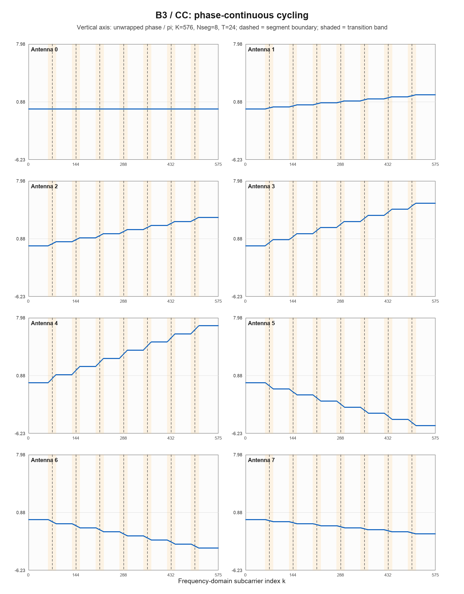
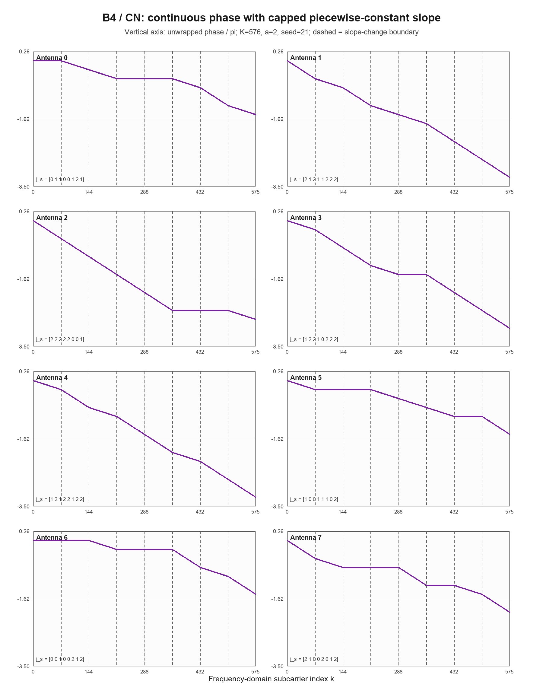
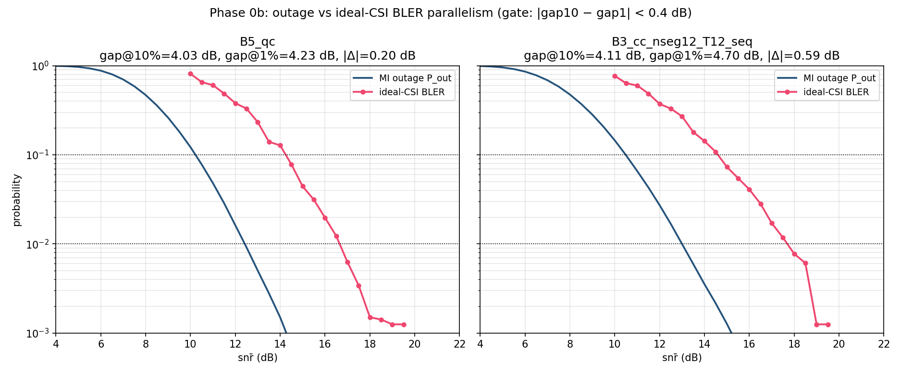
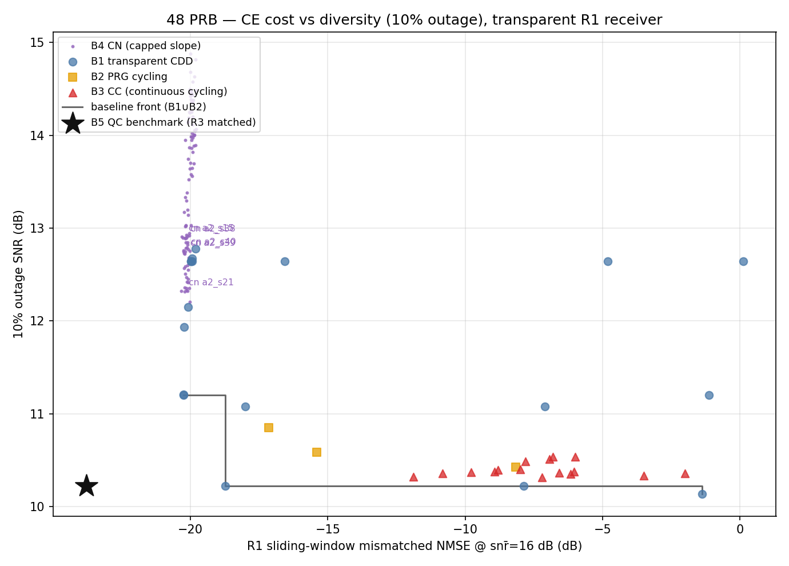
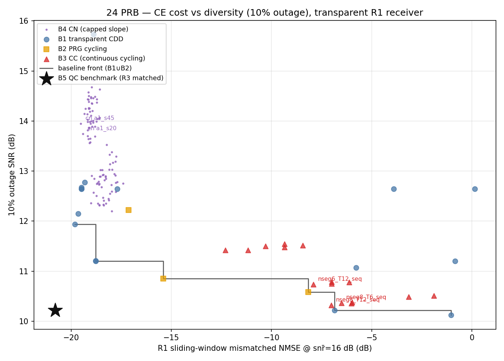
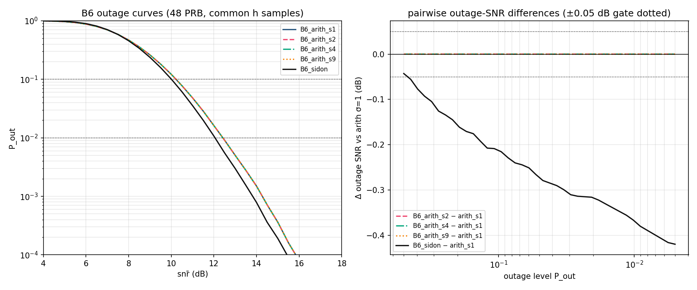
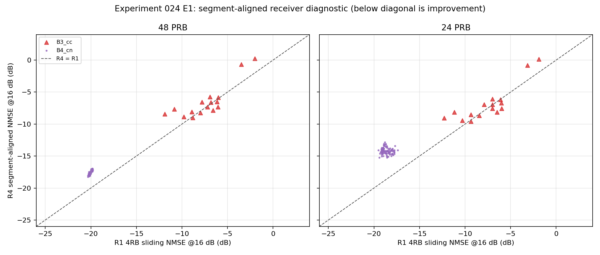
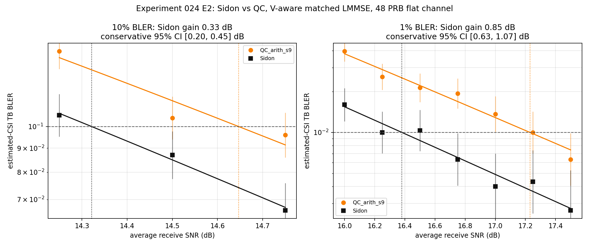

# 频域相位预编码矩阵 $V$ 设计工作进展汇报

## 1. 理论分析

### 1.1 系统模型与研究问题

系统使用 $N_t=8$ 个发射分支、单接收天线和单层传输。第 $k$ 个有效子载波、第 $n$ 个发射分支上的频域相位预编码系数写为

\[
V_{k,n}=e^{j\phi_{k,n}},
\qquad |V_{k,n}|=1,
\]

其中

- $k=0,\ldots,K-1$ 是有效子载波索引；
- $n=0,\ldots,N_t-1$ 是发射分支索引；
- $K=576$ 对应48 PRB，$K=288$ 对应24 PRB；
- $\Delta f=30\ \mathrm{kHz}$ 是子载波间隔。

在本轮理论分析和H1/H3主体实验中，每个发射分支的物理信道在有效带宽内近似为常数：

\[
\mathbf h=[h_0,\ldots,h_{N_t-1}]^T,
\qquad
\mathbf h\sim\mathcal{CN}(\mathbf 0,\mathbf I_{N_t}).
\]

本文把接收机条件分为两类：

- **透明接收机**：UE不知道所使用的 $\mathbf V$，也不使用由 $\mathbf V$ 决定的真实频域协方差；这对应H1的R1接收机；
- **V-aware非透明接收机**：UE知道 $\mathbf V$，可以使用真实频域协方差构造匹配的LMMSE估计器；这对应B5和E2。

接收端在 $K$ 个有效子载波上观察到的等效频域信道为

\[
\boxed{\mathbf g=\mathbf V\mathbf h},
\]

即

\[
g_k=\sum_{n=0}^{N_t-1}h_n e^{j\phi_{k,n}}.
\]

矩阵 $\mathbf V$ 的作用是改变不同发射分支在各子载波上的相对相位，从而改变

\[
\{|g_k|^2\}_{k=0}^{K-1}
\]

在频域上的联合分布。

本项目需要同时考虑两个目标：

1. **分集性能**：对于一次随机信道实现 $\mathbf h$，编码块跨越全部数据RE时，等效信道能否支持给定的传输速率；
2. **信道估计性能**：在固定DMRS开销下，接收机能否从稀疏导频准确估计全部数据RE上的 $\mathbf g$。

因此，研究问题不是单独最大化一个矩阵指标，而是寻找满足恒模约束的 $\mathbf V$，使其在

\[
(\text{分集性能},\ \text{信道估计误差})
\]

两个维度上优于既有基线。

---

### 1.2 为什么选择块平均互信息 $I(\mathbf h)$ 作为分集目标

给定一次信道实现 $\mathbf h$，第 $k$ 个子载波的归一化瞬时接收SNR为

\[
\gamma_k
=
\bar\rho\frac{|g_k|^2}{N_t},
\]

其中 $\bar\rho$ 是平均每个RE的接收SNR。除以 $N_t$ 是因为恒模预编码和独立单位方差分支信道满足

\[
\mathbb E|g_k|^2=N_t.
\]

系统使用16QAM和比特交织编码调制（bit-interleaved coded modulation，BICM）软解调。一个RE是一个OFDM符号上的一个子载波资源位置。记

\[
I_{\mathrm{QAM}}(\gamma)
\]

为单位平均能量16QAM在AWGN信道、接收SNR为 $\gamma$ 时的BICM互信息，单位为bit/RE。由于一个码字跨越多个相互独立的OFDM子载波，给定 $\mathbf h$ 后，条件信道可以分解为

\[
p(\mathbf y|\mathbf x,\mathbf h)
=
\prod_{k=0}^{K-1}p(y_k|x_k,g_k).
\]

并行无记忆信道的总互信息等于各子信道互信息之和。因此每个RE的块平均互信息为

\[
\boxed{
I(\mathbf h;\bar\rho,\mathbf V)
=
\frac1K\sum_{k=0}^{K-1}
I_{\mathrm{QAM}}
\left(
\bar\rho\frac{|g_k|^2}{N_t}
\right)
}.
\]

这里不能先计算平均SNR再代入互信息函数。错误的表达式是

\[
I_{\mathrm{QAM}}
\left(
\frac1K\sum_k\gamma_k
\right).
\]

原因是不同子载波发送不同的QAM符号和不同的编码比特，接收机不会把它们作为同一个重复符号进行相干合并。编码能够利用的是各并行子信道提供的信息总量，而不是把强子载波上的物理SNR转移到弱子载波。

此外，$I_{\mathrm{QAM}}(\gamma)$ 关于线性SNR是凹函数，因此Jensen不等式给出

\[
\frac1K\sum_k I_{\mathrm{QAM}}(\gamma_k)
\le
I_{\mathrm{QAM}}
\left(
\frac1K\sum_k\gamma_k
\right).
\]

所以“平均SNR后再计算互信息”会系统性高估真实并行信道的可达信息率，特别是在部分子载波进入16QAM的4 bit/RE饱和区、另一些子载波仍处于深衰落时。

---

### 1.3 问题归结为优化 $I(\mathbf h)$ 的统计分布

每个传输块抽取一次随机分支信道

\[
\mathbf h\sim\mathcal{CN}(\mathbf 0,\mathbf I_{N_t}),
\]

并在整个编码块期间保持不变。于是 $I(\mathbf h)$ 是由随机变量 $\mathbf h$ 诱导的随机变量。

对于谱效率门限 $R$，定义outage事件

\[
\mathcal O(\bar\rho,\mathbf V)
=
\left\{
\mathbf h:
I(\mathbf h;\bar\rho,\mathbf V)<R
\right\}.
\]

相应的outage概率为

\[
\boxed{
P_{\mathrm{out}}(\bar\rho,\mathbf V)
=
\Pr_{\mathbf h}
\left[
I(\mathbf h;\bar\rho,\mathbf V)<R
\right]
}.
\]

本实验使用

\[
R=4\times\frac{553}{1024}
=2.1602\ \mathrm{bit/RE}.
\]

由于所有候选使用相同的调制、码率和码长，分集优化可以表述为：

> 在相同平均SNR下，使随机变量 $I(\mathbf h)$ 的低值尾部概率尽可能小；等价地，在给定目标outage概率下，使所需平均SNR尽可能低。

因此，分集性能取决于 $I(\mathbf h)$ 的完整统计分布，尤其是10%和1%概率附近的左尾，而不仅取决于 $\mathbf V^H\mathbf V$ 的行列式或条件数。

---

### 1.4 分集度量：outage概率与outage SNR

对于目标概率 $q$，定义outage SNR为

\[
\boxed{
\gamma_q(\mathbf V)
=
\inf
\left\{
\bar\rho_{\mathrm{dB}}:
P_{\mathrm{out}}(\bar\rho_{\mathrm{dB}},\mathbf V)\le q
\right\}
}.
\]

主要报告

\[
\gamma_{0.10}(\mathbf V),
\qquad
\gamma_{0.01}(\mathbf V).
\]

两者都是越低越好。

实验中的数值计算步骤如下：

1. 对每个候选生成 $\mathbf V$；
2. 使用固定种子抽取

   \[
   N_{\mathrm{MC}}=2\times10^5
   \]

   组 $\mathbf h^{(m)}\sim\mathcal{CN}(\mathbf 0,\mathbf I_8)$；
3. 对每个候选、每个样本计算

   \[
   \mathbf g^{(m)}=\mathbf V\mathbf h^{(m)};
   \]

4. 在SNR网格 $0\sim24$ dB、步长0.5 dB上计算

   \[
   I^{(m)}(\bar\rho)
   =
   \frac1K\sum_k
   I_{\mathrm{QAM}}
   \left(
   \bar\rho\frac{|g_k^{(m)}|^2}{N_t}
   \right);
   \]

5. 用事件计数估计

   \[
   \widehat P_{\mathrm{out}}(\bar\rho)
   =
   \frac1{N_{\mathrm{MC}}}
   \sum_{m=1}^{N_{\mathrm{MC}}}
   \mathbf 1
   \left[I^{(m)}(\bar\rho)<R\right];
   \]

6. 在对数概率域对相邻SNR点插值，得到10%和1% outage SNR。

所有候选共用同一组 $\mathbf h$ 样本。这种公共随机样本设计可以显著降低候选差值的Monte Carlo方差。

---

### 1.5 信道估计度量：固定接收机下的失配MMSE

MMSE表示最小均方误差；LMMSE表示在线性估计器范围内使均方误差最小。设导频子载波集合为 $P$，目标数据子载波集合为 $D$。接收机使用一个固定的假设协方差

\[
\widetilde{\mathbf R}
\]

构造线性MMSE估计器：

\[
\boxed{
\mathbf A
=
\widetilde{\mathbf R}_{DP}
\left(
\widetilde{\mathbf R}_{PP}
+\sigma_{\mathrm{LS}}^2\mathbf I
\right)^{-1}
}.
\]

估计结果为

\[
\widehat{\mathbf g}_D
=
\mathbf A\mathbf y_P.
\]

在透明接收机条件下，UE不知道真实 $\mathbf V$，所以估计器不能使用

\[
\mathbf R_g=\mathbf V\mathbf V^H.
\]

实验令接收机假设功率时延谱（power delay profile，PDP）在 $[0,\tau_w]$ 内均匀分布，因此

\[
\widetilde R_{k,\ell}
=
N_t
e^{-j\pi(k-\ell)\Delta f\tau_w}
\operatorname{sinc}
\left((k-\ell)\Delta f\tau_w\right).
\]

但真实性能由真实协方差

\[
\mathbf R_g=\mathbf V\mathbf V^H
\]

决定。固定估计器 $\mathbf A$ 下的真实总MSE为

\[
\begin{aligned}
\mathrm{MSE}(D)
=\operatorname{tr}\Big(&
\mathbf A
(\mathbf R_{PP}+\sigma_{\mathrm{LS}}^2\mathbf I)
\mathbf A^H\\
&-\mathbf A\mathbf R_{PD}
-\mathbf R_{DP}\mathbf A^H
+\mathbf R_{DD}
\Big).
\end{aligned}
\]

归一化均方误差（normalized mean square error，NMSE）定义为

\[
\boxed{
\mathrm{NMSE}
=
\frac{\sum_w\mathrm{MSE}(D_w)}
{\sum_w\operatorname{tr}(\mathbf R_{D_wD_w})}
}.
\]

这里 $w$ 表示不同的频域处理窗口。

H1的主参考接收机R1为4RB滑窗MMSE：

- 一个窗口宽48个子载波；
- 窗口沿频率移动；
- 每个1RB目标数据块使用覆盖它的4RB窗口内导频；
- DMRS comb间隔为24，因此每个DMRS符号在4RB窗口内只有2个不同频率导频；
- 两个DMRS符号在静态信道下做平均，只降低导频噪声方差，不增加频域采样位置；
- 主先验参数为 $\tau_w=300\ \mathrm{ns}$。

R1 NMSE越低，表示候选 $\mathbf V$ 与这种标准透明接收机越匹配。

对于非透明基准B5和E2实验，使用R3 V-aware matched LMMSE，即

\[
\widetilde{\mathbf R}=\mathbf R_g=\mathbf V\mathbf V^H.
\]

此时接收机知道 $\mathbf V$，不再存在预编码结构未知造成的协方差失配。

---

### 1.6 理论最优条件的含义

#### 1.6.1 全带正交条件 $\mathbf V^H\mathbf V=K\mathbf I$

由于 $|V_{k,n}|=1$，每一列的能量固定为

\[
\|\mathbf v_n\|^2=K.
\]

定义Gram矩阵

\[
\mathbf G=\mathbf V^H\mathbf V.
\]

其迹固定为

\[
\operatorname{tr}(\mathbf G)=KN_t.
\]

设特征值为 $\lambda_1,\ldots,\lambda_{N_t}$，则

\[
\sum_i\lambda_i=KN_t.
\]

由算术—几何均值不等式，

\[
\det(\mathbf V^H\mathbf V)
=
\prod_i\lambda_i
\le K^{N_t},
\]

取等号当且仅当

\[
\lambda_1=\cdots=\lambda_{N_t}=K,
\]

即

\[
\boxed{\mathbf V^H\mathbf V=K\mathbf I_{N_t}}.
\]

同样，由“最小值不大于平均值”可得

\[
\lambda_{\min}
\le
\frac{1}{N_t}\sum_i\lambda_i
=K.
\]

只有所有特征值都等于 $K$ 时，最小特征值才能达到上界 $K$。此外，正定矩阵的条件数不小于1，且仅在所有特征值相等时取1。因此，行列式上界、最小特征值上界和条件数下界都由同一个正交条件同时达到。

该条件意味着：

1. $\mathbf V$ 的各列在全带上正交；
2. 所有发射分支方向具有相同增益；
3. $\det(\mathbf V^H\mathbf V)$ 最大；
4. 最小特征值最大；
5. 条件数达到最小值1；
6. 对任意给定 $\mathbf h$，全带平均接收功率满足

   \[
   \frac1K\|\mathbf V\mathbf h\|^2
   =
   \|\mathbf h\|^2.
   \]

但是，这个条件不是有限SNR outage最优的充分条件。有限SNR块互信息还取决于能量如何分配到不同子载波，即取决于 $\mathbf V\mathbf V^H$ 的行相关结构和更高阶统计关系。H3中Sidon设计与等差CDD均满足全带列正交，但二者的outage和真实BLER仍有明显差异。

#### 1.6.2 导频域正交条件 $\mathbf V_P^H\mathbf V_P=N_p\mathbf I$

在物理分支信道近平坦且接收机知道 $\mathbf V$ 时，导频观测为

\[
\mathbf y_P
=
\mathbf V_P\mathbf h+\mathbf n.
\]

在 $\mathbf R_h=\mathbf I$ 下，$\mathbf h$ 的matched-LMMSE误差协方差为

\[
\mathbf E_h
=
\left(
\mathbf I+
\frac1{\sigma_{\mathrm{LS}}^2}
\mathbf V_P^H\mathbf V_P
\right)^{-1}.
\]

设 $\mathbf V_P^H\mathbf V_P$ 的特征值为 $\mu_i$。恒模约束使

\[
\sum_i\mu_i=N_pN_t.
\]

由于本实验中 $N_p\ge N_t=8$，导频矩阵具备列满秩的维度条件；如果 $N_p<N_t$，则不可能使8列同时正交，上述最优条件不可实现。

总分支估计误差为

\[
\operatorname{tr}(\mathbf E_h)
=
\sum_i
\frac1{1+\mu_i/\sigma_{\mathrm{LS}}^2}.
\]

函数

\[
f(x)=\frac1{1+x/\sigma_{\mathrm{LS}}^2}
\]

是凸函数。由Jensen不等式，固定 $\sum_i\mu_i$ 时，上式在所有特征值相等时最小。因此最小误差条件为

\[
\boxed{
\mathbf V_P^H\mathbf V_P
=
N_p\mathbf I_{N_t}
}.
\]

该条件意味着：

1. 8个分支在导频观测空间中正交；
2. 导频能量均匀分配到所有分支方向；
3. 没有不可观测或弱观测的分支组合；
4. 在给定导频数、导频功率和噪声方差下，matched-LMMSE总误差达到下界。

#### 1.6.3 DFT-grid CDD如何同时满足两个条件

循环延迟分集（cyclic delay diversity，CDD）通过给不同发射分支施加不同的循环时延来产生频域相位斜率。传统CDD的频域相位为

\[
V_{k,n}=e^{-j2\pi k\Delta f\tau_n}.
\]

若时延取有效带宽DFT网格

\[
\tau_n=\frac{j_n}{K\Delta f},
\qquad j_n\in\mathbb Z,
\]

则

\[
V_{k,n}=e^{-j2\pi kj_n/K}.
\]

当 $j_n\bmod K$ 互不相同时，各列是 $K$ 点DFT矩阵的不同列，因此

\[
\mathbf V^H\mathbf V=K\mathbf I.
\]

导频位置为 $k=pS_f$，且 $K=N_pS_f$，所以

\[
V_P[p,n]
=
e^{-j2\pi p j_n/N_p}.
\]

当 $j_n\bmod N_p$ 互不相同时，各列又是 $N_p$ 点DFT矩阵的不同列，因此

\[
\mathbf V_P^H\mathbf V_P=N_p\mathbf I.
\]

这里的“grid”不是数值仿真的SNR扫描网格，而是时延只能取

\[
\Delta\tau_{\mathrm{grid}}=\frac{1}{K\Delta f}
\]

的整数倍。选择满足上述模条件的整数索引，可以同时使全带Gram矩阵和导频Gram矩阵达到各自的正交上界。更准确地说：全带行列式和最小奇异值达到上界；V-aware matched-LMMSE估计误差达到下界。这不等于有限SNR outage已经达到全局最优，因为outage还受频域增益的高阶联合统计关系影响。H3就是对这一点的实验检验。

---

## 2. 候选方案与仿真配置

### 2.1 公共仿真条件

| 参数 | 取值 |
|---|---|
| 发射/接收 | 8 Tx / 1 Rx，单层 |
| 子载波间隔 | 30 kHz |
| 带宽 | 48 PRB（$K=576$）和24 PRB（$K=288$） |
| 物理分支信道 | 平坦模型 $\mathbf h\sim\mathcal{CN}(\mathbf 0,\mathbf I_8)$ |
| 解调参考信号（DMRS） | comb间隔 $S_f=24$，两个DMRS符号平均 |
| 导频数 | 48PRB：$N_p=24$；24PRB：$N_p=12$ |
| 调制与码率 | 16QAM，码率 $553/1024$ |
| outage样本数 | 每候选 $2\times10^5$ 个公共 $\mathbf h$ 样本 |
| H1 CE指标 | R1 4RB滑窗失配MMSE，$\tau_w=300$ ns，16 dB |

### 2.2 B1–B6候选的定义

| 编号 | 名称与作用 | 构造 |
|---|---|---|
| B1 | 透明小人工时延CDD基线 | $j_n$按有效分支数 $N_{\mathrm{eff}}\in\{2,4,8\}$ 和总时延跨度50–1389 ns生成；扫描分集与信道估计之间的传统CDD折中 |
| B2 | PRG precoder cycling基线 | 预编码资源组（precoding resource group，PRG）大小为2、4、8 RB；每个PRG内使用一个8点DFT相位向量，跨PRG相位不连续；接收机不跨PRG边界处理 |
| B3 | CC，相位连续的precoder cycling挑战者 | 频域分段；段内8根天线采用一组常相位DFT向量；相邻段之间用宽度 $T$ 的线性相位过渡带连接；目标是段内信道近似常数、全带相位模式轮转 |
| B4 | CN，受限斜率N-series挑战者 | 固定8段；每段每根天线的DFT-grid斜率索引 $j_{s,n}\in\{0,\ldots,a\}$，$a=1,2$；相位连续、分段斜率随机变化；目标是限制局部人工时延跨度，同时产生全带相位变化 |
| B5 | QC非透明参考点 | DFT-grid等差CDD，配合V-aware R3 matched LMMSE；48PRB使用 $j_n=9n$，24PRB使用 $j_n=n$ |
| B6 | H3理论检验集合 | 48PRB下比较等差时延索引集合 $j_n=\sigma n, \sigma\in\{1,2,4,9\}$ 与Sidon时延索引集合 $[0,1,3,7,12,20,30,65]$；只计算分集指标 |

QC是既有非透明基准方案的项目代号；在本报告中，它具体指B5的等差DFT-grid CDD矩阵和知道该矩阵的R3接收机组合，不表示一个额外的数学构造类别。

### 2.3 B3频域相位结构

B3在每个主要频段内部使用常相位

\[
\phi_{k,n}=c_{s,n}
=\frac{2\pi n r_s}{8},
\]

所以段内

\[
g_k=\sum_n h_ne^{jc_{s,n}}
\]

不随 $k$ 改变。相邻段之间使用最短相位差的线性过渡。图中8个子图分别对应8根发射天线，横轴是有效子载波索引，纵轴使用展开相位，避免把等价的 $2\pi$ 回绕误认为物理相位不连续。虚线表示名义分段边界，浅色区域表示线性过渡带。

B3满足相位连续，但斜率在过渡带起止点发生变化。R1窗口跨越过渡带时，真实局部协方差不再是单一平稳模型，因此可能出现较大信道估计误差。

### 2.4 B4频域相位结构

B4图同样用8个子图分别表示8根发射天线，横轴是有效子载波索引，纵轴是展开相位。B4在第 $s$ 段、第 $n$ 根天线上选择

\[
j_{s,n}\in\{0,\ldots,a\},
\]

并递推

\[
\phi_{k+1,n}
=
\phi_{k,n}
-\frac{2\pi}{K}j_{s(k),n}.
\]

因此段内局部人工时延为

\[
\tau_{s,n}=\frac{j_{s,n}}{K\Delta f}.
\]

相位在分段边界连续，但斜率可能发生不连续变化。图中虚线表示斜率变化边界。

B4与B3的主要区别是：B3段内所有天线斜率均为零，只改变常相位组合；B4段内允许不同天线采用少量不同的受限斜率，但不保证每段相位向量形成完整DFT轮转。

---

## 3. H1、H3与Phase 0b的实验目的

### 3.1 H1：透明滑窗接收机下是否存在优于透明基线的 $V$

H1检验的问题是：

> 在UE不知道 $\mathbf V$、使用固定4RB滑窗MMSE的条件下，B3/B4是否能在“信道估计误差—分集性能”二维空间中严格优于B1/B2透明基线。

选择R1滑窗接收机的原因是B3/B4的设计目标发生在局部频域范围内：

- B3希望主要频段内部的等效信道为常数；
- B4希望每段内部的8个局部人工时延集中在一个较小范围；
- CDD的人工时延在全带固定，每个局部窗口都观察到同一组时延跨度。

如果B3/B4存在结构性优势，最可能在局部滑窗接收机下体现。因此H1是在对挑战者最有利、且与其设计目标一致的接收机条件下进行检验。

H1的二维坐标为

\[
x=\mathrm{NMSE}_{\mathrm{R1}}(16\ \mathrm{dB}),
\]

\[
y=\gamma_{0.10}(\mathbf V).
\]

两轴均越小越好。B1和B2形成透明基线Pareto前沿。B3/B4满足以下任一条件才判定H1成立：

1. 10% outage SNR不劣于相应基线超过0.05 dB，同时R1 NMSE至少改善1.0 dB；
2. R1 NMSE不劣于相应基线超过0.2 dB，同时10% outage SNR至少改善0.3 dB。

B5黑色星号使用R3 matched NMSE，是非透明性能参考，不属于H1透明基线，也不参与H1通过条件。这里的Pareto前沿是指：在基线集合中，不存在另一个点能使NMSE和outage SNR都不更差、并且至少一项严格更好的点集。

H1把10% outage SNR作为主分集坐标，而没有用1%点作为验收坐标。原因有两个：第一，固定Monte Carlo样本数下，10%事件数更多，分位点估计方差更小；第二，Phase 0b显示10%处不同候选的outage到BLER水平偏移仅相差0.085 dB，而1%处B3的偏移比QC多0.467 dB。因而10% outage适合用于H1的大规模候选筛选，1%性能需要真实链路仿真确认。

### 3.2 H3：正交CDD内部是否仍存在可优化的频域联合统计结构

H3检验两个问题：

1. 对栅格等差CDD

   \[
   j_n=\sigma n,
   \]

   改变步长 $\sigma$ 是否会改变平坦模型下的outage；
2. 在同样满足全带列正交和导频域可辨识的条件下，消除非平凡四项加法等式的Sidon时延索引集合是否优于等差时延索引集合。

等差集合存在大量关系

\[
j_{n-1}+j_{n+1}=2j_n,
\]

这是一个非平凡的四项加法等式，会进入频域增益的四阶统计量。Sidon集合是加法组合数学中的标准术语，它要求集合内两个元素之和不会由另一对不同的无序元素重复得到。用公式表示，Sidon集合满足

\[
a+b=c+d
\]

时只有 $\{a,b\}=\{c,d\}$ 的平凡解。本实验的Sidon集合

\[
[0,1,3,7,12,20,30,65]
\]

在整数域和模 $K=576$ 下的36个无序成对和均互不重复，因此消除了非平凡四阶加性关系。

H3直接比较完整outage曲线，并对每个目标outage概率 $q$ 计算

\[
\Delta\gamma_i(q)
=
\gamma_{i,q}-\gamma_{\sigma=1,q}.
\]

### 3.3 Phase 0b：outage是否能代表真实ideal-CSI BLER

BLER是传输块错误率，即一个完整编码块译码失败的概率。ideal-CSI表示接收机直接使用真实信道，不包含信道估计误差。outage把真实有限码长译码近似为

\[
I(\mathbf h)<R
\]

时失败、否则成功的理想门限。真实LDPC BLER曲线不会与outage曲线完全相同。

对目标错误率 $q$，定义

\[
\mathrm{gap}_q
=
\gamma_{\mathrm{BLER},q}
-\gamma_{\mathrm{outage},q}.
\]

如果BLER曲线近似为outage曲线在SNR轴上的固定水平平移，则

\[
\mathrm{gap}_{10\%}
\approx
\mathrm{gap}_{1\%}.
\]

这不要求概率曲线本身为直线，只要求在目标区间内两条曲线具有近似相同形状。

Phase 0b选择两种结构不同的候选：

- B5 QC等差CDD；
- B3 CC分段候选。

分别运行真实16QAM/LDPC ideal-CSI链路，检查outage与BLER的水平间距。门槛为

\[
|\mathrm{gap}_{10\%}-\mathrm{gap}_{1\%}|<0.4\ \mathrm{dB}.
\]

---

## 4. 仿真结果

### 4.1 Phase 0b：outage代理的有效范围

图的横轴是平均接收SNR，纵轴是对数刻度的概率。蓝线是由块平均互信息计算的outage概率，红色带圆点曲线是真实ideal-CSI LDPC链路的BLER。两条水平虚线分别标出10%和1%概率。左图对应B5 QC，右图对应B3 CC。比较同一水平虚线与两条曲线交点之间的横向SNR距离，即得到下表中的gap。

| 候选 | outage 10% / 1% SNR | BLER 10% / 1% SNR | gap 10% | gap 1% | 两点gap差 | 判定 |
|---|---:|---:|---:|---:|---:|---|
| B5 QC | 10.221 / 12.420 dB | 14.247 / 16.651 dB | 4.026 dB | 4.230 dB | 0.204 dB | 通过 |
| B3 CC | 10.487 / 12.997 dB | 14.598 / 17.694 dB | 4.111 dB | 4.697 dB | 0.586 dB | 不通过 |

结果含义：

1. 在10%工作点，两候选的coding gap只相差

   \[
   4.111-4.026=0.085\ \mathrm{dB},
   \]

   因此outage适合作为H1 10%工作点的候选间分集排序代理；
2. 在1%工作点，两候选gap相差

   \[
   4.697-4.230=0.467\ \mathrm{dB},
   \]

   说明分段CC结构存在额外有限码长惩罚，不能只用outage精确预测其1% BLER；
3. 该偏差方向对B3有利于outage预测，即outage低估了B3的真实深尾损失。因此它不会推翻“H1未找到优胜B3/B4”的结论；
4. Phase 0b只校准了B5和一个B3代表点，不构成对所有 $\mathbf V$ 的统一误差证明。接近最终判定边界的候选仍需要真实链路终审。

### 4.2 H1：透明R1接收机下的Pareto结果

#### 48 PRB

坐标轴含义：

- 横轴：R1 4RB滑窗失配NMSE@16 dB，越左越好；
- 纵轴：10% outage SNR，越低越好；
- 蓝色圆点：B1透明CDD；
- 黄色方块：B2 PRG cycling；
- 红色三角：B3 CC；
- 紫色小点：B4 CN；
- 灰色阶梯线：B1与B2形成的透明基线Pareto前沿；
- 黑色星号：B5 QC使用R3 matched接收机的非透明参考点。

关键数值：

| 候选 | R1/R3 NMSE@16 dB | 10% outage SNR | 解释 |
|---|---:|---:|---|
| B1 $N_{\mathrm{eff}}=4$，时延跨度200 ns | −20.25 dB | 11.200 dB | 信道估计较好、分集不足的基线前沿点 |
| B1 $j_n=n$，时延跨度约400 ns | −18.73 dB | 10.221 dB | 透明基线关键点 |
| B3最优分集附近点 | −11.88 dB | 10.322 dB | outage接近基线，但信道估计损失约7 dB |
| B4最佳信道估计挑战点 | −20.33 dB | 12.319 dB | 信道估计略好，但outage差约2.1 dB |
| B5 QC，R3 matched | −23.80 dB | 10.221 dB | 非透明参考，不参与H1透明判定 |

48PRB下116个B3/B4挑战者中没有候选通过H1门槛。

#### 24 PRB

关键数值：

| 候选 | R1/R3 NMSE@16 dB | 10% outage SNR | 解释 |
|---|---:|---:|---|
| B1 $N_{\mathrm{eff}}=4$，时延跨度200 ns | −19.81 dB | 11.935 dB | 信道估计较好、分集不足 |
| B2 PRG 4RB | −15.40 dB | 10.852 dB | 中间折中点 |
| B1 $j_n=n$，时延跨度约800 ns | −6.86 dB | 10.221 dB | 透明基线分集关键点 |
| B3最佳点 | −7.01 dB | 10.321 dB | 信道估计仅改善0.15 dB，outage反而差0.10 dB |
| B4最佳信道估计挑战点 | −19.52 dB | 13.946 dB | 信道估计较好，但outage显著不足 |
| B5 QC，R3 matched | −20.81 dB | 10.221 dB | 非透明参考 |

24PRB下同样没有B3/B4候选通过H1门槛。

#### H1的主要机理结论

1. **B3的段内低误差没有转化为全带平均低误差。** 4RB窗口跨越线性过渡带时，窗口内真实协方差不再满足单一平稳PDP模型。分段数增加时，边界和过渡带窗口占比增加，平均NMSE恶化。
2. **B4限制局部斜率可以改善信道估计，但不保证分集。** 随机受限斜率没有强制全带相位向量充分覆盖8个分支组合，所以出现“NMSE较好、outage较差”的候选。
3. **原计划低估了 $j_n=n$ 等差DFT-grid CDD基线。** H3证明不同等差步长在平坦模型下outage几乎相同，因此最小网格步长 $j_n=n$ 可以同时获得等差CDD的分集性能和较小的人工时延跨度。它位于透明设计空间的关键Pareto位置。
4. **H1结论：在完全透明、固定R1接收机、当前DMRS和近平坦信道条件下，没有找到优于B1/B2透明基线的B3/B4矩阵。**

### 4.3 H3：等差CDD步长比较与Sidon结构

左图纵轴是outage概率 $P_{\mathrm{out}}$，横轴是平均接收SNR。右图固定目标outage概率，给出各候选相对 $\sigma=1$ 等差CDD的outage SNR差值。

关键结果：

| 对比 | 10% outage SNR差 | 1% outage SNR差 | 结论 |
|---|---:|---:|---|
| 等差 $\sigma=2$ − $\sigma=1$ | 0.0000 dB | 0.0000 dB | 数值重合 |
| 等差 $\sigma=4$ − $\sigma=1$ | 0.0000 dB | 0.0000 dB | 数值重合 |
| 等差 $\sigma=9$ − $\sigma=1$ | +0.0001 dB | 0.0000 dB | 数值重合 |
| Sidon − 最优等差CDD | **−0.210 dB** | **−0.368 dB** | Sidon更好 |

结果含义：

1. 对等差集合

   \[
   j_n=\sigma n,
   \]

   对固定信道样本定义多项式

   \[
   P_{\mathbf h}(z)=\sum_{n=0}^{N_t-1}h_nz^n.
   \]

   则等效信道可以写成

   \[
   g_k=P_{\mathbf h}(z_k),
   \qquad
   z_k=e^{-j2\pi\sigma k/K}.
   \]

   因而改变 $\sigma$ 不会改变多项式系数，只会改变单位圆上的离散采样点。如果 $d=\gcd(\sigma,K)$，则共有 $K/d$ 个不同采样点，每个点在全带重复 $d$ 次。本实验中 $\sigma=1,2,4,9$ 分别产生576、288、144和64个均匀采样点，均显著多于多项式的8个系数；在当前互信息函数、平坦信道和带宽条件下，这些离散平均给出的outage在数值精度内重合。该结论是本实验条件下的数值结论，不应外推为任意 $K$、任意步长和任意物理信道下的恒等式；
2. 因此，大人工时延等差CDD在平坦模型下没有额外分集收益。更早实验中观察到的某个大步长候选的深尾优势，不能归因于“等差步长更大”；
3. Sidon集合与等差CDD都满足全带列正交，但Sidon消除了等差集合固有的非平凡四阶加性关系。因此

   \[
   \mathbf V^H\mathbf V=K\mathbf I
   \]

   不是有限SNR outage的充分统计量；
4. H3在理论筛选层面找到了优于等差CDD的 $V$：48PRB平坦模型下，Sidon在10%和1% outage处分别改善0.21和0.37 dB。

---

## 5. H1与H3的扩展实验

### 5.1 E1：分段边界已知的MMSE能否恢复B3/B4

E1在H1基础上增加一个R4接收机：接收机知道候选的分段数和名义边界，每段只使用段内导频进行MMSE估计，不再使用跨边界滑窗。R4仍不知道具体相位值，并继续使用均匀PDP先验 $[0,300\ \mathrm{ns}]$。

这不是原H1的完全透明接收机，因为接收机获得了候选结构的分段信息。E1的作用是诊断H1失败是否主要来自窗口跨越边界。

图中：

- 横轴是原R1 NMSE；
- 纵轴是R4分段对齐NMSE；
- 虚线表示R4与R1相同；
- 点位于虚线下方表示R4改善，位于虚线上方表示R4恶化。

下表把“改善”定义为

\[
\Delta_{\mathrm{CE}}
=
\mathrm{NMSE}_{\mathrm{R1,dB}}
-
\mathrm{NMSE}_{\mathrm{R4,dB}}.
\]

因此正值表示R4误差更低，负值表示R4误差更高。

量化结果：

| 带宽 | 家族 | 候选数 | R4改善数 | 改善中位数 | 最大改善 |
|---|---:|---:|---:|---:|---:|
| 48PRB | B3 | 16 | 6 | −0.53 dB | +1.27 dB |
| 48PRB | B4 | 100 | 0 | −2.46 dB | −2.02 dB，即最好的B4仍恶化 |
| 24PRB | B3 | 16 | 7 | −0.43 dB | +1.63 dB |
| 24PRB | B4 | 100 | 0 | −4.41 dB | −3.06 dB，即最好的B4仍恶化 |

重新使用H1门槛进行诊断性复判：

- 48PRB：仍为0个候选通过；
- 24PRB：仅 `B3_cc_nseg8_T6_seq` 通过。

结论：

1. 跨边界处理确实是部分B3候选的误差来源，但不是唯一来源；
2. 分段后每段只有1–3个不同频率导频，减少观测数量会增加估计方差；
3. B4段内本来较平滑，R1可以利用相邻频率导频，强制截断到每段反而普遍恶化；
4. 唯一诊断性通过点需要接收机知道分段结构，因此不能作为“完全透明方案优于基线”的结论。如果继续该方向，问题应改为“预编码分段、DMRS和接收机联合设计”，并对所有基线提供相同的结构信息。

### 5.2 E2：Sidon与QC等差CDD的真实V-aware BLER

E2对H3进行真实链路终审。这里的estimated-CSI表示数据均衡使用由DMRS估计得到的信道，而不是直接使用真实信道。比较：

- QC等差CDD：

  \[
  j=[0,9,18,27,36,45,54,63];
  \]

- Sidon：

  \[
  j=[0,1,3,7,12,20,30,65].
  \]

两者都使用：

- 48PRB；
- 相同DMRS；
- 相同平坦8分支信道样本；
- 相同payload、导频噪声和数据噪声；
- 各自真实 $\mathbf R_g$ 构造的V-aware matched LMMSE；
- 真实16QAM、LDPC编码、软解调和8次LDPC迭代。

10%和1%区域均使用每个SNR点3000个独立传输块。目标SNR通过二项logit模型

\[
\operatorname{logit}(\mathrm{BLER})
=a+b\cdot\mathrm{SNR}_{\mathrm{dB}}
\]

拟合并反解，置信区间由Fisher信息矩阵和一阶误差传播方法计算。

图的横轴是平均接收SNR，纵轴是对数刻度的estimated-CSI BLER。橙色圆点是QC的直接误块率，黑色方点是Sidon的直接误块率；竖直误差棒表示二项计数不确定性，实线表示logit拟合。左图放大10%区域，右图放大1%区域。水平虚线给出目标BLER，橙色和黑色竖直虚线分别是QC和Sidon达到该目标时的拟合SNR。黑色竖直线位于橙色竖直线左侧，表示Sidon达到相同BLER所需的SNR更低。

| 目标 | QC SNR | Sidon SNR | Sidon优势 | 优势保守95%区间 |
|---|---:|---:|---:|---:|
| 10% BLER | 14.65 dB | 14.32 dB | **0.33 dB** | **[0.20, 0.45] dB** |
| 1% BLER | 17.23 dB | 16.38 dB | **0.85 dB** | **[0.63, 1.07] dB** |

1%附近的直接误块计数为：

| SNR | QC误块/3000 | QC BLER | Sidon误块/3000 | Sidon BLER |
|---:|---:|---:|---:|---:|
| 16.00 dB | 119 | 3.97% | 48 | 1.60% |
| 16.25 dB | 77 | 2.57% | 30 | 1.00% |
| 16.50 dB | 64 | 2.13% | 31 | 1.03% |
| 16.75 dB | 58 | 1.93% | 19 | 0.63% |
| 17.00 dB | 41 | 1.37% | 12 | 0.40% |
| 17.25 dB | 30 | 1.00% | 13 | 0.43% |
| 17.50 dB | 19 | 0.63% | 8 | 0.27% |

两个候选在仿真时使用成对的随机样本，但保存文件只保留了各候选的聚合误块数，不能恢复“同一传输块是否同时出错”的联合计数。因此差值置信区间按两个候选独立处理，忽略了通常为正的配对协方差；表中的区间是偏宽的保守估计。

两者在全部加密SNR点上的matched CE NMSE最大差仅0.06 dB，且差值正负均有。因此Sidon的BLER优势不能归因于更有利的信道估计误差，主要来自频域增益联合结构和有限码长译码效应。

E2相对H3 outage预判的结果为：

| 指标 | H3 outage预测 | E2真实estimated-CSI BLER |
|---|---:|---:|
| 10%优势 | 0.21 dB | 0.33 dB |
| 1%优势 | 0.37 dB | 0.85 dB |

方向一致，真实链路中的深尾优势更大。一个合理但尚未单独验证的解释是：Sidon消除了等差集合中的非平凡四项加法等式，改变了频域增益的高阶联合统计量，使低互信息信道实现中的频域信息量分布更有利；有限码长译码在1%区域放大了这种差异。

E2仍有明确边界：物理分支信道采用与H3一致的带内平坦模型。尚未验证5–100 ns TDL展宽、定时误差、接收机协方差失配。Sidon的最小时延网格间距小于QC，因此下一步需要优先检查真实PDP展宽后的导频条件数、NMSE和BLER。

---

## 6. 对核心问题的回答

领导关注的问题是：**是否找到了比基线更好的 $V$ 矩阵，以及在什么条件下更好。** 当前结果可分为三种接收机条件回答。

| 接收机与信道条件 | 比较对象 | 是否找到更好的 $V$ | 结论 |
|---|---|---|---|
| UE不知道 $V$，R1 4RB滑窗MMSE，平坦8分支信道，DMRS $S_f=24$ | B3/B4对B1/B2透明基线 | **没有** | 两个带宽各116个、合计232个B3/B4挑战者均未通过H1；局部频域平滑性带来的估计收益被边界失配或分集不足抵消 |
| UE知道分段边界但不知道具体相位，R4分段MMSE | B3/B4对原R1透明基线作诊断比较 | **仅发现一个24PRB B3诊断点** | 需要额外结构信息，不属于原完全透明条件；48PRB仍无通过点，B4全部恶化 |
| UE知道 $V$，使用matched LMMSE，48PRB平坦8分支信道 | Sidon对QC等差DFT-grid CDD | **找到** | Sidon真实BLER在10%处改善0.33 dB，在1%处改善0.85 dB，置信区间均不跨0 |

综合结论：

1. **透明方向当前没有找到优于透明基线的B3/B4。** 在当前R1、DMRS和近平坦信道条件下，最强透明结构仍是正确选择网格索引的小步长等差CDD基线。
2. **非透明V-aware方向找到了优于QC等差CDD的新 $V$。** Sidon时延索引集合在保持全带正交和导频域正交的同时，通过消除非平凡四项加法等式，改变了频域增益的高阶联合统计量，并获得更好的outage和真实BLER，尤其在1%深尾处优势明显。
3. **当前可以向下一阶段推进的主要方案是Sidon型DFT-grid CDD，而不是B3/B4透明分段方案。**
4. **Sidon结论当前成立的条件**是48PRB、8Tx/1Rx、单层、DMRS comb 24、接收机知道 $V$ 并使用matched LMMSE、物理分支信道带内平坦。推广到实际方案前，必须补充5–100 ns物理PDP、时延误差、不同带宽和接收机失配下的鲁棒性验证。

---

## 7. 数据与文档来源

- H1/H3主体设计：`research/plan-023.md`
- H1/H3主体结果：`research/result-023.md`
- E1/E2扩展设计：`research/plan-024.md`
- E1/E2扩展结果：`research/result-024.md`
- H1/H3原始数据：`outputs/track_b_pilot_scan/20260709_main/`
- E1/E2原始数据：`outputs/experiment024_segment_sidon_qc/20260716_main/`
