# CDD Non-Transparent Channel Estimation Algorithms and Frequency-Domain Precoder Matrix Study

## Executive Summary

This report consolidates the most useful findings from the completed CDD link-level experiments. It covers two related topics:

1. channel estimation for explicit, UE-aware CDD, where the receiver knows the cyclic delays; and
2. the design of deterministic frequency-domain precoder matrices that trade frequency-diversity expansion against channel-estimation difficulty.

The main conclusions are:

- **Algorithm 1, matched direct equivalent-channel RMMSE, remains the strongest general baseline** when all estimators use the same CDD-combined DMRS observations.
- **Algorithm 2B/2C does not show a robust NMSE advantage over Algorithm 1** on the unified 420-point grid. The best observed Algorithm 2B gain is only $+0.014$ dB and is too small to distinguish from finite-trial variation.
- **Algorithm 3 can provide very large gains in a specific sparse-pilot, large-CDD regime.** At CDD delay 512 samples and DMRS spacing 24 subcarriers, all 15 delay-spread/SNR combinations have positive gain. The maximum gain is $+18.237$ dB.
- **The new phase-continuous piecewise-linear N-series precoders improve the matrix-level diversity/coherence Pareto frontier.** Their advantage is also visible in ideal-CSI BLER for several bandwidths and operating points.
- **That ideal-CSI diversity advantage does not translate into a reliable estimated-CSI BLER advantage with the tested sparse DMRS and Algorithm 1 RMMSE.** The N-series points pay a 1.81--3.26 dB NMSE penalty at 20 dB for 48/36 PRB, and up to 8.04 dB for the 24-PRB N8 case.
- Consequently, **a two-dimensional diversity/coherence proxy is valuable for screening but is not a sufficient link objective**. Final precoder selection must jointly evaluate full-covariance RMMSE NMSE and coded BLER.

---

## 1. Common System Model

### 1.1 Physical channel and CDD equivalent channel

Consider a single-layer OFDM link with $N_t$ transmit branches and $N_r$ receive antennas. The frequency-domain channel from transmit branch $m$ to receive antenna $r$ is

$$
H_{r,m}[k]
=
\sum_{\ell} h_{r,m}[\ell]
e^{-j2\pi k\ell/N_{\mathrm{FFT}}},
$$

where $k$ is the subcarrier index, $\ell$ is the delay-tap index, $h_{r,m}[\ell]$ is the complex channel tap, and $N_{\mathrm{FFT}}$ is the OFDM FFT size.

CDD applies a deterministic cyclic delay $d_m$, in OFDM samples, to transmit branch $m$. Its frequency-domain weight is

$$
\alpha_m[k]=e^{-j2\pi k d_m/N_{\mathrm{FFT}}}.
$$

With total-power normalization, the single-layer transmit vector is

$$
\mathbf c_{\mathrm{CDD}}[k]
=\frac{1}{\sqrt{N_t}}
\begin{bmatrix}
\alpha_0[k] & \cdots & \alpha_{N_t-1}[k]
\end{bmatrix}^{T}.
$$

The equivalent channel observed at receive antenna $r$ is

$$
g_r[k]
=\frac{1}{\sqrt{N_t}}
\sum_{m=0}^{N_t-1}H_{r,m}[k]\alpha_m[k],
$$

and the received signal is

$$
y_r[k]=g_r[k]s[k]+w_r[k],
$$

where $s[k]$ is the transmitted data symbol and $w_r[k]$ is complex AWGN.

The term *non-transparent* or *explicit CDD* in this report means that the UE knows the CDD delays $\{d_m\}$ and can use them in covariance construction or equivalent-channel synthesis.

### 1.2 Common notation

| Symbol | Meaning |
|---|---|
| $N_t,N_r$ | Number of transmit branches and receive antennas |
| $k,p$ | Target/data and pilot subcarrier indices |
| $\mathcal P,\mathcal D$ | Pilot and target/data subcarrier sets |
| $H_{r,m}[k]$ | Physical frequency-domain channel of Tx branch $m$ to Rx $r$ |
| $g_r[k]$ | CDD-combined equivalent channel |
| $d_m$ | Known cyclic delay of Tx branch $m$, in samples |
| $p[\ell]$ | Physical-channel power-delay profile (PDP) |
| $\sigma_w^2$ | Noise variance per received RE |
| $\sigma_{\mathrm{LS}}^2$ | Noise variance of the combined LS pilot observation |
| $\mathbf R_{AB}$ | Channel covariance between subcarrier sets $A$ and $B$ |

---

## 2. Channel-Estimation Algorithms

### 2.1 Algorithm 1: Direct equivalent-channel RMMSE

Algorithm 1 estimates the CDD-combined channel $g_r[k]$ directly; it does not recover the individual physical branches.

The LS pilot observation is

$$
\widetilde{\mathbf g}_{r,\mathcal P}
=\mathbf g_{r,\mathcal P}+\mathbf n_{r,\mathcal P}.
$$

The matched RMMSE estimate over the target subcarriers is

$$
\widehat{\mathbf g}_{r,\mathcal D}
=\mathbf R_{\mathcal D\mathcal P}^{\mathrm{CDD}}
\left(
\mathbf R_{\mathcal P\mathcal P}^{\mathrm{CDD}}
+\sigma_{\mathrm{LS}}^2\mathbf I
\right)^{-1}
\widetilde{\mathbf g}_{r,\mathcal P}.
$$

For independent transmit branches with a common physical PDP $p[\ell]$, the CDD-equivalent PDP is

$$
p_g[\ell]
=\frac{1}{N_t}\sum_{m=0}^{N_t-1}p[\ell-d_m],
$$

and the matched frequency covariance is

$$
R_g[k,k']
=\sum_{\ell}p_g[\ell]
e^{-j2\pi(k-k')\ell/N_{\mathrm{FFT}}}.
$$

The UE extracts $\mathbf R_{\mathcal P\mathcal P}$ and $\mathbf R_{\mathcal D\mathcal P}$ from this covariance. If the UE does not know the CDD delay and uses the unshifted physical PDP, the filter is mismatched.

Algorithm 1 is simple, numerically stable, and statistically optimal under the assumed Gaussian model and matched covariance. Its limitation is pilot sampling: a large CDD can make $g[k]$ vary much faster than the underlying $H_m[k]$, so a sparse pilot comb can under-sample the equivalent channel.

### 2.2 Algorithm 2B: Multi-pilot delay-domain basis LMMSE

Algorithm 2B uses the same CDD-combined DMRS observations as Algorithm 1, but explicitly models the physical delay-domain taps. Let $\mathcal L$ be the selected tap support. Then

$$
\widetilde g_r[p]
=\frac{1}{\sqrt{N_t}}
\sum_{m=0}^{N_t-1}\sum_{\ell\in\mathcal L}
h_{r,m}[\ell]
e^{-j2\pi p(\ell+d_m)/N_{\mathrm{FFT}}}
+n_r[p].
$$

Stacking all pilot observations gives

$$
\widetilde{\mathbf g}_{r,\mathcal P}
=\mathbf\Phi\mathbf h_r+\mathbf n_r,
$$

with

$$
[\mathbf\Phi]_{p,(m,\ell)}
=\frac{1}{\sqrt{N_t}}
e^{-j2\pi p(\ell+d_m)/N_{\mathrm{FFT}}}.
$$

Here, $\mathbf h_r$ stacks the delay-domain taps of all transmit branches. With tap covariance $\mathbf R_h$, the LMMSE estimate is

$$
\widehat{\mathbf h}_r
=\mathbf R_h\mathbf\Phi^H
\left(
\mathbf\Phi\mathbf R_h\mathbf\Phi^H
+\sigma_{\mathrm{LS}}^2\mathbf I
\right)^{-1}
\widetilde{\mathbf g}_{r,\mathcal P}.
$$

The physical branches and final equivalent channel are reconstructed as

$$
\widehat H_{r,m}[k]
=\sum_{\ell\in\mathcal L}
\widehat h_{r,m}[\ell]e^{-j2\pi k\ell/N_{\mathrm{FFT}}},
$$

$$
\widehat g_r[k]
=\frac{1}{\sqrt{N_t}}
\sum_m\widehat H_{r,m}[k]
e^{-j2\pi k d_m/N_{\mathrm{FFT}}}.
$$

The evaluated **E99** version chooses the shortest contiguous physical-channel tap support containing 99% of the PDP energy. This reduces the number of unknowns, but introduces truncation mismatch. The central risk is that $\mathbf\Phi$ becomes ill-conditioned or effectively rank deficient because several physical branches must be separated from one CDD-combined scalar observation.

### 2.3 Algorithm 2C: Local-window deterministic reconstruction

Algorithm 2C replaces the full delay-basis inverse problem with a local flat-channel approximation. The active band is divided into blocks $\mathcal K_b$ whose width $W$ should satisfy

$$
S_f\le W\lesssim B_{c,H}(\gamma),
$$

where $S_f$ is the DMRS frequency spacing and $B_{c,H}(\gamma)$ is the physical-channel coherence bandwidth at correlation threshold $\gamma$.

Within block $b$, the physical branch channel is approximated by

$$
H_{r,m}[k]\approx h_{r,m}^{(b)},
\qquad k\in\mathcal K_b.
$$

For the pilots $\mathcal P_b=\mathcal P\cap\mathcal K_b$,

$$
\widetilde{\mathbf g}_{r,\mathcal P_b}
=\mathbf A_b\mathbf h_r^{(b)}+\mathbf n_{r,b},
$$

where

$$
[\mathbf A_b]_{p,m}
=\frac{1}{\sqrt{N_t}}e^{-j2\pi p d_m/N_{\mathrm{FFT}}}.
$$

A regularized LS implementation is

$$
\widehat{\mathbf h}_r^{(b)}
=\left(\mathbf A_b^H\mathbf A_b+\lambda\mathbf I\right)^{-1}
\mathbf A_b^H\widetilde{\mathbf g}_{r,\mathcal P_b},
$$

followed by

$$
\widehat g_r[k]
=\frac{1}{\sqrt{N_t}}
\sum_m\widehat h_{r,m}^{(b)}
e^{-j2\pi k d_m/N_{\mathrm{FFT}}}.
$$

The window must be wide enough to create distinguishable CDD phases, but narrow enough for the physical channel to remain approximately flat. Thus Algorithm 2C trades model bias against the condition number $\kappa(\mathbf A_b)$.

### 2.4 Algorithm 3: Non-CDD per-port DMRS plus CDD synthesis

Algorithm 3 changes the DMRS transmission. Data REs retain CDD, while DMRS REs are transmitted without CDD and are orthogonal across physical/effective ports. After FDM/CDM/TDM de-orthogonalization, the UE observes

$$
\widetilde H_{r,m}[p]=H_{r,m}[p]+n_{r,m}[p].
$$

Each port is estimated independently using the physical, non-CDD covariance:

$$
\widehat{\mathbf H}_{r,m,\mathcal D}
=\mathbf R_{\mathcal D\mathcal P_m}^{H}
\left(
\mathbf R_{\mathcal P_m\mathcal P_m}^{H}
+\sigma_{\mathrm{LS},m}^2\mathbf I
\right)^{-1}
\widetilde{\mathbf H}_{r,m,\mathcal P_m}.
$$

The CDD equivalent channel on data REs is then synthesized using the known delays:

$$
\widehat g_r[k]
=\frac{1}{\sqrt{N_t}}
\sum_m\widehat H_{r,m}[k]
e^{-j2\pi k d_m/N_{\mathrm{FFT}}}.
$$

Algorithm 3 avoids the ill-conditioned branch-separation problem of Algorithm 2. In the **equal-total-overhead** mode used below, the total number of DMRS REs is kept equal to Algorithm 1, so each of the two transmit ports receives only half of the pilot locations. Its benefit therefore requires the physical per-port channels to remain estimable at this reduced pilot density.

---

## 3. Unified Algorithm Comparison

### 3.1 Metric and simulation conditions

The final comparison uses a unified 420-point grid. The NMSE gain relative to Algorithm 1 is

$$
G_{\mathrm{NMSE}}
=10\log_{10}
\frac{\mathrm{NMSE}_{\mathrm{Alg1}}}
{\mathrm{NMSE}_{\mathrm{candidate}}}.
$$

Positive gain means that the candidate has lower equivalent-channel NMSE than Algorithm 1.

| Item | Setting |
|---|---|
| Channel | Independent static 2Tx x 4Rx TDL realization per trial, exponential PDP |
| Delay spread | 1, 5, 10, 30, 100 ns |
| CDD delay | 16, 32, 48, 64, 128, 256, 512 samples |
| DMRS spacing | 4, 6, 12, 24 subcarriers |
| SNR | -3, 0, 8 dB |
| Bandwidth | 48 PRB = 576 active subcarriers |
| Numerology | 30 kHz SCS, $N_{\mathrm{FFT}}=4096$ |
| DMRS symbols | OFDM-symbol indices 2 and 7 |
| Trials | 50 per grid point |
| Total points | $5\times7\times4\times3=420$ |
| Algorithm 1 | Direct wideband RMMSE over 576 subcarriers, matched CDD-shifted covariance |
| Algorithm 2 | Basis LMMSE E99 using CDD-combined DMRS |
| Algorithm 3 | Two-port FDM DMRS, equal total overhead |

Algorithm 1 and Algorithm 2 share the same physical channel and CDD-combined DMRS observation in each trial. Algorithm 3 uses the same physical channel but has an independent noise realization of the appropriate per-port observation dimension.

For Algorithm 2B, the E99 support grows with physical delay spread:

| Delay spread | E99 taps per port | Joint complex unknowns for 2Tx |
|---:|---:|---:|
| 1 ns | 1 | 2 |
| 5 ns | 3 | 6 |
| 10 ns | 6 | 12 |
| 30 ns | 17 | 34 |
| 100 ns | 57 | 114 |

The CDD phase shifts enter the sensing matrix, but do not change the E99 support length of each underlying physical channel.

### 3.2 Algorithm 2B E99 gain maps

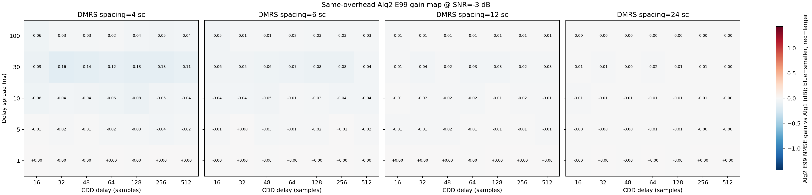

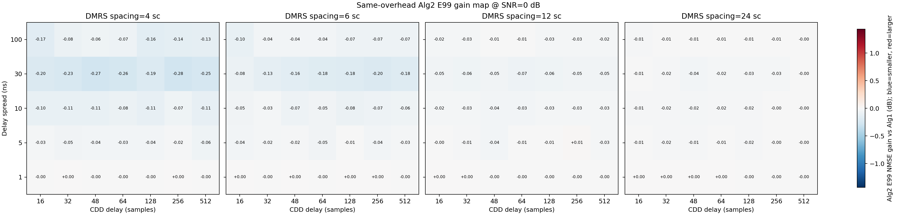

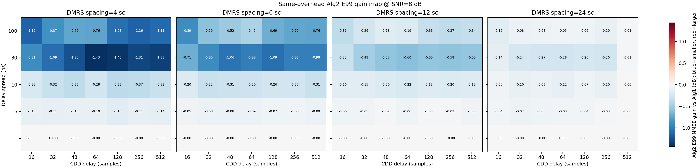

| Statistic | Algorithm 2B E99 result |
|---|---:|
| Positive-gain points | 39/420 |
| Negative-gain points | 381/420 |
| Mean gain | -0.125 dB |
| Median gain | -0.029 dB |
| Maximum gain | +0.014 dB at DS=5 ns, CDD=256, spacing=12, SNR=0 dB |
| Minimum gain | -1.433 dB at DS=30 ns, CDD=64, spacing=4, SNR=8 dB |

The $+0.014$ dB maximum is too small to support a real performance claim with 50 trials per point. At 1 ns delay spread, Algorithm 2B nearly coincides with Algorithm 1. As delay spread and SNR increase, E99 support truncation and reconstruction conditioning become more visible. The unified grid therefore provides no evidence of a robust Algorithm 2B advantage.

Algorithm 2C was useful as a structural diagnostic and avoids the large full-band basis matrix, but the completed searches likewise did not establish a stable advantage over matched Algorithm 1. Its performance remains highly sensitive to block width, pilot count per block, and $\kappa(\mathbf A_b)$.

### 3.3 Algorithm 3 equal-total-overhead gain maps

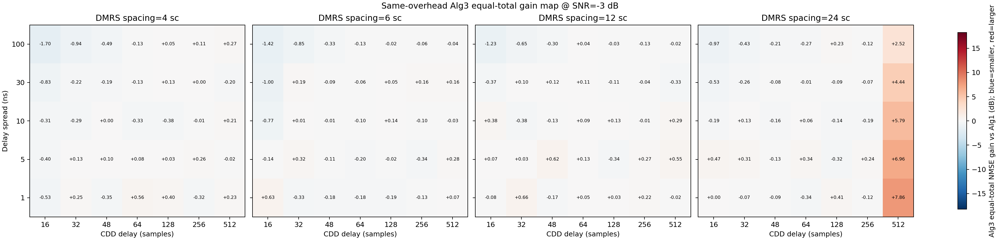

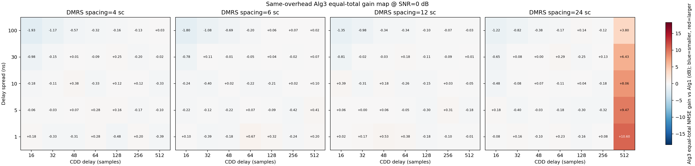

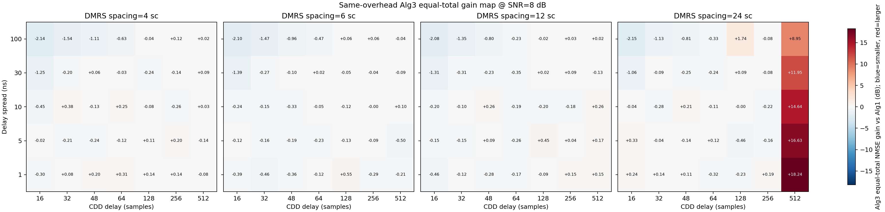

| Statistic | Algorithm 3 result |
|---|---:|
| Positive-gain points | 159/420 |
| Negative-gain points | 261/420 |
| Mean gain | +0.175 dB |
| Median gain | -0.086 dB |
| Maximum gain | +18.237 dB at DS=1 ns, CDD=512, spacing=24, SNR=8 dB |
| Minimum gain | -2.146 dB at DS=100 ns, CDD=16, spacing=24, SNR=8 dB |

The positive mean but negative median shows that a small number of large gains dominate the average. Algorithm 3 is therefore not generally superior.

The clearest repeatable region is CDD=512 samples with DMRS spacing 24. All 15 combinations of delay spread and SNR are positive:

| Delay spread | Gain at -3 dB | Gain at 0 dB | Gain at 8 dB |
|---:|---:|---:|---:|
| 1 ns | +7.855 dB | +10.600 dB | +18.237 dB |
| 5 ns | +6.963 dB | +9.465 dB | +16.632 dB |
| 10 ns | +5.790 dB | +8.059 dB | +14.637 dB |
| 30 ns | +4.437 dB | +6.430 dB | +11.954 dB |
| 100 ns | +2.516 dB | +3.797 dB | +8.947 dB |

The mechanism is structural. Sparse pilots under-sample the rapidly varying CDD-equivalent channel used by Algorithm 1, while Algorithm 3 estimates the smoother physical port channels before reapplying the known deterministic phase. This advantage disappears when the per-port pilot-density loss dominates, especially for long physical delay spread and small CDD.

Relative gain alone can be misleading. At CDD=512, spacing=24, and SNR=8 dB, Algorithm 3 reaches about -21.2 dB absolute NMSE for DS=1 ns, but only about -11.8 dB for DS=100 ns. Thus a large relative gain does not necessarily imply that the residual estimation error is small enough for high-order coded transmission.

### 3.4 Algorithm-comparison conclusion

For the same CDD-combined DMRS, matched direct RMMSE is difficult to beat: Algorithm 2B adds an inverse problem without adding observations, and Algorithm 2C replaces that problem with a local-flatness approximation. Algorithm 3 changes the observation design and can therefore escape the equivalent-channel aliasing floor, but only in a distinct operating region. The practical decision rule is:

- use Algorithm 1 as the default matched baseline;
- use Algorithm 3 when explicit port-orthogonal DMRS is available and the expected CDD-equivalent channel is too fast for the pilot comb; and
- do not select an estimator using relative NMSE gain alone; check absolute NMSE and coded BLER.

---

## 4. Frequency-Domain Precoder Matrix Design

### 4.1 Generalized precoder and physical assumptions

The precoder-design study uses a separate 8Tx/1Rx single-layer model. Each transmit branch has an independent realization with the same PDP:

$$
\mathbb E\left[h_n[\ell]h_m^*[\ell']\right]
=\delta_{n,m}\delta_{\ell,\ell'}p[\ell].
$$

Let $K$ be the number of active subcarriers and let

$$
\mathbf V\in\mathbb C^{K\times N_t},
\qquad |V[k,n]|=1,
$$

be the unit-modulus phase matrix. The actual power-normalized precoder is

$$
C[k,n]=\frac{V[k,n]}{\sqrt{N_t}}.
$$

The equivalent channel is

$$
g[k]=\sum_{n=0}^{N_t-1}C[k,n]H_n[k].
$$

Under the independent, common-PDP branch model, its full covariance is

$$
R_g[k,k']
=R_{\mathrm{phy}}[k,k']
\sum_n C[k,n]C^*[k',n],
$$

where

$$
R_{\mathrm{phy}}[k,k']
=\sum_{\ell}p[\ell]
e^{-j2\pi(k-k')\ell/N_{\mathrm{FFT}}}.
$$

Equivalently,

$$
\mathbf R_g=\mathbf R_{\mathrm{phy}}\odot(\mathbf C\mathbf C^H).
$$

For conventional CDD, $V[k,n]=e^{-j2\pi k d_n/N_{\mathrm{FFT}}}$, so $\mathbf R_g$ is Toeplitz and can be represented by a shifted PDP. For a general piecewise-linear $\mathbf V$, $R_g[k,k']$ can depend on the absolute pair $(k,k')$, so the matched estimator must use the complete non-stationary covariance.

### 4.2 Scatter-plot metrics

Each point in the scatter plot represents one candidate $\mathbf V$ for $K=576$ active subcarriers and $N_t=8$.

The vertical coordinate is the normalized Gram-determinant diversity metric:

$$
J_{\mathrm{div}}
=\log_{10}\det\left(\frac{\mathbf V^H\mathbf V}{K}\right)
=\sum_{i=1}^{N_t}\log_{10}\lambda_i,
$$

where $\lambda_i$ are the eigenvalues of $\mathbf V^H\mathbf V/K$, equivalently the squared singular values of $\mathbf V/\sqrt K$. Its linear form is

$$
G_{\mathrm{div}}
=\det\left(\frac{\mathbf V^H\mathbf V}{K}\right)
=\prod_i\lambda_i.
$$

An ideal orthogonal frequency expansion has $\mathbf V^H\mathbf V/K=\mathbf I$, hence $J_{\mathrm{div}}=0$ and $G_{\mathrm{div}}=1$. A large negative value indicates one or more weak directions.

The horizontal coordinate is an average covariance-width proxy, not simulated NMSE. First normalize the equivalent covariance:

$$
\widetilde R[k,k']
=\frac{R_g[k,k']}
{\sqrt{R_g[k,k]R_g[k',k']}}.
$$

Then average the magnitude along each covariance diagonal:

$$
\rho_{\mathrm{abs}}[\Delta]
=\frac{1}{K-\Delta}
\sum_{k=0}^{K-\Delta-1}
\left|\widetilde R[k,k+\Delta]\right|.
$$

The plotted coherence width is

$$
B_{0.5}
=\min\left\{\Delta\ge1:\rho_{\mathrm{abs}}[\Delta]\le0.5\right\}.
$$

A point farther right is, on average, more frequency-correlated and potentially easier to estimate. A point higher is better spread across the eight transmit directions. The proxy is not sufficient to predict RMMSE NMSE because NMSE also depends on the pilot locations, $\mathbf R_{TP}$, $\mathbf R_{PP}$, noise, non-stationarity, and conditioning.

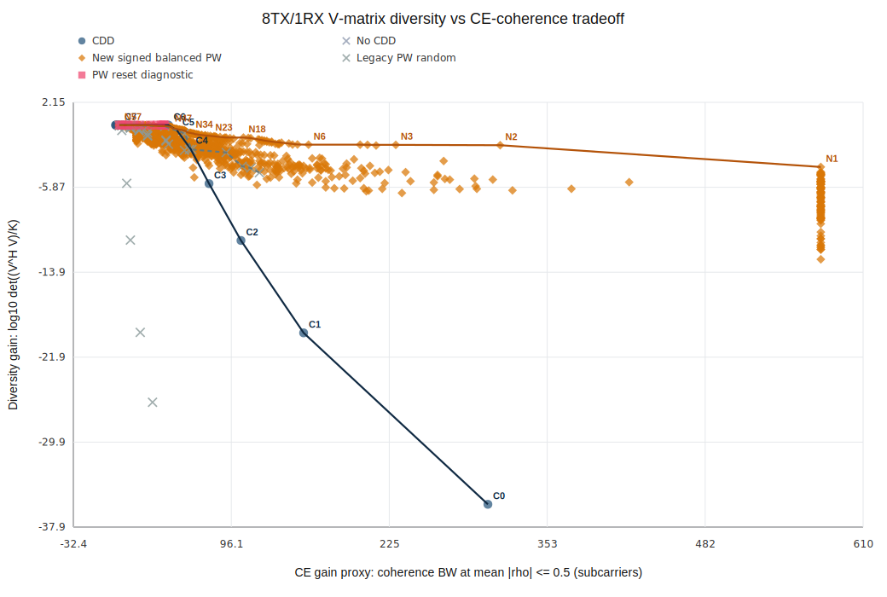

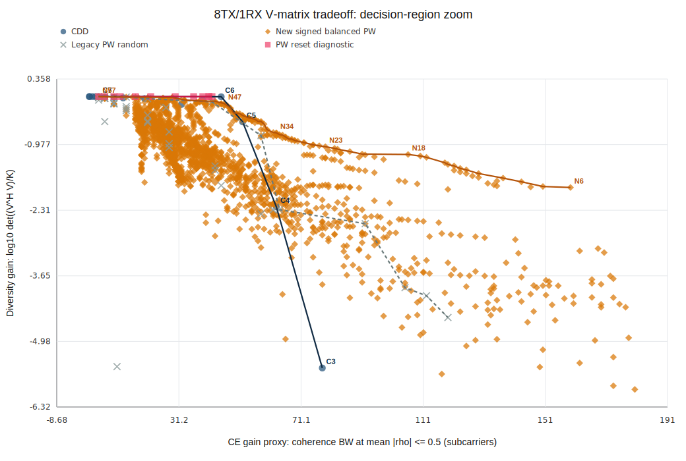

The scan contains 2,028 signed-balanced piecewise-linear implementations and produces 57 strict N-series Pareto points. Of the 55 points having a CDD reference with equal or larger $B_{0.5}$, 45 have a positive matrix-diversity margin.

### 4.3 Phase-continuous local linear-delay design: the N series

The $K$ active subcarriers are divided into $S=8$ segments. In segment $s$, transmit branch $n$ uses a local delay $d_{s,n}$. The phase evolves recursively as

$$
\phi_n[0]=0,
$$

$$
\phi_n[k+1]
=\phi_n[k]
-\frac{2\pi}{N_{\mathrm{FFT}}}d_{s(k),n},
$$

and

$$
V[k,n]=e^{j\phi_n[k]}.
$$

The accumulated phase at the end of one segment becomes the starting phase of the next segment. Therefore, phase is continuous; only the local slope, or group delay, changes at a segment boundary. This avoids the long delay-domain tails caused by hard phase resets.

For the N series, each segment uses the same signed, zero-centered set of eight local delays, but assigns them to transmit branches using either a deterministic cyclic Latin-square layout or a randomized cyclic Latin-square layout. Every row and every column contains each local delay exactly once. Thus:

- every segment uses eight distinct local slopes;
- every transmit branch experiences all eight slopes across the band; and
- the layout spreads the transmit signatures without creating phase discontinuities.

A typical nonuniform signed alphabet has the form

$$
\mathcal D=\{-d_4,-d_3,-d_2,-d_1,d_1,d_2,d_3,d_4\}.
$$

The strongest new Pareto candidates use several small delays plus one larger delay. The small values preserve local frequency correlation, while the larger value helps separate the columns of $\mathbf V$ over the complete allocation. Examples selected for link simulation are:

| ID | Local-delay alphabet, samples | Layout | $B_{0.5}$, 48 PRB | Product, 48 PRB |
|---|---|---|---:|---:|
| N3 | `{-64,-3,-2,-1,1,2,3,64}` | randomized cyclic Latin square | 230 SC | $1.36\times10^{-2}$ |
| N6 | `{-64,-4,-3,-1,1,3,4,64}` | randomized cyclic Latin square | 159 SC | $1.41\times10^{-2}$ |
| N8 | `{-64,-6,-4,-3,3,4,6,64}` | randomized cyclic Latin square | 143 SC | $1.84\times10^{-2}$ |
| N23 | `{-48,-6,-4,-1,1,4,6,48}` | deterministic cyclic Latin square | 79 SC | $9.54\times10^{-2}$ |

The design idea is therefore not simply "use a larger CDD." Conventional CDD holds one linear phase slope per branch over the entire band. The N series redistributes a signed set of local slopes across frequency and transmit branches, creating better global column separation while retaining substantial local covariance width.

---

## 5. New Pareto Points: Ideal-CSI Diversity and RMMSE NMSE

### 5.1 Link simulation conditions

| Item | Setting |
|---|---|
| Physical channel | Static TDL, exponential PDP, 5 ns delay spread |
| Antennas | 8Tx / 1Rx, single layer |
| SCS / FFT | 30 kHz / 4096; sampling rate 122.88 MHz |
| PDSCH | 10 OFDM symbols |
| Active bandwidths | 48/36/24 PRB = 17.28/12.96/8.64 MHz |
| Active subcarriers | 576/432/288 |
| Segments | 8; 72/54/36 subcarriers per segment |
| DMRS | Symbols [2,7], spacing 24 subcarriers |
| Modulation and coding | NR 256QAM-table MCS 8; actual modulation 16QAM; code rate 553/1024 |
| Decoder | LDPC, 8 iterations |
| Ideal-CSI trials | 400 TBs per SNR |
| RMMSE NMSE | SNR 0/4/8/12/16/20/24 dB, 300 trials per SNR |
| Estimator | Algorithm 1 matched full-covariance RMMSE for each candidate |

The two DMRS symbols use the same frequency comb. They are averaged before RMMSE, so

$$
\sigma_{\mathrm{LS}}^2=\frac{\sigma_w^2}{2}.
$$

Ideal-CSI BLER retains the same DMRS RE overhead and data/TB layout, but does not use the pilots for channel estimation. The main figures below use a fixed full coded-bit interleaver across the TB.

### 5.2 Ideal-CSI BLER

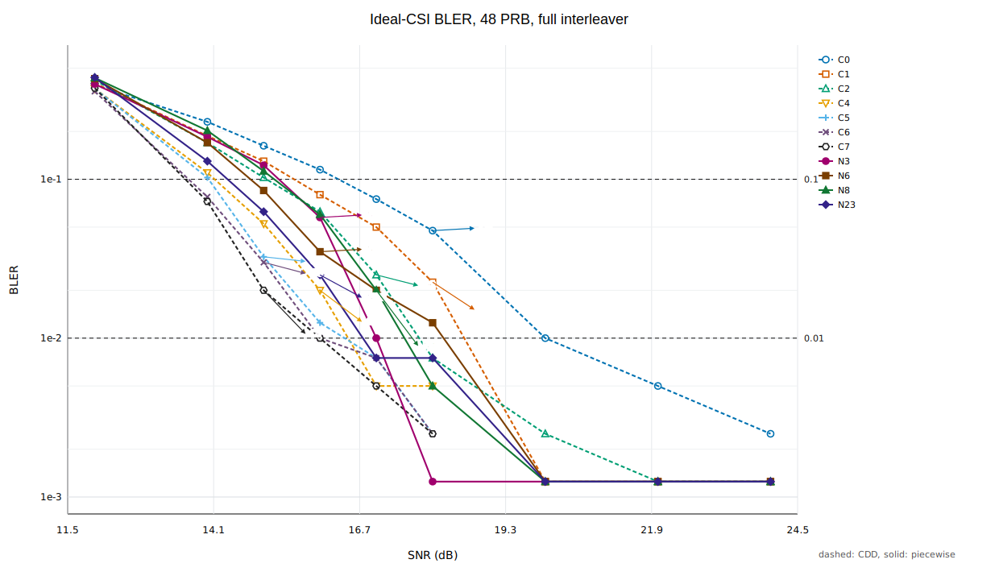

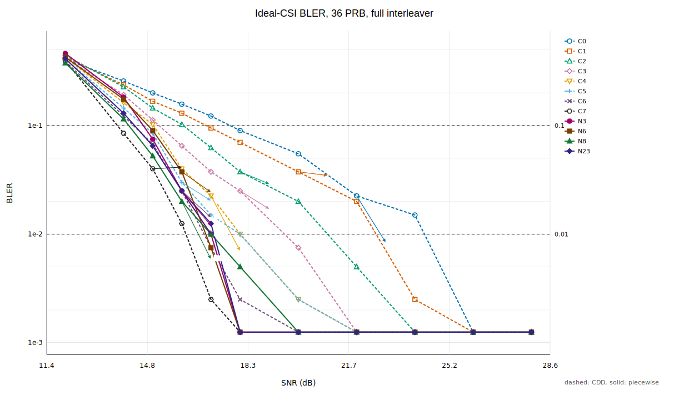

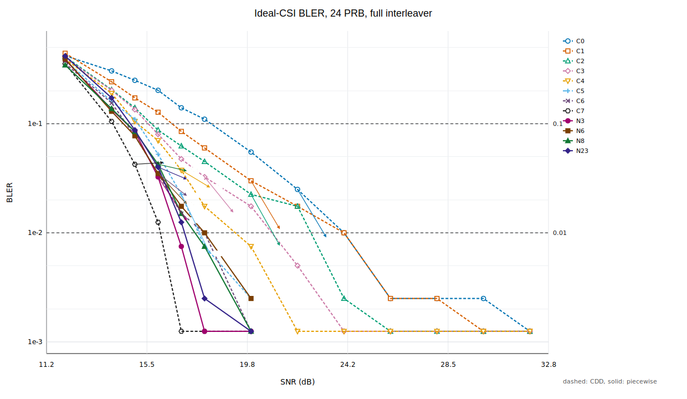

For a target BLER $p$, the reported gain is

$$
G_p
=\mathrm{SNR}_{\mathrm{CDD}}(\mathrm{BLER}=p)
-\mathrm{SNR}_{N}(\mathrm{BLER}=p).
$$

Positive gain means the N-series point requires less SNR. The CDD references in this table are selected by the closest recomputed $B_{0.5}$ at each bandwidth.

| Active BW | Candidate / CDD reference | Gain at 10% BLER | Gain at 1% BLER |
|---|---|---:|---:|
| 17.28 MHz | N3 / C0 | +1.03 dB | +3.00 dB |
| 17.28 MHz | N6 / C0 | +1.55 dB | +1.60 dB |
| 17.28 MHz | N8 / C1 | +0.36 dB | +1.44 dB |
| 17.28 MHz | N23 / C2 | +0.62 dB | +1.00 dB |
| 12.96 MHz | N3 / C5 | -0.02 dB | +1.00 dB |
| 12.96 MHz | N6 / C6 | -0.47 dB | -0.06 dB |
| 12.96 MHz | N8 / C3 | +1.02 dB | +2.71 dB |
| 12.96 MHz | N23 / C4 | +0.58 dB | +0.80 dB |
| 8.64 MHz | N3 / C6 | +0.01 dB | +1.10 dB |
| 8.64 MHz | N6 / C6 | +0.14 dB | 0.00 dB |
| 8.64 MHz | N8 / C6 | 0.00 dB | +0.33 dB |
| 8.64 MHz | N23 / C4 | +0.29 dB | +2.25 dB |

The 48-PRB result confirms that the matrix-level separation of the N series can translate into coded frequency-diversity gain when channel estimation is removed. As bandwidth narrows, the result becomes candidate- and BLER-region-dependent; the 48-PRB Pareto ordering cannot be copied directly to 36 or 24 PRB.

The matched-$B_{0.5}$ comparison is not the same as comparison against the best possible CDD. When large-delay CDD points are included, C7 with step 64 samples has the best ideal-CSI tail among the tested points: its 1% crossings are 16.00, 16.25, and 16.20 dB at 48, 36, and 24 PRB. This demonstrates an important limitation of the two scatter metrics: a similar Gram determinant and a larger average coherence width do not fully determine LDPC/BICM performance.

### 5.3 Matched full-covariance RMMSE NMSE

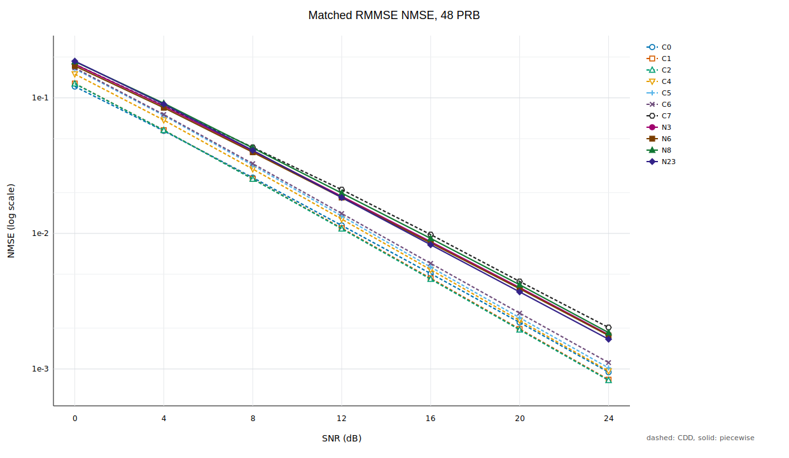

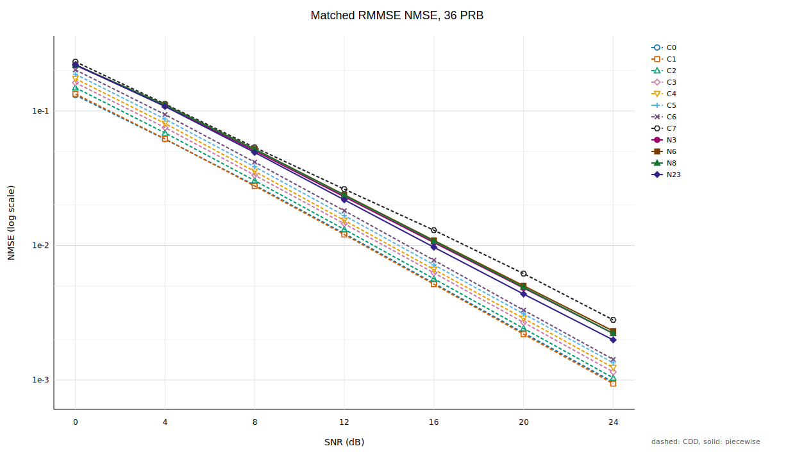

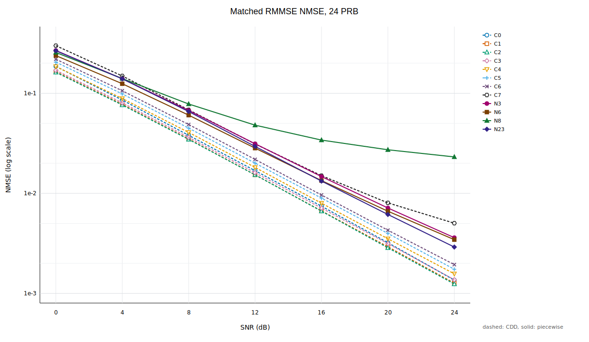

The NMSE penalty at 20 dB is

$$
L_{\mathrm{NMSE}}
=10\log_{10}
\frac{\mathrm{NMSE}_{N}}
{\mathrm{NMSE}_{\mathrm{CDD}}}.
$$

| Active BW | Candidate / CDD reference | N NMSE at 20 dB | CDD NMSE at 20 dB | Penalty |
|---|---|---:|---:|---:|
| 17.28 MHz | N3 / C0 | $3.985\times10^{-3}$ | $2.203\times10^{-3}$ | +2.57 dB |
| 17.28 MHz | N6 / C0 | $3.907\times10^{-3}$ | $2.203\times10^{-3}$ | +2.49 dB |
| 17.28 MHz | N8 / C1 | $4.179\times10^{-3}$ | $1.973\times10^{-3}$ | +3.26 dB |
| 17.28 MHz | N23 / C2 | $3.704\times10^{-3}$ | $1.946\times10^{-3}$ | +2.79 dB |
| 12.96 MHz | N3 / C5 | $4.828\times10^{-3}$ | $3.100\times10^{-3}$ | +1.92 dB |
| 12.96 MHz | N6 / C6 | $5.017\times10^{-3}$ | $3.303\times10^{-3}$ | +1.82 dB |
| 12.96 MHz | N8 / C3 | $4.893\times10^{-3}$ | $2.676\times10^{-3}$ | +2.62 dB |
| 12.96 MHz | N23 / C4 | $4.350\times10^{-3}$ | $2.870\times10^{-3}$ | +1.81 dB |
| 8.64 MHz | N3 / C6 | $7.139\times10^{-3}$ | $4.280\times10^{-3}$ | +2.22 dB |
| 8.64 MHz | N6 / C6 | $6.627\times10^{-3}$ | $4.280\times10^{-3}$ | +1.90 dB |
| 8.64 MHz | N8 / C6 | $2.726\times10^{-2}$ | $4.280\times10^{-3}$ | +8.04 dB |
| 8.64 MHz | N23 / C4 | $6.148\times10^{-3}$ | $3.516\times10^{-3}$ | +2.43 dB |

All four N-series candidates have worse matched-RMMSE NMSE than their bandwidth-specific CDD references. This does not contradict the scatter plot: $B_{0.5}$ is a diagonal-average threshold, while RMMSE depends on the complete non-stationary covariance and the sparse pilot comb.

The 24-PRB N8 case is especially important. Its NMSE decreases slowly from $4.80\times10^{-2}$ at 12 dB to $2.31\times10^{-2}$ at 24 dB, indicating a strong interpolation residual. With only 36 subcarriers per segment and pilots spaced every 24 subcarriers, the non-stationary covariance is poorly observed. Even a matched covariance cannot reconstruct target REs that are weakly predictable from the sampled pilot set.

### 5.4 End-to-end interpretation

The ideal-CSI BLER and RMMSE NMSE results expose the intended design trade-off:

- the N-series slope switching can improve global frequency-diversity exposure;
- the same switching creates a non-stationary equivalent covariance that can be harder to interpolate from sparse pilots; and
- large-delay CDD also trades estimation quality for diversity, but its stationary shifted-PDP structure is easier for Algorithm 1 to model.

In the completed estimated-CSI BLER validation, no N-series candidate reliably beats the best CDD at the 1% BLER target. The closest cases are effectively ties within the SNR grid and 400-trial resolution. The 24-PRB N8 candidate exhibits an approximately 11--15% BLER floor, consistent with its large NMSE residual and with the receiver not explicitly adding channel-estimation uncertainty to the demapper noise variance.

---

## 6. Final Conclusions and Design Guidance

1. **Matched direct RMMSE is the correct primary baseline.** It directly estimates the channel required by the detector, uses the known CDD-shifted statistics, and avoids unnecessary branch separation.

2. **Reconstruction from CDD-combined pilots is observation-limited.** Algorithm 2B and 2C encode useful physical structure, but they do not add independent observations. Their performance is governed by sensing-matrix conditioning, model support, or local-flatness error. The unified data do not show a robust NMSE gain.

3. **Changing the reference-signal design can solve a problem that estimator complexity alone cannot.** Algorithm 3 is highly effective when sparse pilots alias a fast CDD-equivalent channel but remain sufficient for the smoother physical port channels. Its overhead and per-port density must be included in any fair system comparison.

4. **The N-series construction is a genuine matrix-level improvement over conventional CDD in a large part of the diversity/coherence plane.** Phase-continuous local slope switching, especially with signed nonuniform alphabets and Latin-square layouts, is a promising deterministic-precoder design family.

5. **Matrix metrics are screening tools, not final objectives.** Neither the Gram-determinant product nor $B_{0.5}$, alone or together, captures the full pilot-to-data predictability, covariance conditioning, equivalent-SINR distribution, and coded-bit mapping.

6. **The practical optimization target should be link-aware.** A useful next-stage objective is

$$
J(\mathbf V)
=J_{\mathrm{div}}(\mathbf V)
-\mu L_{\mathrm{CE}}(\mathbf V),
$$

where $L_{\mathrm{CE}}$ is computed from matched RMMSE NMSE or the analytical conditional error covariance for the actual DMRS pattern. The final selection should then be verified by estimated-CSI BLER at the intended MCS and bandwidth.

7. **For the present configuration, conventional CDD remains the safest end-to-end choice.** The N series proves that better ideal-CSI diversity/coherence trade-offs exist, but the tested sparse-pilot receiver does not yet convert them into a reliable estimated-CSI BLER gain. Future improvements should jointly optimize $\mathbf V$, DMRS placement/density, and estimation-error-aware LLR scaling.

---

## 7. Traceability

This report summarizes the following project records and result sets:

- `QC_explicit_CDD_link_level_simulation_plan.md`: system model and Algorithms 1, 2B, 2C, and 3;
- `docs/experiment_record_20260608.md`, Section 10.9: unified 420-point Algorithm 2/3 NMSE gain maps;
- `docs/v_design_piecewise_tradeoff_experiment.md`: generalized $\mathbf V$ covariance, scatter metrics, N-series construction, ideal-CSI BLER, and matched-RMMSE NMSE;
- `outputs/nmse_same_overhead_search_unified/search_20260619_164606/unified_gain_map.csv`: unified algorithm-comparison data;
- `outputs/v_design_balanced_slope_scan/v_design_balanced_slope_scan_20260619_162622/`: N-series matrix scan and Pareto front;
- `outputs/v_design_new_front_link_*`: ideal-CSI and RMMSE NMSE link results.
