# CDD LLS 第一版实验记录

日期：2026-06-08  
记录对象：当前已经实际运行过的本地仿真与验证检查  
代码目录：`/Users/zhangwei/Downloads/CDD_LLS`

> 重要说明：本记录中的两个仿真实验都是 smoke 级功能闭环验证，trial 数非常小，目的是确认平台链路能跑通、各算法路径能产生输出，并不是正式 QC 性能结论。正式 BLER 曲线需要运行 `configs/config_qc_static_tdl.yaml` 或 `configs/config_recon_vs_rmmse.yaml`，并把 trial 数提高到足够统计量。

## 1. 实验 A：CDD + RMMSE_WB_KNOWN 最小闭环 smoke

### 实验目的

验证第一版平台的核心 bit-level 链路是否闭环：

1. Sionna LDPC 编码/解码可用；
2. static TDL branch channel 可生成；
3. CDD 等效信道可生成；
4. DMRS LS 观测和 wideband RMMSE 信道估计可运行；
5. MRC/ZF 风格均衡、QAM soft demap、LDPC decode、BLER/NMSE/goodput 统计可完整输出。

### 运行命令

```bash
/Users/zhangwei/Downloads/lls_platform_sc_mimo/.venv-sionna1/bin/python run.py --config configs/smoke.yaml
```

### 输出目录

```text
outputs/smoke/sim_20260608_224957/
```

### 仿真设置

| 项目 | 设置 |
|---|---|
| 配置文件 | `configs/smoke.yaml` |
| Tx/Rx | 2Tx / 4Rx |
| 发射方案 | `CDD` |
| CDD delay | `[0, 4]` samples |
| 信道模型 | static TDL，指数 PDP |
| Delay spread | 30 ns |
| `n_fft` | 1024 |
| PDSCH RB | 2 RB |
| PDSCH symbols | 6 symbols |
| DMRS symbols | `[1, 4]`，共 2 个 |
| DMRS frequency spacing | 4 subcarriers |
| DMRS overhead | 8.33% |
| Data RE | 132 |
| CE method | `RMMSE_WB_KNOWN` |
| MCS | `nr_256qam` MCS 5 |
| Modulation | 16QAM，`Qm=4` |
| Coded bits | 528 |
| TBS | 192 bits |
| LDPC CB 数 | 1 |
| LDPC decoder iterations | 8 |
| SNR sweep | 0 dB, 2 dB |
| Trials per SNR | 1 |

### 实验结果

| SNR (dB) | noise var | trials | TB errors | BLER | CB-BLER | CE NMSE eff | Goodput bits/slot | Goodput SE/data RE |
|---:|---:|---:|---:|---:|---:|---:|---:|---:|
| 0 | 1.000000 | 1 | 1 | 1.0 | 1.0 | 0.272494 | 0 | 0.000000 |
| 2 | 0.630957 | 1 | 0 | 0.0 | 0.0 | 0.155097 | 192 | 1.454545 |

`summary_10pct_bler_snr.csv` 给出的 10% BLER 插值 SNR 为 0.5 dB。由于本实验每个 SNR 只有 1 个 trial，该插值只说明输出流程可用，不能作为真实性能点引用。

### 图

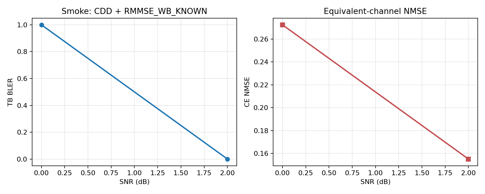

### 观察

- 平台完成了从 payload bits 到 Sionna LDPC 编码、CDD TDL 信道、RMMSE 信道估计、均衡解调、LDPC 解码和统计输出的完整闭环。
- 2 dB 点的等效信道 NMSE 低于 0 dB 点，方向符合 SNR 提高后 CE 变好的直觉。
- BLER 从 1 个错误到 0 个错误只是 smoke 级现象，不能解释为真实 waterfall。

## 2. 实验 B：多算法路径 smoke

### 实验目的

验证第一版平台中多个发射/信道估计算法分支都能实际运行并输出关键诊断字段：

1. PRG baseline 路径：`PRG_CYCLING_4RB + PRG_RMMSE_4RB`；
2. CDD ideal CSI 路径；
3. CDD direct RMMSE 路径；
4. CDD pairwise reconstruction 路径；
5. CDD basis LMMSE reconstruction 路径。

### 运行命令

```bash
/Users/zhangwei/Downloads/lls_platform_sc_mimo/.venv-sionna1/bin/python run.py --config configs/smoke_variants.yaml
```

### 输出目录

```text
outputs/smoke_variants/sim_20260608_225046/
```

### 仿真设置

| 项目 | 设置 |
|---|---|
| 配置文件 | `configs/smoke_variants.yaml` |
| Tx/Rx | 2Tx / 4Rx |
| 信道模型 | static TDL，指数 PDP |
| Delay spread | 30 ns |
| `n_fft` | 1024 |
| PDSCH RB | 2 RB |
| PDSCH symbols | 6 symbols |
| DMRS symbols | `[1, 4]`，共 2 个 |
| DMRS frequency spacing | 2 subcarriers |
| DMRS overhead | 16.67% |
| Data RE | 120 |
| CDD delay | `[0, 4]` samples |
| MCS | `nr_256qam` MCS 5 |
| Modulation | 16QAM，`Qm=4` |
| Coded bits | 480 |
| TBS | 176 bits |
| LDPC CB 数 | 1 |
| LDPC decoder iterations | 4 |
| SNR | 2 dB |
| Trials per variant | 1 |

### 实验结果

| variant | Tx scheme | CE method | BLER | CB-BLER | CE NMSE eff | CE NMSE branch | cond number | effective rank | Goodput bits/slot |
|---|---|---|---:|---:|---:|---:|---:|---:|---:|
| `prg` | `PRG_CYCLING_4RB` | `PRG_RMMSE_4RB` | 0.0 | 0.0 | 0.029985 | n/a | n/a | n/a | 176 |
| `ideal` | `CDD` | `IDEAL_CSI` | 1.0 | 1.0 | 0.000000 | 0.000000 | n/a | n/a | 0 |
| `rmmse` | `CDD` | `RMMSE_WB_KNOWN` | 0.0 | 0.0 | 0.047134 | n/a | n/a | n/a | 176 |
| `pairwise` | `CDD` | `RECON_PAIRWISE` | 1.0 | 1.0 | 0.180061 | 23.638605 | 81.483240 | n/a | 0 |
| `basis` | `CDD` | `RECON_BASIS_LMMSE` | 1.0 | 1.0 | 0.030838 | 0.310947 | 3.435e12 | 1.185067 | 0 |

### 图

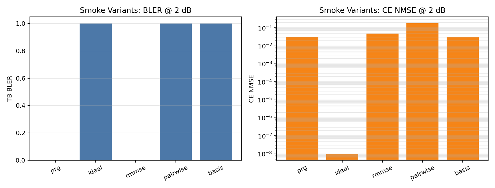

### 观察

- PRG baseline、ideal CSI、direct RMMSE、pairwise reconstruction、basis reconstruction 五条代码路径均成功运行并写出 CSV/JSON。
- `RECON_PAIRWISE` 输出了 condition number，当前 smoke 设置下约为 81.48，说明 pairwise 解耦矩阵可诊断。
- `RECON_BASIS_LMMSE` 输出了 branch NMSE、equivalent-channel NMSE、condition number 和 effective rank。该点的 basis condition number 很大，提示当前小资源网格和稀疏/短 support 设置下 basis matrix 很病态。
- `ideal` 这一行 BLER 为 1.0 不代表 ideal CSI 比 RMMSE 差。原因是本实验每个 variant 只有 1 个 trial，而且不同 variant 使用不同稳定 seed，信道和 payload 并不相同。该实验只用于代码路径 smoke，不用于算法排名。

## 3. 额外开发验证

### 3.1 单元测试

运行命令：

```bash
/Users/zhangwei/Downloads/lls_platform_sc_mimo/.venv-sionna1/bin/python -m unittest discover -s tests
```

结果：

```text
Ran 4 tests in 0.039s
OK
```

覆盖内容：

- smoke 配置可加载；
- resource grid 可生成 data RE 和 pilot；
- TB layout 的 coded bits 与 data RE/Qm 匹配；
- QAM soft demapper 的 LLR 符号约定正确；
- CDD-shifted PDP 能量归一化正确。

### 3.2 Python 编译检查

运行命令：

```bash
/Users/zhangwei/Downloads/lls_platform_sc_mimo/.venv-sionna1/bin/python -m compileall cdd_lls run.py
```

结果：通过，无语法错误。

### 3.3 48 RB / MCS8 LDPC 初始化检查

目的：确认正式 QC 配置中的 48 RB、MCS8 场景不会在 Sionna LDPC encoder 初始化阶段失败。

检查结果：

```text
TBLayout(data_re=5568, coded_bits=22272, tb_size=12024,
         cb_k_values=[3006, 3006, 3006, 3006],
         cb_e_values=[5568, 5568, 5568, 5568],
         qm=4, code_rate=0.5400390625)
ldpc ok
```

说明：48 RB / MCS8 会被切成 4 个 CB，每个 CB 的 Sionna LDPC encoder/decoder 可初始化。

### 3.4 绘图检查

目的：确认 `summary.json` 可以被绘图工具读取并生成 BLER/NMSE PNG。

结果：已生成本记录使用的两张图片：

```text
docs/figures/smoke_bler_nmse.png
docs/figures/smoke_variants_bler_nmse.png
```

## 4. 当前还没有完成的正式实验

以下配置已经写好，但尚未做完整 Monte Carlo 跑数：

```text
configs/config_qc_static_tdl.yaml
configs/config_recon_vs_rmmse.yaml
```

原因是这两组配置包含多个 scenario、variant、SNR 点和 trial，运行时间会明显高于 smoke。当前已经确认平台闭环可用，下一步可以直接启动正式跑数。

建议正式实验时至少调整：

- `simulation.n_trials_per_snr`: 从 20 提高到 200 或更多；
- `simulation.min_block_errors`: 设置为 50 到 100；
- 根据初始曲线扩大或移动 `simulation.snr_range_db`；
- 对不同 variant 使用 common random channel/payload seed，以便做更公平的算法比较。

## 5. 结论

已经完成的实验主要证明：第一版 CDD LLS 平台可以在本地 Sionna 环境中跑通，核心输出包括 BLER、CB-BLER、goodput、equivalent-channel NMSE、branch NMSE、condition number 和 10% BLER SNR 插值文件。

目前这些结果只能作为工程闭环和调试记录。正式回答 QC 显式 CDD 增益、wideband CE 增益、known/unknown delay 差异、RMMSE vs reconstruction 优劣，还需要运行完整 Monte Carlo 配置。

---

## 6. 正式实验计划：对齐 QC 图 10 / 图 11，验证 Structural reconstruction

### 6.1 实验背景

当前文件夹中的 QC Word 提案 `R1-2604697 Downlink transmission schemes for downlink shared channels.docx` 给出了 CDD 评估的 LLS 设置。提案中图 10 和图 11 对应 wideband PDSCH 场景：

- 图 10：Wideband PDSCH BLER spanning 48 RBs，2 Tx，3 km/h；
- 图 11：Wideband PDSCH BLER spanning 48 RBs，2 Tx，60 km/h。

从 Word 提案 Table 1 和图 10/11 附近文字提取到的关键条件如下：

| 项目 | QC 图 10/11 条件 |
|---|---|
| Carrier BW | 100 MHz |
| SCS | 30 kHz |
| Channel model | TDL |
| Delay spread | 30 ns / 100 ns |
| UE speed | 图 10: 3 km/h；图 11: 60 km/h |
| gNB array | 2 transmit antennas |
| UE array | 4 receive antennas |
| PDSCH F/TDRA | 48 RB x 10 symbols，含 2 个 DMRS symbols |
| MCS | MCS 8，16QAM，R = 553/1024，256QAM table |
| QC CE baseline | RMMSE-based，PRG bundling size = 4 或 wideband |
| CDD delay | 选择使 10% BLER 所需 SNR 最小的 cyclic delay |

提案正文还说明：在 48 RB wideband PDSCH 下，PRG-level precoder cycling 已经能在 48 RB 内循环 4 个 precoder 多次，因此 CDD + 4RB CE 相对 PRG 的 diversity gain 有限；CDD 的主要额外收益来自 phase-continuous RE-level cycling 允许 UE 做 wideband channel estimation。若 UE 不知道 cyclic delay value，会使用 non-CDD PDP，导致 covariance mismatch，低 delay spread 30 ns 时退化更明显。

本实验的新增目标不是复现 QC 所有曲线，而是在 QC 图 10/11 的 wideband 条件下，比较：

1. QC Direct equivalent-channel RMMSE；
2. 我们提出的 Structural / deterministic physical-channel reconstruction；
3. Ideal CSI 上界。

### 6.2 核心研究假设

本实验重点验证以下判断：

1. 当底层 TDL delay spread 小，例如 30 ns，物理 branch channel 在频域更平滑；
2. 当 CDD delay 较大时，CDD 等效信道 `g[k]` 会出现更快频率选择性；
3. Direct equivalent-channel RMMSE 直接插值 `g[k]`，会受到 CDD 造成的快速相位/幅度起伏限制；
4. Structural reconstruction 利用已知 CDD delay，把快速变化解释为确定性 phase term，先估计更平滑的底层 branch channel `H_m[k]`，再重构 `g[k]`；
5. 因此在“小 delay spread + 大 CDD delay + 足够 DMRS density”条件下，Structural reconstruction 预期优于 Direct RMMSE，表现为更低 `ce_nmse_eff` 和更低 10% BLER 所需 SNR。

### 6.3 实验分组

本计划分为两个阶段。

#### Phase A：static TDL approximation，对齐图 10 主体条件

当前平台第一版已经支持 static TDL、CDD、RMMSE、reconstruction 和 Ideal CSI，但尚未实现 Doppler/time-varying channel。因此 Phase A 先跑 static TDL，用于隔离 delay spread、CDD delay 和 CE 算法本身。

| 场景 ID | 目标对应 | Tx/Rx | Speed | Delay spread | PDSCH |
|---|---|---:|---:|---:|---|
| `fig10_static_ds30` | 图 10 的低 delay spread 静态近似 | 2Tx / 4Rx | static / 3 km/h approx | 30 ns | 48 RB x 10 symbols |
| `fig10_static_ds100` | 图 10 的高 delay spread 静态近似 | 2Tx / 4Rx | static / 3 km/h approx | 100 ns | 48 RB x 10 symbols |

Phase A 的结果用于验证我们的算法直觉：30 ns + 较大 CDD delay 时 reconstruction 是否比 Direct RMMSE 更明显受益。

#### Phase B：mobility extension，对齐图 11

图 11 是 60 km/h。为了严格对齐，需要在平台中增加 time-varying TDL / Doppler 以及 DMRS symbols 间的时间相关处理。当前代码尚未实现 Doppler，因此图 11 的严格版本应作为 Phase B，在补齐 mobility 后运行。

| 场景 ID | 目标对应 | Tx/Rx | Speed | Delay spread | PDSCH |
|---|---|---:|---:|---:|---|
| `fig11_mobile_ds30` | 图 11 低 delay spread | 2Tx / 4Rx | 60 km/h | 30 ns | 48 RB x 10 symbols |
| `fig11_mobile_ds100` | 图 11 高 delay spread | 2Tx / 4Rx | 60 km/h | 100 ns | 48 RB x 10 symbols |

在 Phase B 完成前，可以先用 static results 判断 reconstruction 的频域结构化收益，但不能声称已复现图 11 的高速移动性。

### 6.4 固定仿真参数

| 参数 | 计划取值 |
|---|---|
| `n_fft` | 4096 |
| SCS | 30 kHz |
| PDSCH RB | 48 |
| Active subcarriers | 576 |
| PDSCH symbols | 10 |
| DMRS symbols | 2 个，默认 `[2, 7]` |
| DMRS spacing | 主实验 `S_f=6`；补充 sweep `S_f in {2,4,6,12}` |
| Tx/Rx | 2Tx / 4Rx |
| MCS table | `nr_256qam` |
| MCS index | 8 |
| Modulation/code rate | 16QAM，R = 553/1024 |
| TBS 计算 | 按 data RE 和 MCS 重新计算 |
| Channel | TDL，delay spread 30 ns / 100 ns |
| Trial stopping | 每 SNR 至少 200 trials，或至少 100 TB errors |
| BLER target | 10% |

#### 资源与 DMRS 分布示意

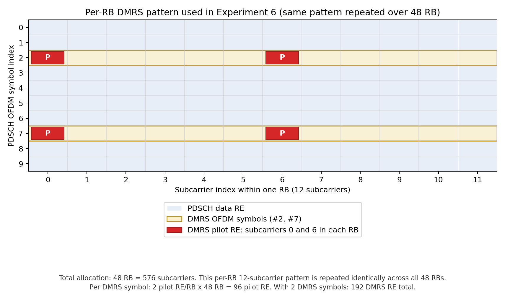

图中只画一个 RB 内的 12 个子载波，因为每个 RB 内的 DMRS pattern 完全相同，并在 48 个 RB 上重复。总频域分配仍是 48 RB，也就是 576 个 active subcarriers；纵轴是 10 个 PDSCH OFDM symbols。默认两个 DMRS symbols 放在 symbol `#2` 和 `#7`。主实验的 DMRS frequency spacing 为 `S_f=6` subcarriers，因此每个 RB 内有 2 个 DMRS pilot RE，位于该 RB 的子载波 `0` 和 `6`；两个 DMRS symbols 合并后，每个 trial 的频域 LS pilot observation 数为：

```text
N_pilot,freq = 576 / 6 = 96
N_DMRS_RE = 96 * 2 = 192
DMRS overhead = 192 / (576 * 10) = 3.33%
```

PRG cycling baseline 和 `RMMSE_4RB_KNOWN` 的 processing window 是 4 RB；`RMMSE_WB_KNOWN` 和 `RECON_BASIS_LMMSE` 都使用整个 48-RB allocation 内的 pilot samples。

#### 两种 CE 算法是否使用相同导频

是。`RMMSE_WB_KNOWN` 和 `RECON_BASIS_LMMSE` 使用完全相同的 DMRS pattern、相同的 pilot RE、相同的 LS pilot observation：

```text
tilde_g_r[p] = g_r[p] + n_r[p],  p in pilot set P
```

两者区别只在后端估计模型：

- `RMMSE_WB_KNOWN`：直接把 CDD 后的 equivalent channel `g_r[k]` 作为待估对象，用 CDD-shifted PDP 构造 `R_Dp` / `R_pp`，从同一组 `tilde_g_r[p]` 插值得到 `hat_g_r[k]`。
- `RECON_BASIS_LMMSE`：仍从同一组 `tilde_g_r[p]` 出发，但把观测写成 delay-domain physical branch taps 的线性组合，先估计 `hat_h_{r,m}[l]` / `hat_H_{r,m}[k]`，再用已知 CDD delay 重构 `hat_g_r[k]`。

因此本实验对比的是“相同导频采样下，不同 CE estimator / prior model 的性能”，不是不同 DMRS overhead 或不同 pilot pattern 的比较。

SNR 范围按用户指定的 QC 图读数范围固定为：

```text
-6, -4, -2, 0, 2, 4, 6, 8 dB
```

配置中对应：

```yaml
simulation:
  snr_range_db: [-6, 8, 2]
```

第一轮 Monte Carlo 和后续正式 run 都先使用该 SNR grid。若需要更精确提取 10% BLER SNR，可在该范围内围绕 waterfall 区间补充 1 dB 或 0.5 dB 加密点。

### 6.5 CDD delay 设置和 sweep

QC 提案中 CDD delay 是“选择使 10% BLER 所需 SNR 最小”的 delay。为了同时验证我们的算法假设，本实验不只使用一个固定 delay，而是先做 delay sweep。

在 `n_fft=4096, SCS=30 kHz` 下，采样率为：

```text
Fs = 4096 * 30 kHz = 122.88 MHz
Ts = 8.138 ns
```

2Tx delay vector 使用：

```text
[0, d]
```

计划 sweep：

| d samples | 近似 delay |
|---:|---:|
| 0 | 0 ns |
| 2 | 16.3 ns |
| 4 | 32.6 ns |
| 8 | 65.1 ns |
| 16 | 130.2 ns |
| 32 | 260.4 ns |
| 64 | 520.8 ns |

主比较使用两种 delay 选择方式：

1. **QC-style common optimum**：用 `Direct RMMSE_WB_KNOWN` 在每个 delay spread 下选择使 10% BLER SNR 最小的 `d*`，然后 Direct RMMSE、Structural reconstruction、Ideal CSI 都使用同一个 `d*`；
2. **hypothesis stress test**：固定较大的 CDD delay，例如 `d=16/32/64`，重点观察 30 ns delay spread 下 Structural reconstruction 是否比 Direct RMMSE 更稳健。

这样可以避免只看 QC optimum 时错过 reconstruction 更适合的“大 CDD delay”工作区间。

### 6.6 待比较算法

主曲线：

| 曲线名 | Tx scheme | CE method | 目的 |
|---|---|---|---|
| `CDD_RMMSE_WB_KNOWN` | CDD | `RMMSE_WB_KNOWN` | QC Direct equivalent-channel RMMSE baseline |
| `CDD_RECON_BASIS_LMMSE` | CDD | `RECON_BASIS_LMMSE` | 我们提出的主 Structural reconstruction |
| `CDD_IDEAL_CSI` | CDD | `IDEAL_CSI` | 接收端 CSI 上界 |

补充曲线：

| 曲线名 | Tx scheme | CE method | 目的 |
|---|---|---|---|
| `CDD_RMMSE_4RB_KNOWN` | CDD | `RMMSE_4RB_KNOWN` | 对齐 QC 4RB processing |
| `CDD_RMMSE_WB_UNKNOWN` | CDD | `RMMSE_WB_UNKNOWN` | 验证 unknown delay / PDP mismatch 损失 |
| `CDD_RECON_PAIRWISE` | CDD | `RECON_PAIRWISE` | reconstruction-A 诊断，不作为主算法 |
| `PRG_RMMSE_4RB` | PRG cycling | `PRG_RMMSE_4RB` | QC PRG-level precoder cycling reference |

本次用户关心的核心对比是 `CDD_RMMSE_WB_KNOWN` vs `CDD_RECON_BASIS_LMMSE` vs `CDD_IDEAL_CSI`。

### 6.7 输出指标

每个 scenario / delay / algorithm / SNR 输出：

| 指标 | 解释 |
|---|---|
| `bler` | TB BLER，主性能指标 |
| `cb_bler` | CB-BLER |
| `goodput_bits_per_slot` | 成功 CB payload bits |
| `goodput_se_per_re` | 按 data RE 归一化 goodput |
| `ce_nmse_eff` | CDD 等效信道 NMSE |
| `ce_nmse_branch` | reconstruction 的底层 branch channel NMSE |
| `cond_number` | reconstruction matrix 条件数 |
| `effective_rank` | basis reconstruction effective rank |
| `snr_at_target_bler_db` | 10% BLER 插值 SNR |
| `snr_gain_vs_direct_rmmse_db` | reconstruction 相对 Direct RMMSE 的 SNR gain |

需要生成的图：

1. BLER vs SNR：Direct RMMSE / Structural reconstruction / Ideal CSI；
2. CE NMSE vs SNR；
3. 10% BLER SNR vs CDD delay；
4. Reconstruction gain vs CDD delay；
5. 30 ns 与 100 ns delay spread 的 gain 对比；
6. condition number vs CDD delay。

### 6.8 成功判据

本实验期望看到：

1. Ideal CSI 始终是 BLER 上界；
2. 在 `delay_spread=30 ns` 且 `d` 较大时，`RECON_BASIS_LMMSE` 的 `ce_nmse_eff` 低于 `RMMSE_WB_KNOWN`；
3. 若 CE NMSE 改善能传导到解码端，则 `RECON_BASIS_LMMSE` 的 10% BLER SNR 低于 `RMMSE_WB_KNOWN`；
4. 在 `delay_spread=100 ns` 时，底层 channel 自身更频选，reconstruction 相对优势可能减小；
5. 当 CDD delay 过大且 DMRS density 不足时，pairwise reconstruction 可能因 condition number 过大而退化，basis LMMSE 应更稳健。

### 6.9 实现注意事项

当前代码已经实现 `RMMSE_WB_KNOWN`、`RECON_BASIS_LMMSE`、`RECON_PAIRWISE` 和 `IDEAL_CSI`，但为严格完成图 10/11 对齐，还需要注意：

1. 图 10 的 3 km/h 可先用 static TDL 近似；若要严格 3 km/h，也需要 Doppler，但误差预计小于 60 km/h。
2. 图 11 的 60 km/h 不能用当前 static TDL 声称严格复现，需要增加 time-varying TDL。
3. 需要把 formal run 的 random seed 设计为 common random numbers，使不同 CE 算法共享相同 channel/payload/noise realization，减少算法比较方差。
4. 当前 LLR noise variance 未显式加入 CE error self-noise，若出现 “NMSE 改善但 BLER 不改善”，需要进一步改进 receiver LLR model。
5. delay sweep 的 `d=64` 可能导致 basis matrix 条件数过大，应同时检查 `cond_number`，不要只看 BLER。

### 6.10 建议执行顺序

1. 跑 `fig10_static_ds30` 的 delay sweep，算法只跑 `RMMSE_WB_KNOWN` 和 `RECON_BASIS_LMMSE`，SNR grid 固定为 `[-6, -4, -2, 0, 2, 4, 6, 8]`。
2. 根据该 SNR grid 找到 10% BLER 区间和候选 CDD delay；如需更精细 SNR10，则只在 waterfall 附近补 1 dB / 0.5 dB 点。
3. 在候选 delays 上跑 formal BLER curves，并加入 `IDEAL_CSI`。
4. 重复 `fig10_static_ds100`，验证 high delay spread 下 reconstruction gain 是否变小。
5. 做 DMRS density sweep，判断 reconstruction 是否在稀疏/密集 DMRS 下有不同收益。
6. 如果 Phase A 结论成立，再实现 Doppler/time-varying TDL 并跑图 11 对齐实验。

---

## 7. Monte Carlo 结果：Fig.10 static approximation 第一批

### 7.1 本轮运行说明

本轮按照用户指定的 SNR 点运行：

```text
-6, -4, -2, 0, 2, 4, 6, 8 dB
```

说明：

- 本轮是 QC 图 10 的 static TDL approximation，不包含图 11 的 60 km/h Doppler。
- 每个 SNR 点只跑 10 trials，用于快速审查趋势和暴露实现问题，不作为最终论文级统计结论。
- 已启用 `common_random_numbers: true`，同一 scenario/SNR/trial 下不同 CE 算法共享相同 channel、payload 和 noise realization。
- 曾启动过一次旧 SNR 范围 `[0, 12, 4]` 的试跑，输出目录为 `outputs/fig10_static_recon_prescan/sim_20260608_231409/`，该结果不纳入本节分析。

### 7.2 实验 C：30 ns，CDD d=16，单 delay 快速检查

#### 目的

先验证 QC 图 10 static 条件下，`delay_spread=30 ns`、CDD delay `d=16` samples 时，Direct RMMSE、Structural basis reconstruction 和 Ideal CSI 三条主曲线能否按指定 SNR 范围完整跑通。

#### 配置和输出

| 项目 | 设置 |
|---|---|
| 配置文件 | `configs/fig10_static_ds30_d16_mc.yaml` |
| 输出目录 | `outputs/fig10_static_ds30_d16_mc/sim_20260609_080219/` |
| Tx/Rx | 2Tx / 4Rx |
| PDSCH | 48 RB x 10 symbols |
| DMRS | 2 symbols，frequency spacing `S_f=6` |
| Delay spread | 30 ns |
| CDD delay | `[0, 16]` samples，约 `[0, 130.2] ns` |
| MCS | MCS 8，16QAM，R=553/1024，256QAM table |
| SNR | -6:2:8 dB |
| Trials | 10 per SNR |
| Algorithms | Direct RMMSE WB known / Structural basis LMMSE / Ideal CSI |

#### 10% BLER SNR

| Algorithm | 10% BLER SNR |
|---|---:|
| Direct RMMSE WB known | 4.182 dB |
| Structural basis LMMSE | 4.182 dB |
| Ideal CSI | 4.182 dB |

#### 观察

- 在 10 trials/点下，三条 BLER 曲线在关键 waterfall 区域几乎重合。
- Structural basis 的 `ce_nmse_eff` 略高于 Direct RMMSE，没有显示出 reconstruction 优势。
- 该点说明 d=16 对当前实现/DMRS density 来说不足以拉开 Direct RMMSE 与 Structural reconstruction 的差异。

### 7.3 实验 D：delay spread 30/100 ns，CDD d=16/32

#### 目的

系统比较 delay spread 和 CDD delay 对两类 CE 算法的影响，重点看：

1. 30 ns 小 delay spread 下是否更有利于 Structural reconstruction；
2. CDD delay 从 d=16 增大到 d=32 后，Structural reconstruction 是否开始优于 Direct RMMSE；
3. Ideal CSI 上界是否正常跑出。

#### 配置和输出

| 项目 | 设置 |
|---|---|
| 配置文件 | `configs/fig10_static_delay_spread_delay_mc.yaml` |
| 输出目录 | `outputs/fig10_static_delay_spread_delay_mc/sim_20260609_080520/` |
| Tx/Rx | 2Tx / 4Rx |
| PDSCH | 48 RB x 10 symbols |
| DMRS | 2 symbols，frequency spacing `S_f=6` |
| Delay spread | 30 ns / 100 ns |
| CDD delay | d=16 / d=32 samples |
| MCS | MCS 8，16QAM，R=553/1024，256QAM table |
| SNR | -6:2:8 dB |
| Trials | 10 per SNR |
| Algorithms | Direct RMMSE WB known / Structural basis LMMSE / Ideal CSI |

#### 10% BLER SNR 汇总

| Delay spread | CDD delay | Direct RMMSE | Structural basis | Ideal CSI | Structural - Direct |
|---:|---:|---:|---:|---:|---:|
| 30 ns | d=16 | 4.274 dB | 4.274 dB | 4.274 dB | 0.000 dB |
| 30 ns | d=32 | 4.274 dB | 4.274 dB | 4.274 dB | 0.000 dB |
| 100 ns | d=16 | 6.000 dB | 6.000 dB | 4.182 dB | 0.000 dB |
| 100 ns | d=32 | 4.182 dB | 4.182 dB | 4.000 dB | 0.000 dB |

> 注：表中 `Structural - Direct` 为 10% BLER SNR 差值，正值代表 Structural 需要更高 SNR，负值代表 Structural 更好。本轮结果中二者在 10 trials 粒度下没有拉开。

#### BLER 图

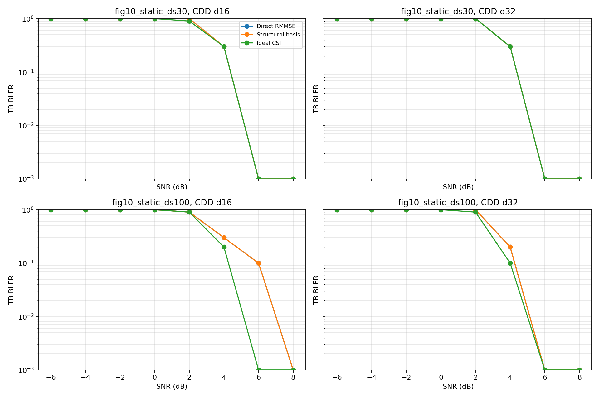

#### CE NMSE 图

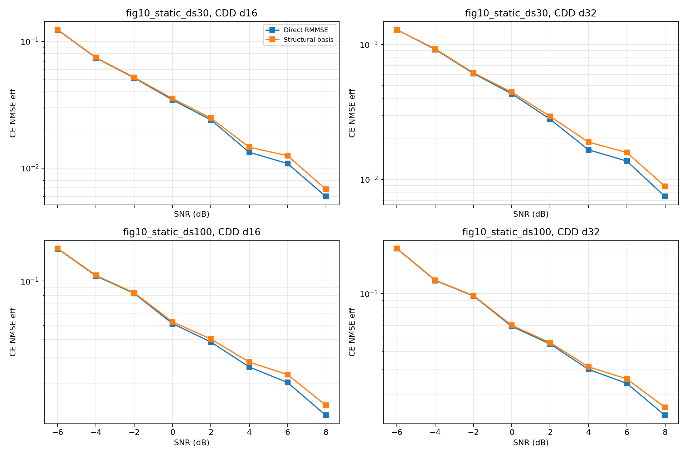

#### 关键数值观察

30 ns, d=16：

| SNR | Direct CE NMSE | Structural CE NMSE | Direct BLER | Structural BLER | Ideal BLER |
|---:|---:|---:|---:|---:|---:|
| 2 dB | 0.02403 | 0.02481 | 1.0 | 1.0 | 0.9 |
| 4 dB | 0.01335 | 0.01462 | 0.3 | 0.3 | 0.3 |
| 6 dB | 0.01088 | 0.01256 | 0.0 | 0.0 | 0.0 |

30 ns, d=32：

| SNR | Direct CE NMSE | Structural CE NMSE | Direct BLER | Structural BLER | Ideal BLER |
|---:|---:|---:|---:|---:|---:|
| 2 dB | 0.02804 | 0.02940 | 1.0 | 1.0 | 1.0 |
| 4 dB | 0.01662 | 0.01897 | 0.3 | 0.3 | 0.3 |
| 6 dB | 0.01373 | 0.01589 | 0.0 | 0.0 | 0.0 |

100 ns, d=16：

| SNR | Direct CE NMSE | Structural CE NMSE | Direct BLER | Structural BLER | Ideal BLER |
|---:|---:|---:|---:|---:|---:|
| 2 dB | 0.03848 | 0.04033 | 0.9 | 0.9 | 0.9 |
| 4 dB | 0.02600 | 0.02808 | 0.3 | 0.3 | 0.2 |
| 6 dB | 0.02039 | 0.02307 | 0.1 | 0.1 | 0.0 |

100 ns, d=32：

| SNR | Direct CE NMSE | Structural CE NMSE | Direct BLER | Structural BLER | Ideal BLER |
|---:|---:|---:|---:|---:|---:|
| 2 dB | 0.04487 | 0.04584 | 1.0 | 1.0 | 0.9 |
| 4 dB | 0.02996 | 0.03121 | 0.2 | 0.2 | 0.1 |
| 6 dB | 0.02398 | 0.02574 | 0.0 | 0.0 | 0.0 |

#### 观察

- 在 `S_f=6` 下，Structural basis LMMSE 的 equivalent-channel NMSE 始终略高于 Direct RMMSE。
- BLER 结果在 10 trials/点的分辨率下几乎相同，未能支持“Structural reconstruction 优于 Direct RMMSE”的假设。
- Ideal CSI 在 100 ns 场景下明显优于两类非理想 CE，说明 CE error 确实限制了链路性能；但当前 Structural reconstruction 没有把 CE error 降下来。
- d=32 相比 d=16 并没有让 Structural 更好，至少在 `S_f=6` 的 DMRS density 下没有。

### 7.4 实验 E：stress case，30 ns + d=64 + dense DMRS

#### 目的

进一步检验用户提出的直觉：小 delay spread + 大 CDD delay 时，Structural reconstruction 可能更好。为避免 DMRS 太稀疏导致 reconstruction 无法解耦，本实验把 DMRS frequency spacing 从 `S_f=6` 提高到 `S_f=2`。

#### 配置和输出

| 项目 | 设置 |
|---|---|
| 配置文件 | `configs/fig10_static_ds30_d64_sf2_mc.yaml` |
| 输出目录 | `outputs/fig10_static_ds30_d64_sf2_mc/sim_20260609_081414/` |
| Tx/Rx | 2Tx / 4Rx |
| PDSCH | 48 RB x 10 symbols |
| DMRS | 2 symbols，frequency spacing `S_f=2` |
| Delay spread | 30 ns |
| CDD delay | `[0, 64]` samples，约 `[0, 520.8] ns` |
| MCS | MCS 8，16QAM，R=553/1024，256QAM table |
| SNR | -6:2:8 dB |
| Trials | 10 per SNR |
| Algorithms | Direct RMMSE WB known / Structural basis LMMSE / Ideal CSI |

#### 10% BLER SNR

| Algorithm | 10% BLER SNR |
|---|---:|
| Direct RMMSE WB known | 4.274 dB |
| Structural basis LMMSE | 4.378 dB |
| Ideal CSI | 4.274 dB |

#### 图

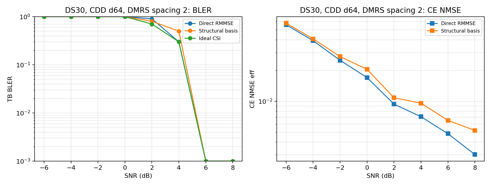

#### 关键数值观察

| SNR | Direct CE NMSE | Structural CE NMSE | Direct BLER | Structural BLER | Ideal BLER |
|---:|---:|---:|---:|---:|---:|
| 2 dB | 0.00939 | 0.01083 | 0.9 | 0.8 | 0.7 |
| 4 dB | 0.00707 | 0.00959 | 0.3 | 0.5 | 0.3 |
| 6 dB | 0.00483 | 0.00650 | 0.0 | 0.0 | 0.0 |
| 8 dB | 0.00302 | 0.00519 | 0.0 | 0.0 | 0.0 |

Structural basis reconstruction 的 condition number 约为：

```text
1.013e13
```

#### 观察

- 即使在 `delay_spread=30 ns`、`d=64`、`S_f=2` 的 stress case 下，Structural basis LMMSE 的 CE NMSE 仍高于 Direct RMMSE。
- Structural 的 10% BLER SNR 比 Direct RMMSE 高约 0.10 dB；考虑只有 10 trials/点，这个差值不能作为精确性能差，但至少没有显示 Structural gain。
- condition number 达到 `1e13` 量级，说明当前 basis reconstruction 的观测矩阵非常病态。这个病态性很可能抵消了“底层 branch channel 更平滑”的潜在优势。

### 7.5 本轮阶段性结论

本轮 Monte Carlo 结果暂时不支持“当前实现的 Structural / deterministic reconstruction 优于 QC Direct equivalent-channel RMMSE”。

更具体地说：

1. 在 `S_f=6`、d=16/d=32、delay spread 30/100 ns 下，Structural basis LMMSE 的 `ce_nmse_eff` 始终略差于 Direct RMMSE。
2. 在 `S_f=2`、d=64、delay spread 30 ns 下，Structural basis LMMSE 仍未超过 Direct RMMSE。
3. Ideal CSI 上界已经跑出；在 100 ns 场景下可以看到 Ideal CSI 对非理想 CE 有明显优势，说明 CE 是瓶颈之一。
4. 当前 Structural basis reconstruction 的矩阵 condition number 很大，尤其 d=64 stress case 达到 `1e13`，需要重点审查算法数值形式、delay support、regularization、pilot observation model。
5. 由于每点只有 10 trials，BLER 曲线只能用于初步方向判断；但 CE NMSE 的一致趋势已经提示当前 reconstruction 实现需要改进。

### 7.6 下一步建议

建议先不要直接加大 trial 数，而是先定位 reconstruction 没有获得理论收益的原因：

1. 检查 `RECON_BASIS_LMMSE` 的 basis support：当前 `truncated 99%` 可能导致不同 Tx branch 的 shifted delay basis 相关性过强。
2. 对比 `basis_support=ideal` 和更强 diagonal loading，例如 `1e-6, 1e-4, 1e-2`。
3. 输出 pilot observation matrix 的 singular value spectrum，而不只看 condition number。
4. 检查 direct RMMSE 的 covariance 是否已经等价利用了 CDD-shifted PDP，因此在当前模型下本来就接近最优 LMMSE。
5. 若要体现 structural advantage，可能需要构造 direct RMMSE mismatch 场景，例如 wrong CDD-shifted PDP、稀疏/错误 PDP prior，或让 reconstruction 使用更准确的 physical branch prior。
6. 在修正 reconstruction 数值问题后，再把 trials 提高到 100/200 per SNR 做正式 BLER 曲线。

---

## 8. 诊断：重建矩阵病态程度与协方差相干带宽

### 8.1 诊断目的

上一轮 Monte Carlo 显示，当前 `RECON_BASIS_LMMSE` 没有优于 `RMMSE_WB_KNOWN`。本节进一步检查两个问题：

1. Structural reconstruction 的 pilot observation / delay-domain basis 矩阵是否病态；
2. 原始 branch channel 和 CDD 后等效信道的 covariance 相干带宽有多大差异。

诊断脚本：

```text
tools/diagnose_reconstruction.py
```

运行命令：

```bash
/Users/zhangwei/Downloads/lls_platform_sc_mimo/.venv-sionna1/bin/python \
  tools/diagnose_reconstruction.py \
  --out outputs/diagnostics/reconstruction_covariance \
  --fig-dir docs/figures
```

输出文件：

```text
outputs/diagnostics/reconstruction_covariance/reconstruction_conditioning.csv
outputs/diagnostics/reconstruction_covariance/coherence_bandwidth.csv
docs/figures/experiment8_original_pdp.png
docs/figures/experiment8_covariance_correlation_with_bc.png
```

### 8.2 诊断定义

#### Reconstruction matrix

对 `RECON_BASIS_LMMSE`，pilot 观测写为：

```text
g_P = Phi h + n
```

其中 `Phi` 的列对应不同 Tx branch 和 delay tap basis：

```text
Phi[p,(m,l)] = exp(-j 2 pi p (l + d_m) / Nfft) / sqrt(Ntx)
```

本节检查：

- `Phi cond`：未加 PDP 权重的 `Phi` 非零奇异值条件数；
- `Weighted Phi cond`：乘上 `sqrt(PDP)` prior 后的条件数，和当前 LMMSE estimator 更接近；
- `Nullity`：`n_unknown_taps - rank`，表示无法由 pilot observation 区分的 tap 子空间维度；
- `Effective rank`：奇异值能量分布对应的有效秩；
- `Reg obs cov cond @ 4dB`：`Phi R_h Phi^H + sigma^2 I` 在 4 dB、2 DMRS symbols 下的条件数。

#### Coherence bandwidth

由 PDP 构造频域 covariance：

```text
R[Delta k] = sum_l p[l] exp(-j 2 pi Delta k l / Nfft)
```

对原始 branch channel 使用原始 PDP；对 CDD equivalent channel 使用 CDD-shifted PDP：

```text
p_cdd[n] = 1/Ntx * sum_m p[n - d_m]
```

相干带宽报告两个阈值：

- `B_c(0.9)`：第一次满足 `|rho(Delta k)| <= 0.9` 的子载波间隔；
- `B_c(0.5)`：第一次满足 `|rho(Delta k)| <= 0.5` 的子载波间隔。

`SCS=30 kHz`，所以 1 subcarrier = 30 kHz，12 subcarriers = 1 RB。

### 8.3 重建矩阵病态程度

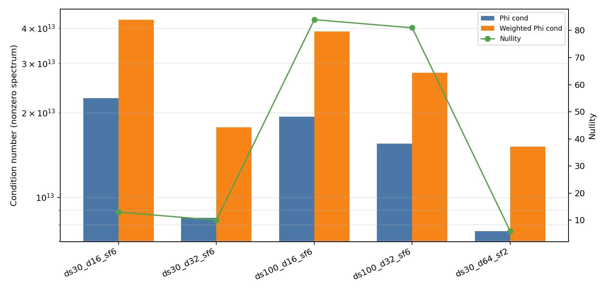

| Case | Delay spread | CDD delay | DMRS spacing | Pilots | Unknown taps | Support len | Phi cond | Weighted Phi cond | Nullity | Weighted effective rank | Reg obs cov cond @ 4dB |
|---|---:|---:|---:|---:|---:|---:|---:|---:|---:|---:|---:|
| `ds30_d16_sf6` | 30 ns | 16 | 6 | 96 | 34 | 17 | 2.253e13 | 4.294e13 | 13 | 4.98 | 183.1 |
| `ds30_d32_sf6` | 30 ns | 32 | 6 | 96 | 34 | 17 | 8.453e12 | 1.775e13 | 10 | 5.60 | 180.2 |
| `ds100_d16_sf6` | 100 ns | 16 | 6 | 96 | 114 | 57 | 1.940e13 | 3.902e13 | 84 | 9.06 | 120.2 |
| `ds100_d32_sf6` | 100 ns | 32 | 6 | 96 | 114 | 57 | 1.552e13 | 2.776e13 | 81 | 11.18 | 99.6 |
| `ds30_d64_sf2` | 30 ns | 64 | 2 | 288 | 34 | 17 | 7.587e12 | 1.515e13 | 6 | 5.68 | 516.2 |

#### 观察

- 所有 case 的 `Phi cond` / `Weighted Phi cond` 都在 `1e13` 量级，属于严重病态。
- `ds100` case 最明显：99% PDP support 有 57 taps，2Tx 后未知数是 114，但 `S_f=6` 只有 96 个频域 pilot，而且实际 rank 只有约 30 到 33，因此 nullity 达到 81 到 84。
- `ds30` case 虽然未知 taps 只有 34，但 `S_f=6` 时仍有 10 到 13 维 nullity。
- `d=64, S_f=2` 增加了 pilot 数到 288，nullity 降到 6，但 weighted condition number 仍有 `1.5e13`，说明 dense DMRS 只能部分缓解 rank deficiency，不能完全解决 basis 相关性和 prior 权重导致的病态。
- `Reg obs cov cond @ 4dB` 只有约 100 到 516，是因为 `Phi R Phi^H + sigma^2 I` 被噪声项正则化了；这说明数值求解本身不会爆炸，但 tap-domain inverse problem 仍然信息不足，LMMSE 会强烈依赖 prior，导致 reconstruction 无法超过 direct RMMSE。

### 8.4 原始 PDP、`R[Delta k]` 幅度与相干带宽

下图给出本实验使用的原始指数 TDL PDP，也就是做 CDD 之前每个 Tx-Rx branch 的底层 tap power profile。纵轴是归一化 tap power，使用 log scale；虚线标出累计 99% PDP 能量对应的 delay support。

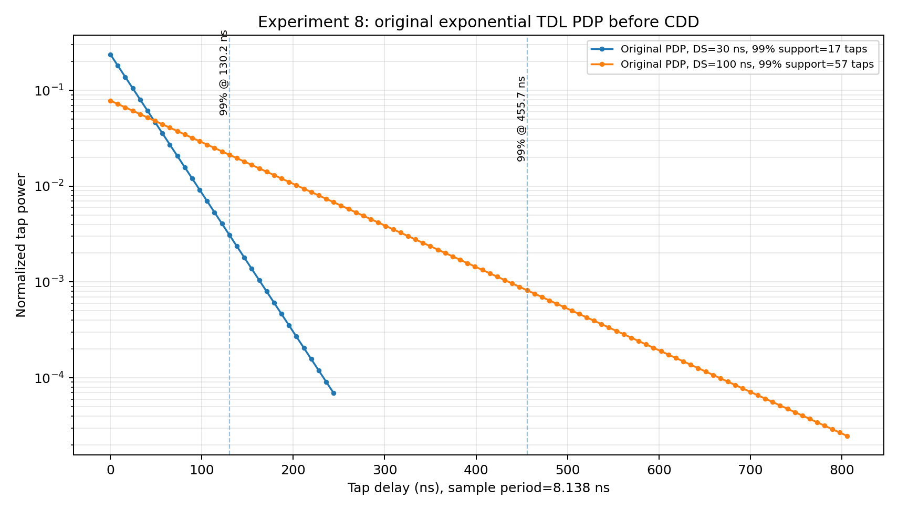

可以看到：

- 30 ns delay spread 的 PDP 更集中，99% 能量 support 为 17 taps，约 130.2 ns；
- 100 ns delay spread 的 PDP 更长，99% 能量 support 为 57 taps，约 455.7 ns；
- 这也是 `ds100` reconstruction matrix 未知 tap 数明显更多、nullity 更大的直接原因。

下图给出由 PDP 计算得到的频域 covariance 幅度：

```text
|R[Delta k]| / R[0]
```

蓝线是原始 branch channel，橙线是 CDD equivalent channel。灰色横线分别是 0.9 和 0.5 阈值；同色竖线标出曲线第一次低于对应阈值的位置，也就是本记录采用的 `B_c(0.9)` 和 `B_c(0.5)`。

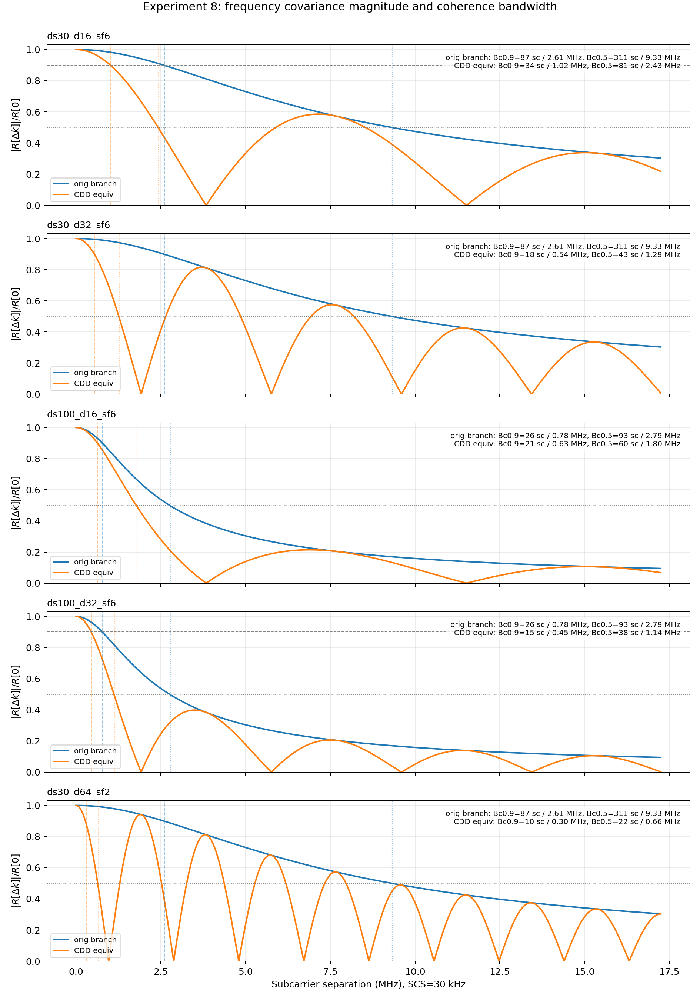

下表是同一批曲线的数值汇总。

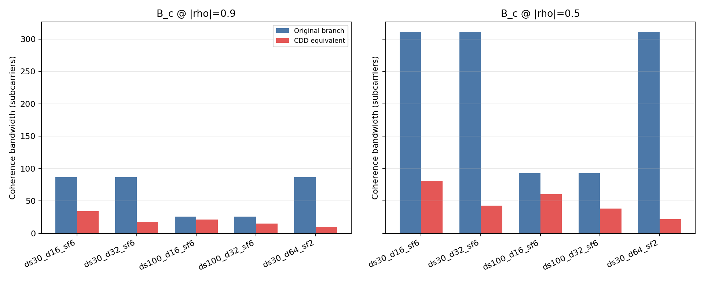

| Case | Signal | `B_c(0.9)` sc | `B_c(0.9)` MHz | `B_c(0.5)` sc | `B_c(0.5)` MHz | Edge `|rho|` over 48 RB |
|---|---|---:|---:|---:|---:|---:|
| `ds30_d16_sf6` | Original branch | 87 sc | 2.61 MHz | 311 sc | 9.33 MHz | 0.304 |
| `ds30_d16_sf6` | CDD equivalent | 34 sc | 1.02 MHz | 81 sc | 2.43 MHz | 0.217 |
| `ds30_d32_sf6` | Original branch | 87 sc | 2.61 MHz | 311 sc | 9.33 MHz | 0.304 |
| `ds30_d32_sf6` | CDD equivalent | 18 sc | 0.54 MHz | 43 sc | 1.29 MHz | 0.007 |
| `ds100_d16_sf6` | Original branch | 26 sc | 0.78 MHz | 93 sc | 2.79 MHz | 0.095 |
| `ds100_d16_sf6` | CDD equivalent | 21 sc | 0.63 MHz | 60 sc | 1.80 MHz | 0.068 |
| `ds100_d32_sf6` | Original branch | 26 sc | 0.78 MHz | 93 sc | 2.79 MHz | 0.095 |
| `ds100_d32_sf6` | CDD equivalent | 15 sc | 0.45 MHz | 38 sc | 1.14 MHz | 0.002 |
| `ds30_d64_sf2` | Original branch | 87 sc | 2.61 MHz | 311 sc | 9.33 MHz | 0.304 |
| `ds30_d64_sf2` | CDD equivalent | 10 sc | 0.30 MHz | 22 sc | 0.66 MHz | 0.303 |

#### 观察

- 用户的直觉在 covariance 层面是正确的：CDD 会显著压缩等效信道的相干带宽。
- `ds30` 原始 branch channel 的 `B_c(0.5)` 是 311 subcarriers，约 25.9 RB；经过 CDD d=32 后，CDD equivalent channel 的 `B_c(0.5)` 变成 43 subcarriers，约 3.6 RB。
- `ds30, d=64` 时，CDD equivalent channel 的 `B_c(0.9)` 只有 10 subcarriers，`B_c(0.5)` 只有 22 subcarriers；这说明大 CDD delay 确实制造了很快的频域起伏。
- `ds100` 原始信道本来就更频率选择性，原始 branch `B_c(0.5)` 只有 93 subcarriers；CDD 进一步压缩到 60 或 38 subcarriers。
- CDD equivalent covariance 会出现周期性低谷，这是 `[0,d]` 两路 delayed PDP 平均后形成的确定性相位差造成的，尤其 d=64 时很明显。

### 8.5 对 Monte Carlo 结果的解释

这次诊断把两个现象分开了：

1. **CDD equivalent channel 的确更快变。**  
   原始 branch channel 的相干带宽明显大于 CDD equivalent channel，尤其在 30 ns + 大 CDD delay 时差异最大。

2. **当前 structural reconstruction 的逆问题太病态。**  
   虽然底层 branch channel 更平滑，但从单层 CDD DMRS observation 反推出多个 physical branch taps 的矩阵 `Phi` 存在严重 rank deficiency 和 `1e13` 量级条件数。也就是说，当前 pilot observation 对底层 branch taps 的可辨识性不足。

因此，上一轮 Monte Carlo 中 Structural reconstruction 没有超过 Direct RMMSE，并不否定“利用 CDD delay 的结构信息可能有价值”；更准确的结论是：

> 在当前单层 CDD pilot observation、当前 delay-domain basis 和当前 LMMSE prior 设置下，physical-channel reconstruction 问题严重病态，导致 structural estimator 没能把原始 branch channel 的大相干带宽转化为 BLER/NMSE 增益。

### 8.6 下一步建议

优先检查和改进 reconstruction，而不是直接增加 Monte Carlo trial 数：

1. 降低未知 tap 维度：尝试更短 support，例如 95% / 90% PDP energy，而不是 99%。
2. 加强 regularization：sweep `diagonal_loading = 1e-6, 1e-4, 1e-2`，观察 weighted Phi effective rank 和 CE NMSE。
3. 设计更可辨识的 pilot observation：例如不同 DMRS symbols 或 ports 使用不同 known phase / orthogonal branch probing，而不是所有 branch 只通过同一个 CDD-combined scalar observation。
4. 对 direct RMMSE 设置 mismatch baseline：当前 Direct RMMSE 使用 matched CDD-shifted covariance，已经是等效信道 LMMSE，理论上很强；Structural 要超过它，需要更准确的 physical prior 或 direct baseline 出现 covariance mismatch。
5. 单独输出 singular value spectrum，定位是 support overlap、pilot spacing、active bandwidth 还是 PDP 权重动态范围导致 rank collapse。

---

## 9. NMSE-only：三类信道估计算法对比

### 9.1 实验目的

本实验不运行 LDPC 编码/解码，不统计 BLER，只比较不同 SNR 下的信道估计 NMSE。目标是隔离 channel estimator 本身的行为，比较：

1. 算法一：Direct equivalent-channel RMMSE；
2. 算法二：Structural / deterministic physical-channel reconstruction，包括 reduced-support basis LMMSE 和 coherence-band blockwise reconstruction；
3. 算法三：Non-CDD per-port DMRS physical-channel RMMSE，再按已知 CDD delay 合成数据 RE 上的 CDD 等效信道。

### 9.2 运行命令与输出

运行命令：

```bash
/Users/zhangwei/Downloads/lls_platform_sc_mimo/.venv-sionna1/bin/python \
  tools/run_nmse_algorithm_comparison.py \
  --trials 100 \
  --snr-start -6 \
  --snr-stop 8 \
  --snr-step 2 \
  --out outputs/nmse_algorithm_comparison \
  --fig-dir docs/figures
```

输出目录：

```text
outputs/nmse_algorithm_comparison/nmse_20260611_225137/
```

主要输出文件：

```text
outputs/nmse_algorithm_comparison/nmse_20260611_225137/nmse_summary.csv
outputs/nmse_algorithm_comparison/nmse_20260611_225137/nmse_metadata.csv
docs/figures/experiment9_nmse_effective.png
docs/figures/experiment9_nmse_branch.png
```

### 9.3 仿真设置

公共设置：

| 项目 | 设置 |
|---|---|
| Tx/Rx | 2Tx / 4Rx |
| 信道 | static exponential TDL |
| PDSCH allocation | 48 RB |
| Active subcarriers | 576 sc |
| `n_fft` | 4096 |
| SCS | 30 kHz |
| DMRS symbols | 2 |
| SNR | -6, -4, -2, 0, 2, 4, 6, 8 dB |
| Trials | 每个 SNR 点 100 个独立信道 realization |
| 指标 | equivalent-channel NMSE；可恢复底层端口信道的算法另统计 branch NMSE |

遍历 case：

| Case | Delay spread | CDD delay | DMRS spacing | 目的 |
|---|---:|---:|---:|---|
| `flat_ds1_d64_sf2` | 1 ns | 64 samples | 2 sc | 底层近似平坦、大 CDD delay |
| `ds30_d16_sf6` | 30 ns | 16 samples | 6 sc | 实验 8 基础 case |
| `ds30_d32_sf6` | 30 ns | 32 samples | 6 sc | 低 delay spread、较大 CDD delay |
| `ds100_d16_sf6` | 100 ns | 16 samples | 6 sc | 高 delay spread |
| `ds100_d32_sf6` | 100 ns | 32 samples | 6 sc | 高 delay spread、较大 CDD delay |
| `ds30_d64_sf2` | 30 ns | 64 samples | 2 sc | 大 CDD delay、较密 DMRS |

算法设置：

| Case | Combined pilots | Alg1 bandwidth | Basis support E90/E95/E99 | Block width / blocks / max cond | Alg3 equal-total pilots/port | Alg3 equal-per-port pilots/port |
|---|---:|---:|---|---|---:|---:|
| `flat_ds1_d64_sf2` | 288 | 576 sc | 1/1/1 taps | 576 sc / 1 / 1 | 144 | 288 |
| `ds30_d16_sf6` | 96 | 576 sc | 9/12/17 taps | 87 sc / 7 / 5.2 | 48 | 96 |
| `ds30_d32_sf6` | 96 | 576 sc | 9/12/17 taps | 87 sc / 7 / 2.6 | 48 | 96 |
| `ds100_d16_sf6` | 96 | 576 sc | 29/37/57 taps | 26 sc / 23 / 12 | 48 | 96 |
| `ds100_d32_sf6` | 96 | 576 sc | 29/37/57 taps | 26 sc / 23 / 6 | 48 | 96 |
| `ds30_d64_sf2` | 288 | 576 sc | 9/12/17 taps | 87 sc / 7 / 1.2 | 144 | 288 |

说明：

- 算法一 `Alg1 Direct RMMSE WB 576sc` 在整个 48 RB allocation 内联合估计，即 576 个 active subcarriers 的 wideband RMMSE，使用所有 combined CDD-DMRS pilot。
- 算法二 `Basis E90/E95/E99` 分别使用累计 PDP 能量 90%、95%、99% 的 delay-domain support。
- 算法二 `CoherenceBlock Bc0.9` 使用原始底层物理信道的 `B_c(0.9)` 作为 block 宽度；每个 block 内每个端口只估计一个未知复数。
- 算法三给出两种 overhead 模式：`equal-total` 与算法一/二总 pilot RE 相同，但每端口 pilot 数减半；`equal-per-port` 每端口 pilot density 与算法一/二相同，但总 pilot RE 约为 2 倍。

DMRS overhead 的计算方式如下。设 active subcarrier 数为 \(N_{\mathrm{sc}}=576\)，DMRS symbols 数为 \(N_{\mathrm{sym}}^{\mathrm{DMRS}}=2\)，combined CDD-DMRS 的频域 pilot 数为

\[
N_P=\left|\mathcal P\right|.
\]

算法一使用一套 CDD-combined DMRS，因此总 DMRS RE 数为

\[
N_{\mathrm{DMRS}}^{\mathrm{Alg1}}
=
N_{\mathrm{sym}}^{\mathrm{DMRS}}N_P.
\]

算法三若采用 FDM port-orthogonal DMRS，则不同端口占用互不重叠的 pilot RE。若保持每端口 pilot density 与算法一相同，即

\[
\left|\mathcal P_m\right|=N_P,
\quad m=0,\ldots,N_t-1,
\]

则总 DMRS RE 数为

\[
N_{\mathrm{DMRS}}^{\mathrm{Alg3,per-port}}
=
N_{\mathrm{sym}}^{\mathrm{DMRS}}
\sum_{m=0}^{N_t-1}\left|\mathcal P_m\right|
=
N_tN_{\mathrm{sym}}^{\mathrm{DMRS}}N_P.
\]

本实验为 2Tx，所以

\[
\frac{
N_{\mathrm{DMRS}}^{\mathrm{Alg3,per-port}}
}{
N_{\mathrm{DMRS}}^{\mathrm{Alg1}}
}
=2.
\]

若要保证算法三与算法一 DMRS 开销相同，则必须使用 `equal-total` 分配：

\[
\sum_{m=0}^{N_t-1}\left|\mathcal P_m\right|
=N_P.
\]

2Tx 情况下，本实验用 FDM split：

\[
\mathcal P_0=\mathcal P[0::2],
\quad
\mathcal P_1=\mathcal P[1::2],
\]

因此每端口 pilot 数约为 \(N_P/2\)，总 pilot RE 与算法一相同。代价是每个端口的 pilot density 降低，per-port physical-channel RMMSE 的插值误差会增加。

### 9.4 NMSE 曲线

Equivalent-channel NMSE：

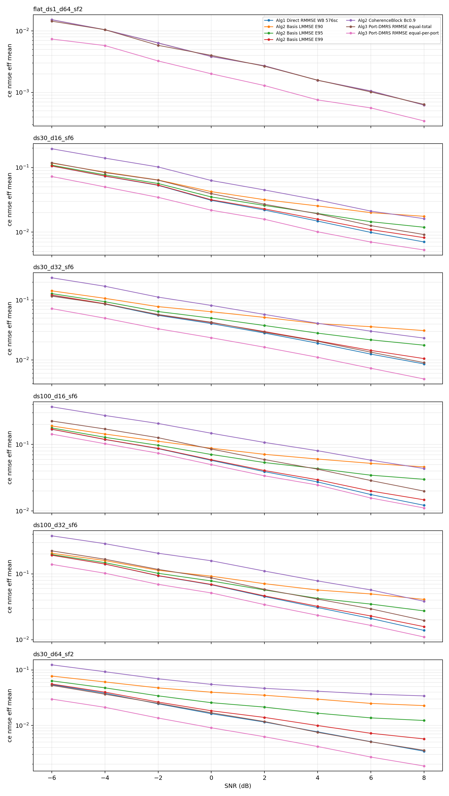

Branch-channel NMSE：

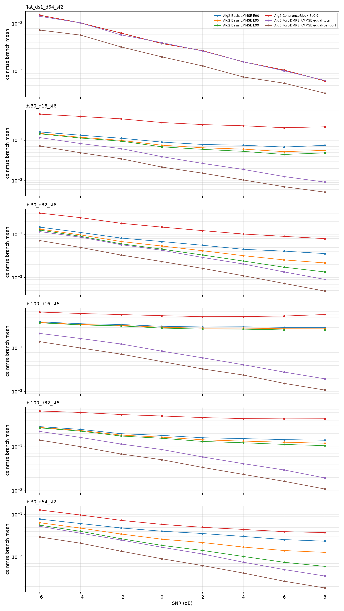

### 9.5 8 dB 数值摘要

下表为 8 dB 下的 mean equivalent-channel NMSE。

| Case | Alg1 Direct | Alg2 Basis E90 | Alg2 Basis E95 | Alg2 Basis E99 | Alg2 Block Bc0.9 | Alg3 equal-total | Alg3 equal-per-port |
|---|---:|---:|---:|---:|---:|---:|---:|
| `flat_ds1_d64_sf2` | 6.233e-04 | 6.243e-04 | 6.243e-04 | 6.243e-04 | 6.243e-04 | 6.386e-04 | 3.435e-04 |
| `ds30_d16_sf6` | 7.046e-03 | 1.755e-02 | 1.188e-02 | 8.203e-03 | 1.615e-02 | 9.158e-03 | 5.290e-03 |
| `ds30_d32_sf6` | 8.595e-03 | 3.098e-02 | 1.767e-02 | 1.055e-02 | 2.322e-02 | 9.040e-03 | 4.823e-03 |
| `ds100_d16_sf6` | 1.219e-02 | 4.604e-02 | 2.995e-02 | 1.474e-02 | 4.354e-02 | 1.993e-02 | 1.111e-02 |
| `ds100_d32_sf6` | 1.387e-02 | 4.095e-02 | 2.742e-02 | 1.581e-02 | 3.836e-02 | 1.960e-02 | 1.101e-02 |
| `ds30_d64_sf2` | 3.434e-03 | 2.280e-02 | 1.229e-02 | 5.719e-03 | 3.410e-02 | 3.565e-03 | 1.856e-03 |

### 9.6 观察

1. `flat_ds1_d64_sf2` 中，底层信道几乎平坦，算法一、算法二 basis、算法二 blockwise 基本重合；算法三 `equal-per-port` 因为使用约 2 倍总 DMRS overhead，NMSE 明显更低。
2. 在 `ds30` 和 `ds100` 的 realistic TDL case 中，算法一 matched wideband RMMSE 仍然很强。它直接估计 CDD equivalent channel，并且使用 CDD-shifted PDP，因此本质上是当前等效信道模型下的强 LMMSE baseline。
3. 算法二 reduced-support basis 中，E99 通常最好，E90/E95 反而更差。这说明当前 case 下减少支撑径数虽然能降低未知维度，但 truncation bias 比矩阵病态改善带来的收益更大。
4. 算法二 `CoherenceBlock Bc0.9` 没有超过 direct RMMSE。虽然每个 block 只估计 2 个端口未知量，局部矩阵条件数比 full basis 好很多，但“block 内底层端口信道常数”的近似误差较大，尤其 `ds100` 的 block width 只有 26 sc、block 数多，branch NMSE 仍然偏高。
5. 算法三 `equal-total` 与 direct RMMSE 在大 CDD / 密 DMRS case 中接近，例如 `ds30_d64_sf2`；但在稀疏 DMRS case 中，因为每端口 pilot 数减半，NMSE 可能略差于 direct。
6. 算法三 `equal-per-port` 在所有非平凡 case 中给出最低或接近最低的 equivalent-channel NMSE，但它使用约 2 倍总 DMRS overhead，因此不能直接解释为同 overhead 下的纯算法增益。

当前结论：若保持相同总 DMRS overhead，matched Direct RMMSE 仍是很强的 NMSE baseline；若允许 port-specific DMRS 增加总 overhead，算法三可以显著降低 NMSE。算法二要获得优势，可能需要更好的 pilot 设计或更准确的物理信道低维模型，而不仅仅是缩短 delay support 或按相干带宽做 piecewise-constant 近似。

---

## 10. Same-overhead NMSE search：寻找算法二/三优于算法一的场景

### 10.1 实验目的

本实验进一步扩大搜索范围，在**相同总 DMRS 开销**下比较算法一、算法二、算法三的 equivalent-channel NMSE，目标是回答三个问题：

1. 当底层物理信道 delay spread、CDD delay、SNR、DMRS density 变化时，是否存在算法二或算法三的 NMSE 优于算法一 `Direct RMMSE` 的场景；
2. 算法三在 `equal-total-overhead` 下，即总 DMRS RE 与算法一相同、每端口 pilot density 降低时，是否仍能获得 NMSE 增益；
3. 算法二能否通过减小 support、增大 CDD delay、增大 pilot sampling interval / DMRS spacing 来改善 reconstruction matrix 条件数，并把性能发挥出来。

### 10.2 同开销定义

算法一使用一套 CDD-combined DMRS：

\[
N_{\mathrm{DMRS}}^{\mathrm{Alg1}}
=
N_{\mathrm{DMRS,sym}}|\mathcal P|.
\]

本实验中的算法三只使用 `equal-total-overhead`，即：

\[
\sum_{m=0}^{N_t-1}|\mathcal P_m|=|\mathcal P|.
\]

2Tx FDM port-DMRS 下：

\[
\mathcal P_0=\mathcal P[0::2],
\quad
\mathcal P_1=\mathcal P[1::2].
\]

因此算法三总 pilot RE 与算法一相同，但每端口 pilot 数约为算法一的一半。实验 9 中的 `equal-per-port` 不纳入本实验的同开销 winner 搜索。

相对算法一的 NMSE gain 定义为：

\[
G_{\mathrm{NMSE}}[\mathrm{dB}]
=
10\log_{10}
\frac{
\mathrm{NMSE}_{\mathrm{Alg1}}
}{
\mathrm{NMSE}_{\mathrm{candidate}}
}.
\]

若 \(G_{\mathrm{NMSE}}>0\)，说明 candidate 的 NMSE 小于算法一；若小于 0，则 candidate 更差。

### 10.3 Broad search 方法

运行命令：

```bash
/Users/zhangwei/Downloads/lls_platform_sc_mimo/.venv-sionna1/bin/python \
  tools/search_nmse_same_overhead.py \
  --trials 50 \
  --delay-spreads-ns 1,5,10,30,100 \
  --cdd-delays 16,32,64,128,256 \
  --dmrs-spacings 2,4,6,12 \
  --snrs=-6,0,8 \
  --out outputs/nmse_same_overhead_search \
  --fig-dir docs/figures
```

输出目录：

```text
outputs/nmse_same_overhead_search/search_20260612_231155/
```

输出文件：

```text
same_overhead_nmse_search.csv
same_overhead_wins.csv
run_config.json
docs/figures/experiment10_best_same_overhead_gains.png
docs/figures/experiment10_alg3_gain_map_snrm6.png
docs/figures/experiment10_alg3_gain_map_snr0.png
docs/figures/experiment10_alg3_gain_map_snr8.png
```

搜索范围：

| 参数 | 取值 |
|---|---|
| Delay spread | 1, 5, 10, 30, 100 ns |
| CDD delay | 16, 32, 64, 128, 256 samples |
| DMRS spacing | 2, 4, 6, 12 sc |
| SNR | -6, 0, 8 dB |
| Trials | 每点 50 |
| PDSCH bandwidth | 48 RB = 576 sc |
| 算法一 | `Direct RMMSE WB 576sc` |
| 算法二 | `Basis E90/E95/E99` 和 `CoherenceBlock Bc0.9` |
| 算法三 | `Port-DMRS RMMSE equal-total` |

### 10.4 Broad search 结果

同开销下，所有显著 winner 都来自算法三 `Port-DMRS RMMSE equal-total`。算法二只出现非常小的正 gain，最大约 0.014 dB，量级太小，不能视为稳健超过算法一。

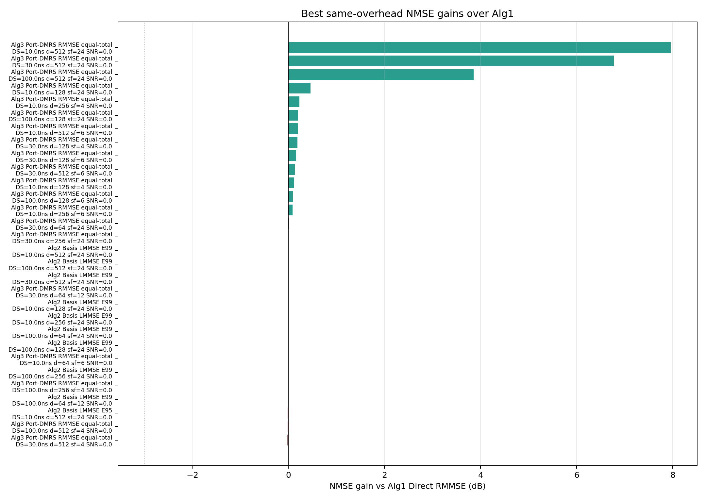

Top winner 摘要：

| Algorithm | DS ns | CDD d | DMRS sp | SNR | NMSE | Gain dB | `B_c,H(0.5)` | `B_c,g(0.5)` | Notes |
|---|---:|---:|---:|---:|---:|---:|---:|---:|---|
| Alg3 equal-total | 5 | 64 | 4 | -6 | 4.297e-02 | 0.74 | > allocation | 22 | pilot/port=72 |
| Alg3 equal-total | 1 | 64 | 6 | 0 | 1.026e-02 | 0.67 | > allocation | 22 | pilot/port=48 |
| Alg3 equal-total | 1 | 128 | 4 | -6 | 2.920e-02 | 0.63 | > allocation | 11 | pilot/port=72 |
| Alg3 equal-total | 1 | 128 | 6 | 8 | 1.621e-03 | 0.55 | > allocation | 11 | pilot/port=48 |
| Alg3 equal-total | 1 | 256 | 2 | 0 | 3.824e-03 | 0.47 | > allocation | 6 | pilot/port=144 |
| Alg3 equal-total | 5 | 128 | 12 | 8 | 7.100e-03 | 0.45 | > allocation | 11 | pilot/port=24 |
| Alg3 equal-total | 30 | 64 | 6 | -6 | 1.121e-01 | 0.44 | 311 | 22 | pilot/port=48 |
| Alg3 equal-total | 10 | 64 | 2 | 0 | 8.500e-03 | 0.41 | > allocation | 22 | pilot/port=144 |
| Alg3 equal-total | 10 | 16 | 12 | 0 | 4.071e-02 | 0.39 | > allocation | 85 | pilot/port=24 |
| Alg3 equal-total | 10 | 32 | 4 | 8 | 3.538e-03 | 0.38 | > allocation | 43 | pilot/port=72 |

这里 `> allocation` 表示原始底层物理信道在 576 sc allocation 内没有下降到 0.5，相干带宽大于当前分配带宽。

不同 SNR 下算法三同开销 gain map：

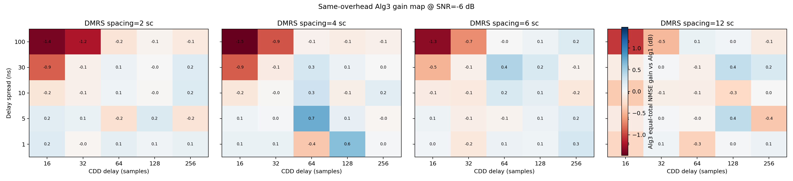

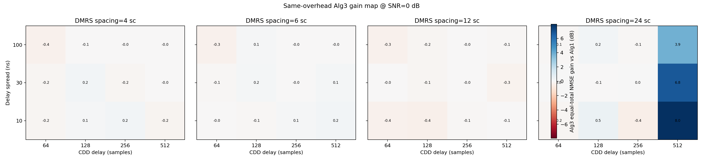

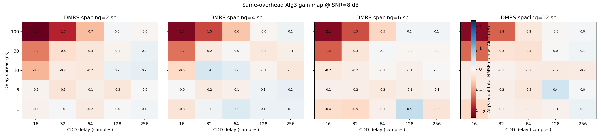

观察：

1. 算法三同开销胜出的典型场景是：底层物理信道很平滑，\(B_{c,H}(0.5)\) 大于 allocation；CDD 后等效信道相干带宽很小，例如 \(B_{c,g}(0.5)=6\sim22\) sc。
2. 这正好符合算法三的设计：DMRS 不经过 CDD，因此每端口估计的是平滑的底层 physical channel；数据 RE 再乘回已知 CDD phase。即使每端口 pilot 数减半，底层信道足够平滑时仍可能赢。
3. SNR 越低时，winner 的 gain 有时更明显，因为 direct RMMSE 对 CDD-equivalent 快速频域变化和噪声共同敏感；算法三的 per-port observation 更容易利用底层信道平滑性。
4. 对 100 ns delay spread，算法三往往不赢或者 gain 变负，因为底层物理信道本身也不够平滑，每端口 pilot density 减半的代价更明显。

### 10.5 算法二 targeted condition-number sweep

为了专门尝试改善算法二条件数，额外运行 targeted sweep：

```bash
/Users/zhangwei/Downloads/lls_platform_sc_mimo/.venv-sionna1/bin/python \
  tools/search_nmse_same_overhead.py \
  --trials 30 \
  --delay-spreads-ns 10,30,100 \
  --cdd-delays 64,128,256,512 \
  --dmrs-spacings 4,6,12,24 \
  --snrs=0 \
  --basis-thresholds 0.50,0.70,0.90,0.95,0.99 \
  --out outputs/nmse_same_overhead_search_alg2_targeted \
  --fig-dir docs/figures
```

输出目录：

```text
outputs/nmse_same_overhead_search_alg2_targeted/search_20260612_231651/
```

这个 sweep 的目的不是寻找算法三，而是测试算法二：

- support 从 E50/E70/E90/E95/E99 变化；
- CDD delay 扩展到 512 samples；
- DMRS spacing 扩展到 24 sc，即 pilot 频域间隔更大。

### 10.6 算法二 targeted 结果

算法二 targeted sweep 中，算法二没有出现正 gain。也就是说，在这些设置下，算法二没有在同开销、matched Alg1 baseline 下超过算法一。

算法二 basis LMMSE 中“NMSE 最接近算法一”的若干点：

| Algorithm | DS ns | CDD d | DMRS sp | NMSE | Gain dB | support | cond | effective rank | `B_c,g(0.5)` |
|---|---:|---:|---:|---:|---:|---:|---:|---:|---:|
| Basis E99 | 10 | 512 | 24 | 5.055e-01 | -0.002 | 6 | 4.72e12 | 1.60 | 3 |
| Basis E99 | 100 | 512 | 24 | 5.738e-01 | -0.003 | 57 | 3.00e12 | 7.01 | 3 |
| Basis E99 | 30 | 512 | 24 | 5.565e-01 | -0.003 | 17 | 4.13e12 | 2.85 | 3 |
| Basis E99 | 10 | 128 | 24 | 7.825e-02 | -0.006 | 6 | 2.18e5 | 3.18 | 11 |
| Basis E99 | 10 | 256 | 24 | 7.024e-02 | -0.007 | 6 | 1.19e5 | 3.19 | 6 |
| Basis E99 | 100 | 64 | 24 | 2.244e-01 | -0.008 | 57 | 5.21e4 | 13.56 | 21 |
| Basis E99 | 100 | 256 | 24 | 2.363e-01 | -0.009 | 57 | 4.65e2 | 13.74 | 6 |

条件数改善的现象存在，但没有转化成 NMSE gain：

| DS ns | Setting | support | Unknowns | cond | Gain dB | 解释 |
|---:|---|---:|---:|---:|---:|---|
| 10 | E50, d=64, sf=6 | 1 | 2 | 1.0 | -6.15 | 条件数最好，但 support 过短，truncation bias 很大 |
| 30 | E50, d=512, sf=4 | 3 | 6 | 72.3 | -7.72 | 条件数明显改善，但只保留 50% PDP 能量，模型误差主导 |
| 100 | E99, d=256, sf=24 | 57 | 114 | 465 | -0.009 | 非零奇异值条件数很好，但 pilot 只有 24 个、未知 tap 114 个，问题高度欠定 |
| 30 | E99, d=128, sf=12 | 17 | 34 | 4.13e12 | -0.058 | 99% support 保留物理模型，但矩阵仍病态 |
| 10 | E99, d=256, sf=12 | 6 | 12 | 1.17e5 | -0.034 | 条件数可接受但仍略差于 matched direct RMMSE |

### 10.7 解读方法

阅读本实验结果时要注意四点：

1. **算法一是 matched equivalent-channel LMMSE。**  
   当前算法一使用真实 CDD-shifted PDP/covariance，因此在只比较 \(g[k]\) 的 NMSE 时，它是很强的理论 baseline。算法二如果只使用同一组 CDD-combined pilot observation，很难稳定超过算法一。

2. **算法三胜出不是因为更多 RE。**  
   本实验算法三只使用 `equal-total-overhead`。它胜出的原因是 observation 发生了变化：导频不做 CDD，每端口直接观测底层 physical channel；代价是每端口 pilot density 降低。

3. **算法二条件数改善和 NMSE 改善不是一回事。**  
   增大 CDD delay、增大 pilot spacing、减少 support 都可能改善某些矩阵的非零奇异值条件数，但会同时带来：
   - pilot 数减少；
   - 未知 tap 子空间欠定；
   - support truncation bias；
   - CDD equivalent channel 更快变化。

   因此条件数变小并不保证 equivalent-channel NMSE 变小。

4. **算法二要真正发挥，需要改变观测设计。**  
   当前 CDD-combined 单层 DMRS observation 对多个底层 branch/tap 的可辨识性不足。比起继续调 support 或 spacing，更有希望的方向是：
   - 多个 DMRS symbol 使用不同 known CDD/port phase probing；
   - 引入 port-orthogonal 或 partially orthogonal probing；
   - 对 direct RMMSE 加入 realistic covariance mismatch baseline；
   - 使用更强的物理低维 prior，例如已知少数 dominant taps 或 parametric delay model。

当前结论：在同总 DMRS 开销下，算法三已经能找到多个 NMSE 优于算法一的场景，尤其是底层信道平滑、CDD 后相干带宽很小的场景；算法二在 matched Alg1 baseline 下没有找到稳健优于算法一的场景，主要瓶颈仍是 CDD-combined observation 的可辨识性。

### 10.8 对“稀疏导频 + 小 CDD 相干带宽 + 平坦底层信道”假设的补充判断

用户假设为：若导频足够稀疏、CDD 后等效信道相干带宽足够小，则算法一通过导频位置预测无导频位置会变差；若底层物理信道足够平坦，算法二和算法三应仍能达到较高估计精度。

实验结果对这个假设的支持是**部分成立**。

支持的现象：

1. 在相同 DMRS spacing 下，CDD 后等效信道相干带宽减小会使算法一 NMSE 上升。例如实验 9 中 `ds30_d16_sf6` 到 `ds30_d32_sf6`，`B_c,g(0.5)` 从 81 sc 降到 43 sc，算法一 8 dB NMSE 从 `7.046e-03` 增加到 `8.595e-03`。
2. 在底层物理信道很平滑、CDD 后相干带宽很小、导频较稀疏的部分场景，算法三 `equal-total` 确实能超过算法一。例如：

| DS ns | CDD d | DMRS sp | SNR | `B_c,g(0.5)` | Alg1 NMSE | Alg3 gain |
|---:|---:|---:|---:|---:|---:|---:|
| 1 | 64 | 6 | 0 dB | 22 sc | 1.197e-02 | 0.673 dB |
| 1 | 128 | 6 | 8 dB | 11 sc | 1.839e-03 | 0.549 dB |
| 5 | 128 | 12 | 8 dB | 11 sc | 7.872e-03 | 0.448 dB |
| 1 | 64 | 12 | 0 dB | 22 sc | 2.533e-02 | 0.381 dB |

不完全支持的现象：

1. 算法二没有稳定超过算法一。即使底层信道很平坦，算法二多数情况下只是与算法一几乎打平，或因为 support truncation、regularization、矩阵病态而更差。Broad search 中 `Alg2 Basis E99` 的最大正 gain 只有约 `0.014 dB`，`CoherenceBlock Bc0.9` 的最大正 gain 只有约 `0.0007 dB`，都不能视为稳健收益。
2. 算法三 `equal-total` 也不是一定不差于算法一。在 smooth + sparse + small CDD coherence 的筛选条件下，算法三只有 22/54 个点胜出，最大 gain `0.673 dB`，最差约 `-0.424 dB`。在全部 broad search 中，算法三 107/300 个点胜出，平均 gain 为 `-0.192 dB`。

原因解释：

1. 算法一在当前实验中是 matched equivalent-channel LMMSE。它知道 CDD-shifted PDP/covariance，因此并不是简单线性插值，也不是假设整个 576 sc 联合处理带宽内信道平坦。CDD 后相干带宽变小时，远距离 pilot 权重会自动降低。
2. 算法二和算法一使用的是同一组 CDD-combined pilot observation。若算法一 covariance 完全 matched，则从相同观测估计同一个 \(g[k]\) 时，算法一已经接近线性 MMSE 最优；算法二很难系统性超过，只能在数值误差或有限 trial 下接近打平。
3. 算法三改变了 observation：DMRS 不做 CDD，直接观测 per-port 底层物理信道。因此当底层信道确实很平滑时，算法三可以胜出。但在 `equal-total` 下，每端口 pilot 数减半；若底层信道不够平坦、SNR/导频密度组合不利，则这个代价会使算法三差于算法一。

因此当前更准确的结论是：

- 算法三在底层信道平滑、CDD 后相干带宽小、且 per-port pilot density 仍足够时，**可以**优于算法一；
- 算法三在同总开销下**不是保证不差于算法一**；
- 算法二在 matched 算法一 baseline 下很难稳定优于算法一，确实可能比算法一差；
- 若把算法一改成 unknown CDD delay / mismatched covariance baseline，算法二和算法三的相对优势可能会更明显。

---

## 11. CDD delay error sensitivity：算法一/二/三对时延误差的敏感性

### 11.1 实验目的

本实验检查三类信道估计算法对 CDD delay signaling / reconstruction delay 误差的敏感性。真实数据和真实 DMRS observation 使用 true CDD delay：

\[
\mathbf d_{\mathrm{true}}=[0,d].
\]

接收端估计器使用 assumed delay：

\[
\mathbf d_{\mathrm{assumed}}=[0,d+\Delta d].
\]

扫描

\[
\Delta d\in\{-8,-4,-2,-1,0,1,2,4,8\}
\]

并比较 equivalent-channel NMSE。

### 11.2 运行命令与输出

运行命令：

```bash
/Users/zhangwei/Downloads/lls_platform_sc_mimo/.venv-sionna1/bin/python \
  tools/delay_error_sensitivity.py \
  --trials 100 \
  --out outputs/delay_error_sensitivity \
  --fig-dir docs/figures
```

输出目录：

```text
outputs/delay_error_sensitivity/delay_error_20260612_234008/
```

输出文件：

```text
outputs/delay_error_sensitivity/delay_error_20260612_234008/delay_error_sensitivity.csv
docs/figures/experiment11_delay_error_sensitivity.png
```

### 11.3 结果

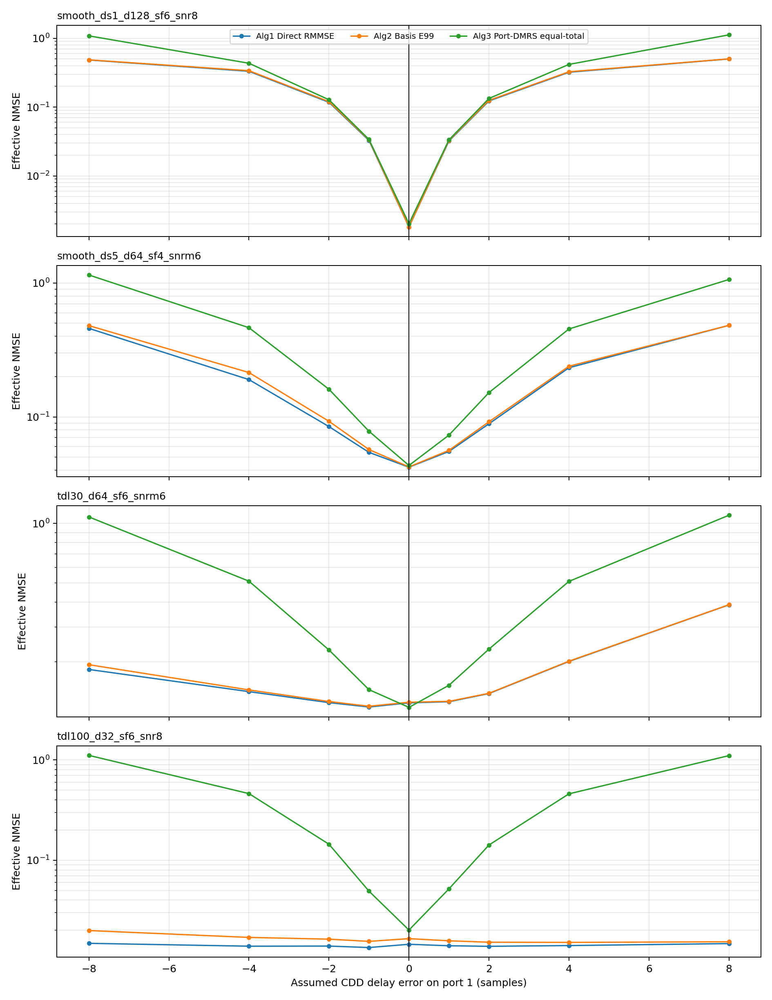

代表性结果如下，表中数值为 mean equivalent-channel NMSE。

| Case | Algorithm | err=0 | err=+1 | err=+4 | err=+8 |
|---|---|---:|---:|---:|---:|
| `smooth_ds1_d128_sf6_snr8` | Alg1 Direct | 1.807e-03 | 3.216e-02 | 3.209e-01 | 5.006e-01 |
| `smooth_ds1_d128_sf6_snr8` | Alg2 Basis E99 | 1.807e-03 | 3.280e-02 | 3.258e-01 | 5.017e-01 |
| `smooth_ds1_d128_sf6_snr8` | Alg3 Port-DMRS | 2.019e-03 | 3.338e-02 | 4.170e-01 | 1.121e+00 |
| `smooth_ds5_d64_sf4_snrm6` | Alg1 Direct | 4.210e-02 | 5.520e-02 | 2.329e-01 | 4.829e-01 |
| `smooth_ds5_d64_sf4_snrm6` | Alg2 Basis E99 | 4.229e-02 | 5.624e-02 | 2.390e-01 | 4.829e-01 |
| `smooth_ds5_d64_sf4_snrm6` | Alg3 Port-DMRS | 4.337e-02 | 7.311e-02 | 4.537e-01 | 1.063e+00 |
| `tdl30_d64_sf6_snrm6` | Alg1 Direct | 1.241e-01 | 1.257e-01 | 2.008e-01 | 3.881e-01 |
| `tdl30_d64_sf6_snrm6` | Alg2 Basis E99 | 1.250e-01 | 1.263e-01 | 2.015e-01 | 3.886e-01 |
| `tdl30_d64_sf6_snrm6` | Alg3 Port-DMRS | 1.177e-01 | 1.523e-01 | 5.099e-01 | 1.101e+00 |
| `tdl100_d32_sf6_snr8` | Alg1 Direct | 1.450e-02 | 1.401e-02 | 1.408e-02 | 1.472e-02 |
| `tdl100_d32_sf6_snr8` | Alg2 Basis E99 | 1.650e-02 | 1.570e-02 | 1.514e-02 | 1.536e-02 |
| `tdl100_d32_sf6_snr8` | Alg3 Port-DMRS | 2.009e-02 | 5.177e-02 | 4.592e-01 | 1.104e+00 |

### 11.4 解读

1. 算法一对 CDD delay 误差的依赖主要通过 covariance mismatch 体现。它的 DMRS LS observation 是真实 CDD equivalent channel 本身，因此 delay 错误不会直接把 pilot value 旋错，而是让 RMMSE 插值使用错误的 CDD-shifted PDP/covariance。
2. 算法二对 delay 误差更直接，因为 \(\mathbf\Phi\) 矩阵和最终 CDD recombination 都显式使用 assumed delay。当前 basis E99 结果通常和算法一接近，是因为 matched 情况下算法二已经接近等效信道 LMMSE；delay 错误后两者在这些 case 中表现也接近。
3. 算法三对 delay 误差非常敏感。它的 per-port physical-channel estimation 本身不依赖 CDD delay，但最终合成数据等效信道时使用

\[
\hat g_r[k]
=
\frac{1}{\sqrt{N_t}}
\sum_m \hat H_{r,m}[k]e^{-j2\pi k\hat d_m/N_{\mathrm{FFT}}}.
\]

若 \(\hat d_m=d_m+\Delta d\)，则整个 data allocation 内会产生确定性频域相位斜率误差。这个误差在高 SNR 和底层信道估计很准时尤其明显，会形成 NMSE floor。
4. 在 `tdl100_d32_sf6_snr8` 中，算法一对 delay error 几乎不敏感，而算法三从 `2.009e-02` 上升到 `1.104e+00`。这说明当底层信道本身已经频率选择性较强时，算法一的 covariance mismatch 影响有限；但算法三的 CDD phase synthesis error 仍然是直接误差源。

当前结论：算法三的增益依赖准确的 CDD delay signaling；如果 delay 有 sample-level 误差，算法三可能比算法一更脆弱。算法一在 matched delay 下很强，在 delay mismatch 下通常比算法三稳健；算法二对 delay 误差也敏感，但当前实现中它的表现多与算法一接近或略差。
