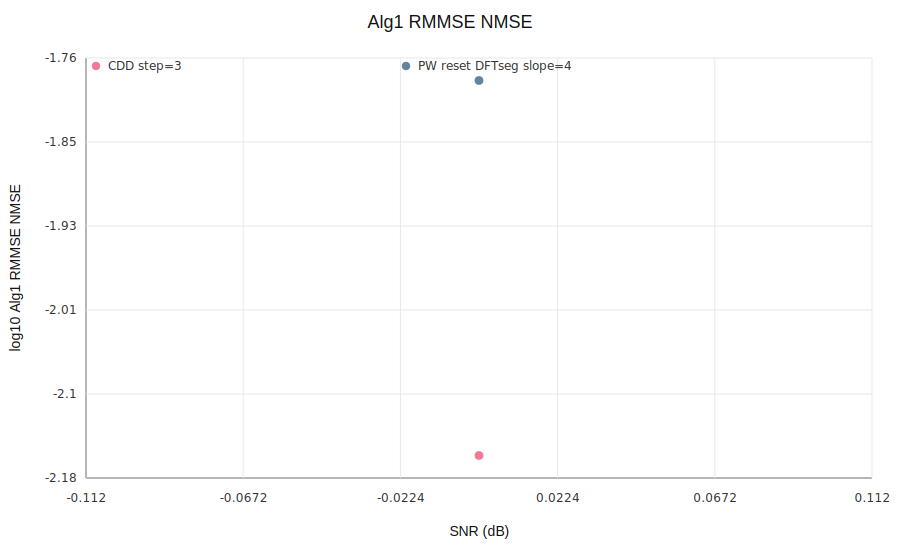
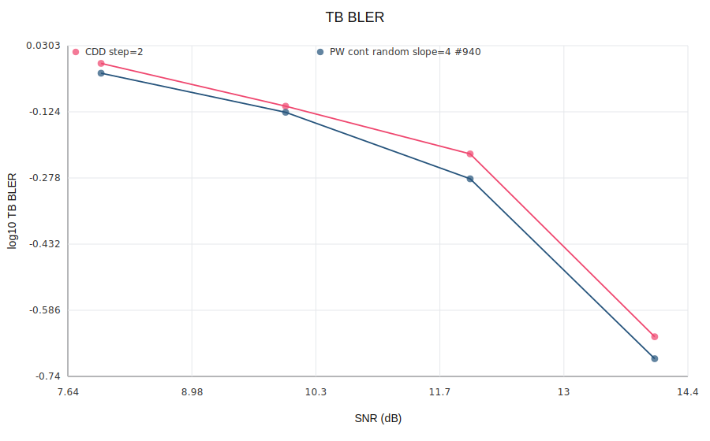

# V 矩阵分集增益与信道估计增益折中验证实验

## 1. 实验目的

阅读 `V_design_diversity_CE_tradeoff.md` 后，本实验验证其中的核心猜想：

> 一般性频域相位矩阵 `V`，特别是分段线性相位，可能在“分集展开能力”和“信道估计处理增益”之间获得比传统全带 CDD 更好的有限维 Pareto 前沿。

本次重点验证三件事：

1. 在 8TX/1RX、频域 8 段的设置下，扫描 CDD 与分段线性相位 `V`，画出“分集增益-CE 相干带宽”散点与 Pareto 前沿。
2. 如果发现分段线性相位优于 CDD 前沿，画出该 `V` 的等效频域协方差函数。
3. 对选中的分段线性相位和参考 CDD，运行 Alg1 full-covariance RMMSE，比较 NMSE，并进一步做 LDPC BLER 小样本对比。

## 2. 等效协方差推导

底层每个 TX 分支采用相同 PDP 且相互独立。第 `n` 个发射分支频域信道为

$$
H_n[k]=\sum_l a_{n,l}\exp\left(-j2\pi k l/N_{\mathrm{fft}}\right),
$$

$$
\mathbb E[a_{n,l}a^*_{m,l'}]=\delta_{n,m}\delta_{l,l'}p[l].
$$

施加 constant-modulus 预编码后，为保持总发射功率不变，实际使用

$$
C[k,n]=\frac{V[k,n]}{\sqrt{N_{\mathrm{tx}}}},
\qquad
g[k]=\sum_n C[k,n]H_n[k].
$$

因此任意两个子载波 `k,k'` 的等效信道协方差为

$$
R_g[k,k']
=\mathbb E[g[k]g^*[k']]
=R_{\mathrm{phy}}[k,k']\sum_n C[k,n]C^*[k',n],
$$

$$
R_{\mathrm{phy}}[k,k']
=\sum_l p[l]\exp\left(-j2\pi(k-k')l/N_{\mathrm{fft}}\right).
$$

也就是

$$
R_g = R_{\mathrm{phy}}\odot(CC^H).
$$

其中 `.*` 是逐元素乘法。

对 CDD，`V[k,n]=exp(-j 2 pi k d_n/Nfft)`，所以 `sum_n C[k,n]C^*[k',n]` 只依赖 `k-k'`，`R_g` 是 Toeplitz，可以等效为 shifted PDP。

对一般分段线性相位，尤其存在 segment 边界相位跳变时，`V[k,n]V^*[k',n]` 依赖绝对子载波位置，`R_g` 不再是频域平稳 Toeplitz 矩阵。此时不能只把 PDP 简单平移或叠加；必须直接用完整矩阵

$$
R_g[k,k']
=\frac{R_{\mathrm{phy}}[k,k']}{N_{\mathrm{tx}}}
\sum_n V[k,n]V^*[k',n].
$$

从时域看，边界相位跳变相当于对频域相位序列做硬切换，其 IDFT 会产生较长旁瓣/长尾；完整 `R_g` 会自然包含这种非平稳影响。本实验的相干带宽坐标只是为了画二维散点，把非平稳 `R_g` 的同一频域间隔对角线做平均：

$$
\rho_{\mathrm{abs}}[\Delta]
=\operatorname{mean}_k
\frac{|R_g[k,k+\Delta]|}
{\sqrt{R_g[k,k]R_g[k+\Delta,k+\Delta]}}.
$$

横轴使用 `rho_abs` 首次低于 0.5 的子载波间隔。

### 2.1 分段线性相位下的 `V` 与 Alg1 协方差构造

设 active subcarrier 的 local index 为 `i=0,...,K-1`，第 `s` 段范围为

$$
b_s \le i < b_{s+1},\qquad s=0,\ldots,S-1.
$$

本实验 `K=576`、`S=8`，所以每段长度 `L_s=72`。第 `s` 段内第 `n` 个 TX 分支的局部 delay 记为 `d_{s,n}`，单位是 sample。分段线性相位写成

$$
\phi_{i,n}
=\theta_{s,n}
-\frac{2\pi(i-b_s)d_{s,n}}{N_{\mathrm{fft}}},
\qquad b_s\le i<b_{s+1}.
$$

于是

$$
V[i,n]=\exp(j\phi_{i,n}),
\qquad
C[i,n]=\frac{V[i,n]}{\sqrt{N_{\mathrm{tx}}}}.
$$

对相位连续的分段线性候选，段首相位递推为

$$
\theta_{0,n}=0,
\qquad
\theta_{s+1,n}
=\theta_{s,n}-\frac{2\pi L_s d_{s,n}}{N_{\mathrm{fft}}}.
$$

这样在边界处 `V` 连续，只允许 group delay 斜率变化。对 reset/DFT-segment 诊断候选，段首相位不递推，而是例如使用

$$
\theta_{s,n}=\frac{2\pi s n}{N_{\mathrm{tx}}}.
$$

这种候选会在段边界产生相位跳变。注意：无论连续还是跳变，Alg1 使用的 `R_g` 都按完整 `V[i,n] V^*[j,n]` 逐点计算，不做平稳 Toeplitz 近似。

具体矩阵步骤如下。先由物理 PDP 构造 active subcarrier 上的底层协方差：

$$
R_{\mathrm{phy}}[i,j]
=\sum_l p[l]\exp\left(-j2\pi(k_i-k_j)l/N_{\mathrm{fft}}\right).
$$

再把 precoder 相位并入等效信道：

$$
R_g[i,j]
=\mathbb E[g[i]g^*[j]]
=R_{\mathrm{phy}}[i,j]\sum_n C[i,n]C^*[j,n]
=\frac{R_{\mathrm{phy}}[i,j]}{N_{\mathrm{tx}}}
\sum_n V[i,n]V^*[j,n].
$$

算法1估计的是等效信道 `g[i]` 本身。令 pilot local index 集合为 `P`，目标集合为 `T={0,...,K-1}`，则

$$
R_{PP}=R_g[P,P],
\qquad
R_{TP}=R_g[T,P].
$$

把两个 DMRS symbol 合并成同一频域 pilot LS 观测后，本实验使用

$$
\sigma_{\mathrm{LS}}^2
=\frac{\sigma_{\mathrm{noise}}^2}{N_{\mathrm{DMRS\ symbols}}}.
$$

Alg1 full-covariance RMMSE 矩阵为

$$
W
=R_{TP}
\left(R_{PP}+(\sigma_{\mathrm{LS}}^2+\epsilon)I\right)^{-1}.
$$

代码中对每个 RX 分支应用为

$$
\hat g = g_P^{\mathrm{LS}}W^T.
$$

这就是本实验 NMSE/BLER 使用的 Algorithm 1 covariance；分段边界的相位跳变不需要额外近似处理，因为它已经包含在 `V[i,n]V^*[j,n]` 这一项里。

### 2.2 与既有算法1代码和旧实验记录的对齐

旧实验记录 [18.9](experiment_record_20260608.md#189-更正alg1--alg3-nmse曲线) 里的算法1定义为：

```text
Alg1：对 CDD-combined equivalent channel 做 Direct RMMSE WB，
使用 CDD-shifted PDP；
target_k = 整个 576-sc allocation；
pilot_k = combined DMRS pilots。
```

本实验与这个算法1在以下层面是对齐的：

| 项目 | 旧记录 18.9 的 Alg1 | 本实验的 Alg1 |
|---|---|---|
| 估计对象 | CDD 后的 equivalent channel `g[k]` | 一般 `V` 后的 equivalent channel `g[k]` |
| 处理带宽 | 整个 576-sc allocation | 整个 576-sc allocation |
| pilot 输入 | combined DMRS pilot LS observation | combined DMRS pilot LS observation |
| RMMSE 形式 | `R_TP (R_PP+sigma^2 I)^-1` | `R_TP (R_PP+sigma^2 I)^-1` |
| CDD covariance | 可用 shifted PDP 得到 Toeplitz `R_g` | CDD 仍等价于 full covariance |
| 一般分段线性 `V` | 不适用 shifted PDP | 使用 matched full covariance `R_phy .* (C C^H)` |

也就是说，本实验不是算法3、也不是 branch-channel reconstruction；它仍是算法1 Direct equivalent-channel RMMSE。区别只在于：对 CDD，旧实现可以通过 shifted PDP 构造 `R_g`；对分段线性相位，必须使用一般 full covariance。

实现上，脚本 [tools/run_v_design_piecewise_tradeoff.py](../tools/run_v_design_piecewise_tradeoff.py) 已改为直接复用已有代码：

```text
tools/search_precoder_design_alg1.py::make_alg1_full_cov_estimator()
```

该函数内部正是：

$$
R_{PP}
=\mathrm{full\_precoded\_covariance}
(\mathrm{grid},\mathrm{pdp},C,P,P),
$$

$$
R_{TP}
=\mathrm{full\_precoded\_covariance}
(\mathrm{grid},\mathrm{pdp},C,T,P),
$$

$$
W=R_{TP}\left(R_{PP}+(\sigma_{\mathrm{LS}}^2+\mathrm{loading})I\right)^{-1}.
$$

其中

$$
\mathrm{full\_precoded\_covariance}
=\mathrm{covariance\_matrix}(\mathrm{PDP})
\odot(C_{\mathrm{target}}C_{\mathrm{pilot}}^H).
$$

因此，本实验的算法1与旧文档中“Direct RMMSE WB / Algorithm 1”的数学定义对齐；与实验14/15中的 non-CDD Algorithm 1 matched full-covariance RMMSE 也对齐。需要注意的是，本轮数值参数并非完全照搬 18.9：这里为了 V 矩阵扫描使用 `8TX/1RX`、`DMRS spacing=6`、`delay spread=5 ns`；旧 18.9 主要是 CDD delay sweep 与 Alg3 对比，典型点包含 `DMRS spacing=24`。

## 3. 仿真方法与参数

代码入口：

```bash
/Users/zhangwei/Downloads/lls_platform_sc_mimo/.venv-sionna1/bin/python tools/run_v_design_piecewise_tradeoff.py --bler-snrs 8,10,12,14 --bler-trials 40 --nmse-snrs=-4,0,4,8 --nmse-trials 80
```

主要参数：

| 项目 | 取值 |
|---|---:|
| TX/RX | 8TX / 1RX |
| SCS / FFT | 30 kHz / 4096 |
| PRB / active SC | 48 PRB / 576 SC |
| 频域分段 | 8 段，每段 72 SC |
| DMRS | symbols 2,7；频域间隔 6 SC；合计 96 个 pilot 子载波 |
| 物理信道 | exponential PDP，delay spread 5 ns，6 taps |
| CDD 扫描 | delay step = 1,2,3,4,5,6,7,8,10,12,16,24,32,48,64,96,128,192,256 samples |
| 分段线性扫描 | segment 内 delay slope step = 0,1,2,4,6,8,12,16,24,32,48,64 samples |
| 分段结构 | phase-continuous cyclic/zigzag/random permutation；另含 reset DFT segment phase 作为带跳变上界 |
| 分集指标 | `log10 det((V^H V)/K)` 与 `det((V^H V)/K)` |
| CE 增益代理 | `mean |rho(Delta)|` 首次低于 0.5 的 coherence BW |
| RMMSE | Alg1 full-covariance RMMSE，使用匹配的完整 `R_g` |
| BLER | NR 256QAM table MCS 8，Qm=4，code rate=553/1024，40 TB/SNR |

本轮共生成 87 个 `V` 候选。输出目录：

```text
outputs/v_design_piecewise_tradeoff/v_design_piecewise_tradeoff_20260615_231257
```

## 4. 矩阵-协方差平面结果

### 4.1 散点图坐标的定义

每一个散点对应一个候选相位矩阵 `V`。本实验里 `K=576` 个 active subcarriers，`N=8` 个 TX 分支。

纵轴的分集增益来自 `V` 的奇异值模方乘积。令

$$
\lambda_i=\operatorname{eig}_i(V^H V)=\sigma_i^2,
\qquad i=1,\ldots,N.
$$

图中纵轴使用

$$
J_{\mathrm{div}}
=\log_{10}\det\left(\frac{V^H V}{K}\right)
=\sum_i\log_{10}\left(\frac{\lambda_i}{K}\right).
$$

同时 CSV 中也记录

$$
G_{\mathrm{div}}
=\det\left(\frac{V^H V}{K}\right)
=\prod_i\frac{\lambda_i}{K}.
$$

理想满展开时 `(V^H V)/K = I_N`，所以 `G_div=1`、`J_div=0`。若某些奇异值很小，`J_div` 会变成较大的负数。

横轴的“信道估计增益”不是直接仿真的 RMMSE NMSE，而是由等效信道协方差压缩出来的相干带宽代理。先用 PDP 得到底层物理频域协方差：

$$
R_{\mathrm{phy}}[k,k']
=\sum_l p[l]\exp\left(-j2\pi(k-k')l/N_{\mathrm{fft}}\right).
$$

再由 `C=V/sqrt(N)` 得到等效信道协方差：

$$
R_g[k,k']
=R_{\mathrm{phy}}[k,k']\sum_n C[k,n]C^*[k',n]
=\frac{R_{\mathrm{phy}}[k,k']}{N}
\sum_n V[k,n]V^*[k',n].
$$

归一化后：

$$
\tilde R[k,k']
=\frac{R_g[k,k']}{\sqrt{R_g[k,k]R_g[k',k']}}.
$$

如果 `V` 是 CDD，`R_tilde[k,k+Delta]` 只依赖 `Delta`；如果 `V` 是分段线性或带边界跳变的相位矩阵，它一般依赖绝对子载波 `k`。为了画二维散点，本实验对同一频域间隔的对角线做平均：

$$
\rho_{\mathrm{abs}}[\Delta]
=\frac{1}{K-\Delta}
\sum_{k=0}^{K-\Delta-1}
\left|\tilde R[k,k+\Delta]\right|.
$$

横轴为

$$
B_{0.5}
=\min\{\Delta\ge 1:\rho_{\mathrm{abs}}[\Delta]\le 0.5\}.
$$

这个 `BW0.5` 只描述“平均相关函数的半功率宽度”，是 CE 处理增益的 proxy。真正的 RMMSE NMSE 还取决于 pilot 位置、pilot-to-data 互相关矩阵、噪声方差和 `R_PP` 条件数：

$$
W_{\mathrm{RMMSE}}
=R_{TP}(R_{PP}+\sigma_{\mathrm{LS}}^2I)^{-1},
$$

$$
\mathrm{NMSE}
=\frac{\mathbb E\|g-W_{\mathrm{RMMSE}}g_P^{\mathrm{LS}}\|^2}
{\mathbb E\|g\|^2}.
$$

因此，散点图上横轴更靠右通常有利于 CE，但不能保证 RMMSE NMSE 一定更低。

Pareto 前沿在每一种 family 内单独计算。点 `A` 支配点 `B` 的条件是：

$$
B_{0.5,A}\ge B_{0.5,B},
\qquad
J_{\mathrm{div},A}\ge J_{\mathrm{div},B},
$$

且至少一个不等号严格成立。未被同 family 其他点支配的点就是该 family 的 Pareto 前沿点。


图中的前沿点已经标注 ID：`C*` 是 CDD 前沿，`P*` 是相位连续分段线性前沿，`R*` 是带 segment 相位 reset/跳变的分段线性诊断前沿。`P1` 是图中最靠右的绿色三角。

### 4.2 Pareto 前沿点表

完整 CSV 见：

```text
outputs/v_design_piecewise_tradeoff/v_design_piecewise_tradeoff_20260615_231257/pareto_front_labeled.csv
```

| ID | 类型 | 实现方式 | BW0.5 (SC) | log10 product | product | cond | min eig/K | GD spread | boundary step |
|---|---|---|---:|---:|---:|---:|---:|---:|---:|
| C1 | CDD | CDD step=2 | 155 | -19.615 | 2.43e-20 | 2.41e+04 | 6.08e-09 | 14.0 | 0.021 |
| C2 | CDD | CDD step=3 | 104 | -10.894 | 1.28e-11 | 994 | 2.40e-06 | 21.0 | 0.032 |
| C3 | CDD | CDD step=4 | 78 | -5.524 | 2.99e-06 | 93.0 | 2.05e-04 | 28.0 | 0.043 |
| C4 | CDD | CDD step=5 | 63 | -2.244 | 5.71e-03 | 13.5 | 7.77e-03 | 35.0 | 0.054 |
| C5 | CDD | CDD step=6 | 52 | -0.514 | 0.306 | 2.85 | 0.146 | 42.0 | 0.064 |
| C6 | CDD | CDD step=7 | 45 | -0.003 | 0.993 | 1.07 | 0.889 | 49.0 | 0.075 |
| C7 | CDD | CDD step=64 | 5 | 0.000 | 1.000 | 1.00 | 1.000 | 448.0 | 0.687 |
| P1 | PW continuous | PW cont random slope=4 #938 | 119 | -4.496 | 3.19e-05 | 15.7 | 1.70e-02 | 28.0 | 0.043 |
| P2 | PW continuous | PW cont random slope=4 #939 | 112 | -4.054 | 8.84e-05 | 38.0 | 2.52e-03 | 28.0 | 0.043 |
| P3 | PW continuous | PW cont random slope=4 #940 | 105 | -3.889 | 1.29e-04 | 15.5 | 1.66e-02 | 28.0 | 0.043 |
| P4 | PW continuous | PW cont cyclic slope=4 | 92 | -2.587 | 2.59e-03 | 6.51 | 5.75e-02 | 28.0 | 0.043 |
| P5 | PW continuous | PW cont random slope=6 #201 | 64 | -2.301 | 5.00e-03 | 8.61 | 3.85e-02 | 42.0 | 0.064 |
| P6 | PW continuous | PW cont cyclic slope=6 | 58 | -0.795 | 0.160 | 2.87 | 0.228 | 42.0 | 0.064 |
| P7 | PW continuous | PW cont cyclic slope=8 | 42 | -0.106 | 0.783 | 1.47 | 0.653 | 56.0 | 0.086 |
| P8 | PW continuous | PW cont cyclic slope=16 | 21 | -0.042 | 0.907 | 1.22 | 0.833 | 112.0 | 0.172 |
| P9 | PW continuous | PW cont cyclic slope=24 | 14 | -0.010 | 0.978 | 1.12 | 0.891 | 168.0 | 0.258 |
| P10 | PW continuous | PW cont cyclic slope=32 | 10 | -0.009 | 0.979 | 1.09 | 0.926 | 224.0 | 0.344 |
| P11 | PW continuous | PW cont cyclic slope=48 | 7 | -0.004 | 0.991 | 1.06 | 0.953 | 336.0 | 0.515 |
| P12 | PW continuous | PW cont cyclic slope=64 | 5 | -0.003 | 0.993 | 1.06 | 0.937 | 448.0 | 0.687 |
| R1 | PW reset | PW reset DFTseg slope=2 | 42 | ~0 | 1.000 | 1.00 | 1.000 | 3442.0 | 3.010 |
| R2 | PW reset | PW reset DFTseg slope=12 | 22 | ~0 | 1.000 | 1.00 | 1.000 | 2736.0 | 2.105 |
| R3 | PW reset | PW reset DFTseg slope=16 | 17 | ~0 | 1.000 | 1.00 | 1.000 | 3296.0 | 2.602 |
| R4 | PW reset | PW reset DFTseg slope=24 | 12 | ~0 | 1.000 | 1.00 | 1.000 | 2888.0 | 2.884 |

### 4.3 关键点

| 方案 | BW0.5 (SC) | log10 product | product | cond | min eig/K | group-delay spread (samples) |
|---|---:|---:|---:|---:|---:|---:|
| CDD step=2 | 155 | -19.615 | 2.43e-20 | 24094.8 | 6.08e-09 | 14 |
| CDD step=3 | 104 | -10.894 | 1.28e-11 | 993.6 | 2.40e-06 | 21 |
| CDD step=4 | 78 | -5.524 | 2.99e-06 | 93.0 | 2.05e-04 | 28 |
| CDD step=7 | 45 | -0.003 | 0.993 | 1.07 | 0.889 | 49 |
| PW cont random slope=4 #940 | 105 | -3.889 | 1.29e-04 | 15.5 | 1.66e-02 | 28 |
| PW reset DFTseg slope=2 | 42 | ~0 | ~1.0 | 1.0 | ~1.0 | 3442 |

最重要的发现：

1. 存在 phase-continuous 分段线性相位 `PW cont random slope=4 #940`，其 `BW0.5=105 SC`，略高于 `CDD step=3` 的 `104 SC`，但 `log10 product=-3.889`，比 `CDD step=3` 的 `-10.894` 高约 7.0 个数量级。
2. 若要求 CDD 具有不小于 105 SC 的相干带宽，只能选到 `CDD step=2` 这一类更平滑但秩展开很弱的点；此时分段线性候选的 `log10 product` 优势为 `15.73`。
3. 带相位跳变的 `PW reset DFTseg` 可以几乎达到满分集 `product≈1`，但 boundary phase step 接近 pi，等效 group-delay spread 达到数千 samples。这更像一个数值上界/反例工具，不应直接解释为物理可平滑实现。

因此，文档中“分段线性相位可能严格优于 CDD Pareto 前沿”的矩阵层面猜想，在本有限维配置下得到支持；而且这次找到的是相位连续的候选，不依赖硬跳变。

## 5. 选中候选的协方差函数


这张图不是由 Monte Carlo 样本估计出来的，而是由上面的解析协方差矩阵 `R_g` 直接计算。图中实线和虚线分别为：

$$
\rho_{\mathrm{abs}}[\Delta]
=\frac{1}{K-\Delta}\sum_k
\left|\tilde R[k,k+\Delta]\right|,
$$

$$
\rho_{\mathrm{complex\_abs}}[\Delta]
=\left|
\frac{1}{K-\Delta}\sum_k
\tilde R[k,k+\Delta]
\right|.
$$

其中

$$
\tilde R[k,k']
=\frac{R_g[k,k']}{\sqrt{R_g[k,k]R_g[k',k']}}.
$$

`rho_abs` 体现平均相关强度；`rho_complex_abs` 会保留同一间隔上的相位抵消效应。因此非平稳分段相位下，这两条曲线可能不同。

选中的分段线性候选与参考 CDD：

| 方案 | BW0.9 (SC) | BW0.5 (SC) | coherence area | covariance effective rank |
|---|---:|---:|---:|---:|
| CDD step=2 | 65 | 155 | 142.47 | 2.78 |
| PW cont random slope=4 #940 | 35 | 105 | 116.61 | 3.09 |

解释：

分段线性候选 `P3` 在频域上没有最平滑的 CDD 前沿点 `C1` 那么宽，`BW0.5` 从 `155 SC` 降到 `105 SC`；但相对相近相干带宽的 `C2`，`P3` 的分集展开明显更好。因此它是“相近 CE proxy 下分集更好”的点，而不是“绝对 CE proxy 最大”的点。

### 5.1 有效 PDP 谱

用户提出的直觉是对的：从时域看，频域相位序列的硬切换会产生类似窗函数截断的效应，其 IDFT 会带来更长旁瓣/长尾。这里补充画出原始物理 PDP、CDD 后以及分段线性相位后的有效 PDP 谱。

需要先区分两种情况。

若等效频域协方差是平稳/Toeplitz 的，即

$$
R_f[k,k'] = r_f[k-k'],
$$

则一维频域相关函数和 PDP 是 Fourier 对：

$$
r_f[\Delta]
= \sum_\tau p[\tau]\,
\exp\left(-j2\pi \frac{\Delta\tau}{N_{\mathrm{FFT}}}\right).
$$

这就是 CDD 在理想全带定义下仍可解释为 shifted PDP 的原因。

但一般分段线性相位会让

$$
R_f[k,k']
$$

依赖绝对子载波位置 `k,k'`，不再只是 `k-k'` 的函数。此时严格对象不是一维 PDP，而是完整 delay-domain covariance：

$$
Q[\tau,\tau']
= \frac{1}{N_{\mathrm{FFT}}}
\sum_{k,k'\in\mathcal A}
R_f[k,k']
\exp\left(j2\pi\frac{k\tau-k'\tau'}{N_{\mathrm{FFT}}}\right),
$$

其中 `A` 是 576 个 active subcarriers。图中画的是其对角线：

$$
p_{\mathrm{eff}}[\tau]
= Q[\tau,\tau].
$$

所以：**平稳时，一维 PDP 足以和一维相关函数互相变换；非平稳时，`p_eff[tau]` 只是完整 `Q[tau,tau']` 的对角线，不能单独恢复完整频域协方差。** 边界相位跳变或段间硬切换会在 `p_eff` 中表现为更长的 delay tail，同时也会增加 delay bin 之间的 off-diagonal correlation。


图中 `Original input PDP` 是物理 TDL 输入 PDP；CDD 和分段线性曲线是由 active-band 等效协方差 `R_f` 计算出的 `p_eff[tau]`。`PW reset R1` 是带 segment phase reset 的诊断曲线，用来展示硬跳变带来的长尾；实际重点候选仍是 phase-continuous 的 `P6/P8`。

输出目录：

```text
outputs/v_design_pdp_spectrum/v_design_pdp_spectrum_20260616_215311/
```

关键 summary：

| Curve | peak bin | tail power >=64 bins | tail power >=128 bins | offdiag energy ratio |
|---|---:|---:|---:|---:|
| Original input PDP | 0 | 0.000 | 0.000 | 0.000 |
| CDD C6 step=7 | 28 | 0.070 | 0.062 | 0.869 |
| PW P6 cyclic slope=6 | 29 | 0.072 | 0.063 | 0.876 |
| PW P8 cyclic slope=16 | 21 | 0.493 | 0.064 | 0.931 |
| PW reset R1 slope=2 | 14 | 0.411 | 0.390 | 0.898 |

读数：

1. `CDD C6` 和 `PW P6` 的有效 PDP tail 很接近，这与二者在 10% BLER 附近表现接近相符。
2. `PW P8` 在 64-bin 之后的 tail power 明显更高，说明它通过更强的频域选择性获得更多分集；这也解释了为什么它的 NMSE 不一定更好，但 1% BLER SNR 可以优于 CDD。
3. `PW reset R1` 的长尾更明显，符合“边界相位硬跳变导致长旁瓣”的直觉。但这种 reset 候选不是当前推荐的物理实现，只作为诊断/上界。
4. CDD/PW 的 `offdiag energy ratio` 不能和原始输入 PDP 直接横比，因为前者是 active-band `Q[tau,tau']` 的统计量，包含有限带宽窗口效应；它主要用于提醒：非平稳相位矩阵下，一维 PDP 谱不是完整协方差信息。

## 6. Alg1 RMMSE NMSE



| SNR (dB) | CDD step=2 NMSE | PW cont random slope=4 #940 NMSE | PW 相对 CDD |
|---:|---:|---:|---:|
| -4 | 7.29e-2 | 1.06e-1 | -1.61 dB |
| 0 | 3.17e-2 | 4.96e-2 | -1.94 dB |
| 4 | 1.34e-2 | 2.18e-2 | -2.11 dB |
| 8 | 5.74e-3 | 1.17e-2 | -3.10 dB |

RMMSE 使用的是匹配的完整 `R_g`，所以这里不是 covariance mismatch。这里看起来“CDD step=2 的 NMSE 更好”并不和散点图矛盾，原因有两个：

1. 散点图中 `P3` 支配的是相近横轴的 `C2`：`P3 BW0.5=105 SC`，`C2 BW0.5=104 SC`。但 NMSE/BLER 对比里选的是参考点 `C1`，它的 `BW0.5=155 SC`，明显更靠右、更平滑，只是分集展开很差。
2. `BW0.5` 是从 `rho_abs[Delta]` 压缩出来的单标量 proxy，而 RMMSE NMSE 由完整的 `R_TP (R_PP+sigma^2I)^(-1)` 决定。两个 `V` 即使 `BW0.5` 接近，pilot-to-data 互相关、`R_PP` 条件数和相关函数形状也可能不同。

所以更准确的表述是：`P3` 在矩阵-协方差 proxy 平面上相对 CDD 前沿更优，但在与更平滑的 `C1` 直接比较 RMMSE NMSE 时，`C1` 仍占优。若要把“CE 增益”定义为真实 RMMSE NMSE，下一步应把横轴直接换成 Alg1 NMSE，而不是 `BW0.5` proxy。

## 7. BLER 对比



| SNR (dB) | CDD step=2 BLER | PW cont random slope=4 #940 BLER | PW - CDD |
|---:|---:|---:|---:|
| 8 | 0.975 | 0.925 | -0.050 |
| 10 | 0.775 | 0.750 | -0.025 |
| 12 | 0.600 | 0.525 | -0.075 |
| 14 | 0.225 | 0.200 | -0.025 |

40 TB/SNR 的 BLER 样本还偏小，不能把 0.025 到 0.075 的差异解释成精确结论；但趋势是有意义的：尽管分段线性相位的 CE NMSE 更差，它在高 SNR 区间仍略优于 CDD step=2，说明更强的模式展开/频域分集可以抵消一部分 CE 损失。

## 8. 全帕累托前沿的 TDL 链路曲线

为回应“每一个帕累托前沿上的点都比较 NMSE / BLER 曲线”的要求，补充运行了 CDD 前沿 `C1-C7` 和 phase-continuous 分段线性相位前沿 `P1-P12`。带相位跳变的 reset diagnostic 点 `R1-R4` 仍只作为矩阵上界诊断，不纳入链路仿真。

本节使用参考实验记录中的 TDL / MCS / Algorithm 1 风格参数：

| 参数 | 取值 |
|---|---|
| 信道 | static exponential TDL |
| Delay spread | 10 ns |
| PDSCH allocation | 48 RB x 10 OFDM symbols，576 active subcarriers |
| Tx/Rx | 8TX / 1RX |
| DMRS symbols | `[2, 7]` |
| DMRS spacing | 24 subcarriers |
| MCS | `nr_256qam` index 8，16QAM，code rate 553/1024 |
| LDPC iterations | 8 |
| Algorithm 1 | Direct equivalent-channel full-covariance RMMSE，目标带宽 576 SC |
| SNR used in final table | 10, 12, 14, 15, 16, 17, 18, 20 dB |
| Trials | 300 TB / SNR / Pareto point |

BLER 分辨率为 `1/300=0.0033`。同一 SNR / trial 下，所有 CDD 和分段线性前沿点共享相同 TDL realization、payload、pilot noise 和 data noise，用 common random numbers 降低不同 `V` 矩阵之间的比较方差。

输出目录：

```text
outputs/v_design_pareto_link_curves/v_design_pareto_link_20260616_merged_10to20/
```

关键输出文件：

```text
pareto_link_curves.csv
pareto_link_targets.csv
pareto_link_piecewise_gain_vs_best_cdd.csv
completed_run_summary.json
```

合并后处理命令：

```bash
/Users/zhangwei/Downloads/lls_platform_sc_mimo/.venv-sionna1/bin/python \
  tools/run_v_design_pareto_link_curves.py \
  --merge-csvs outputs/v_design_pareto_link_curves/v_design_pareto_link_20260616_065635/pareto_link_curves.csv,outputs/v_design_pareto_link_curves_tail/v_design_pareto_link_20260616_082144/pareto_link_curves.csv \
  --merge-output-dir outputs/v_design_pareto_link_curves/v_design_pareto_link_20260616_merged_10to20 \
  --fig-dir docs/figures
```

### 8.1 NMSE 曲线


NMSE 维度仍然体现了 CE 难度：更平滑的 CDD 前沿点通常有更低的 Algorithm 1 NMSE；分段线性相位中，斜率更大、`BW0.5` 更小的点 NMSE 更高。18 dB / 20 dB 处的代表性数值如下：

| ID | Implementation | BW0.5 | log10 product | NMSE @18 dB | BLER @18 dB | BLER @20 dB |
|---|---|---:|---:|---:|---:|---:|
| C1 | CDD step=2 | 155 | -19.615 | 3.072e-03 | 0.070 | 0.027 |
| C6 | CDD step=7 | 45 | -0.003 | 4.423e-03 | 0.013 | 0.003 |
| C7 | CDD step=64 | 5 | 0.000 | 9.913e-03 | 0.013 | 0.003 |
| P3 | PW cont random slope=4 #940 | 105 | -3.889 | 4.748e-03 | 0.050 | 0.017 |
| P6 | PW cont cyclic slope=6 | 58 | -0.795 | 4.822e-03 | 0.010 | 0.003 |
| P8 | PW cont cyclic slope=16 | 21 | -0.042 | 7.392e-03 | 0.007 | 0.007 |
| P9 | PW cont cyclic slope=24 | 14 | -0.010 | 9.902e-03 | 0.007 | 0.003 |

### 8.2 BLER 曲线


300 trials/SNR 后，多数点已经穿过 10% BLER，部分点也穿过 1% BLER。`SNR@BLER=x` 使用相邻 SNR 点上的 BLER 线性插值得到；表中 `n/a` 表示在 10-20 dB 的完整 SNR 网格内未形成 crossing。

| ID | Type | V implementation | BW0.5 | log10 product | SNR@BLER=0.1 | SNR@BLER=0.01 | min BLER |
|---|---|---|---:|---:|---:|---:|---:|
| C1 | CDD | CDD step=2 | 155 | -19.615 | 16.89 | n/a | 0.027 |
| C2 | CDD | CDD step=3 | 104 | -10.894 | 16.45 | n/a | 0.013 |
| C3 | CDD | CDD step=4 | 78 | -5.524 | 16.12 | n/a | 0.013 |
| C4 | CDD | CDD step=5 | 63 | -2.244 | 15.64 | 20.00 | 0.010 |
| C5 | CDD | CDD step=6 | 52 | -0.514 | 15.47 | 19.00 | 0.003 |
| C6 | CDD | CDD step=7 | 45 | -0.003 | 15.30 | 18.67 | 0.003 |
| C7 | CDD | CDD step=64 | 5 | 0.000 | 15.91 | 18.67 | 0.003 |
| P1 | Piecewise | PW cont random slope=4 #938 | 119 | -4.496 | 16.70 | 20.00 | 0.010 |
| P2 | Piecewise | PW cont random slope=4 #939 | 112 | -4.054 | 16.41 | 19.50 | 0.000 |
| P3 | Piecewise | PW cont random slope=4 #940 | 105 | -3.889 | 16.50 | n/a | 0.017 |
| P4 | Piecewise | PW cont cyclic slope=4 | 92 | -2.587 | 16.18 | 19.83 | 0.007 |
| P5 | Piecewise | PW cont random slope=6 #201 | 64 | -2.301 | 15.75 | n/a | 0.017 |
| P6 | Piecewise | PW cont cyclic slope=6 | 58 | -0.795 | 14.98 | 18.00 | 0.003 |
| P7 | Piecewise | PW cont cyclic slope=8 | 42 | -0.106 | 15.55 | 18.80 | 0.000 |
| P8 | Piecewise | PW cont cyclic slope=16 | 21 | -0.042 | 15.34 | 17.50 | 0.007 |
| P9 | Piecewise | PW cont cyclic slope=24 | 14 | -0.010 | 15.50 | 17.86 | 0.003 |
| P10 | Piecewise | PW cont cyclic slope=32 | 10 | -0.009 | 16.45 | 19.50 | 0.003 |
| P11 | Piecewise | PW cont cyclic slope=48 | 7 | -0.004 | 15.93 | 18.00 | 0.003 |
| P12 | Piecewise | PW cont cyclic slope=64 | 5 | -0.003 | 15.92 | 17.75 | 0.007 |

### 8.3 分段线性相位的 BLER SNR 增益

这里把 CDD 前沿中达到目标 BLER 所需 SNR 最低的点作为 baseline。正增益定义为分段线性相位所需 SNR 更低：

$$
G_{\mathrm{PW-vs-CDD}}(p)
= \mathrm{SNR}_{\mathrm{best\,CDD}}(\mathrm{BLER}=p)
- \mathrm{SNR}_{\mathrm{PW}}(\mathrm{BLER}=p).
$$

在本轮数据中，10% 和 1% BLER 的最佳 CDD baseline 都是 `C6 = CDD step=7`，其 `SNR@10%=15.30 dB`，`SNR@1%=18.67 dB`。分段线性相位的增益如下：

| ID | V implementation | SNR@10% | gain@10% vs best CDD | SNR@1% | gain@1% vs best CDD |
|---|---|---:|---:|---:|---:|
| P1 | PW cont random slope=4 #938 | 16.70 | -1.40 | 20.00 | -1.33 |
| P2 | PW cont random slope=4 #939 | 16.41 | -1.11 | 19.50 | -0.83 |
| P3 | PW cont random slope=4 #940 | 16.50 | -1.20 | n/a | n/a |
| P4 | PW cont cyclic slope=4 | 16.18 | -0.88 | 19.83 | -1.17 |
| P5 | PW cont random slope=6 #201 | 15.75 | -0.45 | n/a | n/a |
| P6 | PW cont cyclic slope=6 | 14.98 | 0.32 | 18.00 | 0.67 |
| P7 | PW cont cyclic slope=8 | 15.55 | -0.25 | 18.80 | -0.13 |
| P8 | PW cont cyclic slope=16 | 15.34 | -0.04 | 17.50 | 1.17 |
| P9 | PW cont cyclic slope=24 | 15.50 | -0.20 | 17.86 | 0.81 |
| P10 | PW cont cyclic slope=32 | 16.45 | -1.15 | 19.50 | -0.83 |
| P11 | PW cont cyclic slope=48 | 15.93 | -0.63 | 18.00 | 0.67 |
| P12 | PW cont cyclic slope=64 | 15.92 | -0.62 | 17.75 | 0.92 |

### 8.4 读数

1. **10% BLER 有一个分段线性相位点超过最佳 CDD。** `P6 = PW cont cyclic slope=6` 的 `SNR@10%=14.98 dB`，相对最佳 CDD `C6` 的 `15.30 dB` 有约 `+0.32 dB` gain。
2. **1% BLER 有多个分段线性相位点超过最佳 CDD。** 最好的是 `P8 = PW cont cyclic slope=16`，`SNR@1%=17.50 dB`，相对最佳 CDD `C6` 的 `18.67 dB` 有约 `+1.17 dB` gain；`P12/P9/P6/P11` 也有正增益。
3. **不是所有分段线性相位都赢。** 低斜率随机 `P1-P4` 在 10% 和 1% BLER 上大多差于最佳 CDD；过高斜率的 `P10` 也变差。较好的区域在中等斜率 cyclic pattern 附近。
4. **NMSE 和 BLER 排序不完全一致。** 例如 `P8` 的 18 dB NMSE 比 `C6` 更差，但 1% BLER SNR 反而更低。这说明在当前 MCS8/TDL/8TX1RX 场景下，频域分集和等效信道幅度分布可以部分抵消 CE NMSE 损失。
5. **矩阵-协方差 proxy 仍不是完整链路目标。** `BW0.5` 能描述 CE 友好程度的一个侧面，但最终链路性能还取决于完整 RMMSE 矩阵、pilot aliasing、等效 SINR 分布和 LDPC 码字在频域上的交织收益。

## 9. 结论

本实验对文档猜想的验证结果是：

1. **矩阵-Pareto 层面：支持猜想。** 在 8TX/1RX、576 SC、8 段频域配置下，确实存在 phase-continuous 分段线性相位，使其在相近甚至更高的相干带宽下获得远高于 CDD 的奇异值模方乘积。
2. **信道估计层面：折中明显。** 匹配完整协方差的 Alg1 RMMSE 下，分段线性候选的 NMSE 比 CDD step=2 差约 1.6 到 3.1 dB。
3. **链路层面：支持存在局部增益。** 小样本 `P3` vs `C1` BLER 中，分段线性候选在 8 到 14 dB 均略低于 CDD step=2；进一步的全帕累托 TDL 链路曲线中，`P6` 在 10% BLER 上相对最佳 CDD 有约 `+0.32 dB` gain，`P8` 在 1% BLER 上相对最佳 CDD 有约 `+1.17 dB` gain。
4. **相位跳变必须谨慎。** reset DFT segment phase 的确能构造近似满秩/正交 `V`，但边界相位跳变导致非常大的等效 group-delay spread；这种候选应作为理论上界或诊断工具，而不是直接作为物理可实现方案。
5. **增益点集中在中等分段斜率。** 不是所有分段线性相位都优于 CDD；低斜率随机点和过高斜率点会变差，较好的点集中在 `P6-P9/P12` 这类中等到偏高 cyclic slope。

建议下一步扩大 BLER trials，并对 phase-continuous 分段线性相位做目标函数优化，例如直接最大化

$$
\log\det\left(\frac{V^H V}{K}\right)
-\lambda\,\mathrm{CE\_loss}(R_g).
$$

其中 `CE_loss` 可用 RMMSE NMSE、coherence area 或 estimator condition number 定义。
