# V 矩阵分集增益与信道估计增益折中验证实验

## 1. 实验目的

阅读 `V_design_diversity_CE_tradeoff.md` 后，本实验验证其中的核心猜想：

> 一般性频域相位矩阵 `V`，特别是分段线性相位，可能在“分集展开能力”和“信道估计处理增益”之间获得比传统全带 CDD 更好的有限维 Pareto 前沿。

本次重点验证三件事：

1. 在 8TX/1RX、频域 8 段的设置下，扫描 CDD 与分段线性相位 `V`，画出“分集增益-CE 相干带宽”散点与 Pareto 前沿。
2. 如果发现分段线性相位优于 CDD 前沿，画出该 `V` 的等效频域协方差函数。
3. 对选中的分段线性相位和参考 CDD，运行 Alg1 full-covariance RMMSE，比较 NMSE，并进一步做 LDPC BLER 小样本对比。

## 2. 等效协方差推导

底层每个 TX 分支采用相同 PDP 且相互独立。第 `n` 个发射分支频域信道为

$$
H_n[k]=\sum_l a_{n,l}\exp\left(-j2\pi k l/N_{\mathrm{fft}}\right),
$$

$$
\mathbb E[a_{n,l}a^*_{m,l'}]=\delta_{n,m}\delta_{l,l'}p[l].
$$

施加 constant-modulus 预编码后，为保持总发射功率不变，实际使用

$$
C[k,n]=\frac{V[k,n]}{\sqrt{N_{\mathrm{tx}}}},
\qquad
g[k]=\sum_n C[k,n]H_n[k].
$$

因此任意两个子载波 `k,k'` 的等效信道协方差为

$$
R_g[k,k']
=\mathbb E[g[k]g^*[k']]
=R_{\mathrm{phy}}[k,k']\sum_n C[k,n]C^*[k',n],
$$

$$
R_{\mathrm{phy}}[k,k']
=\sum_l p[l]\exp\left(-j2\pi(k-k')l/N_{\mathrm{fft}}\right).
$$

也就是

$$
R_g = R_{\mathrm{phy}}\odot(CC^H).
$$

其中 `.*` 是逐元素乘法。

对 CDD，`V[k,n]=exp(-j 2 pi k d_n/Nfft)`，所以 `sum_n C[k,n]C^*[k',n]` 只依赖 `k-k'`，`R_g` 是 Toeplitz，可以等效为 shifted PDP。

对一般分段线性相位，尤其存在 segment 边界相位跳变时，`V[k,n]V^*[k',n]` 依赖绝对子载波位置，`R_g` 不再是频域平稳 Toeplitz 矩阵。此时不能只把 PDP 简单平移或叠加；必须直接用完整矩阵

$$
R_g[k,k']
=\frac{R_{\mathrm{phy}}[k,k']}{N_{\mathrm{tx}}}
\sum_n V[k,n]V^*[k',n].
$$

从时域看，边界相位跳变相当于对频域相位序列做硬切换，其 IDFT 会产生较长旁瓣/长尾；完整 `R_g` 会自然包含这种非平稳影响。本实验的相干带宽坐标只是为了画二维散点，把非平稳 `R_g` 的同一频域间隔对角线做平均：

$$
\rho_{\mathrm{abs}}[\Delta]
=\operatorname{mean}_k
\frac{|R_g[k,k+\Delta]|}
{\sqrt{R_g[k,k]R_g[k+\Delta,k+\Delta]}}.
$$

横轴使用 `rho_abs` 首次低于 0.5 的子载波间隔。

### 2.1 分段线性相位下的 `V` 与 Alg1 协方差构造

设 active subcarrier 的 local index 为 `i=0,...,K-1`，第 `s` 段范围为

$$
b_s \le i < b_{s+1},\qquad s=0,\ldots,S-1.
$$

本实验 `K=576`、`S=8`，所以每段长度 `L_s=72`。第 `s` 段内第 `n` 个 TX 分支的局部 delay 记为 `d_{s,n}`，单位是 sample。分段线性相位写成

$$
\phi_{i,n}
=\theta_{s,n}
-\frac{2\pi(i-b_s)d_{s,n}}{N_{\mathrm{fft}}},
\qquad b_s\le i<b_{s+1}.
$$

于是

$$
V[i,n]=\exp(j\phi_{i,n}),
\qquad
C[i,n]=\frac{V[i,n]}{\sqrt{N_{\mathrm{tx}}}}.
$$

对相位连续的分段线性候选，段首相位递推为

$$
\theta_{0,n}=0,
\qquad
\theta_{s+1,n}
=\theta_{s,n}-\frac{2\pi L_s d_{s,n}}{N_{\mathrm{fft}}}.
$$

这样在边界处 `V` 连续，只允许 group delay 斜率变化。对 reset/DFT-segment 诊断候选，段首相位不递推，而是例如使用

$$
\theta_{s,n}=\frac{2\pi s n}{N_{\mathrm{tx}}}.
$$

这种候选会在段边界产生相位跳变。注意：无论连续还是跳变，Alg1 使用的 `R_g` 都按完整 `V[i,n] V^*[j,n]` 逐点计算，不做平稳 Toeplitz 近似。

具体矩阵步骤如下。先由物理 PDP 构造 active subcarrier 上的底层协方差：

$$
R_{\mathrm{phy}}[i,j]
=\sum_l p[l]\exp\left(-j2\pi(k_i-k_j)l/N_{\mathrm{fft}}\right).
$$

再把 precoder 相位并入等效信道：

$$
R_g[i,j]
=\mathbb E[g[i]g^*[j]]
=R_{\mathrm{phy}}[i,j]\sum_n C[i,n]C^*[j,n]
=\frac{R_{\mathrm{phy}}[i,j]}{N_{\mathrm{tx}}}
\sum_n V[i,n]V^*[j,n].
$$

算法1估计的是等效信道 `g[i]` 本身。令 pilot local index 集合为 `P`，目标集合为 `T={0,...,K-1}`，则

$$
R_{PP}=R_g[P,P],
\qquad
R_{TP}=R_g[T,P].
$$

把两个 DMRS symbol 合并成同一频域 pilot LS 观测后，本实验使用

$$
\sigma_{\mathrm{LS}}^2
=\frac{\sigma_{\mathrm{noise}}^2}{N_{\mathrm{DMRS\ symbols}}}.
$$

Alg1 full-covariance RMMSE 矩阵为

$$
W
=R_{TP}
\left(R_{PP}+(\sigma_{\mathrm{LS}}^2+\epsilon)I\right)^{-1}.
$$

代码中对每个 RX 分支应用为

$$
\hat g = g_P^{\mathrm{LS}}W^T.
$$

这就是本实验 NMSE/BLER 使用的 Algorithm 1 covariance；分段边界的相位跳变不需要额外近似处理，因为它已经包含在 `V[i,n]V^*[j,n]` 这一项里。

### 2.2 与既有算法1代码和旧实验记录的对齐

旧实验记录 [18.9](experiment_record_20260608.md#189-更正alg1--alg3-nmse曲线) 里的算法1定义为：

```text
Alg1：对 CDD-combined equivalent channel 做 Direct RMMSE WB，
使用 CDD-shifted PDP；
target_k = 整个 576-sc allocation；
pilot_k = combined DMRS pilots。
```

本实验与这个算法1在以下层面是对齐的：

| 项目 | 旧记录 18.9 的 Alg1 | 本实验的 Alg1 |
|---|---|---|
| 估计对象 | CDD 后的 equivalent channel `g[k]` | 一般 `V` 后的 equivalent channel `g[k]` |
| 处理带宽 | 整个 576-sc allocation | 整个 576-sc allocation |
| pilot 输入 | combined DMRS pilot LS observation | combined DMRS pilot LS observation |
| RMMSE 形式 | `R_TP (R_PP+sigma^2 I)^-1` | `R_TP (R_PP+sigma^2 I)^-1` |
| CDD covariance | 可用 shifted PDP 得到 Toeplitz `R_g` | CDD 仍等价于 full covariance |
| 一般分段线性 `V` | 不适用 shifted PDP | 使用 matched full covariance `R_phy .* (C C^H)` |

也就是说，本实验不是算法3、也不是 branch-channel reconstruction；它仍是算法1 Direct equivalent-channel RMMSE。区别只在于：对 CDD，旧实现可以通过 shifted PDP 构造 `R_g`；对分段线性相位，必须使用一般 full covariance。

实现上，脚本 [tools/run_v_design_piecewise_tradeoff.py](../tools/run_v_design_piecewise_tradeoff.py) 已改为直接复用已有代码：

```text
tools/search_precoder_design_alg1.py::make_alg1_full_cov_estimator()
```

该函数内部正是：

$$
R_{PP}
=\mathrm{full\_precoded\_covariance}
(\mathrm{grid},\mathrm{pdp},C,P,P),
$$

$$
R_{TP}
=\mathrm{full\_precoded\_covariance}
(\mathrm{grid},\mathrm{pdp},C,T,P),
$$

$$
W=R_{TP}\left(R_{PP}+(\sigma_{\mathrm{LS}}^2+\mathrm{loading})I\right)^{-1}.
$$

其中

$$
\mathrm{full\_precoded\_covariance}
=\mathrm{covariance\_matrix}(\mathrm{PDP})
\odot(C_{\mathrm{target}}C_{\mathrm{pilot}}^H).
$$

因此，本实验的算法1与旧文档中“Direct RMMSE WB / Algorithm 1”的数学定义对齐；与实验14/15中的 non-CDD Algorithm 1 matched full-covariance RMMSE 也对齐。需要注意的是，本轮数值参数并非完全照搬 18.9：这里为了 V 矩阵扫描使用 `8TX/1RX`、`DMRS spacing=6`、`delay spread=5 ns`；旧 18.9 主要是 CDD delay sweep 与 Alg3 对比，典型点包含 `DMRS spacing=24`。

## 3. 仿真方法与参数

代码入口：

```bash
/Users/zhangwei/Downloads/lls_platform_sc_mimo/.venv-sionna1/bin/python tools/run_v_design_piecewise_tradeoff.py --bler-snrs 8,10,12,14 --bler-trials 40 --nmse-snrs=-4,0,4,8 --nmse-trials 80
```

主要参数：

| 项目 | 取值 |
|---|---:|
| TX/RX | 8TX / 1RX |
| SCS / FFT | 30 kHz / 4096 |
| PRB / active SC | 48 PRB / 576 SC |
| 频域分段 | 8 段，每段 72 SC |
| DMRS | symbols 2,7；频域间隔 6 SC；合计 96 个 pilot 子载波 |
| 物理信道 | exponential PDP，delay spread 5 ns，6 taps |
| CDD 扫描 | delay step = 1,2,3,4,5,6,7,8,10,12,16,24,32,48,64,96,128,192,256 samples |
| 分段线性扫描 | segment 内 delay slope step = 0,1,2,4,6,8,12,16,24,32,48,64 samples |
| 分段结构 | phase-continuous cyclic/zigzag/random permutation；另含 reset DFT segment phase 作为带跳变上界 |
| 分集指标 | `log10 det((V^H V)/K)` 与 `det((V^H V)/K)` |
| CE 增益代理 | `mean |rho(Delta)|` 首次低于 0.5 的 coherence BW |
| RMMSE | Alg1 full-covariance RMMSE，使用匹配的完整 `R_g` |
| BLER | NR 256QAM table MCS 8，Qm=4，code rate=553/1024，40 TB/SNR |

这里需要区分配置对象中的 `carrier_bandwidth_mhz=100` 与实验实际占用的频域资源。当前代码中，`carrier_bandwidth_mhz` 是从既有配置沿用的名义字段；`build_resource_grid()` 不读取它，信道生成、相位矩阵、协方差、分集指标、RMMSE 和 BLER 计算也都不读取它。因此，**100 MHz 并未作为本实验的计算带宽使用**。

真正进入数值计算的是 `SCS=30 kHz`、`NFFT=4096` 和 `n_prbs`。其中 `NFFT` 与 SCS 决定采样率和一个时域 sample 的时间：

$$
f_s=N_{\mathrm{FFT}}\Delta f=4096\times30\ \mathrm{kHz}=122.88\ \mathrm{MHz},
\qquad
T_s=1/f_s=8.138\ \mathrm{ns}.
$$

`n_prbs=48` 决定 active subcarrier 数 $K=48\times12=576$，所以实际占用带宽为 $576\times30\ \mathrm{kHz}=17.28\ \mathrm{MHz}$。第 4.1 节散点图、CDD/分段线性相位 Pareto 前沿及第 4.2 节表格中的全部矩阵与协方差指标，均只在这 576 个 active subcarriers 上计算：$V\in\mathbb C^{576\times8}$，$R_g\in\mathbb C^{576\times576}$，相关间隔最多检查到 575 SC。第 5 节才另外把相同设计映射到 36 PRB 和 24 PRB，并针对 432/288 个 active subcarriers 分别重算指标、NMSE 和 BLER；36/24 PRB 的结果不属于第 4.1 节所画的 Pareto 前沿。

本轮共生成 87 个 `V` 候选。输出目录：

```text
outputs/v_design_piecewise_tradeoff/v_design_piecewise_tradeoff_20260615_231257
```

## 3A. V 矩阵构造方法

### 3A.1 统一记号与功率归一化

设 active subcarrier 总数为 $K$，发射天线数为 $N_t$。第 $k$ 个 active subcarrier 上使用的频域预编码向量写成

$$
\mathbf c[k]
=\frac{1}{\sqrt{N_t}}
\begin{bmatrix}
e^{j\phi_0[k]} & e^{j\phi_1[k]} & \cdots & e^{j\phi_{N_t-1}[k]}
\end{bmatrix}.
$$

因此其第 $n$ 个元素为

$$
C_{k,n}=\frac{1}{\sqrt{N_t}}e^{j\phi_n[k]}.
$$

仿真代码内部把不含功率归一化的单位模矩阵

$$
V_{k,n}=e^{j\phi_n[k]}
$$

存为 `design.V`，在真正生成等效信道和协方差矩阵时再通过 `design.C = design.V/sqrt(Nt)` 得到上面的 $\mathbf C$。因此，代码中的 `V` 与本节公式中的物理预编码矩阵只相差统一的 $1/\sqrt{N_t}$ 功率归一化因子。第 4 节的矩阵分集指标使用单位模的 $\mathbf V$，并通过 $\mathbf V^{\mathrm H}\mathbf V/K$ 归一化，使理想正交设计的 `product` 等于 1。

### 3A.2 普通线性 CDD

若第 $n$ 根发射天线使用 $d_n$ 个 OFDM 采样点的循环时延，则

$$
\phi_n[k]
=-\frac{2\pi}{N_{\mathrm{FFT}}}m_kd_n,
$$

其中 $m_k$ 是第 $k$ 个 active subcarrier 对应的 FFT 子载波索引。CDD `step=a` 使用

$$
d_n=an,
\qquad n=0,1,\ldots,N_t-1.
$$

因此所有频段使用同一组固定斜率，每根天线的相位在整个 active band 上都是一条直线。

### 3A.3 按每段整数 slope 递推的分段局部 CDD

下面给出本实验希望比较的一类通用分段线性构造。把 $K$ 个 active subcarriers 分为 $S$ 个等长 segment，每段长度记为

$$
K_{\mathrm{seg}}=\frac{K}{S}.
$$

定义第 $k$ 个子载波所属的 segment 为

$$
s(k)=\left\lfloor\frac{k}{K_{\mathrm{seg}}}\right\rfloor.
$$

在第 $s$ 段内，第 $n$ 个 Tx 使用整数相位斜率 $q_{s,n}$。相位从零开始，并在频率方向递推：

$$
\phi_n[0]=0,
$$

$$
\phi_n[k+1]
=\phi_n[k]
+\frac{2\pi}{K_{\mathrm{seg}}}q_{s(k),n}.
$$

沿用题述构造方法的记号，功率归一化预编码矩阵可写为

$$
V^{(\mathrm{norm})}_{k,n}
=\frac{1}{\sqrt{N_t}}e^{j\phi_n[k]}.
$$

在本文仿真代码的记号中，同一个矩阵记为 $C_{k,n}=V^{(\mathrm{norm})}_{k,n}$；代码变量 `design.V` 则专门表示去掉 $1/\sqrt{N_t}$ 后的单位模相位矩阵。两者只是命名与统一功率因子的区别，不会改变相位递推方法。

该递推不会在 segment 边界重置 $\phi_n[k]$，所以相位序列在离散子载波网格上保持连续；边界处改变的是下一步采用的斜率。每段内部的相位是一条直线，因此可以把它理解为“局部 CDD”，但不同 segment 可以使用不同的 slope pattern。

斜率可从整数集合

$$
\mathcal Q=\{q_0,q_1,\ldots,q_{N_t-1}\}
$$

中选取。第 $s$ 段给各发射天线分配一个排列

$$
[q_{s,0},q_{s,1},\ldots,q_{s,N_t-1}]
=\pi_s(\mathcal Q).
$$

例如 $N_t=4$ 时可取

$$
\mathcal Q=\{-2,-1,1,2\},
$$

并在四段中循环排列为

$$
\begin{aligned}
s=0:&\quad[-2,-1,1,2],\\
s=1:&\quad[-1,1,2,-2],\\
s=2:&\quad[1,2,-2,-1],\\
s=3:&\quad[2,-2,-1,1].
\end{aligned}
$$

这样，每根 Tx 在不同 segment 中承担不同的局部相位斜率，同时每个 segment 仍使用同一个 slope 集合。

这里的整数 $q_{s,n}$ 表示“在一个 segment 长度内累计 $q_{s,n}$ 个完整相位周期”。它与以 OFDM 采样点表示的 CDD 时延 $d_{s,n}$ 的关系可由相邻子载波相位增量得到：

$$
\frac{2\pi}{K_{\mathrm{seg}}}q_{s,n}
=-\frac{2\pi}{N_{\mathrm{FFT}}}d_{s,n},
$$

即

$$
d_{s,n}
=-\frac{N_{\mathrm{FFT}}}{K_{\mathrm{seg}}}q_{s,n}.
$$

正负号来自 CDD 相位采用 $e^{-j2\pi kd/N_{\mathrm{FFT}}}$ 的约定；若采用相反的傅里叶变换符号，只需将整组 slope 取反。

### 3A.4 本实验实际使用的 `PW cont random slope`

当前代码没有直接把整数 $q_{s,n}$ 代入 $2\pi q_{s,n}/K_{\mathrm{seg}}$，而是先在“OFDM 采样点时延”域构造每段的局部时延。对于标签 `PW cont random slope=a`，修正后的基础时延集合显式关于零对称：

$$
\mathcal D_a
=\left\{
a\left(n-\frac{N_t-1}{2}\right):
n=0,1,\ldots,N_t-1
\right\}
\quad\text{samples}.
$$

修正后的 `random` 生成器不再让每个 segment 独立、无约束地抽取排列，而是生成一个**随机化循环拉丁方排列**。拉丁方（Latin square）是标准的组合数学概念：在一个 $N_t\times N_t$ 方阵中使用 $N_t$ 个符号，并要求每个符号在每一行、每一列都恰好出现一次。这里不是从所有可能的拉丁方中均匀随机抽取，而是从循环拉丁方出发，再随机打乱 segment 顺序、Tx 顺序和时延编号。令 $r_s$ 是互不相同的随机 segment offset，$t_n$ 是 Tx offset 的一个随机排列，$\gamma$ 是时延编号的随机重标记，则

$$
i_{s,n}
=\gamma\!\left((r_s+t_n)\bmod N_t\right),
\qquad
d_{s,n}=a\left(i_{s,n}-\frac{N_t-1}{2}\right).
$$

这样，每一行 $[d_{s,0},\ldots,d_{s,N_t-1}]$ 都是 $\mathcal D_a$ 的一个排列，所以同一 segment 内 8 根 Tx 的局部时延互不相同；每一列 $[d_{0,n},\ldots,d_{S-1,n}]$ 也不重复，所以对给定 Tx，不同 segment 的局部时延同样互不相同。当本实验 $S=N_t=8$ 时，每根 Tx 在 8 个 segment 中恰好把 8 个局部时延各使用一次。若 $S>N_t$，在只有 $N_t$ 个候选时延的条件下不可能满足全局不重复，代码会直接报错。

随后按

$$
\phi_n[0]=0,
$$

$$
\phi_n[k+1]
=\phi_n[k]
-\frac{2\pi}{N_{\mathrm{FFT}}}d_{s(k),n}
$$

递推相位。代码在每段结束后把已经累计的终点相位作为下一段的起点，因此该实现与 3A.3 一样是相位连续的，不存在人为 phase reset。

在这个符号约定下，相邻子载波的相位斜率为

$$
\Delta\phi_{s,n}
=-\frac{2\pi}{N_{\mathrm{FFT}}}d_{s,n}.
$$

因此用户所述理解完全正确：$d_{s,n}<0$ 时，$\phi_n[k]$ 随子载波编号增加而增大，是正相位斜率；$d_{s,n}>0$ 时，相位随子载波编号增加而减小，是负相位斜率；$d_{s,n}=0$ 时斜率为零。

本实验 $N_t=8$。例如 `PW cont random slope=4` 使用的局部时延集合是

$$
\mathcal D_4=\{-14,-10,-6,-2,2,6,10,14\}
\quad\text{samples},
$$

然后通过上述随机化循环拉丁方分配给 8 根发射天线。这个排列仅在候选 $\mathbf V$ 生成时由固定 seed 产生一次；同一候选的所有信道、NMSE 和 BLER trials 都复用这个固定矩阵，不会逐 trial 重新排列。

当 $N_t$ 为偶数且 `slope=a` 为奇数时，中心化集合中会出现半采样时延，例如 $a=1$ 时为 $\{-3.5,-2.5,\ldots,3.5\}$ samples。这在频域相位矩阵中是合法的分数时延；若实现必须限制为整数采样点，可以只扫描偶数 `slope`，或改用另一组显式整数 slope alphabet。

**结果版本说明：** 第 4 节及后续表格使用的 `20260615_231257` 输出是在“每个 Tx 跨 segment 不重复”和“显式正负对称 slope”两项修正之前生成的。该旧批次的 `random` 候选采用各 segment 独立随机排列，并使用 $\{0,a,\ldots,(N_t-1)a\}$，所以 `P1/P2/P3/P5` 既不保证每根 Tx 的 8 个局部时延互不重复，也没有显式正相位斜率。当前代码已经改为随机化循环拉丁方排列和正负对称时延集合；要让散点图、Pareto ID、NMSE 和 BLER 也满足新定义，需要重新运行这些实验。CDD 和 `reset` 候选不受这次修改影响；`cyclic` 候选也改用了显式中心化 slope，但它与旧版本只相差所有 Tx 共用的线性相位。

### 3A.5 两种分段构造是否相同

结论是：**构造思想相同，但当前 `PW cont random slope` 与 3A.3 的整数 slope 公式不是同一组数值参数。**

相同之处包括：两者都在频域分段；每段内部都是线性相位；段与段之间通过递推保持相位连续；每段都把同一组局部斜率重新分配给不同 Tx。3A.3 的示例采用循环排列；当前 `random` 候选采用随机化循环拉丁方排列，在保持每行、每列均无重复的条件下随机改变排列；代码中的 `cyclic` 候选则是确定性的循环拉丁方。

不同之处主要有四点：

1. 3A.3 的 $q$ 以“每 segment 的相位周期数”为单位，当前代码的 `slope=a` 以“相邻 Tx 局部时延间隔的 OFDM 采样点数”为单位。
2. 两者的相位增量分母分别是 $K_{\mathrm{seg}}$ 和 $N_{\mathrm{FFT}}$，必须使用 $q_{s,n}=-K_{\mathrm{seg}}d_{s,n}/N_{\mathrm{FFT}}$ 才能得到完全相同的相位序列。
3. 两者现在都显式包含正、负 slope，但 3A.3 允许任意整数集合 $\mathcal Q$；当前代码固定使用等间隔、零均值的 $\mathcal D_a$。当 $N_t$ 为偶数且 $a$ 为奇数时，当前集合包含半采样时延。
4. 3A.3 的公式已经包含 $1/\sqrt{N_t}$；当前代码把单位模矩阵存为 `design.V`，但链路仿真实际使用的 `design.C` 会补上完全相同的功率归一化。

以当前 $K_{\mathrm{seg}}=72$、$N_{\mathrm{FFT}}=4096$ 为例，`PW cont random slope=4` 的时延集合映射到 3A.3 的 $q$ 为

$$
\mathcal Q
=-\frac{72}{4096}\mathcal D_4
=\{0.24609375,0.17578125,0.10546875,0.03515625,
-0.03515625,-0.10546875,-0.17578125,-0.24609375\}.
$$

因此，标签中的 `slope=4` 绝不能解释为 3A.3 公式中的整数 $q=4$。若后续要严格验证 3A.3 的整数 slope 构造，应把它作为一个新的候选 family 单独扫描，而不能直接复用当前 `PW cont random slope` 的标签和结果。

## 4. 矩阵-协方差平面结果

### 4.1 散点图坐标的定义

每一个散点对应一个候选相位矩阵 `V`。本实验里 `K=576` 个 active subcarriers，`N=8` 个 TX 分支。

纵轴的分集增益来自 `V` 的奇异值模方乘积。令

$$
\lambda_i=\operatorname{eig}_i(V^H V)=\sigma_i^2,
\qquad i=1,\ldots,N.
$$

图中纵轴使用

$$
J_{\mathrm{div}}
=\log_{10}\det\left(\frac{V^H V}{K}\right)
=\sum_i\log_{10}\left(\frac{\lambda_i}{K}\right).
$$

同时 CSV 中也记录

$$
G_{\mathrm{div}}
=\det\left(\frac{V^H V}{K}\right)
=\prod_i\frac{\lambda_i}{K}.
$$

理想满展开时 `(V^H V)/K = I_N`，所以 `G_div=1`、`J_div=0`。若某些奇异值很小，`J_div` 会变成较大的负数。

横轴的“信道估计增益”不是直接仿真的 RMMSE NMSE，而是由等效信道协方差压缩出来的相干带宽代理。先用 PDP 得到底层物理频域协方差：

$$
R_{\mathrm{phy}}[k,k']
=\sum_l p[l]\exp\left(-j2\pi(k-k')l/N_{\mathrm{fft}}\right).
$$

再由 `C=V/sqrt(N)` 得到等效信道协方差：

$$
R_g[k,k']
=R_{\mathrm{phy}}[k,k']\sum_n C[k,n]C^*[k',n]
=\frac{R_{\mathrm{phy}}[k,k']}{N}
\sum_n V[k,n]V^*[k',n].
$$

归一化后：

$$
\tilde R[k,k']
=\frac{R_g[k,k']}{\sqrt{R_g[k,k]R_g[k',k']}}.
$$

如果 `V` 是 CDD，`R_tilde[k,k+Delta]` 只依赖 `Delta`；如果 `V` 是分段线性或带边界跳变的相位矩阵，它一般依赖绝对子载波 `k`。为了画二维散点，本实验对同一频域间隔的对角线做平均：

$$
\rho_{\mathrm{abs}}[\Delta]
=\frac{1}{K-\Delta}
\sum_{k=0}^{K-\Delta-1}
\left|\tilde R[k,k+\Delta]\right|.
$$

横轴为

$$
B_{0.5}
=\min\{\Delta\ge 1:\rho_{\mathrm{abs}}[\Delta]\le 0.5\}.
$$

旧批次只计算到 $\Delta=192$。本次 3A.4 新实现补充扫描把相关函数计算到 active band 的最大间隔 $K-1=575$。为使“全带宽内仍未跌破 0.5”的候选也能显示在散点图中，补充扫描使用带限记号

$$
B_{0.5}^{(\mathrm{band})}
=\begin{cases}
B_{0.5}, & \text{若在 }1\le\Delta\le K-1\text{ 内发生首次越限},\\
K, & \text{若全带宽内均未越限}.
\end{cases}
$$

第二种情况在 CSV 中用 `coherence_bw_abs_0p5_right_censored=1` 标记。图上的 576 只表示 $B_{0.5}>575$，不是声称其无限带宽相干宽度恰好等于 576 SC。

这个 `BW0.5` 只描述“平均相关函数的半功率宽度”，是 CE 处理增益的 proxy。真正的 RMMSE NMSE 还取决于 pilot 位置、pilot-to-data 互相关矩阵、噪声方差和 `R_PP` 条件数：

$$
W_{\mathrm{RMMSE}}
=R_{TP}(R_{PP}+\sigma_{\mathrm{LS}}^2I)^{-1},
$$

$$
\mathrm{NMSE}
=\frac{\mathbb E\|g-W_{\mathrm{RMMSE}}g_P^{\mathrm{LS}}\|^2}
{\mathbb E\|g\|^2}.
$$

因此，散点图上横轴更靠右通常有利于 CE，但不能保证 RMMSE NMSE 一定更低。

Pareto 前沿在每一种 family 内单独计算。点 `A` 支配点 `B` 的条件是：

$$
B_{0.5,A}\ge B_{0.5,B},
\qquad
J_{\mathrm{div},A}\ge J_{\mathrm{div},B},
$$

且至少一个不等号严格成立。未被同 family 其他点支配的点就是该 family 的 Pareto 前沿点。


橙色菱形是本次新增的 2028 个 signed-balanced 分段线性实现，灰色叉号是 2026-06-15 旧批次的无约束 `random` 实现，粉色方块仍是带 phase reset 的诊断点。棕色实线是新实现 family 的严格 Pareto 前沿，灰色虚线是旧分段实现前沿，深蓝实线是按完整 575-SC 间隔重算的 CDD 前沿。

所有橙色散点都在 SVG 的 `<title>` 中保存了唯一实现名，鼠标悬停可查看。新 family 共得到 57 个严格 Pareto 点，完整 ID 为 `N1-N57`；主图只标出 9 个跨越不同 BW 区域的代表 ID，避免 57 个标签互相遮挡。`C1-C7` 继续沿用旧表定义；补算后新增的 `CDD step=1` 命名为 `C0`，不会导致原 CDD ID 整体错位。

为了看清常用决策区域，另给出 $B_{0.5}\le180$ 且 `log10 product >= -6` 的放大图：


### 4.2 Pareto 前沿点表

完整 CSV 见：

```text
outputs/v_design_piecewise_tradeoff/v_design_piecewise_tradeoff_20260615_231257/pareto_front_labeled.csv
```

| ID | 类型 | 实现方式 | BW0.5 (SC) | log10 product | product | cond | min eig/K | GD spread | boundary step |
|---|---|---|---:|---:|---:|---:|---:|---:|---:|
| C1 | CDD | CDD step=2 | 155 | -19.615 | 2.43e-20 | 2.41e+04 | 6.08e-09 | 14.0 | 0.021 |
| C2 | CDD | CDD step=3 | 104 | -10.894 | 1.28e-11 | 994 | 2.40e-06 | 21.0 | 0.032 |
| C3 | CDD | CDD step=4 | 78 | -5.524 | 2.99e-06 | 93.0 | 2.05e-04 | 28.0 | 0.043 |
| C4 | CDD | CDD step=5 | 63 | -2.244 | 5.71e-03 | 13.5 | 7.77e-03 | 35.0 | 0.054 |
| C5 | CDD | CDD step=6 | 52 | -0.514 | 0.306 | 2.85 | 0.146 | 42.0 | 0.064 |
| C6 | CDD | CDD step=7 | 45 | -0.003 | 0.993 | 1.07 | 0.889 | 49.0 | 0.075 |
| C7 | CDD | CDD step=64 | 5 | 0.000 | 1.000 | 1.00 | 1.000 | 448.0 | 0.687 |
| P1 | PW continuous | PW cont random slope=4 #938 | 119 | -4.496 | 3.19e-05 | 15.7 | 1.70e-02 | 28.0 | 0.043 |
| P2 | PW continuous | PW cont random slope=4 #939 | 112 | -4.054 | 8.84e-05 | 38.0 | 2.52e-03 | 28.0 | 0.043 |
| P3 | PW continuous | PW cont random slope=4 #940 | 105 | -3.889 | 1.29e-04 | 15.5 | 1.66e-02 | 28.0 | 0.043 |
| P4 | PW continuous | PW cont cyclic slope=4 | 92 | -2.587 | 2.59e-03 | 6.51 | 5.75e-02 | 28.0 | 0.043 |
| P5 | PW continuous | PW cont random slope=6 #201 | 64 | -2.301 | 5.00e-03 | 8.61 | 3.85e-02 | 42.0 | 0.064 |
| P6 | PW continuous | PW cont cyclic slope=6 | 58 | -0.795 | 0.160 | 2.87 | 0.228 | 42.0 | 0.064 |
| P7 | PW continuous | PW cont cyclic slope=8 | 42 | -0.106 | 0.783 | 1.47 | 0.653 | 56.0 | 0.086 |
| P8 | PW continuous | PW cont cyclic slope=16 | 21 | -0.042 | 0.907 | 1.22 | 0.833 | 112.0 | 0.172 |
| P9 | PW continuous | PW cont cyclic slope=24 | 14 | -0.010 | 0.978 | 1.12 | 0.891 | 168.0 | 0.258 |
| P10 | PW continuous | PW cont cyclic slope=32 | 10 | -0.009 | 0.979 | 1.09 | 0.926 | 224.0 | 0.344 |
| P11 | PW continuous | PW cont cyclic slope=48 | 7 | -0.004 | 0.991 | 1.06 | 0.953 | 336.0 | 0.515 |
| P12 | PW continuous | PW cont cyclic slope=64 | 5 | -0.003 | 0.993 | 1.06 | 0.937 | 448.0 | 0.687 |
| R1 | PW reset | PW reset DFTseg slope=2 | 42 | ~0 | 1.000 | 1.00 | 1.000 | 3442.0 | 3.010 |
| R2 | PW reset | PW reset DFTseg slope=12 | 22 | ~0 | 1.000 | 1.00 | 1.000 | 2736.0 | 2.105 |
| R3 | PW reset | PW reset DFTseg slope=16 | 17 | ~0 | 1.000 | 1.00 | 1.000 | 3296.0 | 2.602 |
| R4 | PW reset | PW reset DFTseg slope=24 | 12 | ~0 | 1.000 | 1.00 | 1.000 | 2888.0 | 2.884 |

#### 4.2.1 3A.4 新实现补充扫描

本次补充结果位于：

```text
outputs/v_design_balanced_slope_scan/v_design_balanced_slope_scan_20260619_162622
```

代码入口和本次运行命令为：

```bash
/Users/zhangwei/Downloads/lls_platform_sc_mimo/.venv-sionna1/bin/python \
  tools/run_v_design_balanced_slope_scan.py \
  --out outputs/v_design_balanced_slope_scan \
  --figure docs/figures/experiment18_v_design_tradeoff_scatter.svg \
  --progress-every 1000
```

扫描包含两类正负对称 slope alphabet：

1. 3A.4 的等间隔中心化集合，`step = 1,2,3,4,6,8,12,16,24,32,48,64`，共 12 组。
2. 从正幅值网格 `{1,2,3,4,6,8,12,16,24,32,48,64}` 中任选 4 个幅值，再与其负值组成 8 元对称集合，共 $\binom{12}{4}=495$ 组非等间隔 alphabet。

合计 507 组 slope alphabet。每组使用 1 个确定性循环布局 `LC` 和 3 个随机化循环拉丁方布局 `LR00-LR02`，因此总计生成

$$
507\times4=2028
$$

个具名、相位连续、每行每列均无重复的具体实现。每个实现的完整结果与复现信息分别见：

```text
new_signed_balanced_metrics.csv
new_signed_balanced_pareto.csv
new_signed_balanced_pareto_representatives.csv
new_signed_balanced_implementation_manifest.csv
new_signed_balanced_implementation_manifest.json
recomputed_cdd_metrics.csv
recomputed_cdd_pareto.csv
```

其中 manifest 给出了每个具名实现的完整 `8 segments x 8 Tx` 时延矩阵，矩阵行对应 segment 0-7，列对应 Tx 0-7。所有 2028 个实现均有唯一名称，不依赖图上是否显示文字标签。

名称 `NS-A0065-M3_4_6_16-LR02-S526512140` 的含义是：

- `NS`：new signed-balanced 分段线性实现。
- `A0065`：slope alphabet 目录中的固定编号。
- `M3_4_6_16`：正幅值为 `{3,4,6,16}` samples，因此完整集合为 `{-16,-6,-4,-3,3,4,6,16}` samples。
- `LR02`：第 3 个随机化循环拉丁方布局；`LC` 表示确定性循环布局。
- `S526512140`：生成该布局的完整随机 seed。

只要使用名称中的 slope alphabet、布局类型和完整 seed，并按 3A.4 的相位递推式生成，就能复现同一个 $\mathbf V$；manifest 中保存的完整时延矩阵是最终的逐元素复现依据。

新 family 共有 57 个严格 Pareto 点。下表列出主图标注的 9 个代表点；完整 `N1-N57` 全部保存在 `new_signed_balanced_pareto.csv`。

| ID | 唯一实现名称 | 完整局部时延集合（samples） | 布局 |
|---|---|---|---|
| N1 | `NS-A0065-M3_4_6_16-LR02-S526512140` | `{-16,-6,-4,-3,3,4,6,16}` | `LR02`, seed 526512140 |
| N2 | `NS-A0498-M1_3_6_64-LR00-S535556378` | `{-64,-6,-3,-1,1,3,6,64}` | `LR00`, seed 535556378 |
| N3 | `NS-A0503-M1_2_3_64-LR00-S537649365` | `{-64,-3,-2,-1,1,2,3,64}` | `LR00`, seed 537649365 |
| N6 | `NS-A0501-M1_3_4_64-LR00-S537649103` | `{-64,-4,-3,-1,1,3,4,64}` | `LR00`, seed 537649103 |
| N18 | `NS-A0485-M3_6_8_64-LC` | `{-64,-8,-6,-3,3,6,8,64}` | deterministic cyclic |
| N23 | `NS-A0330-M1_4_6_48-LC` | `{-48,-6,-4,-1,1,4,6,48}` | deterministic cyclic |
| N34 | `NS-A0202-M2_4_8_32-LC` | `{-32,-8,-4,-2,2,4,8,32}` | deterministic cyclic |
| N47 | `NS-A0171-M1_8_16_32-LC` | `{-32,-16,-8,-1,1,8,16,32}` | deterministic cyclic |
| N57 | `NS-A0507-M32_96_160_224-LC` | `{-224,-160,-96,-32,32,96,160,224}` | deterministic cyclic |

这些代表点的矩阵指标如下。`CDD margin` 定义为该点的 `log10 product` 减去所有满足 `CDD BW0.5 >= 当前点 BW0.5` 的 CDD 中最大的 `log10 product`；正值表示在不牺牲横轴相干带宽的条件下，新实现有更高的矩阵分集指标。

完整频域间隔重算后新增的 `C0 = CDD step=1` 为 `BW0.5=305`、`log10 product=-35.798`；原有 `C1-C7` 的实现和 ID 保持不变。

| ID | BW0.5 (SC) | log10 product | product | cond | min eig/K | GD spread | boundary step | 对照 CDD | CDD margin |
|---|---:|---:|---:|---:|---:|---:|---:|---|---:|
| N1 | 576† | -3.954 | 1.11e-04 | 16.41 | 0.0200 | 32 | 0.0245 | 无同等 BW CDD | n/a |
| N2 | 315 | -1.898 | 1.26e-02 | 4.67 | 0.2128 | 128 | 0.0982 | 无同等 BW CDD | n/a |
| N3 | 230 | -1.866 | 1.36e-02 | 4.33 | 0.2486 | 128 | 0.0982 | CDD step=1 | +33.93 |
| N6 | 159 | -1.849 | 1.41e-02 | 4.24 | 0.2442 | 128 | 0.0982 | CDD step=1 | +33.95 |
| N18 | 106 | -1.178 | 6.64e-02 | 3.51 | 0.2874 | 128 | 0.0982 | CDD step=2 | +18.44 |
| N23 | 79 | -1.020 | 9.54e-02 | 3.18 | 0.3610 | 96 | 0.0736 | CDD step=3 | +9.87 |
| N34 | 63 | -0.737 | 0.183 | 2.63 | 0.3609 | 64 | 0.0491 | CDD step=5 | +1.51 |
| N47 | 46 | -0.143 | 0.720 | 1.60 | 0.5700 | 64 | 0.0491 | CDD step=6 | +0.37 |
| N57 | 5 | -0.003 | 0.993 | 1.06 | 0.9368 | 448 | 0.3436 | CDD step=64 | -0.003 |

† `N1` 的相关函数在 $1\le\Delta\le575$ 内没有跌破 0.5，所以图表以 576 表示右删失的 $B_{0.5}>575$，不是精确的首次越限位置。

在全部 57 个新 Pareto 点中，55 个存在相同或更大 `BW0.5` 的 CDD 对照，其中 45 个具有正的 `CDD margin`。最大的矩阵指标优势出现在 `N6`：其 `BW0.5=159`，而满足不小于该带宽的最佳 CDD 是 `CDD step=1`，`log10 product` 差值为 `+33.95`。这个结果只说明矩阵-协方差平面上的优势；是否转化为 NMSE 或 BLER 增益仍需对新 `N*` 点另行运行 matched full-covariance RMMSE 和链路仿真。

#### 4.2.2 表中矩阵指标定义

表中矩阵指标按下面的方式计算。设相位矩阵为

$$
\mathbf V\in\mathbb C^{K\times N_{\mathrm{TX}}},
$$

其中本实验 $K=576$、$N_{\mathrm{TX}}=8$，每个元素均为单位模复数。先定义归一化 Gram 矩阵

$$
\mathbf G=\frac{1}{K}\mathbf V^{\mathrm H}\mathbf V,
\qquad
\lambda_i=\lambda_i(\mathbf G),\quad i=1,\ldots,N_{\mathrm{TX}}.
$$

这里的 $\lambda_i$ 也是 $\mathbf V/\sqrt K$ 的奇异值模方。表中各列的定义如下。

1. **`product`** 是全部归一化奇异值模方的乘积，也就是归一化 Gram 矩阵的行列式：

$$
J_{\mathrm{div}}
=\prod_{i=1}^{N_{\mathrm{TX}}}\lambda_i
=\det\!\left(\frac{1}{K}\mathbf V^{\mathrm H}\mathbf V\right).
$$

它是本文散点图纵轴所采用的分集指标的线性值。若 8 个空间方向完全正交且等功率，则 $\lambda_i=1$，因而 `product` 为 1；只要存在很弱或秩亏的方向，该乘积就会快速趋近于 0。

2. **`log10 product`** 是上述乘积的十进对数：

$$
\log_{10}J_{\mathrm{div}}
=\sum_{i=1}^{N_{\mathrm{TX}}}\log_{10}\lambda_i.
$$

代码为避免数值下溢，实际使用 $\max(\lambda_i,10^{-15})$ 代入对数。表中的 `~0` 表示该对数在显示精度下约为 0，也就是 `product` 约为 1。

3. **`cond`** 是 $\mathbf V/\sqrt K$ 的奇异值条件数，等价地由 $\mathbf G$ 的最大、最小特征值计算：

$$
\kappa_V
=\frac{\sigma_{\max}(\mathbf V/\sqrt K)}
       {\sigma_{\min}(\mathbf V/\sqrt K)}
=\sqrt{\frac{\lambda_{\max}}{\lambda_{\min}}}.
$$

代码在分母使用 $\max(\lambda_{\min},10^{-15})$ 防止除零。`cond` 越接近 1，说明不同发射方向越均衡；数值越大，说明至少有一个方向接近退化。注意它不是信道协方差矩阵或 RMMSE pilot 矩阵的条件数。

4. **`min eig/K`** 是未归一化 Gram 矩阵 $\mathbf V^{\mathrm H}\mathbf V$ 的最小特征值除以子载波数 $K$：

$$
\text{min eig/K}
=\frac{\lambda_{\min}(\mathbf V^{\mathrm H}\mathbf V)}{K}
=\lambda_{\min}(\mathbf G).
$$

该值衡量最弱空间方向被激励的程度；越接近 1 越好，接近 0 表示 $\mathbf V$ 接近秩亏。

5. **`GD spread`** 是由相邻子载波相位差换算出的局部群时延在所有子载波和所有发射天线上的极差。对第 $n$ 根发射天线定义

$$
d_n[k]
=-\frac{N_{\mathrm{FFT}}}{2\pi}
\operatorname{angle}\!\left(V[k+1,n]V^*[k,n]\right),
$$

于是

$$
\text{GD spread}
=\max_{k,n}d_n[k]-\min_{k,n}d_n[k].
$$

其单位是 OFDM 采样点；当前 $N_{\mathrm{FFT}}=4096$，1 个采样点约为 8.138 ns。`angle` 取主值区间，因此这里反映的是离散频率相位的一阶差分所对应的包裹群时延。对于普通 CDD，若 8 根天线的时延依次为 $0,s,\ldots,7s$，则 `GD spread` 等于 $7s$。

6. **`boundary step`** 是所有内部段边界、所有发射天线中，相邻两个子载波之间的最大绝对相位步进：

$$
\text{boundary step}
=\max_{b\in\mathcal B,\,n}
\left|
\operatorname{angle}\!\left(V[b,n]V^*[b-1,n]\right)
\right|,
$$

其中 $\mathcal B$ 是 8 个频段之间的 7 个内部边界，单位为弧度。对于相位连续的分段线性设计，它通常只是边界处一个正常的相邻子载波相位增量，并不表示相位发生不连续跳变；对于 `PW reset`，它还包含分段相位重置产生的硬跳变，因此可能接近 $\pi$。

表中“实现方式”这一列是仿真脚本为了区分候选矩阵写的短标签，不是标准协议名词。几个容易误解的标签说明如下。

`CDD step=2` 表示 8 根发射天线使用普通线性 CDD。第 1 根天线不加循环时延，第 2 根天线加 2 个采样点，第 3 根天线加 4 个采样点，依此类推，第 8 根天线加 14 个采样点。这里的 `step=2` 指“相邻发射天线之间的循环时延间隔”，单位是 OFDM 采样点。当前配置为 `Nfft=4096`、子载波间隔 30 kHz，所以 1 个采样点约等于 8.138 ns；`step=2` 约等于相邻天线相差 16.276 ns。

`PW cont random slope=4 #938` 表示一个相位连续的分段线性相位矩阵。整个 576 个 active subcarriers 被分成 8 段，每段 72 个 subcarriers。每一段内部，各发射天线使用线性相位，也可以理解为给每根发射天线分配一个局部时延。`slope=4` 表示相邻候选局部时延相差 4 个采样点。本表来自约束修正前的旧批次，所以其集合是 0、4、8、一直到 28 个采样点，而且 `random` 是各 segment 独立随机排列：它不保证给定 Tx 在 8 段中的局部时延互不重复，也没有显式正相位斜率。当前代码已改为 3A.4 所述的 $\{-14,-10,-6,-2,2,6,10,14\}$ 和随机化循环拉丁方排列；重新仿真后才会满足正负斜率以及每根 Tx 恰好遍历全部 8 个时延。无论新旧实现，随机分配都只在生成候选 `V` 矩阵时固定一次，不会在每个 Monte Carlo trial 里重新随机。`cont` 表示段与段之间做了相位连续处理，段边界处不会故意把相位重置成另一个随机相位。最后的 `#938` 只是随机候选的编号，用来区分同样 `slope=4` 下试过的不同随机分配方案；它没有物理单位，也不是系统参数。

`PW cont cyclic slope=6` 这类标签与上面的分段线性相位类似，只是每一段的局部时延分配不是随机打乱，而是按循环移位的方式轮换。`PW reset ...` 则表示段边界处允许相位重置/跳变，这类点主要作为诊断或上界参考，不是本文推荐的平滑实现。

### 4.3 关键点

| 方案 | BW0.5 (SC) | log10 product | product | cond | min eig/K | group-delay spread (samples) |
|---|---:|---:|---:|---:|---:|---:|
| CDD step=2 | 155 | -19.615 | 2.43e-20 | 24094.8 | 6.08e-09 | 14 |
| CDD step=3 | 104 | -10.894 | 1.28e-11 | 993.6 | 2.40e-06 | 21 |
| CDD step=4 | 78 | -5.524 | 2.99e-06 | 93.0 | 2.05e-04 | 28 |
| CDD step=7 | 45 | -0.003 | 0.993 | 1.07 | 0.889 | 49 |
| PW cont random slope=4 #940 | 105 | -3.889 | 1.29e-04 | 15.5 | 1.66e-02 | 28 |
| PW reset DFTseg slope=2 | 42 | ~0 | ~1.0 | 1.0 | ~1.0 | 3442 |

最重要的发现：

1. 存在 phase-continuous 分段线性相位 `PW cont random slope=4 #940`，其 `BW0.5=105 SC`，略高于 `CDD step=3` 的 `104 SC`，但 `log10 product=-3.889`，比 `CDD step=3` 的 `-10.894` 高约 7.0 个数量级。
2. 若要求 CDD 具有不小于 105 SC 的相干带宽，只能选到 `CDD step=2` 这一类更平滑但秩展开很弱的点；此时分段线性候选的 `log10 product` 优势为 `15.73`。
3. 带相位跳变的 `PW reset DFTseg` 可以几乎达到满分集 `product≈1`，但 boundary phase step 接近 pi，等效 group-delay spread 达到数千 samples。这更像一个数值上界/反例工具，不应直接解释为物理可平滑实现。

因此，文档中“分段线性相位可能严格优于 CDD Pareto 前沿”的矩阵层面猜想，在本有限维配置下得到支持；而且这次找到的是相位连续的候选，不依赖硬跳变。

## 5. 新 Pareto 点的理想 CSI 分集与 RMMSE NMSE

### 5.1 实验目的与候选点

本节针对 4.2.1 新前沿中看起来最有希望超过 CDD 的 `N3/N6/N8/N23`，依次回答：

1. 在 ideal CSI 下，这些点的 BLER 是否优于其矩阵-协方差平面上的参考 CDD，尤其是 10% 和 1% BLER 处的 SNR 增益。
2. 4.1 扫描所用的 48 PRB / 17.28 MHz active bandwidth 下是否有增益；把 active bandwidth 略缩小为 36 PRB / 12.96 MHz 后，增益是否仍存在。
3. 加入覆盖整个 coded TB 的充分 coded-bit interleaver 后，能否释放频域分集；完全不加外部 bit interleaver 时，增益是否仍存在。
4. 在相同 TDL 和带宽配置下使用 Algorithm 1 matched full-covariance RMMSE 时，N 点相对 CDD 的 NMSE 代价是多少。
5. 进一步缩窄到 24 PRB / 8.64 MHz 时，充分交织和不加外部交织两种条件下的 ideal-CSI 分集收益是否仍存在。

候选与参考 CDD 为：

| ID | 唯一实现名称 | 48-PRB BW0.5 | 36-PRB BW0.5 | 48-PRB 参考 CDD | 36-PRB 参考 CDD |
|---|---|---:|---:|---|---|
| N3 | `NS-A0503-M1_2_3_64-LR00-S537649365` | 230 SC / 6.90 MHz | 46 SC / 1.38 MHz | C0 = step 1 | C5 = step 6 |
| N6 | `NS-A0501-M1_3_4_64-LR00-S537649103` | 159 SC / 4.77 MHz | 38 SC / 1.14 MHz | C0 = step 1 | C6 = step 7 |
| N8 | `NS-A0494-M3_4_6_64-LR00-S535555854` | 143 SC / 4.29 MHz | 65 SC / 1.95 MHz | C1 = step 2 | C3 = step 4 |
| N23 | `NS-A0330-M1_4_6_48-LC` | 79 SC / 2.37 MHz | 56 SC / 1.68 MHz | C2 = step 3 | C4 = step 5 |

24 PRB 下重新计算矩阵和协方差指标，并按 `BW0.5` 最近原则选择参考 CDD：

| ID | 24-PRB BW0.5 | 24-PRB product | 24-PRB 参考 CDD | 参考 CDD BW0.5 |
|---|---:|---:|---|---:|
| N3 | 37 SC / 1.11 MHz | 1.29e-02 | C6 = step 7 | 45 SC |
| N6 | 36 SC / 1.08 MHz | 8.53e-03 | C6 = step 7 | 45 SC |
| N8 | 41 SC / 1.23 MHz | 6.39e-03 | C6 = step 7 | 45 SC |
| N23 | 60 SC / 1.80 MHz | 1.26e-02 | C4 = step 5 | 63 SC |

为了补足高分集、低相干带宽一端，本节又加入 C4/C5/C6/C7 四个大时延 CDD。对于 `CDD step=s`，8 根 Tx 的循环时延为

$$
[d_0,d_1,\ldots,d_7]=[0,s,2s,\ldots,7s],
$$

所以 `step` 是相邻 Tx 的时延差，最大 Tx 间时延为 $7s$。当前一个 OFDM 采样点为 8.138 ns。

| ID | CDD step | 最大 Tx 时延 | 48-PRB BW0.5 / product | 36-PRB BW0.5 / product | 24-PRB BW0.5 / product |
|---|---:|---:|---:|---:|---:|
| C4 | 5 samples | 35 samples / 284.8 ns | 63 SC / 5.71e-03 | 63 SC / 2.29e-07 | 63 SC / 2.00e-15 |
| C5 | 6 samples | 42 samples / 341.8 ns | 52 SC / 0.306 | 52 SC / 2.16e-04 | 52 SC / 1.27e-11 |
| C6 | 7 samples | 49 samples / 398.8 ns | 45 SC / 0.993 | 45 SC / 2.09e-02 | 45 SC / 1.27e-08 |
| C7 | 64 samples | 448 samples / 3.646 us | 5 SC / 1.000 | 5 SC / 0.987 | 5 SC / 0.962 |

这里的 `product` 仍是 4.1 定义的归一化奇异值模方乘积。同一 CDD 在 48/36 PRB 下的 product 不同，因为 Gram 矩阵是在不同 active-subcarrier 集合上构造的。48 PRB 下 C4 与 N3/N6/N8 的 product 最接近；C5/C6/C7 则提供明显更高的矩阵分集。C7 是极端对照，其最大人工时延远大于底层 TDL 的 5 ns delay spread。

这里必须区分三种“带宽”：

- `active bandwidth`：参与本次链路仿真的全部 active subcarriers。48/36/24 PRB 分别是 576/432/288 SC，对应 17.28/12.96/8.64 MHz。
- `segment bandwidth`：8 段中的单段宽度。48/36/24 PRB 时分别为 72/54/36 SC，对应 2.16/1.62/1.08 MHz。
- `BW0.5`：4.1 定义的平均相关函数首次降到 0.5 的频域间隔，是每个候选的 CE proxy。例如 N3 的 230 SC 对应 6.90 MHz；它不是仿真占用带宽。

36/24-PRB 实验都不重新搜索 slope 或布局，而是复用相同的 `8 segments x 8 Tx` 时延矩阵，只把每段长度从 72 SC 改为 54/36 SC。因此它们检验的是同一实现缩窄 active bandwidth 后是否仍有分集增益。由于同样 8 次 slope 切换被压缩进更窄频带，N 点的 `BW0.5` 会改变；每个带宽都按重算后的 `BW0.5` 独立选择参考 CDD。

### 5.2 LDPC 与 bit interleaver 核查

原链路的实际顺序是：

```text
payload bits -> Sionna LDPC5GEncoder/rate matching
             -> concatenate CB coded bits
             -> QAM mapping -> resource mapping
```

`SionnaLDPCAdapter` 构造 `LDPC5GEncoder(k,n)` 时没有传 `num_bits_per_symbol`，即该参数为 `None`；因此没有启用 Sionna encoder 的 output interleaver。原代码在各 CB 编码后也没有额外的 coded-bit permutation，而是直接拼接后送入 QAM。

严格地说，影响 BICM 频域分集的是 **LDPC 编码后、QAM 映射前** 的 coded-bit interleaver，而不是在 LDPC 编码前简单打乱 information bits。本实验采用两种条件：

1. `full`：对整个 TB 的全部 coded bits 做一次固定随机置换，再进行 QAM；解调后对 LLR 做逆置换，再按 CB 切分并送入 LDPC decoder。置换在所有 trials 和 SNR 间固定。
2. `none`：不增加任何外部 bit interleaver，保持原始的 CB 拼接顺序。

48 PRB 的 full-interleaver seed 为 `728630630`，36 PRB 为 `1859046041`，24 PRB 为 `1111920334`；完整 permutation 保存为对应输出目录中的 `coded_bit_interleaver_*prb.npy`。

需要注意，`none` 并不等于“每个 CB 只占一小段连续频带”。当前 data RE 的排列顺序是 OFDM-symbol 优先、symbol 内按子载波递增。每个 CB 的 rate-matched 长度都是 5712 bits，即 1428 个 16QAM symbols，超过一个完整 OFDM symbol 的 active subcarriers。因此即使没有外部 bit interleaver，每个 CB 仍会自然覆盖整个 active band；`none` 只表示没有额外跨 CB、跨 symbol 的随机打散。

### 5.3 参数、代码与输出

代码入口：

```text
tools/run_v_design_new_front_link.py
```

Ideal-CSI 正式运行：

```bash
/Users/zhangwei/Downloads/lls_platform_sc_mimo/.venv-sionna1/bin/python \
  tools/run_v_design_new_front_link.py \
  --n-prbs 48,36 \
  --ideal-snrs 12,14,15,16,17,18,20,22,24 \
  --ideal-trials 400 \
  --nmse-trials 0 \
  --out outputs/v_design_new_front_link_ideal \
  --fig-dir docs/figures
```

初始运行包含 36 PRB 的 C0 至 C2；其中 C0 在 24 dB 仍略高于 1% BLER，因此另补 26/28 dB、400 trials。随后按 36 PRB 下重算的 `BW0.5` 确认 N3/N6/N8/N23 的公平参考应为 C5/C6/C3/C4，又补跑 C3 至 C6。上述尾点与公平参考结果均已合并到正式 CSV；当前脚本会根据带宽自动选择这些参考，无需手工重复合并。Ideal-CSI 输出目录：

```text
outputs/v_design_new_front_link_ideal/v_design_new_front_link_20260619_171444
```

大时延 CDD 使用同一链路配置补跑：48 PRB 加入 C4/C5/C6/C7，36 PRB 已有 C4/C5/C6，只补 C7。每个 SNR 仍为 400 trials；所有新增曲线在 17 至 18 dB 已低于 1% BLER，因此无需继续增加更高 SNR。原始补跑目录为：

```text
outputs/v_design_new_front_link_large_cdd_ideal_48
outputs/v_design_new_front_link_large_cdd_ideal_48_tail
outputs/v_design_new_front_link_large_cdd_ideal_36
```

24 PRB ideal-CSI 主曲线使用 `12/14/15/16/17/18/20 dB`，小 CDD 尾点补到 `22/24/26/28/30/32 dB`，两批均为 400 trials/SNR。按“带宽、交织方式、方案 ID、SNR”合并后的正式目录为：

```text
outputs/v_design_new_front_link_ideal_24prb_merged/v_design_new_front_link_20260620_094928_100320
```

24 PRB 的 RMMSE NMSE 随后按相同 `0/4/8/12/16/20/24 dB`、300 trials/SNR 补跑。

RMMSE NMSE 正式运行：

```bash
/Users/zhangwei/Downloads/lls_platform_sc_mimo/.venv-sionna1/bin/python \
  tools/run_v_design_new_front_link.py \
  --n-prbs 48,36 \
  --ideal-trials 0 \
  --nmse-snrs 0,4,8,12,16,20,24 \
  --nmse-trials 300 \
  --out outputs/v_design_new_front_link_nmse \
  --fig-dir docs/figures
```

NMSE 输出目录：

```text
outputs/v_design_new_front_link_nmse/v_design_new_front_link_20260619_192448
```

24 PRB NMSE 输出目录：

```text
outputs/v_design_new_front_link_nmse_24prb/v_design_new_front_link_20260620_104501
```

主要参数：

| 项目 | 设置 |
|---|---|
| 物理信道 | static TDL，exponential PDP，delay spread 5 ns |
| Tx/Rx | 8TX / 1RX |
| SCS / NFFT | 30 kHz / 4096 |
| PDSCH | 10 OFDM symbols |
| Active bandwidth | 48/36/24 PRB，即 17.28/12.96/8.64 MHz |
| 分段 | 8 段；每段 72/54/36 SC |
| DMRS | symbols `[2,7]`，spacing=24 SC；ideal CSI 中仍保留相同 data-RE/TB layout |
| MCS | `nr_256qam` index 8，实际 Qm=4（16QAM），code rate=553/1024 |
| LDPC iterations | 8 |
| Ideal-CSI trials | 400 / SNR，所有候选与交织条件共用 channel/payload/noise |
| RMMSE NMSE SNR | 0/4/8/12/16/20/24 dB |
| RMMSE NMSE trials | 300 / SNR，Algorithm 1 matched full covariance |

本节各结果表中的 `Active BW`（下文改写为 `Occupied active BW`）是实际参与 PDSCH 仿真的 active subcarriers 所占带宽：

$$
B_{\mathrm{active}}=N_{\mathrm{SC}}\Delta f.
$$

因此 48/36/24 PRB 分别对应 $576/432/288\times30$ kHz，即 17.28/12.96/8.64 MHz。它不是 8 段中单段的 segment bandwidth，也不是由协方差计算的 `BW0.5` 相干带宽。配置对象虽然保留 `carrier_bandwidth_mhz=100`，但该字段在当前实现中只是未参与计算的名义元数据；它既不改变 active subcarrier 数，也不改变采样率。采样率实际由 `NFFT=4096` 与 `SCS=30 kHz` 决定，为 122.88 MHz。

#### 5.3.1 DMRS 配置与密度

第 5.6 节 Algorithm 1 NMSE 与第 5.7 节 estimated-CSI BLER 使用完全相同的 DMRS pattern：PDSCH 共 10 个 OFDM symbols，DMRS 位于零起始索引 `[2,7]`；每个 DMRS symbol 在频域上每隔 24 个子载波放置一个 pilot。由于 SCS 为 30 kHz，频域 pilot 间隔为

$$
\Delta f_{\mathrm{DMRS}}=24\times30\ \mathrm{kHz}=720\ \mathrm{kHz}.
$$

单个 DMRS symbol 的频域密度为 $1/24=4.167\%$，时域密度为 $2/10=20\%$，因此相对整个 10-symbol PDSCH resource grid 的 DMRS RE 密度为

$$
\rho_{\mathrm{DMRS}}
=\frac{1}{24}\frac{2}{10}
=\frac{1}{120}
\approx0.833\%.
$$

三种带宽下的实际 pilot 数为：

| 带宽 | Active SC | 每个 DMRS symbol 的 pilot RE | 两个 DMRS symbols 合计 |
|---|---:|---:|---:|
| 48 PRB | 576 | 24 | 48 |
| 36 PRB | 432 | 18 | 36 |
| 24 PRB | 288 | 12 | 24 |

两个 DMRS symbols 使用相同的频域 comb，因此独立频域采样位置仍只有 $N_{\mathrm{SC}}/24$ 个；第二个 symbol 是同一频率位置的重复观测，不会把频域间隔缩小为 12 SC。Algorithm 1 先平均两次观测，所以送入 RMMSE 的 LS 噪声方差为

$$
\sigma_{\mathrm{LS}}^2
=\frac{\sigma_w^2}{N_{\mathrm{DMRS}}}
=\frac{\sigma_w^2}{2}.
$$

第 5.4/5.5 节 ideal-CSI BLER 不使用这些 pilot 做信道估计，但仍保留相同的 DMRS RE 开销和 data-RE/TB layout，以保证与第 5.7 节链路资源一致。

带宽改变也会按固定 MCS 改变 TB/CB 大小：

| PRB | data RE | coded bits | TBS bits | CB 数 | 每 CB E |
|---:|---:|---:|---:|---:|---:|
| 48 | 5712 | 22848 | 12336 | 4 | 5712 |
| 36 | 4284 | 17136 | 9256 | 3 | 5712 |
| 24 | 2856 | 11424 | 6168 | 2 | 5712 |

因此 48/36/24 PRB 的结果是三个真实链路工作点的比较，不是“只改变信道带宽、其余 codeword 长度严格不变”的单变量实验。

### 5.4 Ideal CSI：充分交织


图中纵轴是对数坐标下的 BLER 概率，没有换算成 dB。CDD 使用虚线，N 系列使用实线；C0--C7 采用互相区分的离散颜色与不同 marker，并在约 3% BLER 附近用箭头直接标出曲线 ID。每点 400 trials；观测到 0 error 的点在图上按 `0.5/400=0.00125` 显示，CSV 中仍记录真实 BLER=0。

下表的 gain 定义为

$$
G_p
=\mathrm{SNR}_{\mathrm{CDD}}(\mathrm{BLER}=p)
-\mathrm{SNR}_{N}(\mathrm{BLER}=p),
$$

正值表示 N 点需要的 SNR 更低。

10% 和 1% crossing 均在相邻仿真 SNR 点之间对 BLER 做线性插值。每点 400 trials，BLER 分辨率为 0.0025；因此表中的小数 crossing 应理解为相邻采样点间的插值结果，而不是亚 0.1 dB 精度的测量保证。

| Occupied active BW | ID / CDD ref | SNR@10% | gain@10% | SNR@1% | gain@1% |
|---|---|---:|---:|---:|---:|
| 17.28 MHz | N3 / C0 | 15.35 | +1.03 | 17.00 | +3.00 |
| 17.28 MHz | N6 / C0 | 14.82 | +1.55 | 18.40 | +1.60 |
| 17.28 MHz | N8 / C1 | 15.24 | +0.36 | 17.67 | +1.44 |
| 17.28 MHz | N23 / C2 | 14.44 | +0.62 | 16.86 | +1.00 |
| 12.96 MHz | N3 / C5 | 14.77 | -0.02 | 17.00 | +1.00 |
| 12.96 MHz | N6 / C6 | 14.88 | -0.47 | 16.92 | -0.06 |
| 12.96 MHz | N8 / C3 | 14.24 | +1.02 | 17.00 | +2.71 |
| 12.96 MHz | N23 / C4 | 14.46 | +0.58 | 17.20 | +0.80 |
| 8.64 MHz | N3 / C6 | 14.70 | +0.01 | 16.90 | +1.10 |
| 8.64 MHz | N6 / C6 | 14.57 | +0.14 | 18.00 | +0.00 |
| 8.64 MHz | N8 / C6 | 14.71 | 0.00 | 17.67 | +0.33 |
| 8.64 MHz | N23 / C4 | 14.85 | +0.29 | 17.25 | +2.25 |

结论：在 4.1 扫描使用的 17.28 MHz active bandwidth 下，四个 N 点在 10% 和 1% BLER 处均优于各自参考 CDD，确认其矩阵分集指标确实转化成 ideal-CSI BLER 增益。缩窄到 12.96 MHz 并按新 `BW0.5` 重新选择公平 CDD 后，结果分化。继续缩窄到 8.64 MHz 时，10% crossing 上 N3/N8 与 C6 基本打平，N6 仅有 0.14 dB，N23 有 0.29 dB；1% 尾部则 N3/N8/N23 分别保留 1.10/0.33/2.25 dB，N6 与 C6 打平。说明增益依赖 active bandwidth 和 BLER 工作区，不能把 48-PRB Pareto 排序直接搬到更窄带宽。

#### 5.4.1 大时延 CDD 补充结果

上面的参考 CDD 是按 `BW0.5` 接近 N 点来选的，因此主要处在较小 step。补入大时延 CDD 后，充分交织条件下的 crossing 为：

| Occupied active BW | CDD | SNR@10% | SNR@1% |
|---|---|---:|---:|
| 17.28 MHz | C4，step=5 | 14.17 | 16.67 |
| 17.28 MHz | C5，step=6 | 14.04 | 16.50 |
| 17.28 MHz | C6，step=7 | 13.84 | 16.00 |
| 17.28 MHz | C7，step=64 | 13.82 | 16.00 |
| 12.96 MHz | C4，step=5 | 15.04 | 18.00 |
| 12.96 MHz | C5，step=6 | 14.75 | 18.00 |
| 12.96 MHz | C6，step=7 | 14.41 | 16.86 |
| 12.96 MHz | C7，step=64 | 13.90 | 16.25 |
| 8.64 MHz | C4，step=5 | 15.14 | 19.50 |
| 8.64 MHz | C5，step=6 | 15.17 | 17.83 |
| 8.64 MHz | C6，step=7 | 14.71 | 18.00 |
| 8.64 MHz | C7，step=64 | 14.08 | 16.20 |

结果符合“大 CDD 在 ideal CSI 下依靠更强频率选择性取得更低 BLER”的直觉。以极端 C7 为例，48 PRB 下它相对 N3/N6/N8/N23 的 1% crossing 分别低 1.00/2.40/1.67/0.86 dB；36 PRB 下分别低 0.75/0.67/0.75/0.95 dB；24 PRB 下分别低 0.70/1.80/1.47/1.05 dB。

同时也要看到二维 proxy 的边界。48 PRB 下 C4 的 product=0.00571，与 N3/N6/N8 的 0.0136--0.0184 属于相近数量级，而 N3/N6/N8 的 `BW0.5` 为 143--230 SC，显著大于 C4 的 63 SC；这正是散点图展示的 N 系列优势。但是 C4 的 coded BLER 仍略优于这些 N 点，说明单个奇异值乘积与单个 `BW0.5` 阈值并不足以完全预测 LDPC/BICM 链路性能，频率响应的具体形状、码字映射和各奇异值的分布也会参与决定结果。

### 5.5 Ideal CSI：不加外部 bit interleaver

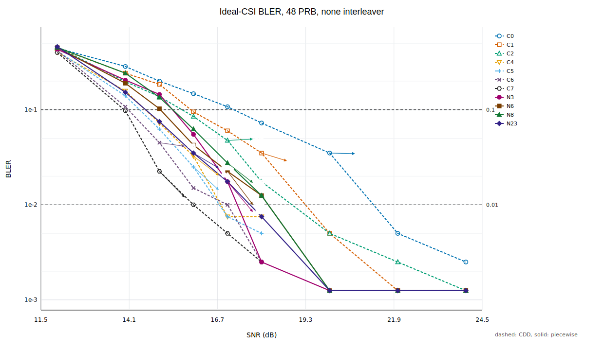

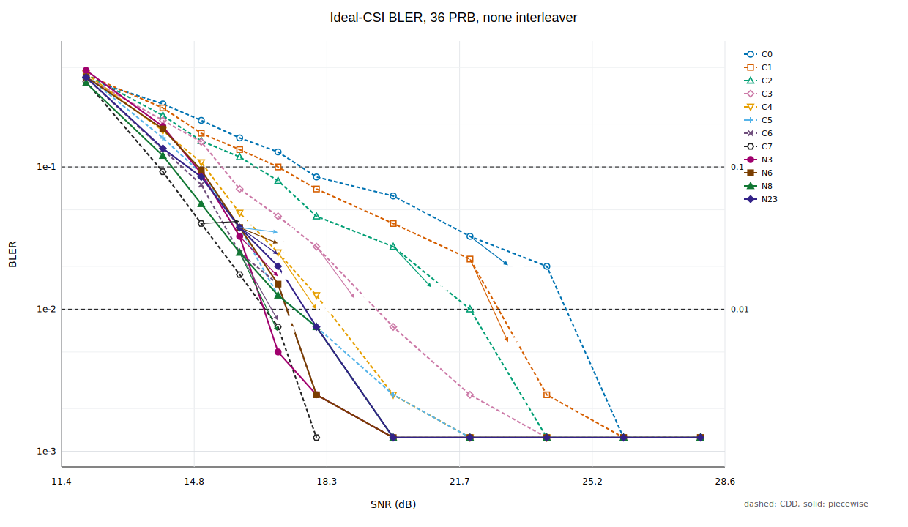

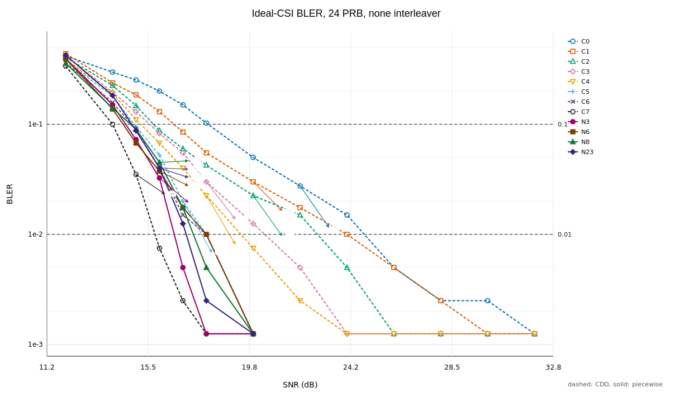

| Occupied active BW | ID / CDD ref | gain@10% | gain@1% |
|---|---|---:|---:|
| 17.28 MHz | N3 / C0 | +1.71 | +4.17 |
| 17.28 MHz | N6 / C0 | +2.17 | +3.27 |
| 17.28 MHz | N8 / C1 | +0.46 | +1.27 |
| 17.28 MHz | N23 / C2 | +1.04 | +1.45 |
| 12.96 MHz | N3 / C5 | -0.05 | +0.68 |
| 12.96 MHz | N6 / C6 | -0.38 | +0.00 |
| 12.96 MHz | N8 / C3 | +1.32 | +2.25 |
| 12.96 MHz | N23 / C4 | +0.43 | +0.70 |
| 8.64 MHz | N3 / C6 | +0.21 | +1.18 |
| 8.64 MHz | N6 / C6 | +0.32 | +0.00 |
| 8.64 MHz | N8 / C6 | +0.05 | +0.40 |
| 8.64 MHz | N23 / C4 | +0.37 | +2.42 |

大时延 CDD 在 `none` 条件下的绝对 crossing 为：

| Occupied active BW | CDD | SNR@10% | SNR@1% |
|---|---|---:|---:|
| 17.28 MHz | C4，step=5 | 14.68 | 16.90 |
| 17.28 MHz | C5，step=6 | 14.52 | 16.86 |
| 17.28 MHz | C6，step=7 | 14.12 | 17.00 |
| 17.28 MHz | C7，step=64 | 13.98 | 16.00 |
| 12.96 MHz | C4，step=5 | 15.13 | 18.50 |
| 12.96 MHz | C5，step=6 | 14.86 | 17.50 |
| 12.96 MHz | C6，step=7 | 14.57 | 17.40 |
| 12.96 MHz | C7，step=64 | 13.95 | 16.75 |
| 8.64 MHz | C4，step=5 | 15.24 | 19.67 |
| 8.64 MHz | C5，step=6 | 14.94 | 18.00 |
| 8.64 MHz | C6，step=7 | 14.85 | 18.00 |
| 8.64 MHz | C7，step=64 | 14.00 | 15.91 |

因此，不加外部 bit interleaver 时，48 PRB 下四个 N 点相对 CDD 的 ideal-CSI 增益仍然存在；36 PRB 下 N8/N23 保持增益，N3 只在 1% 尾部略有增益，N6 基本没有增益；24 PRB 下 N3/N8/N23 的 1% 增益仍为 1.18/0.40/2.42 dB，N6 打平。原因不是交织无关紧要，而是当前自然 resource mapping 已让每个 5712-bit CB 跨越整个 active band。Full interleaver 通常改善 N 点的绝对 crossing SNR，但它也会改善 CDD，因此“相对 CDD 的 gain”不一定比 `none` 更大。

### 5.6 Algorithm 1 matched RMMSE NMSE

本图不是只在单一 SNR 下做估计，而是在横轴的 `0/4/8/12/16/20/24 dB` 七个名义 SNR 点分别运行 300 trials。归一化 PDP 与 $1/\sqrt{8}$ 预编码使平均等效信道功率满足 $\mathbb E|g[k]|^2=1$；横轴 SNR 定义为单个 DMRS RE 在合并前的

$$
\mathrm{SNR}_{\mathrm{dB}}
=10\log_{10}\frac{1}{\sigma_w^2},
\qquad
\sigma_w^2=10^{-\mathrm{SNR}_{\mathrm{dB}}/10}.
$$

两个 DMRS symbol `[2,7]` 承载相同 pilot 并先做平均，所以送入 Algorithm 1 的 LS 观测为

$$
g_P^{\mathrm{LS}}=g_P+\bar w,
\qquad
\mathbb E|\bar w|^2
=\sigma_{\mathrm{LS}}^2
=\frac{\sigma_w^2}{N_{\mathrm{DMRS}}}
=\frac{10^{-\mathrm{SNR}_{\mathrm{dB}}/10}}{2}.
$$

因此横轴 20 dB 时，单个 DMRS RE 的噪声方差为 0.01，平均后的 LS 噪声方差为 0.005，对应 23.01 dB 的合并后 pilot-observation SNR。每个方案、每个横轴 SNR 都使用该方案解析协方差和对应 $\sigma_{\mathrm{LS}}^2$ 重新构造 matched full-covariance RMMSE 滤波器。


纵轴为对数坐标下的 NMSE，数值本身不是 dB。下表给出 20 dB 点；`NMSE penalty` 定义为

$$
L_{\mathrm{NMSE}}
=10\log_{10}\frac{\mathrm{NMSE}_{N}}
{\mathrm{NMSE}_{\mathrm{CDD}}}.
$$

| Occupied active BW | ID / CDD ref | N NMSE @20 dB | CDD NMSE @20 dB | NMSE penalty |
|---|---|---:|---:|---:|
| 17.28 MHz | N3 / C0 | 3.985e-03 | 2.203e-03 | +2.57 dB |
| 17.28 MHz | N6 / C0 | 3.907e-03 | 2.203e-03 | +2.49 dB |
| 17.28 MHz | N8 / C1 | 4.179e-03 | 1.973e-03 | +3.26 dB |
| 17.28 MHz | N23 / C2 | 3.704e-03 | 1.946e-03 | +2.79 dB |
| 12.96 MHz | N3 / C5 | 4.828e-03 | 3.100e-03 | +1.92 dB |
| 12.96 MHz | N6 / C6 | 5.017e-03 | 3.303e-03 | +1.82 dB |
| 12.96 MHz | N8 / C3 | 4.893e-03 | 2.676e-03 | +2.62 dB |
| 12.96 MHz | N23 / C4 | 4.350e-03 | 2.870e-03 | +1.81 dB |
| 8.64 MHz | N3 / C6 | 7.139e-03 | 4.280e-03 | +2.22 dB |
| 8.64 MHz | N6 / C6 | 6.627e-03 | 4.280e-03 | +1.90 dB |
| 8.64 MHz | N8 / C6 | 2.726e-02 | 4.280e-03 | +8.04 dB |
| 8.64 MHz | N23 / C4 | 6.148e-03 | 3.516e-03 | +2.43 dB |

大时延 CDD 的 20 dB NMSE 为。为了与 N 系列直接比较，新增相对同一 occupied active bandwidth 下“NMSE 最低 N 点”的 penalty：

$$
L_{\mathrm{CDD\ vs\ minN}}
=10\log_{10}
\frac{\mathrm{NMSE}_{\mathrm{CDD}}}
{\min_{i\in\{N3,N6,N8,N23\}}\mathrm{NMSE}_{i}}.
$$

三个带宽下 NMSE 最低的 N 点均为 N23，其 20 dB NMSE 分别为 `3.704e-03/4.350e-03/6.148e-03`。penalty 为正表示 CDD 比最低-N 更难估计；为负表示 CDD 的 NMSE 反而更低。

| Occupied active BW | CDD | BW0.5 | NMSE @20 dB | vs min-N penalty | $\operatorname{cond}[R_{PP}+(\sigma_{\mathrm{LS}}^2+\epsilon)I]$ |
|---|---|---:|---:|---:|---:|
| 17.28 MHz | C4，step=5 | 63 SC | 2.279e-03 | -2.11 dB | 854.3 |
| 17.28 MHz | C5，step=6 | 52 SC | 2.389e-03 | -1.90 dB | 712.1 |
| 17.28 MHz | C6，step=7 | 45 SC | 2.582e-03 | -1.57 dB | 610.7 |
| 17.28 MHz | C7，step=64 | 5 SC | 4.422e-03 | +0.77 dB | 548.8 |
| 12.96 MHz | C4，step=5 | 63 SC | 2.870e-03 | -1.81 dB | 854.3 |
| 12.96 MHz | C5，step=6 | 52 SC | 3.100e-03 | -1.47 dB | 712.1 |
| 12.96 MHz | C6，step=7 | 45 SC | 3.303e-03 | -1.20 dB | 610.5 |
| 12.96 MHz | C7，step=64 | 5 SC | 6.178e-03 | +1.52 dB | 548.8 |
| 8.64 MHz | C4，step=5 | 63 SC | 3.516e-03 | -2.43 dB | 853.3 |
| 8.64 MHz | C5，step=6 | 52 SC | 3.973e-03 | -1.90 dB | 712.0 |
| 8.64 MHz | C6，step=7 | 45 SC | 4.280e-03 | -1.57 dB | 610.5 |
| 8.64 MHz | C7，step=64 | 5 SC | 8.034e-03 | +1.16 dB | 112.1 |

其中 condition number 数值来自正式 CSV 的 loaded pilot covariance。C7 的 NMSE 在 48/36 PRB 下高于所有 N 点；24 PRB 下则比 N3/N6/N23 高 0.51/0.84/1.16 dB，但比 N8 低 5.31 dB。因此“极大 CDD 取得更强 ideal-CSI 分集，同时付出更高 CE 代价”的趋势仍成立，但 24 PRB 的 N8 出现了更严重的估计问题。

但 C4/C5/C6 仍比 N 点的 NMSE 低，尽管其 `BW0.5` 通常更小。这再次说明平均 `BW0.5` 不是 Algorithm 1 的充分统计量。RMMSE 由完整的 $R_{TP}$、$R_{PP}$、pilot comb 的采样位置、非平稳协方差结构和 loaded condition number 共同决定；表中 condition number 也没有与 NMSE 单调对应。

24 PRB 的 N8 曲线在高 SNR 出现明显平台：12/16/20/24 dB 的 NMSE 分别为 `4.80e-2/3.41e-2/2.73e-2/2.31e-2`。这里使用的是该方案自身解析协方差构造的 matched RMMSE，因此不是把错误的 CDD covariance 套到 N8 上。更合理的解释是，24 PRB 下 segment 长度缩短到 36 SC，而 pilot comb 仍为 24 SC；pilot 子采样对 N8 的非平稳协方差可观测性较差。即使噪声趋于零，未观测子载波仍可能保留条件协方差

$$
R_{TT}-R_{TP}R_{PP}^{\dagger}R_{PT},
$$

从而形成高 SNR 插值残差。要判断它是否是真正的渐近误差地板，还需增加更高 SNR 或改变 pilot spacing；当前数据至少已经确认 24 dB 前下降速度显著变慢。

四个 N 点在 ideal CSI 下能取得不同程度的分集增益，但在 matched RMMSE 下，它们的 NMSE 都比各带宽下重新匹配的参考 CDD 高；24 PRB 的 N8 尤其突出。这与 4.1 的 `BW0.5` 不矛盾：`BW0.5` 是沿协方差对角线平均后的单一幅度阈值；RMMSE 还取决于非平稳的完整 $R_{TP}$、pilot covariance $R_{PP}$、pilot 位置及其条件数。新设计通过 segment 间切换局部 slope 取得频域分集，同时可能使 sparse-pilot 插值更困难。

### 5.7 Algorithm 1 estimated-CSI BLER

为了直接回答“NMSE 代价是否会抵消 ideal-CSI 分集收益”，进一步对 `C4/C5/C6/C7/N3/N6/N8/N23` 运行实际信道估计下的 BLER。配置与前文一致：TDL delay spread 5 ns、MCS8、DMRS symbols `[2,7]`、frequency spacing 24 SC、full coded-bit interleaver、LDPC 8 iterations；每个 SNR 使用 400 trials。每个方案都使用由自身解析等效协方差构造的 Algorithm 1 matched full-covariance RMMSE，不存在把 CDD covariance 错配给 N 系列的情况。

数据检测使用现有 Algorithm 1 链路口径：以 $\hat g$ 做单流 MRC/equalization，demapper 的 `no_eff` 使用 AWGN 方差，没有把条件信道估计误差额外加入 LLR 方差。因此以下结果同时包含插值残差和 residual-CE 未显式进入 LLR variance 所带来的影响。

48/36 PRB 在 20 dB 时八条曲线均已低于 1%，所以停止后续冗余点；24 PRB 跑到 36 dB，以确认 N8 的高 SNR floor。完整输出位于：

```text
outputs/v_design_estimated_bler_3bw/v_design_estimated_bler_20260620
```

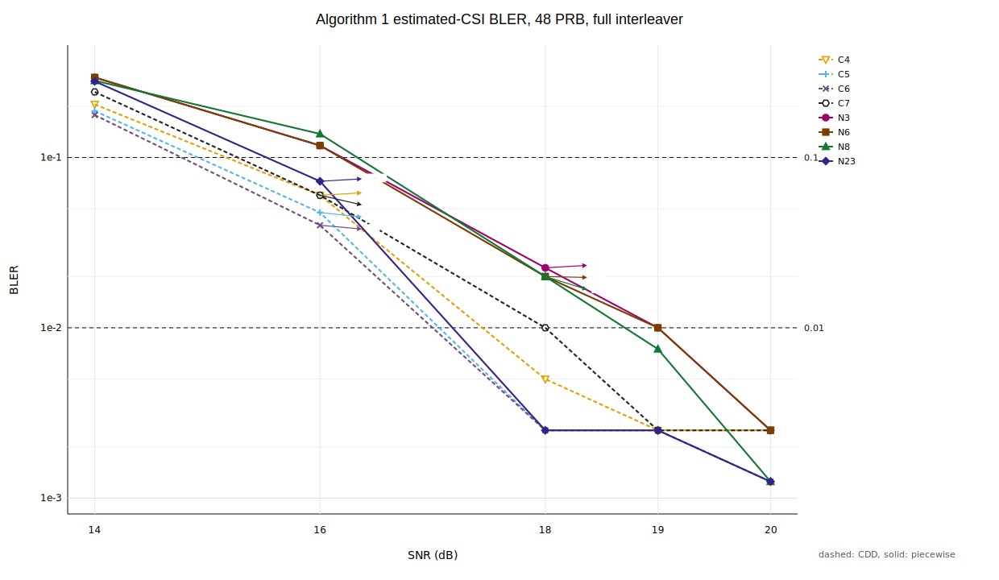

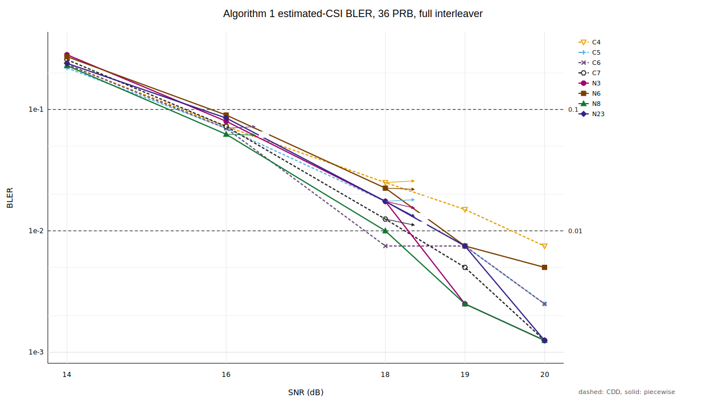

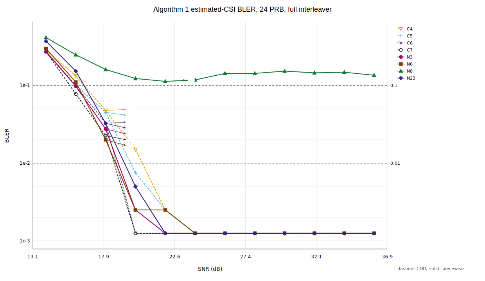

下表直接相对每个带宽、每个 BLER target 下 crossing 最低的 CDD 计算 gain；正值表示 N 更好，负值表示最佳 CDD 更好。crossing 仍由相邻采样 SNR 点线性插值，400 trials 的 BLER 分辨率为 0.0025。

| PRB | N 点 | 最佳 CDD @10% | gain@10% | 最佳 CDD @1% | gain@1% | 最低观测 BLER |
|---:|---|---|---:|---|---:|---:|
| 48 | N3 | C6 | -1.24 dB | C6 | -1.40 dB | 0.0025 |
| 48 | N6 | C6 | -1.23 dB | C6 | -1.40 dB | 0.0025 |
| 48 | N8 | C6 | -1.51 dB | C6 | -1.20 dB | 0.0000 |
| 48 | N23 | C6 | -0.61 dB | C6 | -0.19 dB | 0.0000 |
| 36 | N3 | C5 | -0.20 dB | C6 | -0.58 dB | 0.0000 |
| 36 | N6 | C5 | -0.29 dB | C6 | -0.91 dB | 0.0050 |
| 36 | N8 | C5 | +0.05 dB | C6 | -0.08 dB | 0.0000 |
| 36 | N23 | C5 | -0.21 dB | C6 | -0.83 dB | 0.0000 |
| 24 | N3 | C7 | -0.20 dB | C7 | -0.29 dB | 0.0000 |
| 24 | N6 | C7 | -0.45 dB | C7 | -0.03 dB | 0.0000 |
| 24 | N8 | C7 | n/a | C7 | n/a | 0.1125 |
| 24 | N23 | C7 | -1.11 dB | C7 | -0.53 dB | 0.0000 |

因此，在 1% BLER 处没有 N 点超过最佳 CDD。最接近的是 24 PRB 的 N6，相对 C7 仅差约 0.03 dB；36 PRB 的 N8 在 10% 处有 `+0.05 dB` 的表观增益，但在 1% 处转为 `-0.08 dB`。这两个差值都小于当前 SNR 网格和 400-trial Monte Carlo 精度所能支持的可靠分辨率，应视为打平而不是 N 系列增益。

24 PRB 的 N8 没有 10% 或 1% crossing。其 BLER 从 20 到 36 dB 依次为 `0.1225/0.1125/0.1175/0.1425/0.1425/0.1525/0.1450/0.1475/0.1350`，形成约 11% 至 15% 的平台。对应 CE NMSE 仍从 `2.65e-2` 缓慢降到 `1.29e-2`，说明平均 NMSE 的下降没有转化为可解码 BLER；频率局部残差和未计入 demapper `no_eff` 的估计不确定性会使 LDPC LLR 持续失配。

### 5.8 本节结论

1. `N3/N6/N8/N23` 的矩阵分集优势已在 ideal CSI BLER 中得到验证；48 PRB、充分交织时，1% BLER 增益为 1.00–3.00 dB。
2. Active bandwidth 缩小到 12.96/8.64 MHz 后，N 点相对公平 CDD 的增益逐渐集中到 1% BLER 尾部；在 24 PRB、充分交织时，N3/N8/N23 的 1% 增益为 1.10/0.33/2.25 dB，N6 打平。48-PRB Pareto 优势不能直接外推到更窄带宽。
3. 不加外部 coded-bit interleaver 时，24 PRB 的 N3/N8/N23 仍分别保留 1.18/0.40/2.42 dB 的 1% 增益，因为当前顺序 resource mapping 已让每个 CB 覆盖整个频带；该结果不能推广到“每个 CB 被限制在窄子带”的映射。
4. 加入大时延 CDD 后，C7 `step=64` 的 ideal-CSI BLER 低于全部 N 点；其 1% crossing 在 48/36/24 PRB、充分交织时分别为 16.00/16.25/16.20 dB。
5. C7 的 20-dB RMMSE NMSE 在 48/36 PRB 下高于全部 N 点；24 PRB 下高于 N3/N6/N23，但 N8 的 NMSE 更高。中等 C4/C5/C6 的 NMSE 仍低于 N，说明 `product-BW0.5` 二维平面不能替代完整 RMMSE 计算。
6. 相对按 `BW0.5` 匹配的参考 CDD，N 点在 48/36 PRB 下有 1.81 至 3.26 dB 的 20-dB NMSE penalty；24 PRB 下为 1.90 至 8.04 dB，其中 N8 已出现明显高 SNR 插值残差。后续比较 estimated-CSI BLER 时必须联合考虑 ideal-CSI 分集收益和 CE 损失。
7. Algorithm 1 estimated-CSI BLER 最终没有发现可靠的 N 系列增益：三个带宽的 1% crossing 均不优于最佳 CDD。最接近的 24-PRB N6 与 C7 基本打平；24-PRB N8 则出现 11% 至 15% BLER floor。

完整数值见 ideal 输出中的 `ideal_csi_bler.csv`、`ideal_csi_bler_targets.csv`、`large_cdd_comparison.csv`，24 PRB 合并输出中的同名 CSV，以及各 NMSE 输出中的 `mmse_nmse.csv`、`mmse_nmse_relative.csv`。24 PRB 的 ideal/NMSE 联合摘要为 `ideal_nmse_comparison_24prb.csv`；estimated-CSI 联合结果为 `estimated_csi_bler.csv`、`estimated_csi_bler_targets.csv` 和 `n_gain_vs_best_cdd.csv`。

## 6. 选中候选的协方差函数

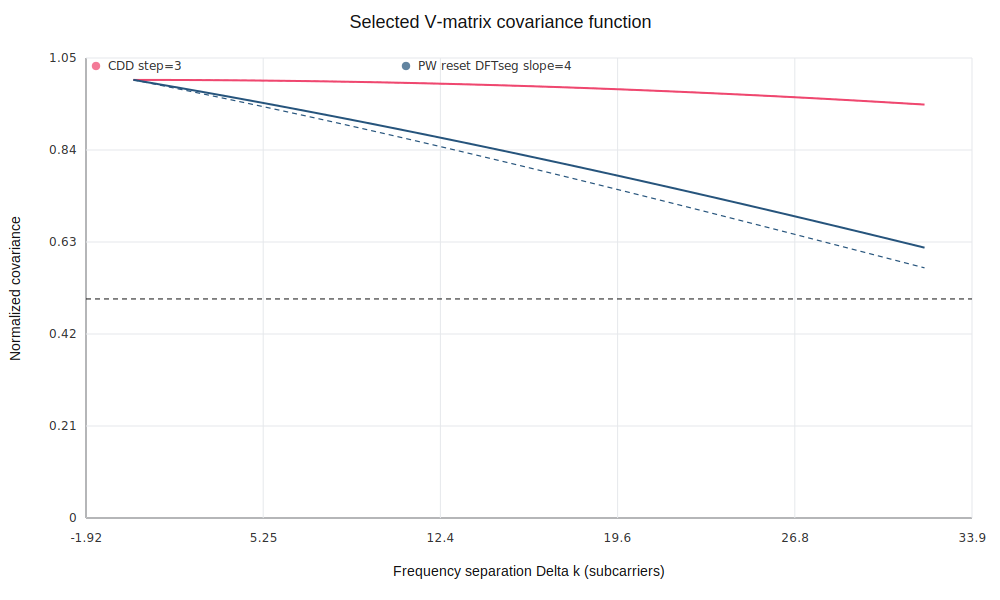

这张图不是由 Monte Carlo 样本估计出来的，而是由上面的解析协方差矩阵 `R_g` 直接计算。图中实线和虚线分别为：

$$
\rho_{\mathrm{abs}}[\Delta]
=\frac{1}{K-\Delta}\sum_k
\left|\tilde R[k,k+\Delta]\right|,
$$

$$
\rho_{\mathrm{complex\_abs}}[\Delta]
=\left|
\frac{1}{K-\Delta}\sum_k
\tilde R[k,k+\Delta]
\right|.
$$

其中

$$
\tilde R[k,k']
=\frac{R_g[k,k']}{\sqrt{R_g[k,k]R_g[k',k']}}.
$$

`rho_abs` 体现平均相关强度；`rho_complex_abs` 会保留同一间隔上的相位抵消效应。因此非平稳分段相位下，这两条曲线可能不同。

选中的分段线性候选与参考 CDD：

| 方案 | BW0.9 (SC) | BW0.5 (SC) | coherence area | covariance effective rank |
|---|---:|---:|---:|---:|
| CDD step=2 | 65 | 155 | 142.47 | 2.78 |
| PW cont random slope=4 #940 | 35 | 105 | 116.61 | 3.09 |

解释：

分段线性候选 `P3` 在频域上没有最平滑的 CDD 前沿点 `C1` 那么宽，`BW0.5` 从 `155 SC` 降到 `105 SC`；但相对相近相干带宽的 `C2`，`P3` 的分集展开明显更好。因此它是“相近 CE proxy 下分集更好”的点，而不是“绝对 CE proxy 最大”的点。

### 6.1 有效 PDP 谱

用户提出的直觉是对的：从时域看，频域相位序列的硬切换会产生类似窗函数截断的效应，其 IDFT 会带来更长旁瓣/长尾。这里补充画出原始物理 PDP、CDD 后以及分段线性相位后的有效 PDP 谱。

需要先区分两种情况。

若等效频域协方差是平稳/Toeplitz 的，即

$$
R_f[k,k'] = r_f[k-k'],
$$

则一维频域相关函数和 PDP 是 Fourier 对：

$$
r_f[\Delta]
= \sum_\tau p[\tau]\,
\exp\left(-j2\pi \frac{\Delta\tau}{N_{\mathrm{FFT}}}\right).
$$

这就是 CDD 在理想全带定义下仍可解释为 shifted PDP 的原因。

但一般分段线性相位会让

$$
R_f[k,k']
$$

依赖绝对子载波位置 `k,k'`，不再只是 `k-k'` 的函数。此时严格对象不是一维 PDP，而是完整 delay-domain covariance：

$$
Q[\tau,\tau']
= \frac{1}{N_{\mathrm{FFT}}}
\sum_{k,k'\in\mathcal A}
R_f[k,k']
\exp\left(j2\pi\frac{k\tau-k'\tau'}{N_{\mathrm{FFT}}}\right),
$$

其中 `A` 是 576 个 active subcarriers。图中画的是其对角线：

$$
p_{\mathrm{eff}}[\tau]
= Q[\tau,\tau].
$$

所以：**平稳时，一维 PDP 足以和一维相关函数互相变换；非平稳时，`p_eff[tau]` 只是完整 `Q[tau,tau']` 的对角线，不能单独恢复完整频域协方差。** 边界相位跳变或段间硬切换会在 `p_eff` 中表现为更长的 delay tail，同时也会增加 delay bin 之间的 off-diagonal correlation。

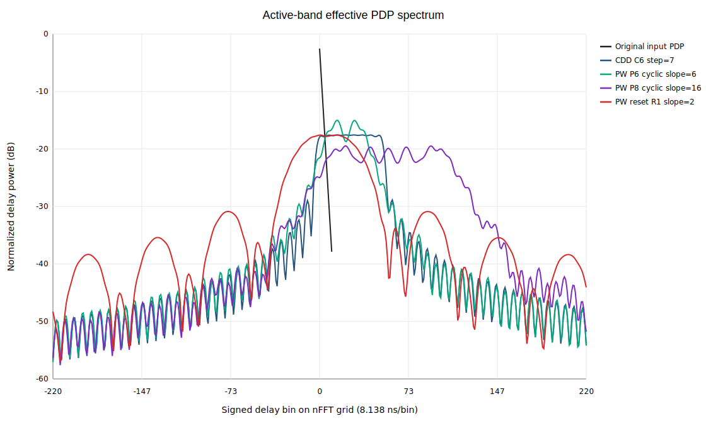

图中 `Original input PDP` 是物理 TDL 输入 PDP；CDD 和分段线性曲线是由 active-band 等效协方差 `R_f` 计算出的 `p_eff[tau]`。`PW reset R1` 是带 segment phase reset 的诊断曲线，用来展示硬跳变带来的长尾；实际重点候选仍是 phase-continuous 的 `P6/P8`。

输出目录：

```text
outputs/v_design_pdp_spectrum/v_design_pdp_spectrum_20260616_215311/
```

关键 summary：

| Curve | peak bin | tail power >=64 bins | tail power >=128 bins | offdiag energy ratio |
|---|---:|---:|---:|---:|
| Original input PDP | 0 | 0.000 | 0.000 | 0.000 |
| CDD C6 step=7 | 28 | 0.070 | 0.062 | 0.869 |
| PW P6 cyclic slope=6 | 29 | 0.072 | 0.063 | 0.876 |
| PW P8 cyclic slope=16 | 21 | 0.493 | 0.064 | 0.931 |
| PW reset R1 slope=2 | 14 | 0.411 | 0.390 | 0.898 |

读数：

1. `CDD C6` 和 `PW P6` 的有效 PDP tail 很接近，这与二者在 10% BLER 附近表现接近相符。
2. `PW P8` 在 64-bin 之后的 tail power 明显更高，说明它通过更强的频域选择性获得更多分集；这也解释了为什么它的 NMSE 不一定更好，但 1% BLER SNR 可以优于 CDD。
3. `PW reset R1` 的长尾更明显，符合“边界相位硬跳变导致长旁瓣”的直觉。但这种 reset 候选不是当前推荐的物理实现，只作为诊断/上界。
4. CDD/PW 的 `offdiag energy ratio` 不能和原始输入 PDP 直接横比，因为前者是 active-band `Q[tau,tau']` 的统计量，包含有限带宽窗口效应；它主要用于提醒：非平稳相位矩阵下，一维 PDP 谱不是完整协方差信息。

## 7. Alg1 RMMSE NMSE

这一节使用第 9 节的完整 TDL 链路仿真结果重画。曲线对应 4.2 表中的所有相位连续 Pareto 前沿点：CDD 前沿 `C1-C7`，以及分段线性相位前沿 `P1-P12`。图中虚线为 CDD，实线为分段线性相位。纵轴为对数坐标下的 NMSE，数值本身没有转成 dB。

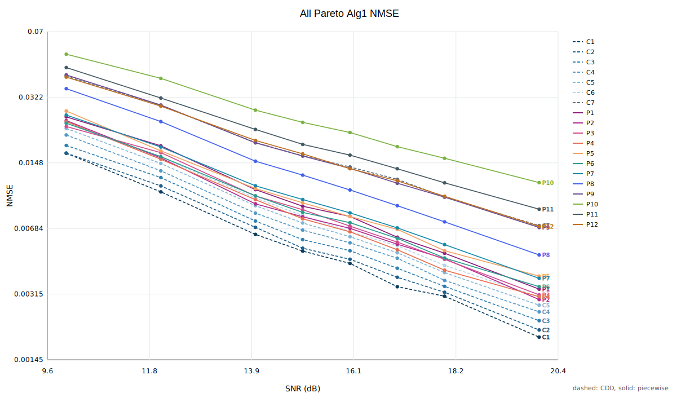

RMMSE 使用的是匹配的完整等效协方差 `R_g`，所以这里不是 covariance mismatch。总体趋势是：更强的相位变化通常会让等效信道更不平滑，NMSE 更高；但 BLER 不完全由 NMSE 决定，还受到频域分集和等效 SINR 分布影响。

这里特别说明 `P1` 和 `C2/C3` 的关系。4.1 散点图里 `P1` 的平均相干带宽 `BW0.5=119 SC`，确实大于 `C2` 的 `104 SC` 和 `C3` 的 `78 SC`。但这个横轴只是把完整协方差压缩成一个平均相关宽度：它先对同一个频域间隔上的相关强度取平均，再看何时低于 0.5。Algorithm 1 的 NMSE 不是由这个单标量决定，而是由完整的 pilot-to-data RMMSE 矩阵决定：

$$
\hat{\mathbf g}_T
=
R_{TP}
\left(R_{PP}+\sigma^2_{\mathrm{LS}}I\right)^{-1}
\mathbf y_P .
$$

也就是说，NMSE 同时取决于 pilot 位置、`R_TP` 的形状、`R_PP` 的条件数、噪声水平，以及相关性是否在频域上平稳。`P1` 是随机分段线性相位，协方差不是 Toeplitz；它的 `BW0.5` 是“平均后”的宽度，不能保证所有 pilot 到 data RE 的插值都更容易。实际数值上，在 10 dB 时 `P1` 的 loaded pilot covariance condition number 约为 241，高于 `C2` 的 143 和 `C3` 的 108；因此虽然 `P1` 在散点图横轴更靠右，Algorithm 1 NMSE 仍高于 `C2/C3`。

## 8. BLER 对比

这一节同样使用完整 Pareto 前沿点：CDD `C1-C7` 和分段线性相位 `P1-P12`。纵轴是对数坐标下的 BLER 概率值，不是 dB 值。也就是说，图上的 `0.1` 就是 10% BLER，`0.01` 就是 1% BLER。若某个点在 300 trials 中没有错误，绘图时只把它放在显示下限处，避免 `log(0)`；CSV 和 SNR crossing 表仍保留原始错误计数。

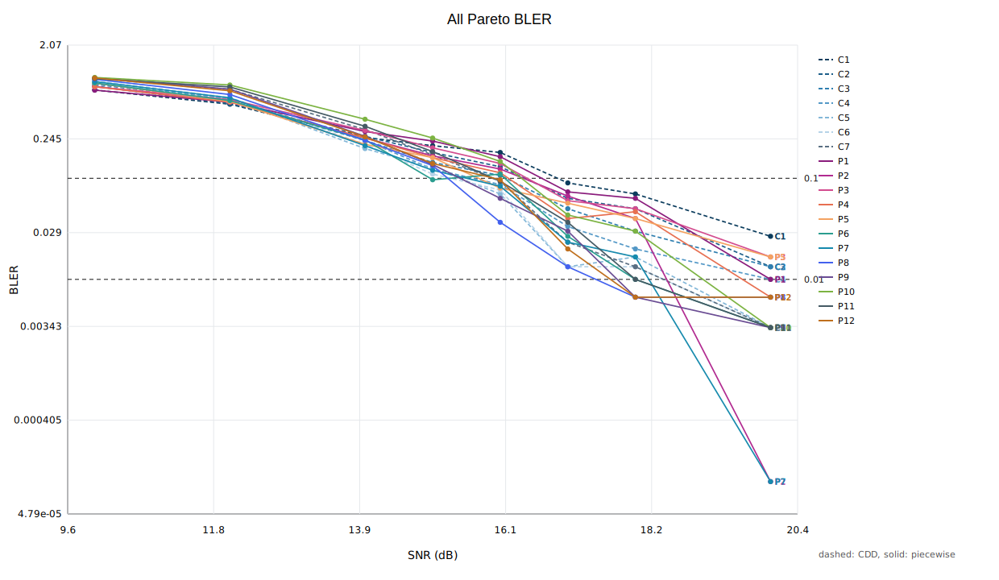

从这张图可以直接看到，10% BLER 附近最好的分段线性点是 `P6`，相对最佳 CDD `C6` 有约 `+0.32 dB` SNR gain；1% BLER 附近最好的分段线性点是 `P8`，相对最佳 CDD `C6` 有约 `+1.17 dB` SNR gain。完整 crossing 和 gain 表见第 8.2 / 8.3 节。

### 8.1 MCS9 BLER 补充实验

为检查上述结论对 MCS 的敏感性，补充运行 MCS9。除 MCS 和 trials 外，其余条件保持不变：同样使用 TDL delay spread 10 ns、8TX/1RX、48 RB、DMRS spacing 24、Algorithm 1 full-covariance RMMSE、同一组 SNR 点 `10,12,14,15,16,17,18,20 dB`。每个 SNR 点使用 400 trials，因此 BLER 分辨率为 `1/400=0.0025`。对比对象仍是 CDD `C1-C7` 和分段线性相位 `P1-P12`。

输出目录：

```text
outputs/v_design_pareto_link_curves_mcs9/v_design_pareto_link_20260617_234550/
```

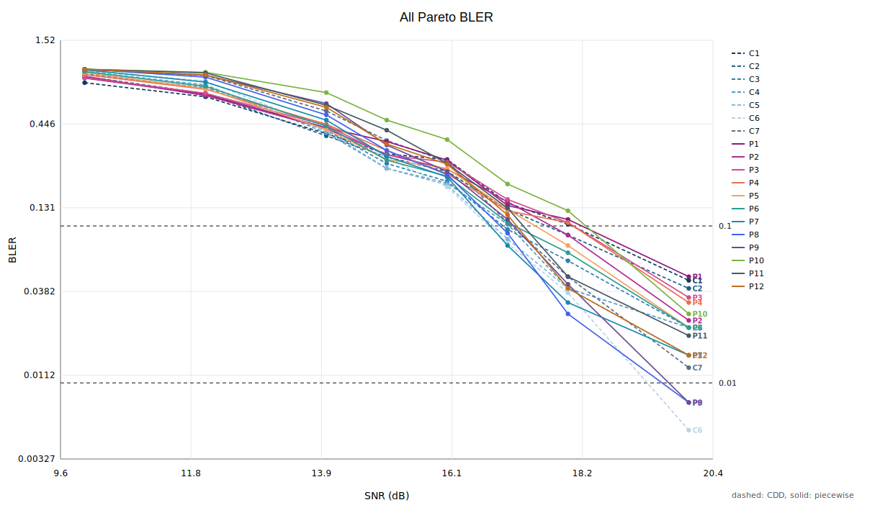

MCS9 下的 crossing 结果如下：

| ID | Type | SNR@10% | SNR@1% | min BLER |
|---|---|---:|---:|---:|
| C1 | CDD | 18.09 | n/a | 0.045 |
| C2 | CDD | 17.69 | n/a | 0.040 |
| C3 | CDD | 16.95 | n/a | 0.022 |
| C4 | CDD | 17.04 | n/a | 0.022 |
| C5 | CDD | 16.82 | n/a | 0.015 |
| C6 | CDD | 16.77 | 19.69 | 0.005 |
| C7 | CDD | 17.09 | n/a | 0.013 |
| P1 | Piecewise | 18.32 | n/a | 0.048 |
| P2 | Piecewise | 17.77 | n/a | 0.025 |
| P3 | Piecewise | 18.14 | n/a | 0.035 |
| P4 | Piecewise | 18.14 | n/a | 0.033 |
| P5 | Piecewise | 17.52 | n/a | 0.022 |
| P6 | Piecewise | 17.13 | n/a | 0.022 |
| P7 | Piecewise | 16.81 | n/a | 0.015 |
| P8 | Piecewise | 16.92 | 19.75 | 0.007 |
| P9 | Piecewise | 17.15 | 19.86 | 0.007 |
| P10 | Piecewise | 18.51 | n/a | 0.028 |
| P11 | Piecewise | 17.36 | n/a | 0.020 |
| P12 | Piecewise | 17.23 | n/a | 0.015 |

这里仍以最佳 CDD 作为 baseline。MCS9 下最佳 CDD 也是 `C6 = CDD step=7`，其 `SNR@10%=16.77 dB`，`SNR@1%=19.69 dB`。分段线性相位相对最佳 CDD 的 SNR gain 为：

| ID | SNR@10% | gain@10% | SNR@1% | gain@1% |
|---|---:|---:|---:|---:|
| P1 | 18.32 | -1.55 | n/a | n/a |
| P2 | 17.77 | -1.00 | n/a | n/a |
| P3 | 18.14 | -1.37 | n/a | n/a |
| P4 | 18.14 | -1.36 | n/a | n/a |
| P5 | 17.52 | -0.75 | n/a | n/a |
| P6 | 17.13 | -0.36 | n/a | n/a |
| P7 | 16.81 | -0.03 | n/a | n/a |
| P8 | 16.92 | -0.14 | 19.75 | -0.06 |
| P9 | 17.15 | -0.37 | 19.86 | -0.16 |
| P10 | 18.51 | -1.74 | n/a | n/a |
| P11 | 17.36 | -0.59 | n/a | n/a |
| P12 | 17.23 | -0.45 | n/a | n/a |

读数：MCS9 下没有观察到分段线性相位超过最佳 CDD。10% BLER 附近最接近的是 `P7`，只比 `C6` 差约 `0.03 dB`，可以视作基本打平；1% BLER 附近只有 `P8/P9` 在当前 SNR 网格内形成 crossing，但也分别比 `C6` 差约 `0.06 dB` 和 `0.16 dB`。因此，分段线性相位在 MCS8 下出现的 BLER gain 并没有直接泛化到 MCS9；MCS、码率和 waterfall 区间会影响“分集收益 vs CE 损失”的平衡。

## 9. 全帕累托前沿的 TDL 链路曲线

为回应“每一个帕累托前沿上的点都比较 NMSE / BLER 曲线”的要求，补充运行了 CDD 前沿 `C1-C7` 和 phase-continuous 分段线性相位前沿 `P1-P12`。带相位跳变的 reset diagnostic 点 `R1-R4` 仍只作为矩阵上界诊断，不纳入链路仿真。

本节使用参考实验记录中的 TDL / MCS / Algorithm 1 风格参数：

| 参数 | 取值 |
|---|---|
| 信道 | static exponential TDL |
| Delay spread | 10 ns |
| PDSCH allocation | 48 RB x 10 OFDM symbols，576 active subcarriers |
| Tx/Rx | 8TX / 1RX |
| DMRS symbols | `[2, 7]` |
| DMRS spacing | 24 subcarriers |
| MCS | `nr_256qam` index 8，16QAM，code rate 553/1024 |
| LDPC iterations | 8 |
| Algorithm 1 | Direct equivalent-channel full-covariance RMMSE，目标带宽 576 SC |
| SNR used in final table | 10, 12, 14, 15, 16, 17, 18, 20 dB |
| Trials | 300 TB / SNR / Pareto point |

BLER 分辨率为 `1/300=0.0033`。同一 SNR / trial 下，所有 CDD 和分段线性前沿点共享相同 TDL realization、payload、pilot noise 和 data noise，用 common random numbers 降低不同 `V` 矩阵之间的比较方差。

输出目录：

```text
outputs/v_design_pareto_link_curves/v_design_pareto_link_20260616_merged_10to20/
```

关键输出文件：

```text
pareto_link_curves.csv
pareto_link_targets.csv
pareto_link_piecewise_gain_vs_best_cdd.csv
completed_run_summary.json
```

合并后处理命令：

```bash
/Users/zhangwei/Downloads/lls_platform_sc_mimo/.venv-sionna1/bin/python \
  tools/run_v_design_pareto_link_curves.py \
  --merge-csvs outputs/v_design_pareto_link_curves/v_design_pareto_link_20260616_065635/pareto_link_curves.csv,outputs/v_design_pareto_link_curves_tail/v_design_pareto_link_20260616_082144/pareto_link_curves.csv \
  --merge-output-dir outputs/v_design_pareto_link_curves/v_design_pareto_link_20260616_merged_10to20 \
  --fig-dir docs/figures
```

### 9.1 NMSE 曲线

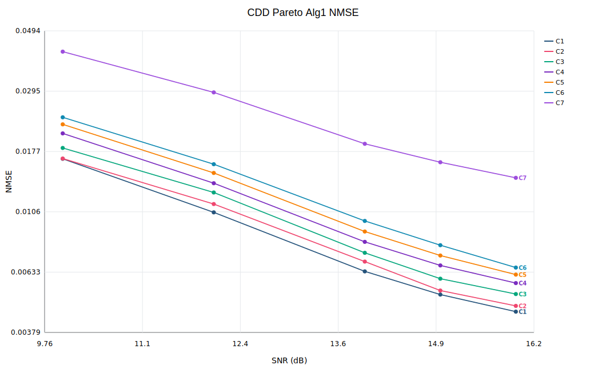

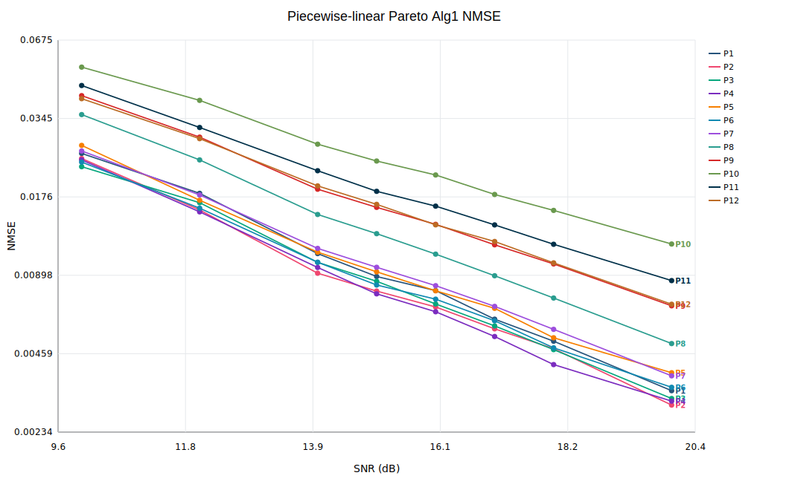

NMSE 维度仍然体现了 CE 难度：更平滑的 CDD 前沿点通常有更低的 Algorithm 1 NMSE；分段线性相位中，斜率更大、`BW0.5` 更小的点 NMSE 更高。18 dB / 20 dB 处的代表性数值如下：

| ID | Implementation | BW0.5 | log10 product | NMSE @18 dB | BLER @18 dB | BLER @20 dB |
|---|---|---:|---:|---:|---:|---:|
| C1 | CDD step=2 | 155 | -19.615 | 3.072e-03 | 0.070 | 0.027 |
| C6 | CDD step=7 | 45 | -0.003 | 4.423e-03 | 0.013 | 0.003 |
| C7 | CDD step=64 | 5 | 0.000 | 9.913e-03 | 0.013 | 0.003 |
| P3 | PW cont random slope=4 #940 | 105 | -3.889 | 4.748e-03 | 0.050 | 0.017 |
| P6 | PW cont cyclic slope=6 | 58 | -0.795 | 4.822e-03 | 0.010 | 0.003 |
| P8 | PW cont cyclic slope=16 | 21 | -0.042 | 7.392e-03 | 0.007 | 0.007 |
| P9 | PW cont cyclic slope=24 | 14 | -0.010 | 9.902e-03 | 0.007 | 0.003 |

### 9.2 BLER 曲线

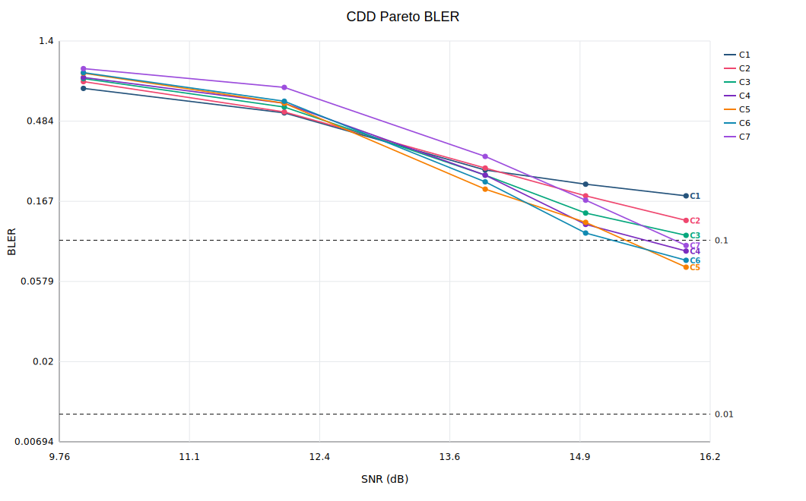

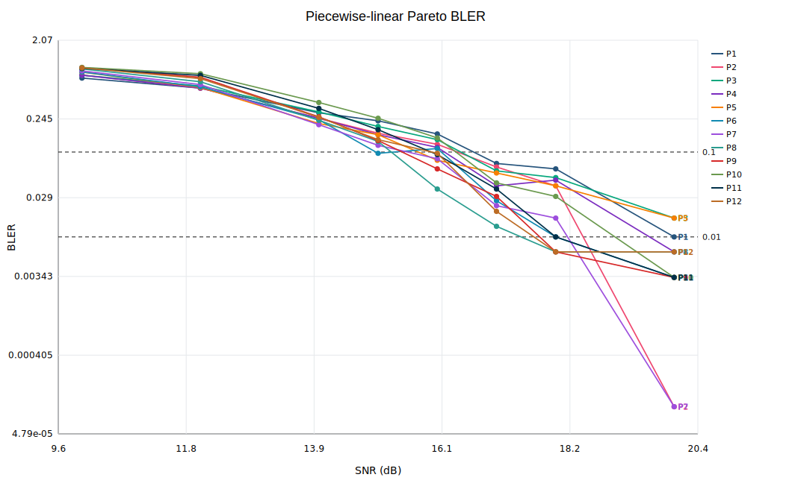

300 trials/SNR 后，多数点已经穿过 10% BLER，部分点也穿过 1% BLER。`SNR@BLER=x` 使用相邻 SNR 点上的 BLER 线性插值得到；表中 `n/a` 表示在 10-20 dB 的完整 SNR 网格内未形成 crossing。

| ID | Type | V implementation | BW0.5 | log10 product | SNR@BLER=0.1 | SNR@BLER=0.01 | min BLER |
|---|---|---|---:|---:|---:|---:|---:|
| C1 | CDD | CDD step=2 | 155 | -19.615 | 16.89 | n/a | 0.027 |
| C2 | CDD | CDD step=3 | 104 | -10.894 | 16.45 | n/a | 0.013 |
| C3 | CDD | CDD step=4 | 78 | -5.524 | 16.12 | n/a | 0.013 |
| C4 | CDD | CDD step=5 | 63 | -2.244 | 15.64 | 20.00 | 0.010 |
| C5 | CDD | CDD step=6 | 52 | -0.514 | 15.47 | 19.00 | 0.003 |
| C6 | CDD | CDD step=7 | 45 | -0.003 | 15.30 | 18.67 | 0.003 |
| C7 | CDD | CDD step=64 | 5 | 0.000 | 15.91 | 18.67 | 0.003 |
| P1 | Piecewise | PW cont random slope=4 #938 | 119 | -4.496 | 16.70 | 20.00 | 0.010 |
| P2 | Piecewise | PW cont random slope=4 #939 | 112 | -4.054 | 16.41 | 19.50 | 0.000 |
| P3 | Piecewise | PW cont random slope=4 #940 | 105 | -3.889 | 16.50 | n/a | 0.017 |
| P4 | Piecewise | PW cont cyclic slope=4 | 92 | -2.587 | 16.18 | 19.83 | 0.007 |
| P5 | Piecewise | PW cont random slope=6 #201 | 64 | -2.301 | 15.75 | n/a | 0.017 |
| P6 | Piecewise | PW cont cyclic slope=6 | 58 | -0.795 | 14.98 | 18.00 | 0.003 |
| P7 | Piecewise | PW cont cyclic slope=8 | 42 | -0.106 | 15.55 | 18.80 | 0.000 |
| P8 | Piecewise | PW cont cyclic slope=16 | 21 | -0.042 | 15.34 | 17.50 | 0.007 |
| P9 | Piecewise | PW cont cyclic slope=24 | 14 | -0.010 | 15.50 | 17.86 | 0.003 |
| P10 | Piecewise | PW cont cyclic slope=32 | 10 | -0.009 | 16.45 | 19.50 | 0.003 |
| P11 | Piecewise | PW cont cyclic slope=48 | 7 | -0.004 | 15.93 | 18.00 | 0.003 |
| P12 | Piecewise | PW cont cyclic slope=64 | 5 | -0.003 | 15.92 | 17.75 | 0.007 |

### 9.3 分段线性相位的 BLER SNR 增益

这里把 CDD 前沿中达到目标 BLER 所需 SNR 最低的点作为 baseline。正增益定义为分段线性相位所需 SNR 更低：

$$
G_{\mathrm{PW-vs-CDD}}(p)
= \mathrm{SNR}_{\mathrm{best\,CDD}}(\mathrm{BLER}=p)
- \mathrm{SNR}_{\mathrm{PW}}(\mathrm{BLER}=p).
$$

在本轮数据中，10% 和 1% BLER 的最佳 CDD baseline 都是 `C6 = CDD step=7`，其 `SNR@10%=15.30 dB`，`SNR@1%=18.67 dB`。分段线性相位的增益如下：

| ID | V implementation | SNR@10% | gain@10% vs best CDD | SNR@1% | gain@1% vs best CDD |
|---|---|---:|---:|---:|---:|
| P1 | PW cont random slope=4 #938 | 16.70 | -1.40 | 20.00 | -1.33 |
| P2 | PW cont random slope=4 #939 | 16.41 | -1.11 | 19.50 | -0.83 |
| P3 | PW cont random slope=4 #940 | 16.50 | -1.20 | n/a | n/a |
| P4 | PW cont cyclic slope=4 | 16.18 | -0.88 | 19.83 | -1.17 |
| P5 | PW cont random slope=6 #201 | 15.75 | -0.45 | n/a | n/a |
| P6 | PW cont cyclic slope=6 | 14.98 | 0.32 | 18.00 | 0.67 |
| P7 | PW cont cyclic slope=8 | 15.55 | -0.25 | 18.80 | -0.13 |
| P8 | PW cont cyclic slope=16 | 15.34 | -0.04 | 17.50 | 1.17 |
| P9 | PW cont cyclic slope=24 | 15.50 | -0.20 | 17.86 | 0.81 |
| P10 | PW cont cyclic slope=32 | 16.45 | -1.15 | 19.50 | -0.83 |
| P11 | PW cont cyclic slope=48 | 15.93 | -0.63 | 18.00 | 0.67 |
| P12 | PW cont cyclic slope=64 | 15.92 | -0.62 | 17.75 | 0.92 |

### 9.4 读数

1. **10% BLER 有一个分段线性相位点超过最佳 CDD。** `P6 = PW cont cyclic slope=6` 的 `SNR@10%=14.98 dB`，相对最佳 CDD `C6` 的 `15.30 dB` 有约 `+0.32 dB` gain。
2. **1% BLER 有多个分段线性相位点超过最佳 CDD。** 最好的是 `P8 = PW cont cyclic slope=16`，`SNR@1%=17.50 dB`，相对最佳 CDD `C6` 的 `18.67 dB` 有约 `+1.17 dB` gain；`P12/P9/P6/P11` 也有正增益。
3. **不是所有分段线性相位都赢。** 低斜率随机 `P1-P4` 在 10% 和 1% BLER 上大多差于最佳 CDD；过高斜率的 `P10` 也变差。较好的区域在中等斜率 cyclic pattern 附近。
4. **NMSE 和 BLER 排序不完全一致。** 例如 `P8` 的 18 dB NMSE 比 `C6` 更差，但 1% BLER SNR 反而更低。这说明在当前 MCS8/TDL/8TX1RX 场景下，频域分集和等效信道幅度分布可以部分抵消 CE NMSE 损失。
5. **矩阵-协方差 proxy 仍不是完整链路目标。** `BW0.5` 能描述 CE 友好程度的一个侧面，但最终链路性能还取决于完整 RMMSE 矩阵、pilot aliasing、等效 SINR 分布和 LDPC 码字在频域上的交织收益。

## 10. 结论

本实验对文档猜想的验证结果是：

1. **矩阵-Pareto 层面：支持猜想。** 在 8TX/1RX、576 SC、8 段频域配置下，确实存在 phase-continuous 分段线性相位，使其在相近甚至更高的相干带宽下获得远高于 CDD 的奇异值模方乘积。
2. **信道估计层面：折中明显。** 匹配完整协方差的 Alg1 RMMSE 下，新 `N3/N6/N8/N23` 在 20 dB 的 NMSE 比各带宽下重新匹配的参考 CDD 差约 1.81 到 3.26 dB。
3. **理想 CSI 链路层面：明确存在分集增益。** 48 PRB、充分 coded-bit interleaver 下，新 N 点在 10% BLER 上有 0.36 到 1.55 dB 增益，在 1% BLER 上有 1.00 到 3.00 dB 增益。这把矩阵奇异值指标与不含 CE 误差的真实 LDPC BLER 联系了起来。
4. **相位跳变必须谨慎。** reset DFT segment phase 的确能构造近似满秩/正交 `V`，但边界相位跳变导致非常大的等效 group-delay spread；这种候选应作为理论上界或诊断工具，而不是直接作为物理可实现方案。
5. **斜率集合与布局都重要。** 新扫描说明，`{小幅值 + 一个较大幅值}` 的非等间隔对称 alphabet 可以形成很长的 Pareto 前沿；不是所有分段线性相位都优于 CDD，过弱或过强的展开都可能变差。
6. **MCS 敏感性明显。** 补充的 MCS9 / 400 trials 结果没有复现 MCS8 下的正 SNR gain；最佳分段线性点在 10% BLER 基本打平但略差于最佳 CDD，在 1% BLER 也略差。因此当前结论应表述为“存在 MCS8 场景下的局部链路增益”，而不是所有 MCS 上稳定优于 CDD。
7. **新 N 点的 ideal-CSI 增益不依赖额外随机交织才出现，但依赖带宽。** 去掉外部 coded-bit interleaver 后，48 PRB 的四个 N 点仍有增益；缩小到 36 PRB 并重新匹配公平 CDD 后，只有 N8/N23 稳定保持 10%/1% 增益，N3 只保留尾部增益，N6 基本打平。当前自然 resource mapping 本身已经让每个 CB 覆盖整个频带，不能据此推断窄子带 CB 映射也会有相同结果。

建议下一步对新 `N3/N6/N8/N23` 运行 estimated-CSI BLER，并对 phase-continuous 分段线性相位做目标函数优化，例如直接最大化

$$
\log\det\left(\frac{V^H V}{K}\right)
-\lambda\,\mathrm{CE\_loss}(R_g).
$$

其中 `CE_loss` 可用 RMMSE NMSE、coherence area 或 estimator condition number 定义。
