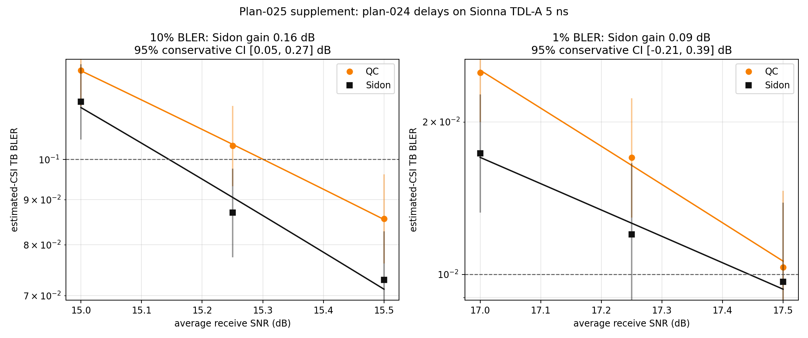
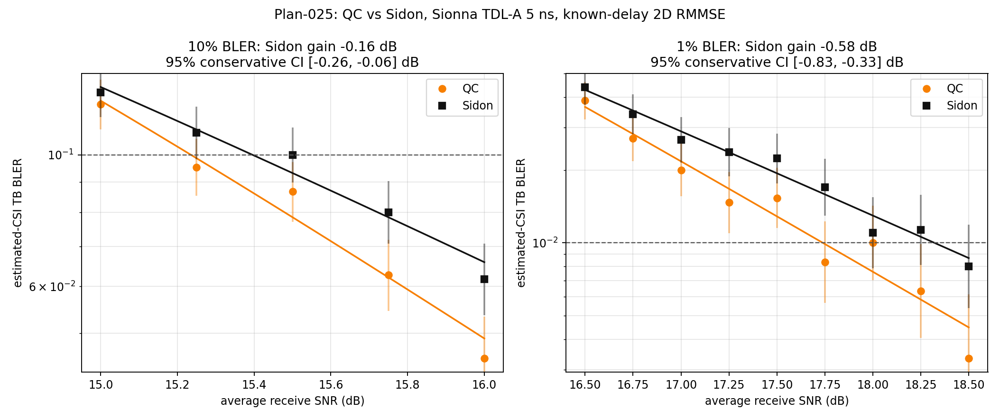

# result-025：5 ns TDL-A 下 Sidon 与 QC 的 known-delay BLER 对比及物理时延匹配补做

> 对应 `research/plan-025.md`。无图版：`research/result-025-text.md`。本文先报告 plan-025 第 5 节的物理时延匹配补做，再保留首次 `/4096` 执行作为历史对照。两次正式范围均只包含 plan-024 E2 的 QC/Sidon 对比，不包含 unknown-delay BLER。

## 1. 补做结论

在保持 plan-024 的 576 点有效带宽 DFT 栅格矩阵、物理 CDD 时延、未归一化幅度、资源分配、等效平均 DMRS、噪声定义、MCS、LDPC 和统计方法不变，只把底层平坦 8 分支信道替换为 Sionna 1.0.2 TDL-A 5 ns 后，Sidon 相对 QC 的 10% BLER 优势得到复现：改善为 `+0.156 dB`，保守 95% 区间 `[+0.045,+0.266] dB`。该点估计达到预定的 `0.15 dB` 主判据，且区间不支持反向排序，因此 H1 通过。

1% BLER 的 Sidon 改善点估计为 `+0.090 dB`，保守 95% 区间 `[-0.210,+0.391] dB`。两候选目标附近累计误块均不少于 30，因此不是低计数先导结果；但区间跨 0，只能判定点估计方向与 plan-024 一致，不能确定 1% 增益。QC 的拟合目标为 `17.535 dB`，比预定精扫上限 `17.50 dB` 高 `0.035 dB`，属于轻微外推。

| 目标 | QC SNR，95% 区间 | Sidon SNR，95% 区间 | Sidon 相对 QC 改善 | 改善的保守 95% 区间 | 判定 |
|---|---:|---:|---:|---:|---|
| 10% BLER | 15.301，[15.218, 15.384] dB | 15.145，[15.073, 15.218] dB | +0.156 dB | [+0.045,+0.266] dB | 保持 plan-024 主结论 |
| 1% BLER | 17.535，[17.349, 17.720] dB | 17.444，[17.208, 17.681] dB | +0.090 dB | [-0.210,+0.391] dB | 点估计方向保持，区间不可判定 |

正改善表示 Sidon 达到同一 BLER 所需 SNR 更低。本补做与首次 `/4096` 执行的符号相反，说明首次反向不能归因于 TDL-A 5 ns 本身；CDD 相位/物理时延定义是必须隔离的实验变量。

## 2. 补做配置回执与变量隔离

| 类别 | 参数 | 实际取值 | 与 plan-024 的关系 |
|---|---|---|---|
| 信道 | 生成器 / profile | Sionna 1.0.2 TDL-A | 唯一主动变化 |
| 信道 | RMS delay spread | 5 ns | 新物理信道条件 |
| 信道 | 速度 / 载频 | 0 km/h / 3.5 GHz | 零多普勒；载频为 Sionna 配置 |
| 信道 | realization 归一化 | 不做 per-realization normalization | 保留自然功率波动 |
| 天线 | Tx / Rx / layer | 8 / 1 / 1 | 相同 |
| 资源 | SCS / FFT / CP | 30 kHz / 4096 / 288 samples | 相同 |
| 资源 | 分配 | 48 PRB，576 active SC，10 symbols | 相同 |
| DMRS | symbols / comb / offset | `[2,7]` / 24 / 0 | 相同 |
| RE | pilot / unique frequency pilot / data | 48 / 24 / 5712 | 坐标相同 |
| 预编码 | 相位 | $V_{m,n}=\exp(-j2\pi m j_n/576)$，$m=0,\ldots,575$ | 与 plan-024 逐元素一致 |
| 预编码 | 幅度 / 相位参考 | 未归一化 $\lvert V\rvert=1$ / 第一个有效子载波 | 相同 |
| 接收机 | DMRS / 估计器 | 两 DMRS 等效平均；known-delay matched 全带频率 LMMSE | 相同公平性等级 |
| 噪声 | data / 平均 LS | $N_0=8/\mathrm{SNR}$ / $N_0/2=4/\mathrm{SNR}$ | 相同 |
| 链路 | 调制 / MCS / 码率 | 16QAM / MCS 8 / 553/1024 | 相同 |
| LDPC | 最大迭代 / LLR clip | 8 / 50 | 相同 |
| LLR | 有效噪声 | 只使用 $N_0$ | 相同 |
| 随机性 | seed / batch | 20260716 / 20 | 与 plan-024 正式扫描相同 |
| 配对 | 共同随机数 | TDL、payload、平均 LS noise、data noise | QC/Sidon 成对 |

本补做只允许并实际发生了两项相互依赖的变化：底层信道改为 TDL-A 5 ns，以及 matched 接收机协方差相应改为 TDL-A 与各候选 CDD 的复合协方差。未发现其他未预定配置变化。

### 2.1 物理时延与分数采样转换

使用

$$
\tau_n=\frac{j_n}{576\Delta f},
\qquad
d_n=\tau_nN_{\rm FFT}\Delta f=j_n\frac{64}{9},
\qquad \Delta f=30\ \mathrm{kHz}.
$$

| 候选 | $j_n$ | $d_n$，FFT samples | $\tau_n$，ns |
|---|---|---|---|
| QC | `[0,9,18,27,36,45,54,63]` | `[0,64,128,192,256,320,384,448]` | `[0,520.833333,1041.666667,1562.5,2083.333333,2604.166667,3125,3645.833333]` |
| Sidon | `[0,1,3,7,12,20,30,65]` | `[0,7.111111,21.333333,49.777778,85.333333,142.222222,213.333333,462.222222]` | `[0,57.870370,173.611111,405.092593,694.444444,1157.407407,1736.111111,3761.574074]` |

QC/Sidon 的相位矩阵与 plan-024 `cdd_V` 的逐元素最大绝对误差均为 `0`；采样延迟和秒单位换算的最大误差也均为 `0`。因此 H3 通过。

## 3. 验证与自动网格

### 3.1 最小验证

| 项目 | 结果 | 判定 |
|---|---|---|
| 相位矩阵、延迟单位、资源坐标 preflight | 所有最大误差为 0；48 pilot RE、24 unique pilots、5712 data RE | 通过 |
| 复合协方差 | Hermitian 误差 0；最小特征值 QC/Sidon 为 `-4.65e-13/-5.03e-13`；对角相对 8 最大误差 `2.66e-15` | 数值容差内通过 |
| pilot 矩阵 | 两者 rank 8；condition number 均约 1；最小奇异值均约 4.898979 | 通过 |
| 自动测试 | `24 passed, 14 warnings, 2 subtests passed`，23.71 s | 通过；warning 为依赖弃用提示 |
| 单点 smoke | 14.5 dB、20 trials：QC 2 错，Sidon 0 错 | 链路通过，不用于性能结论 |
| smoke 重放 | 两个主 CSV 的 SHA-256 与首次 smoke 完全一致 | 通过 |

smoke 重放哈希为：`sidon_qc_bler.csv`：`9FF0FA4A6D14C3609BF7B478307D0887BB2CA25166133CFA321194F97E6BF295`；`paired_error_counts.csv`：`7785E6A0847730D96064299B26F2F8698D42BC2925941C2DAF201F86994AF644`。

### 3.2 粗扫与精扫网格

粗扫使用 `13.0:0.5:18.0 dB`、400 trials/点。错误计数如下；所有点均保留。

| SNR (dB) | QC 错误/400 | Sidon 错误/400 |
|---:|---:|---:|
| 13.0 | 164 | 170 |
| 13.5 | 133 | 128 |
| 14.0 | 104 | 108 |
| 14.5 | 77 | 57 |
| 15.0 | 54 | 44 |
| 15.5 | 32 | 32 |
| 16.0 | 23 | 19 |
| 16.5 | 16 | 13 |
| 17.0 | 9 | 6 |
| 17.5 | 1 | 3 |
| 18.0 | 1 | 3 |

按 plan-024 两阶段规则，程序先对粗扫序列单调化，再自动找到两候选的相邻 0.5 dB 跨越区间并取并集；在运行精扫前固化了以下网格，未人工选择或删点：

- 10% BLER：`[15.0,15.25,15.5] dB`；
- 1% BLER：`[17.0,17.25,17.5] dB`；
- 每点 3000 trials。

## 4. 补做正式数据与统计



每行的区间为该候选单点 BLER 的 Wilson 95% 区间。`QC only` 表示同一 trial 中 QC 错而 Sidon 对，`Sidon only` 反之。McNemar 为逐点精确双侧检验。

| 目标 | SNR | 候选 | 错误/3000 | BLER | Wilson 95% 区间 | CE NMSE (dB) | QC only / Sidon only | McNemar $p$ |
|---|---:|---|---:|---:|---:|---:|---:|---:|
| 10% | 15.00 | QC | 379 | 12.633% | [11.492%,13.870%] | -19.215 | 162 / 132 | 0.0906 |
| 10% | 15.00 | Sidon | 349 | 11.633% | [10.535%,12.830%] | -18.432 | 162 / 132 | 0.0906 |
| 10% | 15.25 | QC | 311 | 10.367% | [9.326%,11.509%] | -19.416 | 154 / 104 | 0.00222 |
| 10% | 15.25 | Sidon | 261 | 8.700% | [7.744%,9.762%] | -18.662 | 154 / 104 | 0.00222 |
| 10% | 15.50 | QC | 257 | 8.567% | [7.617%,9.622%] | -19.595 | 131 / 93 | 0.0133 |
| 10% | 15.50 | Sidon | 219 | 7.300% | [6.423%,8.287%] | -18.792 | 131 / 93 | 0.0133 |
| 1% | 17.00 | QC | 75 | 2.500% | [1.999%,3.122%] | -20.862 | 49 / 26 | 0.0106 |
| 1% | 17.00 | Sidon | 52 | 1.733% | [1.324%,2.266%] | -19.741 | 49 / 26 | 0.0106 |
| 1% | 17.25 | QC | 51 | 1.700% | [1.295%,2.228%] | -21.137 | 33 / 18 | 0.0489 |
| 1% | 17.25 | Sidon | 36 | 1.200% | [0.868%,1.657%] | -19.901 | 33 / 18 | 0.0489 |
| 1% | 17.50 | QC | 31 | 1.033% | [0.729%,1.463%] | -21.362 | 20 / 18 | 0.8714 |
| 1% | 17.50 | Sidon | 29 | 0.967% | [0.674%,1.385%] | -20.091 | 20 / 18 | 0.8714 |

目标 SNR 使用每个预定精扫区间全部三点的二项 logit 拟合，区间使用 delta method。改善区间未利用 QC/Sidon 的正配对协方差，因此是保守近似。10% 三点累计错误为 QC 947、Sidon 829；1% 三点累计错误为 QC 157、Sidon 117。

六个正式点合计有 940 个不一致错误对，其中 549 个仅 QC 出错、391 个仅 Sidon 出错；跨 SNR 汇总 McNemar 精确双侧 `p=2.86e-7`。该汇总只作为方向性佐证，不能替代目标 SNR 拟合。

## 5. 信道估计、公平性与异常

两候选的 pilot 矩阵均为 rank 8、condition number 约 1、最小奇异值约 4.899，因此 plan-024 的导频域正交几何已准确恢复。双方均使用各自真实 TDL-A + CDD 复合协方差的 matched/oracle LMMSE，公平性等级相同。

正式点的 `NMSE_Sidon(dB)-NMSE_QC(dB)` 为 `+0.754` 至 `+1.271 dB`，即 Sidon 的平均 data-RE CE NMSE 较差，但 BLER 目标 SNR 略好。这是已观测到的指标排序差异，不足以证明因果机制；本轮未改变预定 LLR 噪声定义，也未进行 CE-error-aware 消融。

### 5.1 Sidon 四元约束与 TDL 加权相关结构

补做使用的 Sidon 索引集 `[0,1,3,7,12,20,30,65]` 严格满足 plan-024 和 `docs/design/DESIGN_ANNOTATED.md` 的无非平凡加性四元关系条件：允许相同元素的 36 个无序二元和全部唯一；模 576 的有序四元解为 120 个，恰等于 $2N_t^2-N_t$ 个平凡解，非平凡解为 0。全部二元和位于 0 至 130，因此普通整数相等与模 576 相等在本集合上等价。第 2.1 节同时确认实际 $V$ 与 plan-024 逐元素一致，故增益下降不能解释为 Sidon 人工时延约束未满足。

平坦分支信道下，归一化等效相关系数为

$$
\rho_{\rm flat}(k,l)=\frac{1}{8}\sum_{n=0}^{7}V_{k,n}V_{l,n}^{*}.
$$

TDL-A 5 ns 下则为

$$
\rho_{\rm TDL}(k,l)=R_{\rm TDL}(k,l)\rho_{\rm flat}(k,l).
$$

因此，平坦模型中的无权四阶和不再是实际等效信道的完整相关代理，而变为由物理信道协方差加权的相关和。使用补做实际展开配置和 Sionna TDL-A 5 ns 理论协方差，对所有 $k\ne l$ 确定性回算如下：

| 非对角相关代理 | 平坦信道 QC | 平坦信道 Sidon | TDL-A 5 ns QC | TDL-A 5 ns Sidon |
|---|---:|---:|---:|---:|
| 二阶：$\sum_{k\ne l}\lvert\rho_{kl}\rvert^2$ | 40896.0 | 40896.0 | 39102.5 | 39308.6 |
| 四阶：$\sum_{k\ne l}\lvert\rho_{kl}\rvert^4$ | 27288.0 | 9144.0 | 24996.3 | 8660.8 |

事实是：平坦信道下两候选二阶代理精确相同；TDL 加权后二阶代理变为 QC 略低。四阶代理仍是 Sidon 明显较低，但从平坦信道变为 TDL 后，QC 的四阶代理下降 8.40%，Sidon 下降 5.28%，物理频率选择性对 QC 原有高相关结构的削弱比例更大。

据此可作出的推断是：TDL 物理协方差改变了平坦模型中“加性四元组计数直接决定四阶相关代理”的适用条件，使 QC 从物理频率去相关中获得更多补偿，因而可解释 Sidon 相对增益缩小的方向。该回算是相关结构诊断，不是 BLER 因果分解；TDL 下 Sidon 较差的 CE NMSE、有限码长译码和相关阶次对 10%/1% 尾部的权重尚未通过 ideal-CSI 或 CE 消融分离。因此，本轮支持“Sidon 人工时延约束严格满足，但该约束在 TDL 复合信道下不再足以保证 result-024 的增益幅度”，不支持把全部增益下降唯一归因于上述四阶代理变化。

需要记录的有限样本与模型边界：

1. QC 的 1% 点拟合轻微超出精扫上限 0.035 dB；按预定三点 logit 方法保留并标注外推，不追加或删除正式点；
2. 17.50 dB 的单点误块只有 QC 31、Sidon 29，Wilson 区间均跨 1%；1% 增益区间也跨 0；
3. TDL 速度为 0，因此 3.5 GHz 载频不引入多普勒；本轮不能外推到非零速度；
4. CDD 作为理想频域相位矩阵施加；没有模拟超过 CP 的真实时域延迟所可能产生的 ISI/ICI；
5. 结论只适用于 TDL-A 5 ns、48 PRB、当前 DMRS/MCS/LDPC、known-delay matched/oracle 接收机。

## 6. 与 result-024 和首次执行的关系

| 实验 | 10% QC SNR | 10% Sidon SNR | 10% Sidon 相对 QC 增益 | 1% QC SNR | 1% Sidon SNR | 1% Sidon 相对 QC 增益 |
|---|---:|---:|---:|---:|---:|---:|
| 024 实验：平坦信道、`/576` | 14.65 dB | 14.32 dB | +0.33 dB | 17.23 dB | 16.38 dB | +0.85 dB |
| 025 首次实验：TDL-A 5 ns、`/4096` | 15.235 dB | 15.396 dB | -0.161 dB | 17.740 dB | 18.322 dB | -0.582 dB |
| 025 补做实验：TDL-A 5 ns、`/576` | 15.301 dB | 15.145 dB | +0.156 dB | 17.535 dB | 17.444 dB | +0.090 dB |

增益统一定义为 `QC SNR - Sidon SNR`；正值表示 Sidon 达到相同 BLER 所需的 SNR 更低，负值表示 QC 更好。表中 SNR 均为对应实验的二项 logit 拟合目标值，不是单个扫描点。

事实是，恢复 plan-024 的物理时延和相位矩阵后，10% 排序恢复为 Sidon 更好，但优势小于 result-024；1% 点估计也恢复正向，但统计上不可确定。该实验支持“首次 `/4096` 联合配置造成的反向不应归因于 TDL-A 5 ns 本身”，但不能进一步把增益差异归因于某个未单独扫描的信道估计或编码机制。

### 6.1 H1/H2/H3 判定

| 假设 | 判定 | 证据 |
|---|---|---|
| H1：10% 改善至少 0.15 dB，区间不支持反向 | 通过 | +0.156 dB；保守 95% 区间 [+0.045,+0.266] dB |
| H2：样本充分时 Sidon 的 1% 目标 SNR 不高于 QC | 点估计通过，统计上不可确定 | 17.444 < 17.535 dB；改善区间跨 0；累计错误 117/157 均不少于 30 |
| H3：两组 $V$ 与 plan-024 逐元素一致 | 通过 | QC/Sidon 最大绝对误差均为 0 |

## 7. 补做证据与复现

固定证据根目录：`outputs/experiment025_sionna_tdl_rmmse/20260723_delay_matched/`。

- `validation/preflight.json`、`validation/tests.log`：确定性检查与自动测试；
- `smoke/`、`smoke_replay/`：单点链路和相同 seed 重放；
- `prescan/`：11 点粗扫、完整配置、Wilson 区间和配对计数；
- `refinement_grid.json`：正式精扫前自动固化的网格；
- `refine_10pct/`、`refine_1pct/`：正式 BLER、CE NMSE、配对四格计数、配置、环境和命令；
- `final/final_summary.json`：目标拟合、区间、配对检验、相关结构代理和相对历史结果；
- `final/correlation_proxy.csv`：平坦与 TDL-A 5 ns 条件下的二阶/四阶非对角相关和；
- `final/sidon_qc_refined_combined.csv`：两组精扫合并文字数据。

复现命令：

```powershell
& D:\venvs\cdd-s102\Scripts\python.exe tools\run_plan025_delay_matched_tdl.py --stage validate --run-id 20260723_delay_matched
& D:\venvs\cdd-s102\Scripts\python.exe tools\run_plan025_delay_matched_tdl.py --stage smoke --snrs 14.5 --trials 20 --batch-size 20 --run-id 20260723_delay_matched
& D:\venvs\cdd-s102\Scripts\python.exe tools\run_plan025_delay_matched_tdl.py --stage link --snrs 13,13.5,14,14.5,15,15.5,16,16.5,17,17.5,18 --trials 400 --batch-size 20 --run-id '20260723_delay_matched\prescan'
& D:\venvs\cdd-s102\Scripts\python.exe tools\run_plan025_delay_matched_tdl.py --stage refine-grid --run-id 20260723_delay_matched
& D:\venvs\cdd-s102\Scripts\python.exe tools\run_plan025_delay_matched_tdl.py --stage refine --run-id 20260723_delay_matched --batch-size 20
& D:\venvs\cdd-s102\Scripts\python.exe tools\run_plan025_delay_matched_tdl.py --stage analyze --run-id 20260723_delay_matched
```

## 8. 首次 `/4096` 执行摘要（历史记录）

在 48 PRB、8 Tx / 1 Rx、Sionna TDL-A、5 ns RMS delay spread、0 km/h、双方 known-delay matched/oracle 二维 RMMSE 条件下，本轮联合配置中的 Sidon/QC 排序相对 plan-024 显著反向。该结果不能单独归因于 TDL-A，因为本轮还把 CDD 相位分母从有效子载波数 `K=576` 改成了物理 FFT 长度 `N_fft=4096`。

| 目标 | QC SNR，95% 区间 | Sidon SNR，95% 区间 | Sidon 相对 QC 改善 | 改善的保守 95% 区间 |
|---|---:|---:|---:|---:|
| 10% BLER | 15.235，[15.171, 15.300] dB | 15.396，[15.323, 15.469] dB | -0.161 dB | [-0.258, -0.063] dB |
| 1% BLER | 17.740，[17.605, 17.874] dB | 18.322，[18.108, 18.535] dB | -0.582 dB | [-0.834, -0.329] dB |

负改善表示 Sidon 需要更高 SNR。两个区间都完全小于 0，因此结果支持 QC 优于 Sidon。目标附近累计误块数分别为 10%：QC 1099、Sidon 1434；1%：QC 224、Sidon 142，满足确定性结论的至少 30 个误块要求。

## 9. 首次执行配置回执与范围偏离

| 参数 | 取值 | 含义或单位 |
|---|---|---|
| 信道 | Sionna 1.0.2 TDL-A | 3GPP TDL 实现 |
| RMS delay spread | 5 | ns |
| 速度 / 载频 | 0 / 3.5 | km/h / GHz |
| 发射 / 接收 | 8 / 1 | 天线数 |
| 资源 | 48 PRB，576 active SC，10 symbols | 30 kHz SCS |
| FFT / CP | 4096 / 288 | samples |
| DMRS | symbols `[2,7]`，comb 24 | 48 pilot RE；不预平均 |
| data RE | 5712 | 每 slot |
| QC | `[0,9,18,27,36,45,54,63]` | CDD delay index |
| Sidon | `[0,1,3,7,12,20,30,65]` | CDD delay index |
| CDD 相位定义 | `exp(-j2π k j_n/N_fft)/sqrt(8)` | `N_fft=4096`；采样延迟语义 |
| 接收机 | known-delay matched/oracle 2D RMMSE | 使用各候选真实 CDD-shifted TDL 协方差 |
| 链路 | 16QAM，MCS 8，码率 553/1024 | LDPC 最多 8 次迭代 |
| LS 噪声方差 | `N0` | 每个 DMRS RE；两个 DMRS symbols 不提前平均 |
| 归一化 | 不做 per-realization normalization | 保留 TDL realization 功率波动 |
| 共同随机数 | TDL、payload、LS noise、data noise | QC/Sidon 成对 |
| seed / batch | 20260722 / 20 | 固定种子 / trials per batch |

粗扫为 `13.0:0.5:18.0 dB`、400 trials/点。粗扫显示交点移出 plan 中的条件初始精扫范围；研究者确认后，10% 精扫改为 `[15,15.25,15.5,15.75,16] dB`，1% 精扫改为 `[16.5,16.75,17,17.25,17.5,17.75,18,18.25,18.5] dB`，均为 3000 trials/点。unknown-delay 正式 BLER 按确认范围未运行。

## 10. 首次执行验收逐项判定

| plan 判读项 | 实际结果 | 不确定性 | 判定 |
|---|---|---|---|
| 判断 Sidon 排序是否保持 | 10% 改善 -0.161 dB | 95% 区间 [-0.258,-0.063] dB | 排序显著反向 |
| 样本足够时报告 1% | 改善 -0.582 dB | 95% 区间 [-0.834,-0.329] dB | 确定性反向结论 |
| 1% 目标附近每候选至少 30 个误块 | QC 224；Sidon 142 | 均高于 30 | 通过 |
| 报告 data-RE CE NMSE | Sidon-QC 为 -0.781 至 -0.897 dB | 14 个精扫点方向一致 | 已报告；Sidon CE 更好 |
| 与 result-024 比较 | 10% 从 +0.33 变为 -0.161；1% 从 +0.85 变为 -0.582 dB | 差值 -0.491 / -1.432 dB | 联合配置显著反向；不能归因于单一变量 |
| 软件验证 | covariance、RMMSE、旧路径回归、测试均通过 | 见第 6 节 | 通过 |

## 11. 首次执行完整精扫数据

目标 SNR 使用每个精扫区间的全部点做二项 logit 拟合。候选差值区间未利用正配对协方差，因此为保守近似。



### 11.1 10% 精扫

| SNR (dB) | QC 错误/3000 | QC BLER | Sidon 错误/3000 | Sidon BLER |
|---:|---:|---:|---:|---:|
| 15.00 | 365 | 12.167% | 382 | 12.733% |
| 15.25 | 286 | 9.533% | 327 | 10.900% |
| 15.50 | 260 | 8.667% | 300 | 10.000% |
| 15.75 | 188 | 6.267% | 240 | 8.000% |
| 16.00 | 136 | 4.533% | 185 | 6.167% |

### 11.2 1% 精扫

| SNR (dB) | QC 错误/3000 | QC BLER | Sidon 错误/3000 | Sidon BLER |
|---:|---:|---:|---:|---:|
| 16.50 | 116 | 3.867% | 132 | 4.400% |
| 16.75 | 81 | 2.700% | 102 | 3.400% |
| 17.00 | 60 | 2.000% | 80 | 2.667% |
| 17.25 | 44 | 1.467% | 71 | 2.367% |
| 17.50 | 46 | 1.533% | 67 | 2.233% |
| 17.75 | 25 | 0.833% | 51 | 1.700% |
| 18.00 | 30 | 1.000% | 33 | 1.100% |
| 18.25 | 19 | 0.633% | 34 | 1.133% |
| 18.50 | 10 | 0.333% | 24 | 0.800% |

### 11.3 配对错误与 CE NMSE

14 个正式精扫点合计有 2554 个 QC/Sidon 不一致错误对，其中 1096 个仅 QC 出错、1458 个仅 Sidon 出错。跨 SNR 汇总的 McNemar 精确双侧检验 `p=8.37e-13`；该汇总只作为方向性佐证，主结论仍以目标 SNR 拟合为准。每个 SNR 点均为仅 Sidon 出错数多于仅 QC 出错数。

`NMSE_Sidon(dB)-NMSE_QC(dB)` 在所有正式点均为负，范围 [-0.897,-0.781] dB。事实是 Sidon 的平均 data-RE CE NMSE 更好，但其 BLER 更差，因此本轮 BLER 反向不能解释为 Sidon 信道估计 NMSE 更差。Sidon 的估计矩阵条件数也更高；当前 LLR 噪声方差只使用 `N0`，未加入 CE-error-aware 项。两者是否导致 BLER 与平均 NMSE 排序不同是待验证解释，不是本轮已证明结论。

## 12. 首次执行与 result-024 的关系、混杂因素和适用边界

result-024 的平坦 8 分支模型给出 Sidon 的 10%/1% 改善 +0.33/+0.85 dB。本轮联合配置给出 -0.161/-0.582 dB，对应变化 -0.491/-1.432 dB。事实是两轮结果显著反向，但该差别不能解释为单纯的“平坦信道换成 5 ns TDL-A”。

### 12.1 CDD 相位定义也发生了变化

plan-024 使用有效带宽上的 DFT 栅格定义：

$$
V_{k,n}=\exp\left(-j2\pi k j_n/576\right),\qquad k=0,\ldots,575.
$$

result-025 使用物理 FFT 采样延迟定义：

$$
C_{k,n}=\frac{1}{\sqrt{8}}\exp\left(-j2\pi k j_n/4096\right),
\qquad k=-288,\ldots,287.
$$

因此相同整数 `j_n` 在 result-025 中的带内相位斜率只有 plan-024 的 `576/4096=0.140625`，约缩小 7.11 倍。忽略不影响圆对称高斯分布的中心频率常相位后，这仍是两个不同的预编码矩阵族，而不是同一 CDD 在不同信道上的直接对比。

plan-024 中导频每 24 个子载波出现一次，`j_n mod 24` 互异可使导频域 CDD 列正交。采用 `/4096` 后，该正交条件不再由 `j_n mod 24` 保证。result-025 中 Sidon 与 QC 的估计矩阵条件数不同，且 data-RE CE NMSE 稳定相差约 0.8–0.9 dB，与两轮导频域几何结构不同相符。因此，当前反向结果至少同时包含以下两项变化：

1. 底层分支信道从频率平坦 `h~CN(0,I_8)` 改为 Sionna TDL-A 5 ns；
2. CDD delay index 从 `/576` 的 DFT 栅格索引改为 `/4096` 的物理 FFT 采样延迟。

功率标度不是主要混杂因素。plan-024 使用未归一化 `V` 和 `8/SNR` 数据噪声；result-025 使用单位范数 CDD 和 `1/SNR` 数据噪声，两者在等效接收 SNR 上基本等价。plan-024 先等效平均两个静态 DMRS，result-025 以零速度时间协方差联合处理两个 DMRS；在严格平坦、零速度和准确协方差条件下，两者理论上也应近似等价。

### 12.2 仅把信道改回 plan-024 时的预期

若只把底层信道改回频率平坦 `h~CN(0,I_8)`，但保留 result-025 的 `/4096` CDD、二维 RMMSE、噪声定义和数据映射，该实验不会自动退化为 plan-024 E2。预期数值不会复现 result-024；Sidon 优势也不保证恢复。根据当前 `/4096` 导频几何与估计条件数，QC 仍不差于 Sidon 是合理假设，但必须由新实验验证，不能作为本轮事实结论。

若同时恢复 `/576` DFT-grid 相位定义，则统计曲线应在蒙特卡洛不确定性内接近 result-024。要复现逐点误块计数，还需恢复相同随机数流、DMRS 等效平均和 SNR 网格；统计模型一致并不保证不同随机数下的原始计数完全相同。

### 12.3 建议的归因实验

需要使用下列 2×2 消融区分信道与 CDD 定义的作用：

| 底层信道 | CDD 相位分母 | 作用 |
|---|---:|---|
| 平坦 | 576 | plan-024 等价基线 |
| 平坦 | 4096 | 只改变 CDD 定义后的平坦对照 |
| TDL-A 5 ns | 576 | 单独观察信道变化 |
| TDL-A 5 ns | 4096 | 当前 result-025 |

在完成该消融前，本轮可支持的结论是“result-025 的完整联合配置下 QC 优于 Sidon”，不能支持“5 ns TDL-A 单独导致排序反向”。

1% 数据存在有限样本非单调，例如 QC 在 17.50/17.75/18.00 dB 的 BLER 为 1.533%/0.833%/1.000%。预先规定的多点二项 logit 拟合吸收了这种蒙特卡洛波动，没有删除不利点。

本轮只适用于 48 PRB、TDL-A 5 ns、0 km/h、3.5 GHz、`/4096` 物理 FFT 采样延迟、known-delay oracle 2D RMMSE、当前 MCS/DMRS/LLR 实现。unknown-delay、`/576` TDL 对照、3/60 km/h、更大 delay spread、定时误差和协方差失配均未做正式 BLER 扫描。

## 13. 首次执行的软件验证、原始数据与复现

- TDL 协方差：1000 samples，代表元素 RMSE 0.02781（阈值 0.03），最大绝对误差 0.05384（阈值 0.06），通过。
- RMMSE：4000 samples，经验 NMSE 与闭式值最大绝对差 0.11875 dB（阈值 0.2 dB），通过。
- plan-024 旧路径回归：10 行 TB 错误计数完全一致，浮点字段差为 0，通过。
- 测试：`20 passed, 14 warnings, 2 subtests passed`；警告来自依赖包 pyparsing 的弃用接口。

原始证据位于 `outputs/experiment025_sionna_tdl_rmmse/20260722_main/`：

- `prescan/`：400-trial 粗扫、展开配置和环境回执；
- `refine_10pct/`、`refine_1pct/`：完整 BLER、Wilson 95% 区间、CE NMSE、配对四格计数、环境与命令；
- `final/final_summary.json`：目标拟合、保守区间、配对检验和 CE NMSE 差；
- `validation/`：协方差和 RMMSE 验证原始数据；
- `regression_before/`、`regression_after/`：旧路径回归证据。

复现正式扫描与分析：

```powershell
& D:\venvs\cdd-s102\Scripts\python.exe tools\run_plan024_sionna_tdl.py --snrs 15,15.25,15.5,15.75,16 --trials 3000 --batch-size 20 --branches known --run-id '20260722_main\refine_10pct'
& D:\venvs\cdd-s102\Scripts\python.exe tools\run_plan024_sionna_tdl.py --snrs 16.5,16.75,17,17.25,17.5,17.75,18,18.25,18.5 --trials 3000 --batch-size 20 --branches known --run-id '20260722_main\refine_1pct'
& D:\venvs\cdd-s102\Scripts\python.exe tools\analyze_plan025_sionna_e2.py --prescan outputs\experiment025_sionna_tdl_rmmse\20260722_main\prescan --refine10 outputs\experiment025_sionna_tdl_rmmse\20260722_main\refine_10pct --refine1 outputs\experiment025_sionna_tdl_rmmse\20260722_main\refine_1pct --out outputs\experiment025_sionna_tdl_rmmse\20260722_main\final
```
