# result-028：comb-6 三类 CSI 曲线统一增补与 TDL-A 300 ns 对比

> 对应 `research/plan-028.md`。A30/A100 的 estimated-CSI 数据由 result-027 正式点只读合并；A300 的搜索、outage、estimated-CSI 链路和三个场景的真实 ideal-CSI 链路均已完成。2026-08-04 直接在本轮结果上追加 trial 以降低曲线波动，未新增实验 plan。本结果尚待研究者确认。精确表格与原始证据口径和 `research/result-028-text.md` 完全一致。

## 1. 结论与状态

事实：A30、A100、A300 分别有 8、10、10 条物理曲线和 72、85、91 个完整采样点。两轮增量累计追加 721,900 candidate-trials；estimated 与 CE 共用追加 trial，ideal 独立控制 1%附近及指定尾点的预算。合并后三场景的共同采样点均满足 ideal BLER 不高于 estimated，原 A30 的一错误块反向不再出现。

事实：A300 的 10% estimated 目标只闭合 `AP_RMS_T1`、`AP_TALIAS_NT`、`B0_QC`、`S0_SIDON`，1% 只闭合 `AP_RMS_T1`、`B0_QC`、`S0_SIDON`。六基线最优均为 `AP_RMS_T1=14.152/15.365 dB`；没有搜索 family 闭合并优于该基线。大跨距候选的 CE 地板与不闭合相关，但只作为当前配置内的诊断推断。

## 2. 仿真条件与证据口径

系统固定为 48 PRB、$K=576$、30 kHz、8 Tx / 1 Rx、static TDL-A、comb-6、192 pilot/5568 data RE、256QAM MCS 8、LDPC 8 iterations。CDD 为 $V_{k,n}=\exp(-j2\pi k j_n/576)$，`1q=57.870370370... ns`。estimated 接收机为 V-aware matched LMMSE；ideal 接收机仍运行完整 TDL-A、编码、256QAM、AWGN、真实 data-RE CSI 均衡、软解调与译码。

A30/A100 源 manifest SHA-256 分别为 `b20cca1e...97748a` 和 `33ee2b87...07eb1`；A300 manifest 为 `6ebda320...3a665`。统一首轮配置为 `configs/bler_curves_result028_augmentation.yaml`。A100 二次追加配置为 `configs/bler_curves_result028_a100_more_trials.yaml`：常规 estimated/ideal 目标 100 个错误块、最多 10,000 trials；candidate 02 ideal 单独提高到目标 150 个错误块、最多 20,000 trials，并保留全部高 SNR 点。完整参数、复现命令和证据路径见无图版第 2、3.4 节。

## 3. comb-6 三场景统一增补

### 3.1 A30 comb-6

| 编号 | 原缩写 | delay ns |
|---|---|---|
| candidate 01 | `A30_B0_QC` | `[0,520.833,1041.667,1562.5,2083.333,2604.167,3125,3645.833]` |
| candidate 02 | `A30_AP_RMS_T1` | `[0,30,60,90,120,150,180,210]` |
| candidate 03 | `A30_AP_TEPS_T1` | `[0,143.898,287.796,431.694,575.592,719.49,863.388,1007.286]` |
| candidate 04 | `A30_AP_TU_NT` | `[0,4166.667,8333.333,12500,16666.667,20833.333,25000,29166.667]` |
| candidate 05 | `A30_AP_TALIAS_NT` | `[0,694.444,1388.889,2083.333,2777.778,3472.222,4166.667,4861.111]` |
| candidate 06 | `A30_S0_SIDON` | `[0,57.87,173.611,405.093,694.444,1157.407,1736.111,3761.574]` |
| candidate 07 | `A30_AP_T2_00` | `[0,4108.796,8217.593,12326.389,16435.185,20543.981,24652.778,28761.574]` |
| candidate 08 | `A30_MEFF_T2_05` | `[0,2835.648,7523.148,11400.463,17534.722,22569.444,26736.111,30324.074]` |

精确 q/ns、rank 和 condition number 见 `outputs/experiment028_csi_curves/20260803_main/a30_comb6/final/candidate_number_delay_table.csv`。

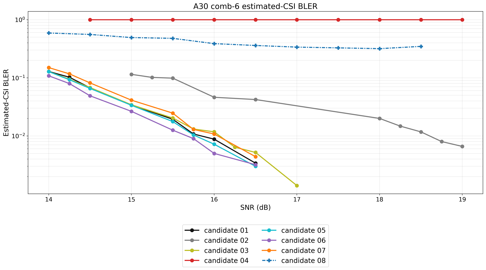

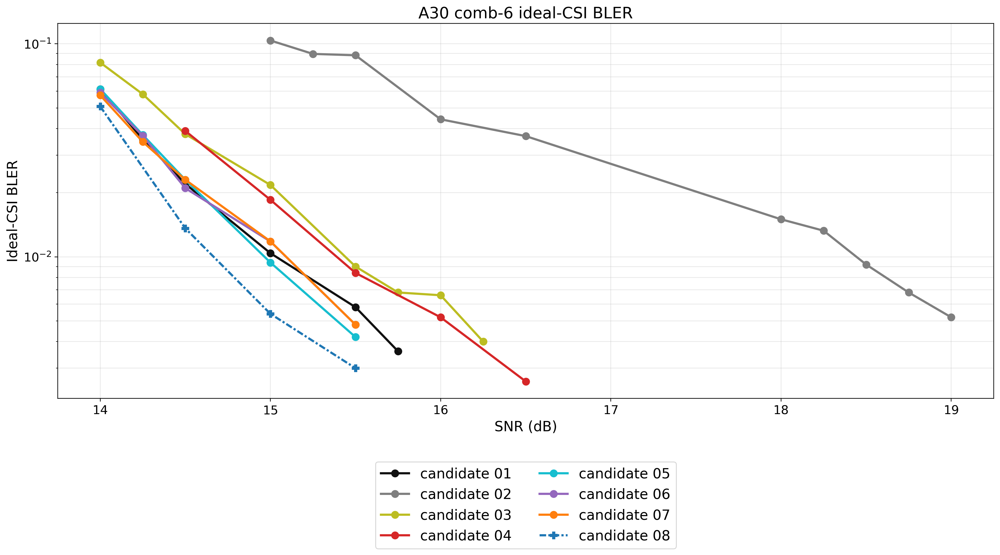

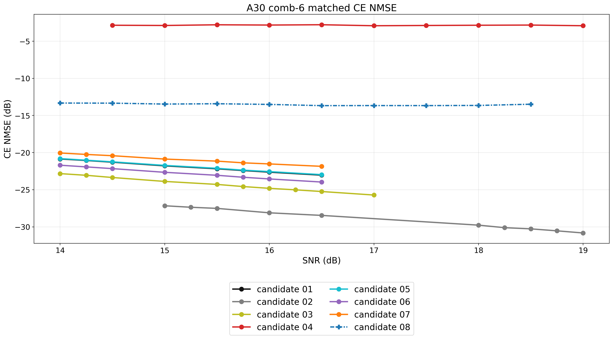

A30 estimated/ideal 分别追加 67,400/91,900 candidate-trials；ideal 图使用 48/72 个点。estimated 正式闭合目标仍沿用原预定 fit。增量 CSV 为 `curve_augmentation_v2/a30/final/<receiver>_csi_bler_points.csv`。

### 3.2 A100 comb-6

| 编号 | 原缩写 | delay ns |
|---|---|---|
| candidate 01 | `A100_B0_QC` | `[0,520.833,1041.667,1562.5,2083.333,2604.167,3125,3645.833]` |
| candidate 02 | `A100_AP_RMS_T1` | `[0,100,200,300,400,500,600,700]` |
| candidate 03 | `A100_AP_TEPS_T1` | `[0,479.66,959.32,1438.98,1918.64,2398.3,2877.96,3357.62]` |
| candidate 04 | `A100_AP_TU_NT` | `[0,4166.667,8333.333,12500,16666.667,20833.333,25000,29166.667]` |
| candidate 05 | `A100_AP_TU_NTM1` | `[0,4761.905,9523.81,14285.714,19047.619,23809.524,28571.429,33333.333]` |
| candidate 06 | `A100_AP_TALIAS_NT` | `[0,694.444,1388.889,2083.333,2777.778,3472.222,4166.667,4861.111]` |
| candidate 07 | `A100_S0_SIDON` | `[0,57.87,173.611,405.093,694.444,1157.407,1736.111,3761.574]` |
| candidate 08 | `A100_AP_T2_01` | `[0,3761.574,7986.111,12210.648,16435.185,20659.722,24884.259,29108.796]` |
| candidate 09 | `A100_MEFF_T2_04` | `[0,2314.815,6655.093,10185.185,13020.833,18750,22858.796,28009.259]` |
| candidate 10 | `A100_MEFF_T2_06` | `[0,1851.852,9085.648,14872.685,17245.37,19328.704,23495.37,29976.852]` |

精确 q/ns、rank 和 condition number 见 `a100_comb6/final/candidate_number_delay_table.csv`。

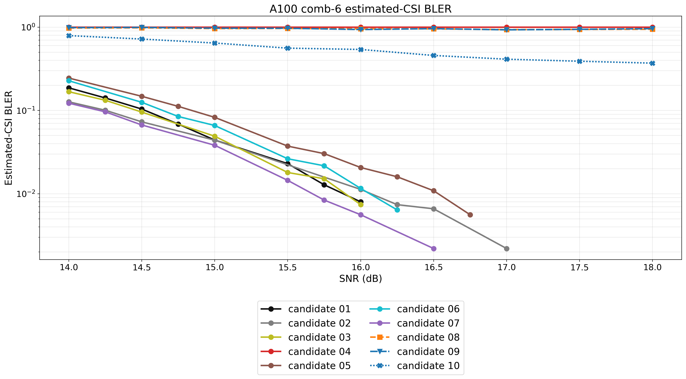

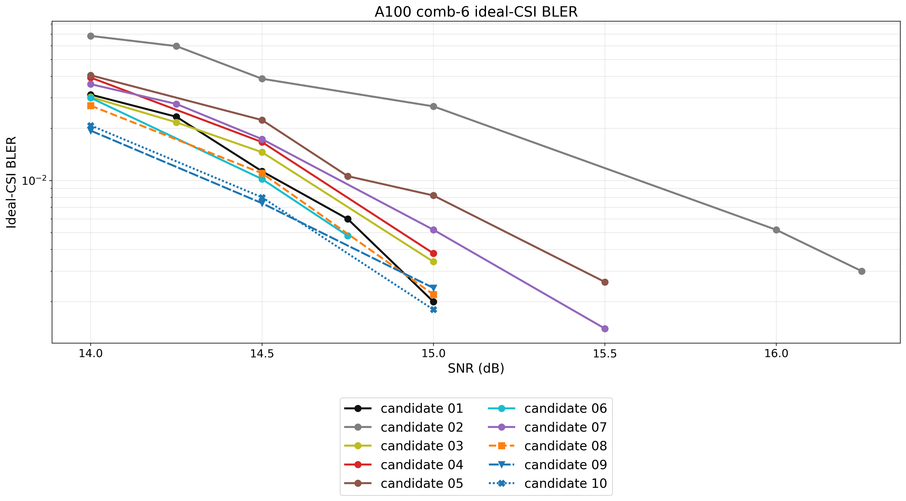

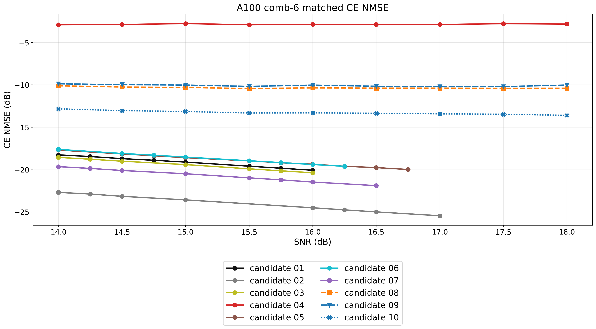

A100 estimated/ideal 相对原始 result-028 分别累计追加 129,400/302,300 candidate-trials，其中本次二次追加为 91,800/217,500；ideal 图使用 45/85 个点。candidate 02 ideal 在 16/16.25/16.5/17 dB 均达到 20,000 trials，对应 100/62/55/26 个错误块，BLER 为 0.500%/0.310%/0.275%/0.130%。正式闭合与目标表仍沿用原预定 fit。

### 3.3 A300 comb-6

A300 的 99% PDP 支撑为 1438.98 ns。动态重算后的候选如下：

| 编号 | 原缩写 | delay ns |
|---|---|---|
| candidate 01 | `A300_B0_QC` | `[0,520.833,1041.667,1562.5,2083.333,2604.167,3125,3645.833]` |
| candidate 02 | `A300_AP_RMS_T1` | `[0,300,600,900,1200,1500,1800,2100]` |
| candidate 03 | `A300_AP_TEPS_T1` | `[0,1438.98,2877.96,4316.94,5755.92,7194.9,8633.88,10072.86]` |
| candidate 04 | `A300_AP_TU_NT` | `[0,4166.667,8333.333,12500,16666.667,20833.333,25000,29166.667]` |
| candidate 05 | `A300_AP_TU_NTM1` | `[0,4761.905,9523.81,14285.714,19047.619,23809.524,28571.429,33333.333]` |
| candidate 06 | `A300_AP_TALIAS_NT` | `[0,694.444,1388.889,2083.333,2777.778,3472.222,4166.667,4861.111]` |
| candidate 07 | `A300_S0_SIDON` | `[0,57.87,173.611,405.093,694.444,1157.407,1736.111,3761.574]` |
| candidate 08 | `A300_AP_T2_01` | `[0,3761.574,7986.111,12210.648,16435.185,20659.722,24884.259,29108.796]` |
| candidate 09 | `A300_MEFF_T2_05` | `[0,1851.852,8449.074,12442.13,15682.87,23321.759,25925.926,29687.5]` |
| candidate 10 | `A300_MEFF_T2_06` | `[0,1967.593,8622.685,11226.852,13541.667,17534.722,21180.556,28067.13]` |

精确 q/ns、rank 和 condition number 见 `a300_comb6/final/candidate_number_delay_table.csv`。

缩写图例版：

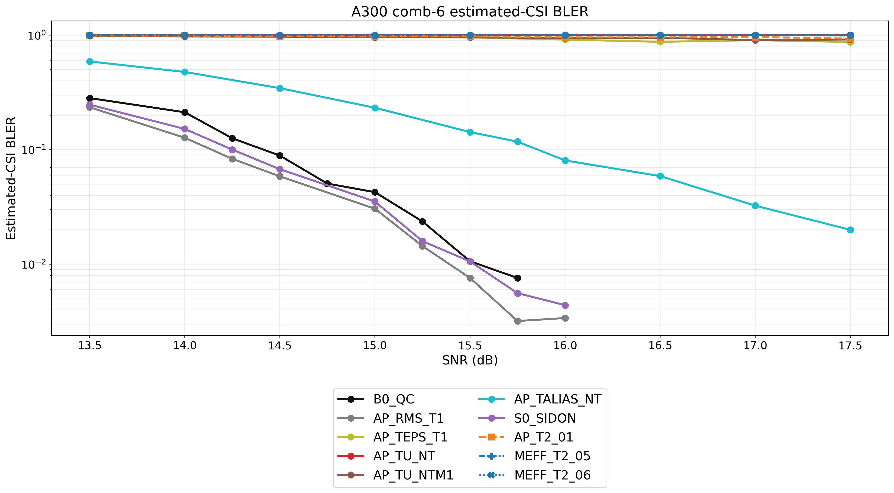

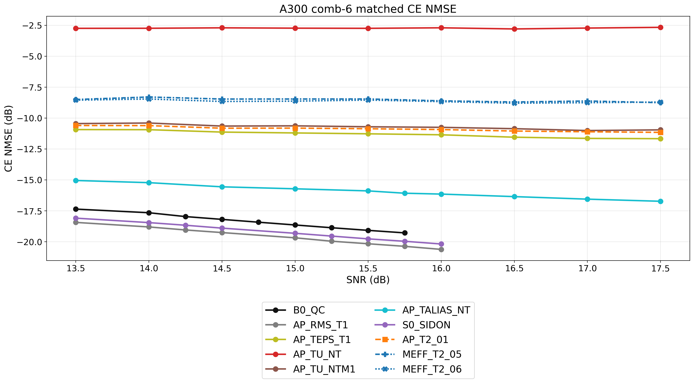

candidate 编号版（样式与缩写版逐物理方案完全一致）：

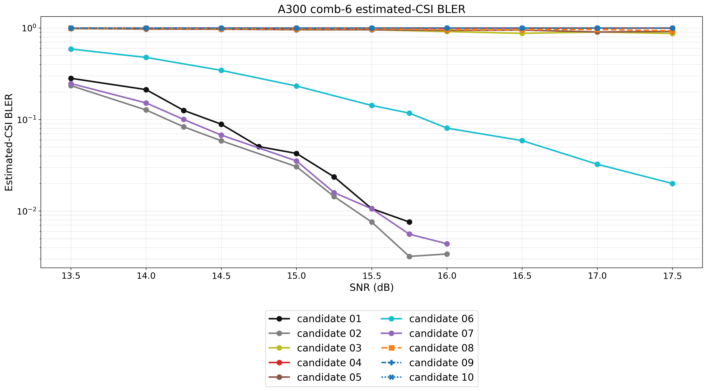

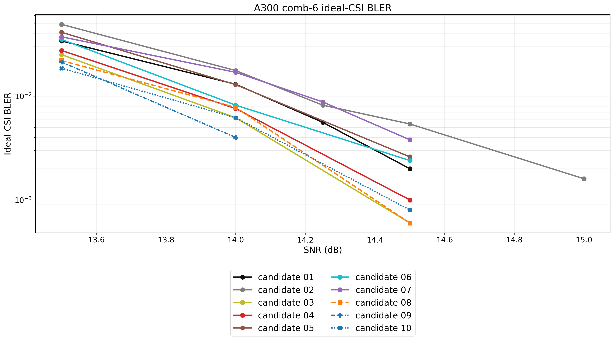

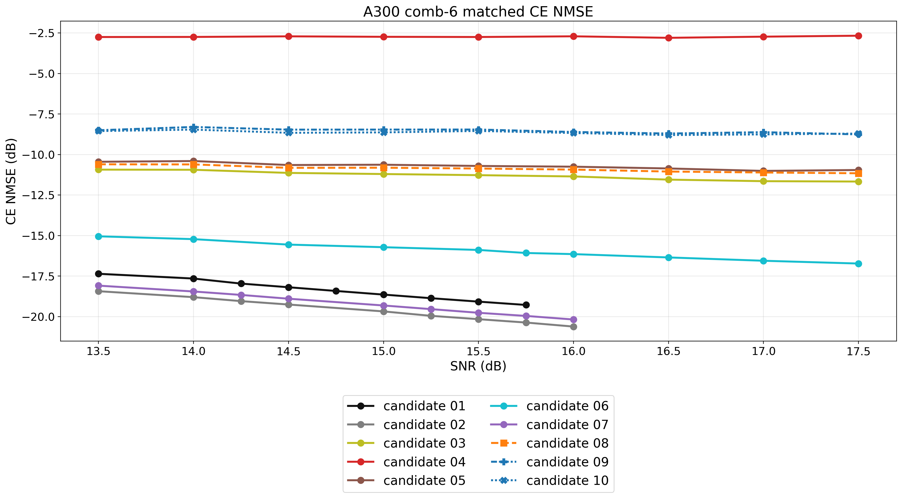

A100 同口径的链路增补图：

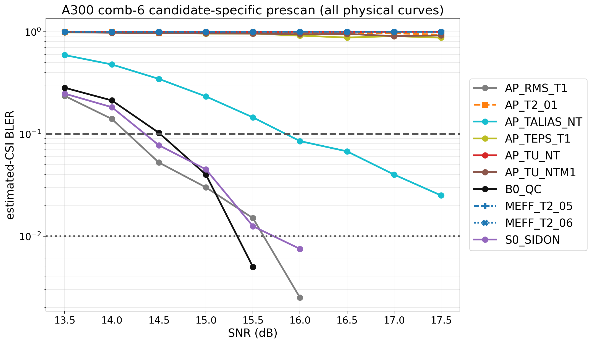

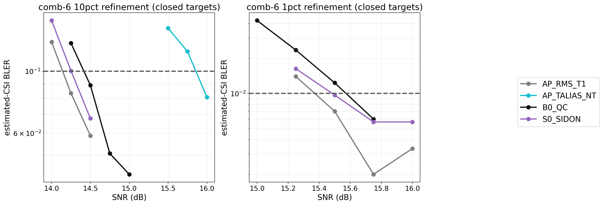

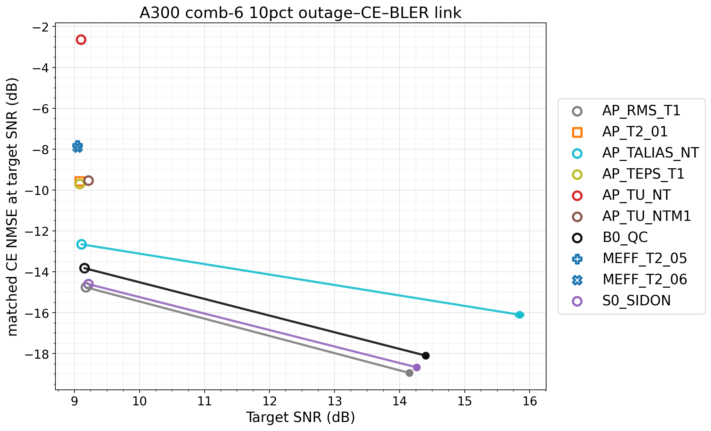

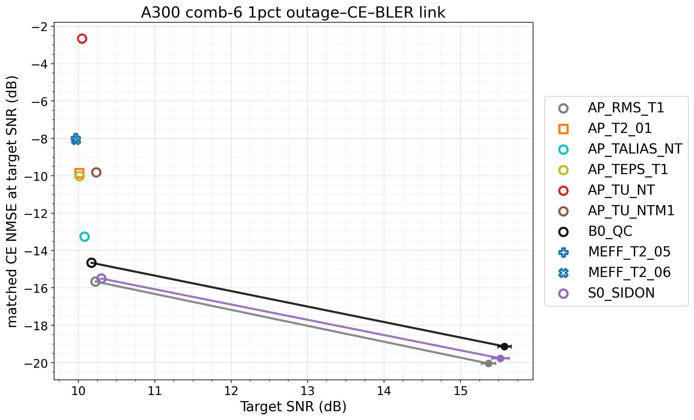

正式目标：`AP_RMS_T1` 为 14.152 `[14.109,14.195]` / 15.365 `[15.271,15.459]` dB；`B0_QC` 为 14.402 `[14.358,14.445]` / 15.575 `[15.486,15.664]`；`S0_SIDON` 为 14.260 `[14.221,14.299]` / 15.521 `[15.407,15.636]`；`AP_TALIAS_NT` 仅 10% 闭合，为 15.845 `[15.782,15.908]`。完整 own CE、错误数与 trials 见无图版表及 `a300_comb6/comb6/link/A300/final/target_summary.csv`。

A300 estimated/ideal 分别追加 22,800/108,100 candidate-trials；ideal 图使用 33/91 个完整数据点。上述正式目标保持原预定 fit，不因本次视觉降波动增量而后验改口径。

### 3.4 曲线降波动增量

增量入口按绝对 trial 编号续跑，完成区间立即保存；六类 receiver/scenario 及 A100 二次追加的剩余任务数均为 0。1%附近的 Wilson 95%区间中位宽度均下降：A100 estimated/ideal 最终为 `0.00374/0.00390`，A300 ideal 为 `0.00505`。A30/A300 ideal 仍截断远低于 1%的尾点；A100 常规 ideal 截至首个低于 0.3%的点，但按研究者点名保留 candidate 02 的全部 8 个 SNR 点，因此 A30/A100/A300 分别绘制 48、45、33 个 ideal 点。正式 target summary 未后验重拟合。

### 3.5 作图与验收

每个场景使用一个 `curve_styles.json`，同一物理方案跨 CSI 类型、缩写/编号图例和散点保持相同 color/linestyle/marker。标题、轴标签、图例至少 16 pt，刻度至少 14 pt，线宽至少 2.5 pt，marker 至少 8 pt；16 张图均按约 13 cm PPT 半页宽预览通过。零错误点的图示下界为 `0.5/trials`，CSV 保留真实值。

### 3.6 A100 五组 delay set、SNR 不高于 16 dB 的无标题图

本节只筛选原 candidate 01、02、04、07、10，并按本节顺序重新编号为 `delay set 1` 至 `delay set 5`，不运行新 trial。三张图均不显示标题，横轴显示范围为 13.75–16.25 dB，现有数据为 14–16 dB，因此左右各保留 0.25 dB 空白；竖向主/次网格间隔分别为 0.5/0.1 dB，便于直接读取曲线间的 SNR 增益。图例自动放在坐标区内不与曲线重叠的空白位置。同一物理方案沿用本 result 其他图中的 color、linestyle 和 marker。

`delay q` 是当前 `/K` 相位定义中的无量纲 DFT 栅格坐标 $j_n$：$V_{k,n}=\exp(-j2\pi k j_n/K)$。整数 q 是 576 点有效带宽 DFT 栅格上的整数循环移位，`1q=1/(K\Delta f)=57.87037 ns`；小数 q 表示相同相位斜率下的分数循环移位。物理 OFDM FFT 长度为 $N_{\rm FFT}=4096$，表中的 FFT sample 时延只把同一物理时延换算为采样点数，不把当前 `/K` 相位模型改成 `/N_{\rm FFT}` 模型：

$$
d_n^{\rm FFT}=\tau_nN_{\rm FFT}\Delta f=j_n\frac{N_{\rm FFT}}K=j_n\frac{64}{9}.
$$

当前数字域实现直接逐子载波乘复相位，因此数学模型允许任意实数 q，并按 q 模 576 周期等价；有限字长只带来相位量化。如果实现被限制为长度 4096 的整数 FFT-sample 循环移位，则只有整数 $d_n^{\rm FFT}$ 能由循环 buffer 精确实现，即 q 必须是 $9/64$ 的整数倍；其他 q 需要逐子载波相位旋转或分数时延滤波器。这里讨论的是数字域循环移位叠加，不把人工时延当作真实传播时延，也不额外消耗 CP。

| 编号 | candidate ID | delay q | delay ns | 等效 delay（FFT samples） |
|---|---|---|---|---|
| delay set 1 | `A100_B0_QC` | `[0,9,18,27,36,45,54,63]` | `[0,520.833,1041.667,1562.5,2083.333,2604.167,3125,3645.833]` | `[0,64,128,192,256,320,384,448]` |
| delay set 2 | `A100_AP_RMS_T1` | `[0,1.728,3.456,5.184,6.912,8.64,10.368,12.096]` | `[0,100,200,300,400,500,600,700]` | `[0,12.288,24.576,36.864,49.152,61.44,73.728,86.016]` |
| delay set 3 | `A100_AP_TU_NT` | `[0,72,144,216,288,360,432,504]` | `[0,4166.667,8333.333,12500,16666.667,20833.333,25000,29166.667]` | `[0,512,1024,1536,2048,2560,3072,3584]` |
| delay set 4 | `A100_S0_SIDON` | `[0,1,3,7,12,20,30,65]` | `[0,57.87,173.611,405.093,694.444,1157.407,1736.111,3761.574]` | `[0,7.111,21.333,49.778,85.333,142.222,213.333,462.222]` |
| delay set 5 | `A100_MEFF_T2_06` | `[0,32,157,257,298,334,406,518]` | `[0,1851.852,9085.648,14872.685,17245.37,19328.704,23495.37,29976.852]` | `[0,227.556,1116.444,1827.556,2119.111,2375.111,2887.111,3683.556]` |

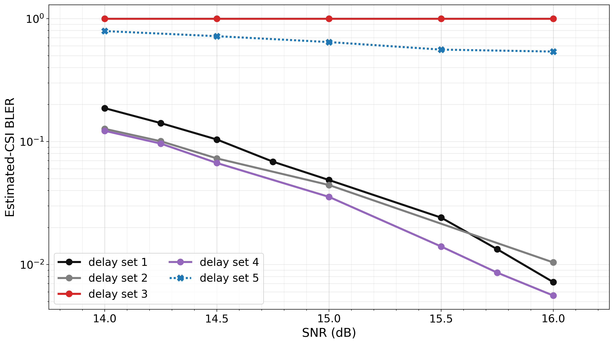

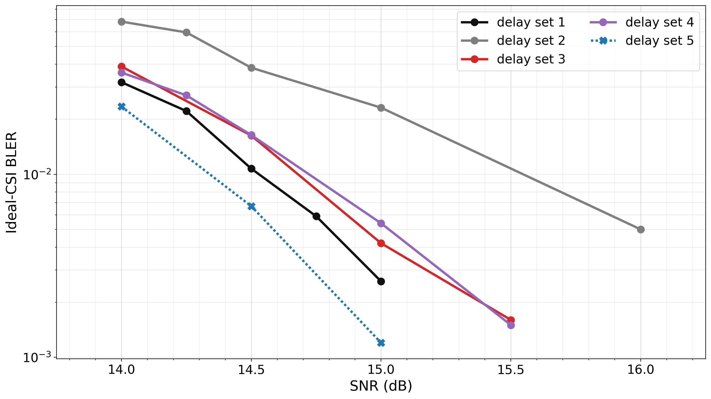

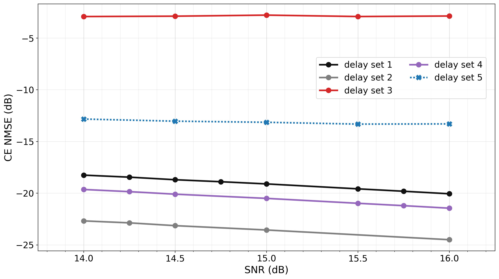

ideal 图遵循 3.2 的 `plot_included` 统计截断，而不是把所有低样本尾点都连线。原始 CSV 中 delay set 5（原 candidate 10）在 15.5/16 dB 各有 400 trials、0 错误；旧子集图为对数显示将两点都替换为 `0.5/400=1.25e-3`，形成了非物理平台。delay set 4（原 candidate 07）在 15.75/16 dB 各为 3000 trials、2 错误，两个经验 BLER 都是 `6.67e-4`，也形成水平线。它们并非“没有数据”，而是错误数太少且已被正式作图规则排除；修订图不再绘制这些点，所以 delay set 5/4 分别止于 15/15.5 dB。

delay set 3（原 candidate 04）的高信道估计误差确实来自导频可观测性缺秩。comb-6 下 $N_p=K/6=96$，导频相位只由 $j_n\bmod96$ 决定；其 8 个折叠位置为 `[0,72,48,24,0,72,48,24]`。第 1/5、2/6、3/7、4/8 列分别完全相同，因此 $\mathbf V_P$ 只有 rank 4，数值 condition number 为 `2.254e13`。这不是普通噪声造成的轻微劣化，而是 8 个发射分支只留下 4 个可区分导频方向。

实际 TDL-A 等效协方差进一步验证了该机理：以最大奇异值的 $10^{-10}$ 为数值秩门限，完整 $\mathbf R_g$ 为 rank 136，而导频协方差 $\mathbf R_{PP}$ 为 rank 68，存在 68 个 rank gap；由 $\mathbf R_{DP}\mathbf R_{PP}^{\dagger}$ 预测数据 RE 得到的无噪声 NMSE 地板为 `-2.863 dB`。16 dB 理论 matched-LMMSE NMSE 为 `-2.839 dB`，Monte Carlo 为 `-2.863 dB`，与地板一致。图中 delay set 3 的 estimated BLER 始终为 1，而 ideal BLER 已随 SNR 下降，说明当前失败点是缺秩导频下的信道估计，不是理想 CSI 链路本身。零错误 ideal 点仍按 `0.5/trials` 仅作对数图显示，真实错误数和 BLER 保留在 CSV。

复现入口为 `python tools/plot_result028_a100_subset.py`；矩阵诊断和精确换算表分别输出到 `curve_augmentation_v2/a100/final/a100_subset_matrix_diagnostics.csv` 与 `a100_subset_delay_table.csv`。

## 4. 异常、边界与待确认项

- A30/A100 estimated 以 result-027 为 base；本次 estimated/ideal 都只追加未覆盖的绝对 trial 区间。
- 未闭合目标不外推；ideal 曲线不另做门限外推。
- 结论只适用于当前 48 PRB、static TDL-A、comb-6、零速度、当前 MCS 与 matched receiver。
- 本 result 尚待研究者确认，因此未更新 `KNOWLEDGE.md`/`GOALS.md`，也未创建 Git checkpoint。
