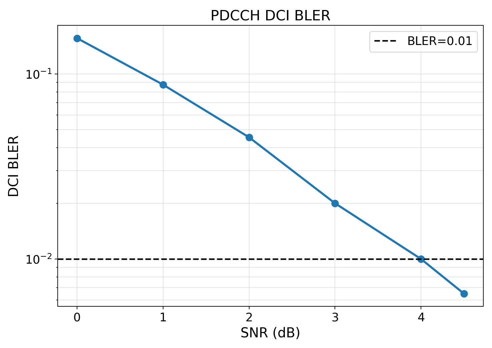

# result-029：Sionna PDCCH DCI BLER 分支

> 对应 `research/plan-029-Sionna-PDCCH-AL4.md`。实现与正式运行已完成，结论待研究者确认。

## 1. 结论

事实：平台已新增标准 PDCCH 资源映射、DCI CRC24C/RNTI mask、Sionna Polar、QPSK、PDCCH DMRS、REG-bundle 常量 DFT precoder cycling、Sionna TDL 和 ideal/estimated-CSI BLER 链路。指定的 A=41、RNTI=`0xFFFF`、AL4、E=432 配置通过无噪声编解码、链路 smoke 和正式运行。

事实：正式 BLER 从 0 dB 的 0.156 单调降至 4.5 dB 的 0.006494。4 dB 实测 102/10200=0.0100；4.5 dB 实测 100/15400=0.006494，Wilson 95% 区间 `[0.005342,0.007891]` 完全低于 0.01，达到用户要求。

推断：当前 static TDL-A、bundle-LS 接收机条件下链路呈合理 waterfall，说明资源计数、LLR 方向、Polar/CRC 和 precoder/CE 边界之间未见明显接口错误；这不构成不同 bundle 或 CDD 方案优劣结论。



## 2. 配置与口径

- 48 PRB、2 CORESET symbols、30 kHz、FFT 4096、CP 288；8 Tx/1 Rx；static Sionna 1.0.2 TDL-A，DS 100 ns、3.5 GHz、0 km/h。
- non-interleaved CCE–REG、AL4、first CCE 0、REG bundle L=6。候选含 4 CCE=24 REG=4 bundles；每 REG 为 9 data+3 DMRS RE，总计 216 data RE、72 DMRS RE，QPSK 得 E=432。
- DCI A=41，CRC24C 24 bits，K=65，RNTI `0xFFFF`，Polar mother N=512，hybrid CA-SCL list 8。Sionna 1.0.2 缺少的 DCI 全 1 CRC 初始化和 RNTI mask 通过确定性 affine codeword offset 补齐。
- 单位范数 DFT8 precoder 按物理 bundle 轮询；同一 bundle 的 data/DMRS 使用同一向量。接收机只在 bundle 内联合两个 symbol 的 DMRS，LS 后频域线性插值并 MRC。
- SNR 为单位总发射功率、单位能量 active PDCCH RE 的 Es/N0。seed `20260902`；每点至少 2000 trials，目标 100 errors，上限 20000。

展开配置为 `outputs/experiment029_pdcch/20260902_main/resolved_config.yaml`；基准提交 `83b25bc2ea77324ae98f7dc67136fc1e93b1f32c`，本轮为未提交的 plan-029 工作区增量。正式配置 SHA-256 为 `FD04B84C18C83598C7710B2B4A8C006C0553BD980031C3BE9804FA0A575C1016`。

## 3. 原始结果

| SNR dB | errors/trials | BLER | Wilson 95% | CE NMSE dB |
|---:|---:|---:|---:|---:|
| 0.0 | 312/2000 | 0.156000 | [0.140758, 0.172560] | -3.836 |
| 1.0 | 175/2000 | 0.087500 | [0.075894, 0.100688] | -4.861 |
| 2.0 | 100/2200 | 0.045455 | [0.037514, 0.054979] | -5.878 |
| 3.0 | 100/5000 | 0.020000 | [0.016472, 0.024265] | -6.871 |
| 4.0 | 102/10200 | 0.010000 | [0.008245, 0.012124] | -7.867 |
| 4.5 | 100/15400 | 0.006494 | [0.005342, 0.007891] | -8.376 |

共 36800 trials、889 errors，用时 896.6 s。精确表在 `outputs/experiment029_pdcch/20260902_main/bler_points.csv`；元数据在同目录 `run_metadata.json`；逐 trial flags/CE 在 `trial_error_flags/`。数组长度与 CSV trials、错误和逐点核对一致。

复现：

```powershell
python tools/run_pdcch_bler_curves.py --config configs/pdcch_result029_formal.yaml --stage validate
python tools/run_pdcch_bler_curves.py --config configs/pdcch_result029_formal.yaml --stage run
```

## 4. 验收与限制

验收通过：A/K/E/N 与 RE 计数一致；无噪声 Polar/CRC、mapping、bundle 恒定性、Sionna TDL 小批量链路测试通过；BLER 与 CE NMSE 随 SNR 单调改善；1% 有实测下侧点且其置信区间上界低于 1%。

限制：当前只模拟连续 CORESET、单层频域等效链路；不含搜索空间候选散列、CFO/ICI、波形同步和 PDCCH 专用 CDD 优化。受当前 Sionna downlink Polar `E≤576` 约束，端到端 BLER 暂支持 AL1/2/4。结果尚未确认，未写入 `KNOWLEDGE.md`/`GOALS.md`。
