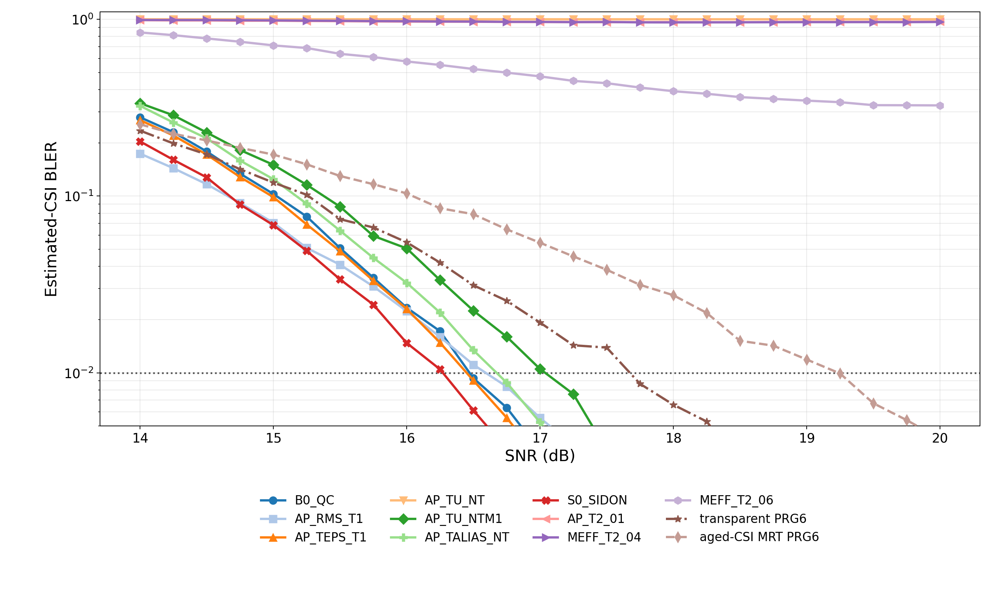
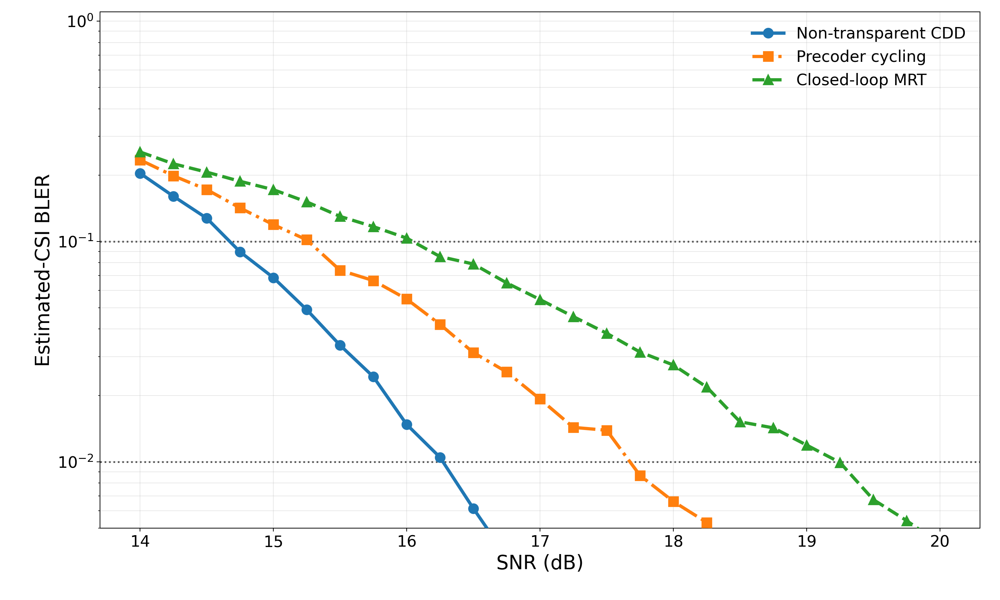
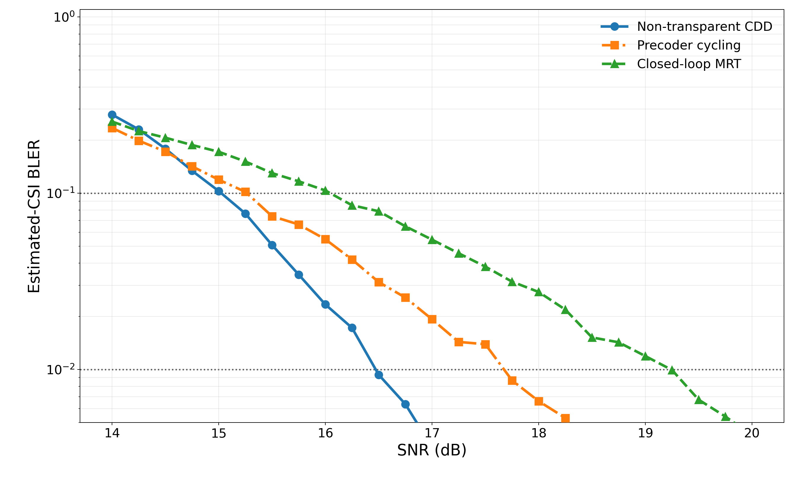
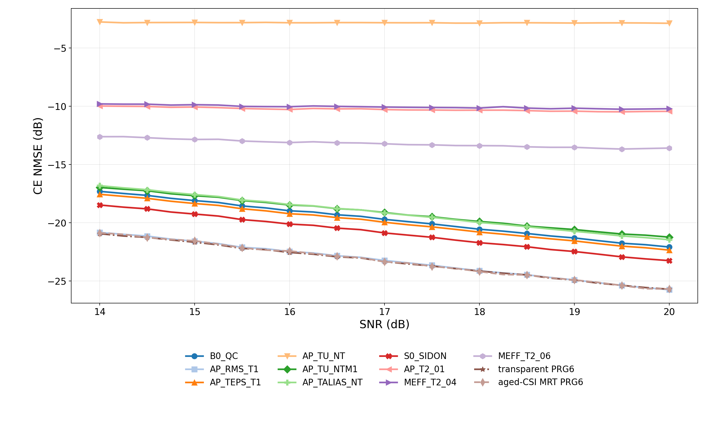

# result-032：TDL-A 60 km/h 下 CDD、透明 PRG 与过时 CSI MRT

对应计划：`research/plan-032-PDSCH-A100-60kmh.md`。状态：正式实验已完成，等待研究者确认；尚未更新 `KNOWLEDGE.md`/`GOALS.md`，尚未创建 Git checkpoint。

## 1. 结论

在本轮冻结口径下，result-028 中表现较好的 CDD 设计在 60 km/h 下仍大体保持对透明 PRG 基线的增益，但不是所有设计、所有 BLER 区域都成立：

- `AP_RMS_T1` 与 `S0_SIDON` 最稳健。在 10% BLER 相对 transparent PRG6 分别节省 0.606 dB 和 0.591 dB，在 1% BLER 分别节省 1.081 dB 和 1.403 dB；paired-bootstrap 95%区间均完全位于增益侧。
- `B0_QC`、`AP_TEPS_T1` 在 10% BLER 分别节省 0.240/0.276 dB，在 1% BLER 分别节省 1.202/1.224 dB，区间也均完全位于增益侧。
- `AP_TALIAS_NT` 在 10% BLER 节省 0.091 dB，95%区间为 `[-0.134,-0.032] dB`；增加样本后区间不再跨零，因此当前证据支持小幅但确定的增益。在 1% BLER 节省 1.000 dB。
- `AP_TU_NTM1` 在 10% BLER 明确比 transparent PRG6 差 0.116 dB，95%区间 `[+0.065,+0.175] dB`；但在 1% BLER 又节省 0.636 dB。这说明“移动性下仍有增益”必须按设计和目标 BLER 分开陈述。
- 上述 6 个可闭合 CDD 在 10%/1% BLER 均优于约 4.995 ms 过时 CSI 的未量化 PRG-MRT：分别节省 0.666–1.387 dB 和 2.200–2.967 dB。该闭环曲线是透明接收机、精确 MRT、无代码本量化的上界型算法基线，不是标准 PMI 性能。
- `AP_TU_NT`、`AP_T2_01`、`MEFF_T2_04`、`MEFF_T2_06` 到 24 dB 仍有 1.000、0.986、0.991、0.425 BLER，10%/1%目标均未闭合，因此不外推目标 SNR。

移动性使 6 个可闭合 CDD 的 10%目标相对 result-028 static 右移 0.402–0.535 dB，1%目标右移 0.558–0.687 dB；transparent PRG6 相应右移 0.509/0.554 dB。经验时间相关与 Jakes/TDL 理论一致，支持移动采样和约 5 ms CSI age 的实现正确。

## 2. 仿真条件与接收机定义

| 项目 | 冻结取值 |
|---|---|
| 信道 | Sionna 1.0.2 TDL-A，RMS delay spread 100 ns，20 sinusoids，8Tx/1Rx |
| 移动性 | 60 km/h，3.5 GHz，最大 Doppler 194.579 Hz；UE 知道速度 |
| 波形 | 48 PRB，576 active subcarriers，30 kHz SCS，FFT 4096，CP 288，10 个 PDSCH symbols |
| DMRS | symbols `[2,7]`，comb-6；每 symbol 96 pilots，共 192 个独立 LS 观测 |
| 接收机 | 两 DMRS 不平均；基于已知速度的时间协方差和 TDL 频率协方差，联合估计全部 data RE 的二维时频 RMMSE |
| 调制编码 | 16QAM；NR 256QAM MCS table 的 MCS 8；目标码率 553/1024；Sionna LDPC，最多 8 次迭代 |
| SNR/功率 | 所有预编码向量平方范数 8；噪声方差 `8/SNR_linear` |
| 信道边界 | 载波与定时同步；不模拟 CFO、ICI、ISI；多普勒只造成 OFDM-symbol 间时变与 CSI 老化 |
| 正式网格 | 14–20 dB 每 0.25 dB，加 22/24 dB，共 27 点 |
| 样本预算 | 14–20 dB 的 25 点均至少 10,000 trials，并对 0.5%–2% BLER 自适应追加至至少 200 errors或 50,000-trial 上限；22/24 dB 各 1,000 trials；共 549,720 个共同 trials、6,596,640 candidate-trials |
| 随机性 | seed `20260727`；同一 SNR/absolute trial 的 12 曲线共享 TDL、payload、data/DMRS AWGN |

透明/非透明只由接收机是否知道预编码区分：

- 10 条 CDD 曲线使用知道各自 CDD `V` 的非透明匹配接收机，频域协方差为 `R_phy ⊙ (V V^H)`；
- `transparent PRG6` 不知道预编码，只在每个 6-RB PRG 内使用 `8 R_phy` 做二维估计；
- `aged-CSI MRT PRG6` 的接收机同样透明并使用 `8 R_phy`。发射端在同一连续 TDL realization 中取 140 个 OFDM symbols 之前的 `H`，每个 6-RB PRG 以 `Σ H_old^H H_old` 的主特征向量构造范数平方为 8 的精确 MRT，并在当前 10 个 symbols 内保持不变。实际 CSI age 为 4.994792 ms。

`feedback_period_slots=10` 是 3GPP TS 38.331 `CSI-ReportPeriodicityAndOffset` 允许的周期；在 30 kHz SCS 下名义上为 5 ms。38.508-1 的 FR1 测试配置中也有 `slots10` 示例，但本结果不据此宣称它是所有现网的唯一常用周期，也不包含码本/量化/反馈误码。

## 3. 目标 BLER 结果

`Δstatic = SNR_60km/h - SNR_static`，正值表示移动性损失。目标只在相邻实测点双侧 bracket 内按 log10(BLER) 插值。

| 曲线 | 10% SNR (dB) | Δstatic (dB) | 1% SNR (dB) | Δstatic (dB) |
|---|---:|---:|---:|---:|
| B0_QC | 15.023 | +0.500 | 16.471 | +0.605 |
| AP_RMS_T1 | 14.657 | +0.402 | 16.593 | +0.567 |
| AP_TEPS_T1 | 14.987 | +0.521 | 16.449 | +0.587 |
| AP_TU_NTM1 | 15.379 | +0.535 | 17.038 | +0.558 |
| AP_TALIAS_NT | 15.172 | +0.528 | 16.674 | +0.687 |
| S0_SIDON | 14.673 | +0.462 | 16.271 | +0.598 |
| transparent PRG6 | 15.263 | +0.509 | 17.674 | +0.554 |
| aged-CSI MRT PRG6 | 16.045 | — | 19.238 | — |

下表定义 `Δ = SNR_CDD - SNR_baseline`，负值表示 CDD 节省 SNR；括号为 1000 次 paired bootstrap 的 95%区间。

| CDD | 10% Δ vs PRG6 | 10% Δ vs aged MRT | 1% Δ vs PRG6 | 1% Δ vs aged MRT |
|---|---:|---:|---:|---:|
| B0_QC | -0.240 `[-0.308,-0.178]` | -1.021 `[-1.100,-0.946]` | -1.202 `[-1.269,-1.127]` | -2.767 `[-3.917,-2.623]` |
| AP_RMS_T1 | -0.606 `[-0.661,-0.528]` | -1.387 `[-1.451,-1.290]` | -1.081 `[-1.195,-0.998]` | -2.646 `[-3.308,-2.493]` |
| AP_TEPS_T1 | -0.276 `[-0.333,-0.183]` | -1.057 `[-1.126,-0.954]` | -1.224 `[-1.299,-1.147]` | -2.789 `[-3.665,-2.643]` |
| AP_TU_NTM1 | +0.116 `[+0.065,+0.175]` | -0.666 `[-0.723,-0.589]` | -0.636 `[-0.760,-0.560]` | -2.200 `[-2.693,-2.055]` |
| AP_TALIAS_NT | -0.091 `[-0.134,-0.032]` | -0.873 `[-0.929,-0.792]` | -1.000 `[-1.076,-0.921]` | -2.564 `[-3.456,-2.400]` |
| S0_SIDON | -0.591 `[-0.639,-0.532]` | -1.372 `[-1.424,-1.287]` | -1.403 `[-1.510,-1.328]` | -2.967 `[-3.550,-2.830]` |



下列两张筛选图使用同一份 estimated-CSI BLER 原始数据和相同坐标范围。第一张保留 `S0_SIDON`、transparent PRG6 与 aged-CSI MRT PRG6；第二张将 `S0_SIDON` 替换为 `B0_QC`。为面向方案类别展示，三条曲线依次标为 `Non-transparent CDD`、`Precoder cycling` 和 `Closed-loop MRT`。







BLER 图只展示 14–20 dB、BLER 不低于 0.5%的区域，点线标出 1%目标；不展示非目标的 0.1%区域。14–20 dB 的 25 个 SNR 点均至少 10,000 trials；最终 31 个 0.5%–2% BLER 点含 200–734 errors，对应 13,960–50,000 trials。图中的 marker 与相邻线段均直接使用同一组原始 Monte Carlo BLER，不做 PAVA、PCHIP、平滑、单调修正或外推。可闭合曲线在图示目标区内没有相邻 SNR 反向；其剩余有限样本反向均低于 0.5%绘图区下界，地板曲线在接近 BLER=1 处的微小反向保留为原始结果。22/24 dB 和低于图窗的原始点仍在 CSV 中。

两图使用同一 `curve_styles.json`，并已按约 13 cm PPT 半页宽检查。按研究者要求，本次只重画 BLER 图；NMSE 图文件保持不变（SHA-256 `71E8841ABAF2CDF4F6B847CAE8C070BAAA9656B2BE6170BB986EAA428C9BF9B7`）。因此 NMSE 图保持追加前的展示值，最终 CE 数值应以包含全部新增 trials 的 `estimated_csi_bler_points.csv` 为准。

## 4. 移动性与实现校验

| 校验量 | 理论值 | 正式样本加权经验值 |
|---|---:|---:|
| 旧 CSI 到当前首 symbol 的复相关实部 | 0.178953 | 0.179055 |
| 当前 symbol 0 到 symbol 9 的复相关实部 | 0.961843 | 0.961846 |

相关统计覆盖 85 个不重叠 formal interval records、合计 549,720 个信道 trials；区间间加权标准差分别为 0.002319 和 0.000184。理论值取 `J0(2π f_D Δt)`。经验值与理论值的绝对差分别为 0.000101 和 0.000003，未见时间索引或单位错误。

测试与回归：

- `pytest tests/test_channel_tdl.py tests/test_rmmse_time_frequency.py tests/test_plan032_mobility.py tests/test_result032_orchestrator.py -q`：17 passed；
- 覆盖历史/当前样本的选择与重放、0 km/h 时二维估计与“两 DMRS 平均后频域 LMMSE”等价、PRG 不跨边界、MRT 范数和主特征向量最优性；
- `tools/run_bler_curves.py --config configs/bler_curves_result028_a100_transparent_cdd.yaml --stage validate`：通过，旧 result028 入口未被破坏；
- 所有 31 个最终 BLER 为 0.5%–2% 的点至少 200 个错误块；其余未闭合目标不外推。
- paired bootstrap 每项发起 1000 次；固定实测 bracket 后保留单调下降的重采样，最终各可比较项有 955–1000 个有效重复，均超过 80%出表门槛。

## 5. 证据与复现

关键机器可读产物：

- `outputs/experiment032_tdl_mobility/20260906_main/final/estimated_csi_bler_points.csv`：324 个曲线点；BLER、Wilson 95%区间、错误数、trials、CE NMSE 及区间；
- `.../final/target_summary.csv`：10%/1% bracket、插值目标 SNR、static 对照与移动性位移；
- `.../final/baseline_comparisons.csv`：相对两条透明基线的点估计、paired-bootstrap 区间与有效重复数；
- `.../final/formal_intervals.csv`：所有绝对 trial 区间及逐 trial flags/CE 数组路径；
- `.../final/channel_correlation_summary.json`：Doppler、CSI age、理论/经验时间相关；
- `.../final/curve_styles.json`：两张图共享样式；
- `outputs/experiment032_tdl_mobility/20260906_main/{formal,formal_shard1,formal_shard2,formal_shard3}/`：展开配置、SHA-256、逐区间 CSV、逐 trial error flags、CE 数组和滤波器诊断。
- `outputs/experiment032_tdl_mobility/20260906_main/result028_scale_orchestration/`：单命令编排状态、四分片完整日志和最终 `547,720/547,720` 预算闭合记录。

源候选由 `outputs/experiment028_csi_curves/20260803_main/a100_comb6/manifest/source_manifest.json`、对应 `.sha256` 与 `source_approval.json` 冻结。代码内容事实源为 Git base `83b25bc2ea77324ae98f7dc67136fc1e93b1f32c` 加当前未提交任务改动；关键文件 SHA-256 为：runner `4401282E8FDEE36ECA39C668AEDD9F78B7ACF68052557911D0BB2F7D2B4C4975`，orchestrator `4F193A473BD59891EF79A80B02668E3A85601C0C657AA2344A7191B970AE3823`，analyzer `5E6DE7EBBC9E6C0581B80DAABC32A4AAF3000BCDA8F842FA97447C684EB8A1E1`，`channel_tdl.py` `E67A9B71314D002B5DCE3186DF09C7975459852F4EFFE94A7FE911C7C543FE73`，`estimators.py` `71AFF1138F42BCC5BB30E535930C946884ACDAB06F55C5D48C013B3151E7104B`。

复现入口：

```powershell
& D:\venvs\cdd-s102\Scripts\python.exe tools\run_plan032_tdl_mobility.py --config configs\bler_curves_result032_a100_60kmh_smoke.yaml --stage validate
& D:\venvs\cdd-s102\Scripts\python.exe tools\run_plan032_tdl_mobility.py --config configs\bler_curves_result032_a100_60kmh_smoke.yaml --stage run
# 正式公共网格、分片及自适应追加配置的精确执行顺序见 research/plan-032-PDSCH-A100-60kmh.md 第 9 节。
& D:\venvs\cdd-s102\Scripts\python.exe tools\run_result032_result028_scale.py
& D:\venvs\cdd-s102\Scripts\python.exe tools\analyze_result032_tdl_mobility.py --skip-ce-plot
& D:\venvs\cdd-s102\Scripts\python.exe tools\plot_result032_selected_bler.py --copy-to-final
```

## 6. 异常、解释边界与验收

- 4 条地板曲线是正式负结果，不应删除，也不能据此给出 10%/1% SNR 外推值。
- `AP_TALIAS_NT` 的 10%相对 PRG6 增益只有 0.091 dB，虽然 95%区间已完全位于增益侧，但效应量小于其他五条可闭合且不劣于 PRG6 的 CDD，不应只凭统计显著性夸大工程收益。
- aged-MRT 的劣化同时包含发射端 CSI 老化和当前 DMRS 信道估计；它不包含标准码本量化、RI/PMI 选择、反馈延迟抖动或错误，因此不能替代严格的 3GPP 闭环链路结论。
- 不模拟 ICI/CFO；结果只能回答 symbol-rate 多普勒时变与 CSI 老化下的性能，不能外推到 ICI 显著的更高速场景。
- 跨 static/60 km/h 的 trial 不配对，因此 `Δstatic` 只报告点估计；不能把同速候选间的 paired-bootstrap 区间套用于跨速度差值。
- smoke、正式预算、trial pairing、时间相关、0 km/h 数学回归、PRG/MRT 功率与边界、图表和成对 result 要求均已满足。结论仍等待研究者确认，故不更新全局知识与目标状态。

标准依据：3GPP TS 38.331 / ETSI TS 138 331 V18.8.0，`CSI-ReportPeriodicityAndOffset` 包含 `slots10`：https://www.etsi.org/deliver/etsi_ts/138300_138399/138331/18.08.00_60/ts_138331v180800p.pdf 。
