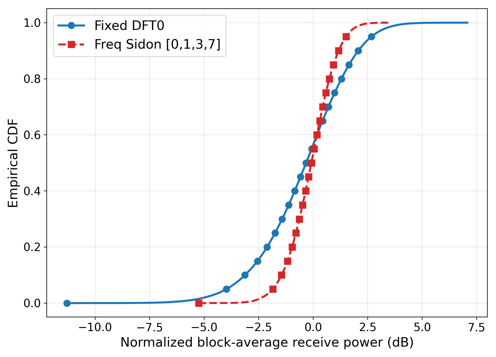
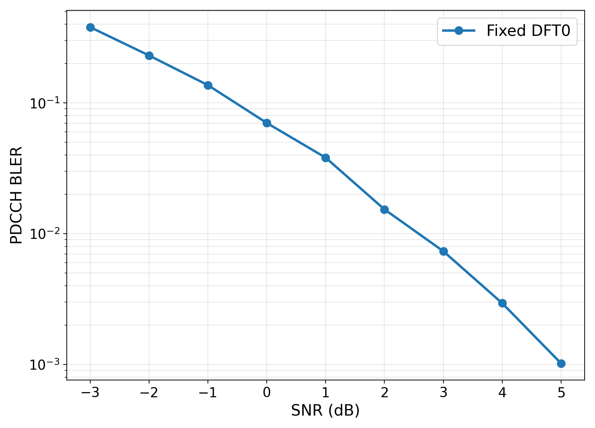
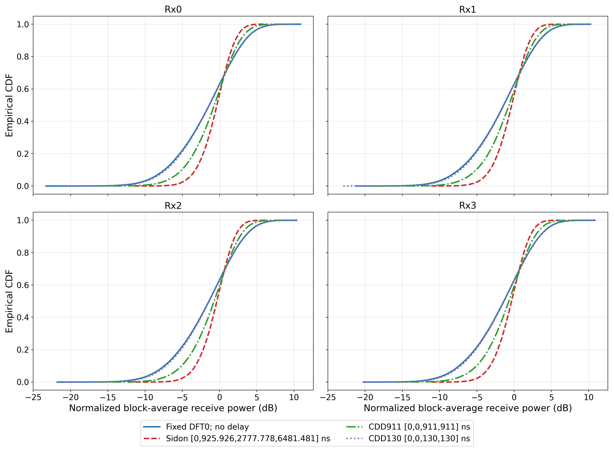

# result-034：无噪声块平均接收功率 CDF 与固定 DFT0 的 4Tx/4Rx PDCCH BLER

对应计划：`research/plan-034-RSRP统计-PDCCH 4T4R.md`。状态：**正式实验及第 10 节逐 Rx 补充实验已执行，待研究者确认**。本结果报告冻结的 RSRP-CDF 机理诊断、`FIXED_DFT0` 的九点 BLER，以及四种发射波形的逐 Rx 无噪声 RSRP 补充诊断；未搜索新预编码、未插值 BLER 门限，也未更新 `KNOWLEDGE.md` 或 `GOALS.md`。

## 1. 结论摘要

- 事实：在 100,000 个严格配对的 TDL-C realization 上，`FREQ_SIDON_0137` 相对 `FIXED_DFT0` 的块平均功率 1%/10%低尾分位数分别提高 `3.0010/1.6790 dB`，中央 80%宽度缩小 `2.5753 dB`；三项 paired-bootstrap 95%区间均不跨 0，满足 plan-034 的“块平均功率更集中”判据。
- 事实：两候选的块平均线性功率均值为 `1.001320/0.999638`，而标准差由 `0.455075` 降为 `0.233170`。这支持变化来自块内频率相关性和波动缩小，而不是平均发射功率改变。
- 事实：预注册单 RE 控制通过。1%/10%/50%分位数差为 `-0.0193/-0.0423/-0.0156 dB`，经验 CDF 最大绝对差为 `0.00428`，均在 `0.10 dB/0.01` 审计门槛内。
- 事实：固定 DFT0 的 BLER 随 SNR 从 -3 到 5 dB 严格下降，由 `0.3785` 降至 `0.00102`。`-3/-2/-1 dB` 高于 0.1，但 `0 dB` 为 `0.07017`，因此“0 dB 及以下均高于 0.1”的预期不成立。
- 事实：`3 dB` 的 BLER 为 `0.007339`，接近 0.01；`4/5 dB` 分别为 `0.00294/0.00102`，明显低于 0.01。4、5 dB 达到 50,000 trials 上限但只有 147/51 个错误，未达到预注册的 200-error 目标，标记为“样本上限/部分不可判定”；其原始估计和 Wilson 95%区间仍可核验。
- 事实：逐 Rx 补充实验的四根 Rx 结论一致。相对 `FIXED_DFT0`，`FREQ_SIDON_0137`/`CDD911`/`CDD130` 在 Rx0--Rx3 上的 1% 低尾分位数分别提高 `6.1535--6.2368`/`2.9191--2.9775`/`0.2875--0.3363 dB`，中央 80% 宽度分别缩小 `5.4442--5.4943`/`2.9684--2.9999`/`0.2114--0.3016 dB`；36 个 paired-bootstrap 95%区间均不跨 0。
- 事实：同一 candidate 的 Rx 间最大经验 CDF 差为 `0.00549--0.00870`，均低于 Bonferroni-DKW 成对阈值 `0.0113679`，与独立同分布 Rx 假设一致。逐 Rx 线性功率对原四 Rx 平均结果的逐 trial 重构在 `1e-12` 容差内通过；由于浮点求和顺序，不是位级相等，`FIXED_DFT0`/`FREQ_SIDON_0137` 的最大绝对差为 `2.665e-15/1.332e-15`。
- 推断：当前独立 4Tx/4Rx、AL1 单 bundle 条件下，频变 Sidon 预编码确实降低了无噪声块平均接收功率的衰落波动。该机理结果不能单独推出 BLER 改善，因为本轮没有为 `FREQ_SIDON_0137` 运行 BLER。

## 2. 冻结条件与复现身份

| 项目 | 取值 |
|---|---|
| 载频 / SCS / FFT / CP | 4 GHz / 30 kHz / 4096 / 288 samples |
| CORESET / candidate | 48 RB，2 symbols，AL1，first CCE 0，non-interleaved，单个 6-REG bundle |
| 资源 | 每 symbol 3 个连续 RB；72 个候选 RE，其中 18 DMRS、54 data；QPSK，$E=108$ bit |
| DCI | payload $A=40$ bit，CRC24C，RNTI `0xFFFF`，Polar list size 8，`hybSCL`，CPU-only |
| 天线 / 层 | 4Tx / 4Rx / 1 layer；16 个 Tx--Rx 分支独立同分布、无空间相关 |
| 信道 | Sionna 1.0.2 TDL-C，RMS delay spread 300 ns，3 km/h，20 sinusoids；不做逐 realization 归一化 |
| 接收机 | 每根 Rx 独立二维时频 LMMSE；data RE 上 coherent MRC；LLR 不加入 CE-error-aware 方差 |
| SNR | 单位总发射功率相对单根 Rx 分支噪声功率；每根 Rx 噪声方差 $10^{-\mathrm{SNR}_{dB}/10}$，不因 4Rx 缩放 |
| RSRP | 无 AWGN；对 72 个候选 RE、4Rx 和 $P_{tx}=1$ 归一化的真实 $\mathbf H\mathbf W$ 块平均功率 |
| RSRP 候选 | `FIXED_DFT0`：$[1,1,1,1]^T/2$；`FREQ_SIDON_0137`：$\mathbf j=[0,1,3,7]$、phase denominator 36 |
| 人工时延 | `[0,925.925926,2777.777778,6481.481481] ns`；只进入数字相位，不修改真实传播 tap |
| 随机性 | base seed `20260916`；RSRP namespace `plan034_rsrp_cdf_v1`；BLER 三档使用 plan 冻结的独立 namespace |
| 样本 | RSRP 100,000 paired trials；BLER 依预注册最少 trial、200-error 目标和最大 trial 动态停止 |

输出根目录为 `outputs/experiment034_rsrp_pdcch_4t4r/20260916_plan034/`。环境回执记录 Python 3.11.9、NumPy 1.26.4、SciPy 1.15.3、TensorFlow 2.15.1、Sionna 1.0.2、Git HEAD `83b25bc2ea77324ae98f7dc67136fc1e93b1f32c`；运行时工作区非干净，因此当前工作区文件与保存的展开配置是内容事实源。

配置 SHA-256：RSRP `f406e0ac8a0dabc82a7ea1834fbf2d19498de6139f66eae5a89ca760de3547e1`；BLER low/mid/high 分别为 `9e11ce3e36191330423601ae0e679286d6ccc01f667f449d6a3c09afa6b564b2`、`a65183d965ab02c7c74b802fed6f0f27aa5960fdca6525f48dea4be57791b772`、`671c362fa7ed11ba2e45248c2958dd8fdb42b091ba889e167cd2be53de71e988`。

## 3. RSRP-CDF 结果

分位数采用左连续经验逆 CDF。均值和标准差的 dB 列对逐 trial 的 $X_t=10\log_{10}\overline P_t$ 统计；线性列直接对 $\overline P_t$ 统计。

| 候选 | $Q_{0.01}$ / dB | $Q_{0.10}$ / dB | $Q_{0.50}$ / dB | $Q_{0.90}$ / dB | 中央80%宽度 / dB | dB均值 / 标准差 | 线性均值 / 标准差 |
|---|---:|---:|---:|---:|---:|---:|---:|
| `FIXED_DFT0` | -5.6574 | -3.1292 | -0.3235 | 2.0649 | 5.1941 | -0.4448 / 2.0299 | 1.001320 / 0.455075 |
| `FREQ_SIDON_0137` | -2.6564 | -1.4502 | -0.0840 | 1.1686 | 2.6188 | -0.1202 / 1.0228 | 0.999638 / 0.233170 |

| 配对差值（freq - fixed） | 点估计 / dB | paired-bootstrap 95%区间 / dB | plan 方向 |
|---|---:|---:|---|
| $\Delta Q_{0.01}$ | +3.0010 | [2.9339, 3.0712] | 大于 0，通过 |
| $\Delta Q_{0.10}$ | +1.6790 | [1.6532, 1.7029] | 大于 0，通过 |
| $\Delta B_{80}$ | -2.5753 | [-2.6050, -2.5452] | 小于 0，通过 |

Bootstrap 使用 1,000 次 paired nonparametric resampling，seed `20260916`。每条经验 CDF 的 95% Dvoretzky--Kiefer--Wolfowitz 半带宽为 `0.0042947`。三项方向一致且区间均不跨 0，故集中性判据为**通过**。



### 3.1 单 RE 边缘控制

预注册位置为 symbol 0、局部子载波 18，并对 4Rx 平均。`freq - fixed` 的 $Q_{0.01}/Q_{0.10}/Q_{0.50}$ 差分别为 `-0.01931/-0.04233/-0.01559 dB`，两条经验 CDF 最大绝对差为 `0.00428`。所有指标均低于实现审计门槛，控制通过。该通过只排除明显的边缘分布/功率实现偏移，不构成分集增益本身的证据。

图对应的完整排序输入为 `outputs/experiment034_rsrp_pdcch_4t4r/20260916_plan034/analysis/rsrp_cdf_input.csv`；逐 trial 线性值、dB 值和配对 key 位于 `.../rsrp/paired_rsrp_trials.csv`。

## 4. 固定 DFT0 PDCCH BLER

只运行 `C300_AL1_FIXED_DFT0_NR4_EST`。表中 CE NMSE 是逐 trial 线性比值平均后转 dB；MRC denominator 是 data RE 和 trial 的平均值。未做平滑、单调修正、门限插值或外推。

| SNR / dB | errors / trials | BLER | Wilson 95%区间 | CE NMSE / dB | 平均 MRC denominator | 停止原因 |
|---:|---:|---:|---:|---:|---:|---|
| -3 | 757 / 2,000 | 0.378500 | [0.357496, 0.399970] | -7.078 | 3.3533 | 最少 trial 且错误数达标 |
| -2 | 460 / 2,000 | 0.230000 | [0.212085, 0.248951] | -7.680 | 3.4604 | 最少 trial 且错误数达标 |
| -1 | 273 / 2,000 | 0.136500 | [0.122149, 0.152245] | -8.311 | 3.5070 | 最少 trial 且错误数达标 |
| 0 | 207 / 2,950 | 0.070169 | [0.061500, 0.079957] | -8.960 | 3.6033 | 最少 trial 且错误数达标 |
| 1 | 200 / 5,250 | 0.038095 | [0.033246, 0.043620] | -9.561 | 3.6713 | 最少 trial 且错误数达标 |
| 2 | 200 / 13,050 | 0.015326 | [0.013356, 0.017580] | -10.219 | 3.6830 | 最少 trial 且错误数达标 |
| 3 | 200 / 27,250 | 0.007339 | [0.006393, 0.008425] | -10.915 | 3.7213 | 最少 trial 且错误数达标 |
| 4 | 147 / 50,000 | 0.002940 | [0.002502, 0.003454] | -11.624 | 3.7773 | **样本上限/部分不可判定** |
| 5 | 51 / 50,000 | 0.001020 | [0.000776, 0.001341] | -12.350 | 3.8144 | **样本上限/部分不可判定** |



BLER、CE NMSE 和平均 MRC denominator 随 SNR 分别呈严格下降、改善和缓慢上升，没有出现明显的相邻点反向或数量级矛盾。九点逐 trial NPY 的长度、错误数、CE 线性均值转 dB、MRC 均值及有限正值均已从原数组复算并通过，详见 `analysis/audit.json`。

预期核对：`-3/-2/-1 dB` 的 BLER 确实大于 0.1，但 `0 dB` 不大于 0.1；`3 dB` 接近 0.01，`4/5 dB` 已分别降至约 0.003 和 0.001。该差异不是实现失败，plan 已声明这些预期只用于预分配预算。

## 5. 逐 Rx、四种发射波形的无噪声块 RSRP 补充实验

补充实验使用 100,000 个 absolute trials，重放 base seed `20260916`、channel namespace `plan034_rsrp_cdf_v1` 和 trial 1--100000。每个 $(t,r)$ 上四个 candidate 共享同一底层信道，不加 AWGN，不做逐 realization 归一化，不跨 Rx 平均。`FREQ_SIDON_0137`/`CDD911`/`CDD130` 的人工时延分别为 `[0,925.925926,2777.777778,6481.481481]`/`[0,0,911,911]`/`[0,0,130,130] ns`，后两者保留重复时延；三者 `phase_denominator=36`。验证回执中所有预编码行功率在浮点精度内为 1。源配置 `configs/pdcch_plan034_rsrp_per_rx_4waveform.yaml` 的 SHA-256 为 `f116ad7f14c65e4d42a9d87856fb2426ed9ae888c5a6b23a1e151dae70e8646a`；保存的展开配置 `.../per_rx_4waveform/configs/pdcch_plan034_rsrp_per_rx_4waveform.resolved.yaml` 的 SHA-256 为 `1cdf7fe991f72e1d8b2b57a84028304d7423fc03ff71d0a451f2bcd89d019048`。

### 5.1 逐 Rx 原始统计

| Rx | candidate | $Q_{0.01}$ / dB | $Q_{0.10}$ / dB | $Q_{0.50}$ / dB | $Q_{0.90}$ / dB | 中央80%宽度 / dB | dB均值 / 标准差 | 线性均值 / 标准差 |
|---:|---|---:|---:|---:|---:|---:|---:|---:|
| 0 | `FIXED_DFT0` | -12.0675 | -7.3885 | -1.3760 | 3.3977 | 10.7862 | -1.7334 / 4.1560 | 1.002383 / 0.911028 |
| 0 | `FREQ_SIDON_0137` | -5.8654 | -3.2367 | -0.3506 | 2.1053 | 5.3420 | -0.4811 / 2.0927 | 0.998837 / 0.464900 |
| 0 | `CDD911` | -9.1446 | -5.0684 | -0.6950 | 2.7494 | 7.8178 | -0.9679 / 3.0700 | 1.001436 / 0.666007 |
| 0 | `CDD130` | -11.7412 | -7.1817 | -1.3682 | 3.3931 | 10.5748 | -1.6706 / 4.0655 | 1.002973 / 0.898707 |
| 1 | `FIXED_DFT0` | -12.1484 | -7.4458 | -1.4043 | 3.4089 | 10.8547 | -1.7428 / 4.1643 | 1.001345 / 0.911172 |
| 1 | `FREQ_SIDON_0137` | -5.9949 | -3.2417 | -0.3304 | 2.1297 | 5.3713 | -0.4665 / 2.1077 | 1.003534 / 0.469564 |
| 1 | `CDD911` | -9.2293 | -5.0935 | -0.6935 | 2.7703 | 7.8638 | -0.9650 / 3.0784 | 1.002654 / 0.665038 |
| 1 | `CDD130` | -11.8609 | -7.1842 | -1.3769 | 3.3689 | 10.5531 | -1.6801 / 4.0656 | 1.000804 / 0.899698 |
| 2 | `FIXED_DFT0` | -12.1453 | -7.4323 | -1.4216 | 3.4042 | 10.8365 | -1.7589 / 4.1598 | 0.998121 / 0.911154 |
| 2 | `FREQ_SIDON_0137` | -5.9114 | -3.2542 | -0.3576 | 2.0880 | 5.3422 | -0.4922 / 2.0941 | 0.996362 / 0.463818 |
| 2 | `CDD911` | -9.1678 | -5.0993 | -0.7278 | 2.7373 | 7.8367 | -0.9941 / 3.0732 | 0.995652 / 0.661136 |
| 2 | `CDD130` | -11.8092 | -7.2059 | -1.3975 | 3.3626 | 10.5685 | -1.6954 / 4.0635 | 0.997557 / 0.897864 |
| 3 | `FIXED_DFT0` | -12.1036 | -7.3962 | -1.3774 | 3.4021 | 10.7983 | -1.7238 / 4.1458 | 1.003430 / 0.914877 |
| 3 | `FREQ_SIDON_0137` | -5.8667 | -3.2282 | -0.3495 | 2.1047 | 5.3329 | -0.4770 / 2.0909 | 0.999818 / 0.466552 |
| 3 | `CDD911` | -9.1679 | -5.0453 | -0.7066 | 2.7705 | 7.8157 | -0.9666 / 3.0724 | 1.001926 / 0.666090 |
| 3 | `CDD130` | -11.7673 | -7.1779 | -1.3494 | 3.3971 | 10.5750 | -1.6658 / 4.0581 | 1.002991 / 0.901661 |

四种 candidate 的逐 Rx 线性均值都接近 1；随频率变化增强，线性和 dB 标准差、中央 80% 宽度逐步下降。四根 Rx 上的次序均为 `FREQ_SIDON_0137` 最集中，其次 `CDD911`、`CDD130`、`FIXED_DFT0`。



### 5.2 相对固定 DFT0 的配对差值

下表每格为“点估计 [paired-bootstrap 95%区间]”，单位均为 dB；bootstrap 按同一 Rx 的 absolute trial 成组重采样 1,000 次，seed `20260916`。

| Rx | candidate - `FIXED_DFT0` | $\Delta Q_{0.01}$ | $\Delta Q_{0.10}$ | $\Delta B_{80}$ |
|---:|---|---:|---:|---:|
| 0 | `FREQ_SIDON_0137` | 6.2021 [6.0784, 6.3190] | 4.1518 [4.1013, 4.2034] | -5.4442 [-5.5035, -5.3830] |
| 0 | `CDD911` | 2.9229 [2.7874, 3.0526] | 2.3200 [2.2651, 2.3722] | -2.9684 [-3.0285, -2.9030] |
| 0 | `CDD130` | 0.3263 [0.1888, 0.4441] | 0.2067 [0.1660, 0.2503] | -0.2114 [-0.2661, -0.1711] |
| 1 | `FREQ_SIDON_0137` | 6.1535 [6.0557, 6.2605] | 4.2041 [4.1455, 4.2547] | -5.4833 [-5.5480, -5.4202] |
| 1 | `CDD911` | 2.9191 [2.7985, 3.0515] | 2.3523 [2.2984, 2.4073] | -2.9909 [-3.0532, -2.9303] |
| 1 | `CDD130` | 0.2875 [0.1506, 0.3992] | 0.2616 [0.2152, 0.3030] | -0.3016 [-0.3468, -0.2498] |
| 2 | `FREQ_SIDON_0137` | 6.2339 [6.1246, 6.3479] | 4.1782 [4.1268, 4.2303] | -5.4943 [-5.5558, -5.4339] |
| 2 | `CDD911` | 2.9775 [2.8601, 3.1028] | 2.3330 [2.2748, 2.3872] | -2.9999 [-3.0666, -2.9331] |
| 2 | `CDD130` | 0.3361 [0.2239, 0.4283] | 0.2264 [0.1857, 0.2693] | -0.2680 [-0.3144, -0.2174] |
| 3 | `FREQ_SIDON_0137` | 6.2368 [6.1090, 6.3459] | 4.1680 [4.1134, 4.2159] | -5.4655 [-5.5279, -5.4014] |
| 3 | `CDD911` | 2.9357 [2.7846, 3.0680] | 2.3510 [2.2977, 2.4026] | -2.9826 [-3.0471, -2.9222] |
| 3 | `CDD130` | 0.3363 [0.2188, 0.4471] | 0.2183 [0.1739, 0.2562] | -0.2234 [-0.2699, -0.1748] |

所有 $Δ Q_{0.01}$ 和 $Δ Q_{0.10}$ 的区间下限大于 0，所有 $Δ B_{80}$ 的区间上限小于 0。因此在每根 Rx 上，三种频变波形均相对固定 DFT0 提高低尾并收窄中央 80% 宽度；改善量级的次序为 `FREQ_SIDON_0137` > `CDD911` > `CDD130`。

### 5.3 Rx 一致性与原四 Rx 平均重构

| candidate | $Q_{0.01}$ Rx 范围（极差）/ dB | $Q_{0.10}$ Rx 范围（极差）/ dB | $B_{80}$ Rx 范围（极差）/ dB | dB 均值 Rx 范围（极差） | dB 标准差 Rx 范围（极差） | Rx 间最大 CDF 差 |
|---|---:|---:|---:|---:|---:|---:|
| `FIXED_DFT0` | [-12.1484, -12.0675] (0.0809) | [-7.4458, -7.3885] (0.0573) | [10.7862, 10.8547] (0.0685) | [-1.7589, -1.7238] (0.0351) | [4.1458, 4.1643] (0.0185) | 0.00549 |
| `FREQ_SIDON_0137` | [-5.9949, -5.8654] (0.1295) | [-3.2542, -3.2282] (0.0260) | [5.3329, 5.3713] (0.0385) | [-0.4922, -0.4665] (0.0257) | [2.0909, 2.1077] (0.0168) | 0.00870 |
| `CDD911` | [-9.2293, -9.1446] (0.0847) | [-5.0993, -5.0453] (0.0541) | [7.8157, 7.8638] (0.0481) | [-0.9941, -0.9650] (0.0291) | [3.0700, 3.0784] (0.0084) | 0.00593 |
| `CDD130` | [-11.8609, -11.7412] (0.1197) | [-7.2059, -7.1779] (0.0280) | [10.5531, 10.5750] (0.0219) | [-1.6954, -1.6658] (0.0297) | [4.0581, 4.0656] (0.0075) | 0.00661 |

| candidate | $Q_{0.50}$ Rx 范围（极差）/ dB | $Q_{0.90}$ Rx 范围（极差）/ dB | 线性均值 Rx 范围（极差） | 线性标准差 Rx 范围（极差） |
|---|---:|---:|---:|---:|
| `FIXED_DFT0` | [-1.4216, -1.3760] (0.0456) | [3.3977, 3.4089] (0.0112) | [0.998121, 1.003430] (0.005309) | [0.911028, 0.914877] (0.003849) |
| `FREQ_SIDON_0137` | [-0.3576, -0.3304] (0.0273) | [2.0880, 2.1297] (0.0416) | [0.996362, 1.003534] (0.007172) | [0.463818, 0.469564] (0.005746) |
| `CDD911` | [-0.7278, -0.6935] (0.0343) | [2.7373, 2.7705] (0.0331) | [0.995652, 1.002654] (0.007002) | [0.661136, 0.666090] (0.004954) |
| `CDD130` | [-1.3975, -1.3494] (0.0482) | [3.3626, 3.3971] (0.0345) | [0.997557, 1.002991] (0.005434) | [0.897864, 0.901661] (0.003797) |

16 条经验 CDF 的 family-wise 95% Bonferroni-DKW 单条带半宽为 `0.00568395`，成对判定阈值 $2\epsilon_{\rm FWER}=0.0113679$。四个 candidate 的 24 个 Rx pair 全部通过，没有触发 seed、分支索引、归一化或信道生成审计异常。完整的 $Q_{0.50}$、$Q_{0.90}$、线性均值/标准差 Rx 间最小值、最大值与极差见 `per_rx_extrema.csv`。

从四根 Rx 的线性功率做算术平均后，可在线性域逐 trial 重构原第 4.1 节的四 Rx 平均统计。分析回执对原 `paired_rsrp_trials.csv` 核对得到：`FIXED_DFT0` 和 `FREQ_SIDON_0137` 的 trial keys 完全相同，线性功率在绝对容差 `1e-12` 内逐元素一致，最大绝对差分别为 `2.6645e-15` 和 `1.3323e-15`。两者的位级 `array_equal` 均为 false，该差异为浮点累加顺序的末位舍入；本判定使用线性域数值，未使用 dB 域近似。

## 6. 证据、图与自动审计

- RSRP 汇总和 bootstrap：`outputs/experiment034_rsrp_pdcch_4t4r/20260916_plan034/analysis/rsrp_summary.json`；
- 合并 BLER 表：`.../analysis/bler_combined.csv`；
- 连续 trial、配对、九点网格和逐数组复算审计：`.../analysis/audit.json`；
- 三档配置递归差异：`.../analysis/config_diff_receipt.json`，差异仅为 SNR、预算、输出目录和 namespace；
- 样式：`.../analysis/plot_style.json`，线宽 2.5 pt、marker 8 pt、标签/图例 16 pt、刻度 14 pt；
- 图输入：`.../analysis/rsrp_cdf_input.csv` 与 `.../analysis/bler_combined.csv`；
- 约 13 cm 宽预览：`.../analysis/rsrp_cdf_preview.png`、`.../analysis/fixed_dft0_bler_preview.png`。预览分别为 1023×737 px；Agent 未加载图片，需研究者人工核对布局。
- 逐 Rx 补充原始表与运行回执：`.../per_rx_4waveform/rsrp/per_rx_rsrp_trials.csv` 与 `.../per_rx_4waveform/rsrp/run_receipt.json`；原始表 1,600,000 行，SHA-256 为 `25e530c1c71f48708fa3f78884db1da285b5fa5fb38086cf83c4aa47dd29b8c3`；
- 逐 Rx 补充统计、bootstrap、Rx 极差、一致性与分析回执：`.../per_rx_4waveform/analysis/per_rx_summary.csv`、`per_rx_paired_bootstrap.csv`、`per_rx_extrema.csv`、`per_rx_consistency.csv`、`per_rx_analysis_summary.json` 和 `per_rx_analysis_metadata.json`；
- 逐 Rx 图输入、图输出与约 13 cm 宽预览：`.../per_rx_4waveform/analysis/per_rx_cdf_input.csv`、`docs/figures/result-034/per_rx_4waveform_cdf.png` 和 `.../per_rx_4waveform/analysis/per_rx_4waveform_cdf_preview.png`。完整图为 3000×2200 px，预览为 1023×787 px；Agent 未加载图片，需研究者人工核对布局。

主实验产物生成时，绘图与分析脚本 `tools/analyze_plan034_rsrp_pdcch_4t4r.py` 的 SHA-256 为 `a58e5dbaceb2efc7ebd72ed8f10cdd0733819072ee03ac67a817403306a45ddf`；当前包含逐 Rx 扩展的同一脚本 SHA-256 为 `93e7ee38982fb882cda8da51f929b7da03b0ae7b30889f16b7ea58f49ef5ec8b`。

复现命令：

```powershell
python tools/run_plan034_rsrp_cdf.py --config configs/pdcch_plan034_rsrp_cdf.yaml --stage run
python tools/run_pdcch_bler_curves.py --config configs/pdcch_plan034_fixed_dft0_4rx_bler_low.yaml --stage run
python tools/run_pdcch_bler_curves.py --config configs/pdcch_plan034_fixed_dft0_4rx_bler_mid.yaml --stage run
python tools/run_pdcch_bler_curves.py --config configs/pdcch_plan034_fixed_dft0_4rx_bler_high.yaml --stage run
python tools/analyze_plan034_rsrp_pdcch_4t4r.py --bootstrap-repeats 1000
python tools/run_plan034_rsrp_cdf.py --config configs/pdcch_plan034_rsrp_per_rx_4waveform.yaml --stage validate
python tools/run_plan034_rsrp_cdf.py --config configs/pdcch_plan034_rsrp_per_rx_4waveform.yaml --stage smoke
python tools/run_plan034_rsrp_cdf.py --config configs/pdcch_plan034_rsrp_per_rx_4waveform.yaml --stage run
python tools/analyze_plan034_rsrp_pdcch_4t4r.py --mode per-rx --input-root outputs/experiment034_rsrp_pdcch_4t4r/20260916_plan034/per_rx_4waveform --bootstrap-repeats 1000
```

## 7. 解释边界与待确认项

- 结论只适用于独立无空间相关的 4Tx/4Rx、TDL-C 300 ns、3 km/h、AL1 单 bundle、指定二维 LMMSE 与 MRC 接收机。
- 本轮“RSRP”是研究用归一化无噪声块平均接收功率，不等同于 3GPP UE RSRP 测量流程。
- 不模拟 CFO、ICI、ISI、天线互耦、空间相关、分支增益失配或 CE-error-aware LLR。
- `FREQ_SIDON_0137` 只参与机理诊断，没有 BLER 数据；不能用本轮结果声称它优于固定 DFT0 的链路 BLER。
- 逐 Rx 补充中的 `CDD911`、`CDD130` 也只有无噪声机理诊断；本 result 不新增或推断任何补充 candidate 的 BLER 结论。
- 逐 Rx 重构在线性域 `1e-12` 容差内通过，但不是位级相等；若后续验收要求必须位级一致，需统一原始与补充实验的浮点求和顺序后重新核对。
- 4、5 dB 未达到 200-error 目标；其点估计与 Wilson 区间有效，但按预注册规则保留“样本上限/部分不可判定”标记，不追加预算、不外推门限。
- result 尚待研究者确认；确认前不更新全局结论，不创建 Git checkpoint。
