# result-036：PDCCH 4Tx、4Rx/2Rx、1-symbol、5 Hz 的 CDD 与 DFT cycling 对比

> 状态：**正式数据已完成，结果待研究者确认；本次仅执行 5 Hz，属于 plan-036 的缩减范围**。完整配置、原始数值、统计限制、复现命令与结论见配对无图版 `research/result-036-PDCCH-4T4R-1symbol-text.md`；两版结论相同。

## 1. 范围与条件

本次运行 4Tx/4Rx 和追加的 4Tx/2Rx，均为单层、1-symbol CORESET、AL1/AL2、TDL-C 300 ns、4 GHz 和 5 Hz。5 Hz 通过 $v=f_Dc/f_c$ 换算为 `1.349066061 km/h`，调用平台已有的 Sionna TDL 实现；没有新增 symbol 内时变或 ICI。比较 Sidon non-transparent、QC-delay non-transparent、同一 QC 波形 transparent 和 DFT4 cycling transparent，ideal CSI 只保留三个不重复物理波形。

每个 SNR 使用 2,000–50,000 个共同 trial，每 1,000 trial 检查停止条件。4Rx 的 AL1/AL2 实际为 2,000–21,000 / 2,000–23,000；2Rx 为 2,000–22,000 / 2,000–23,000，无点达到上限。完整数据位于 `outputs/experiment036_pdcch_4t4r_1symbol/20260918_formal/{al1_fd5,al2_fd5}/bler_points.csv` 和 `outputs/experiment036_pdcch_4t2r_1symbol/20260919_formal/{al1_fd5,al2_fd5}/bler_points.csv`，逐 trial 数据和审计位于相同场景目录。

## 2. 图

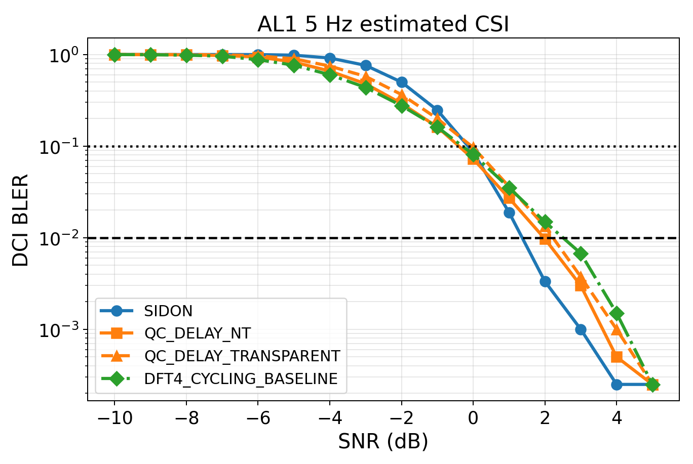

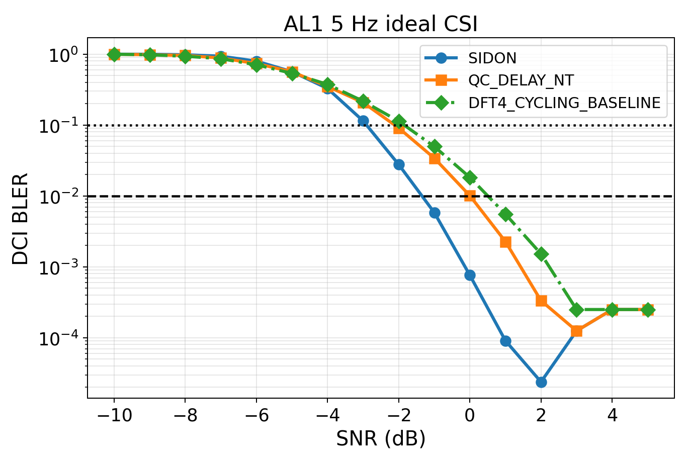

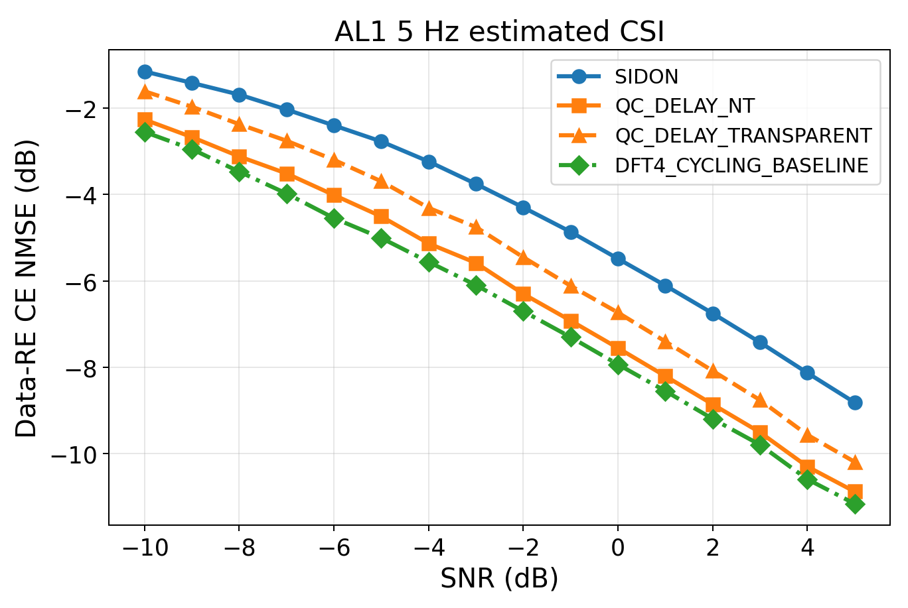

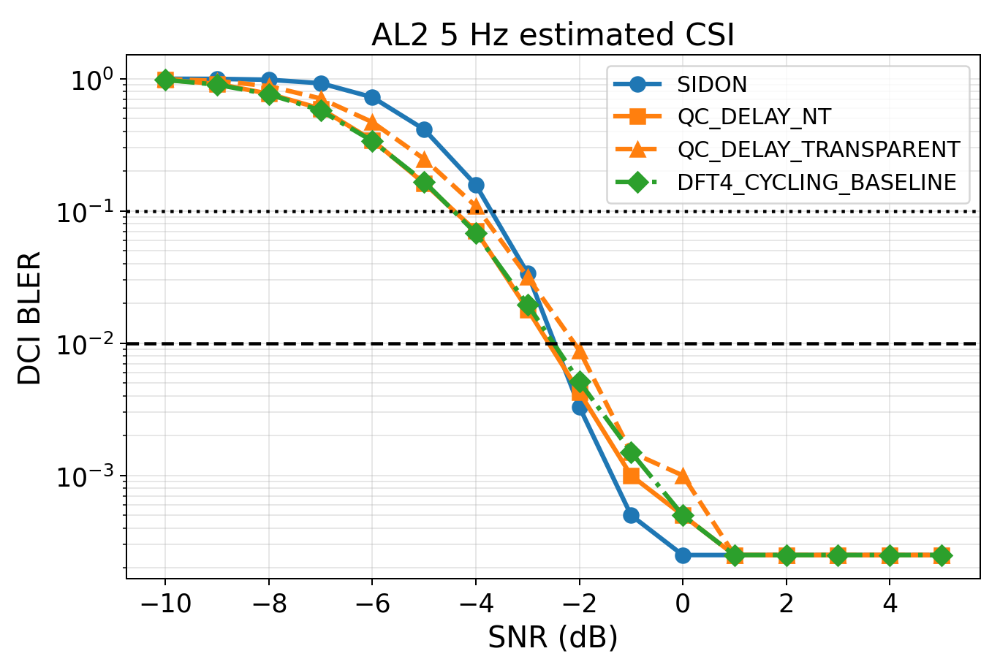

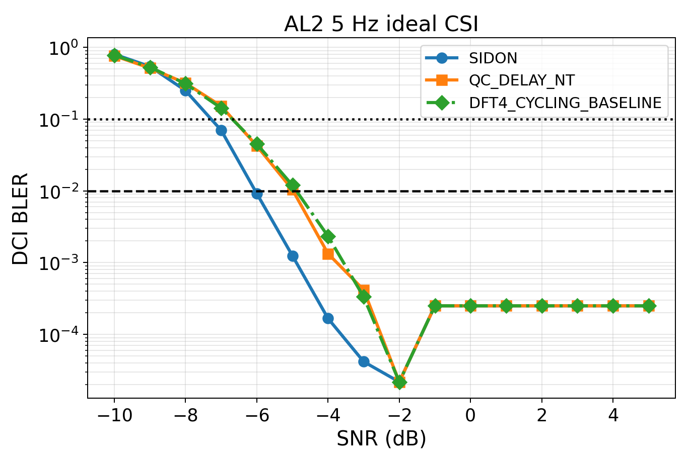

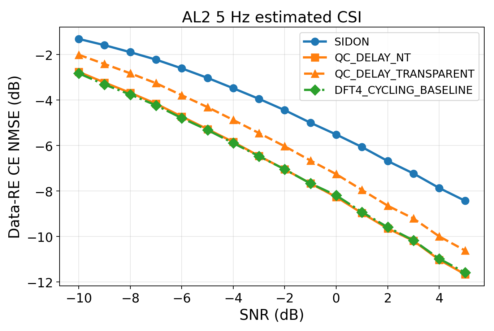

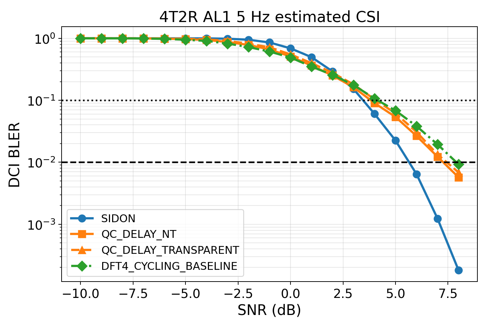

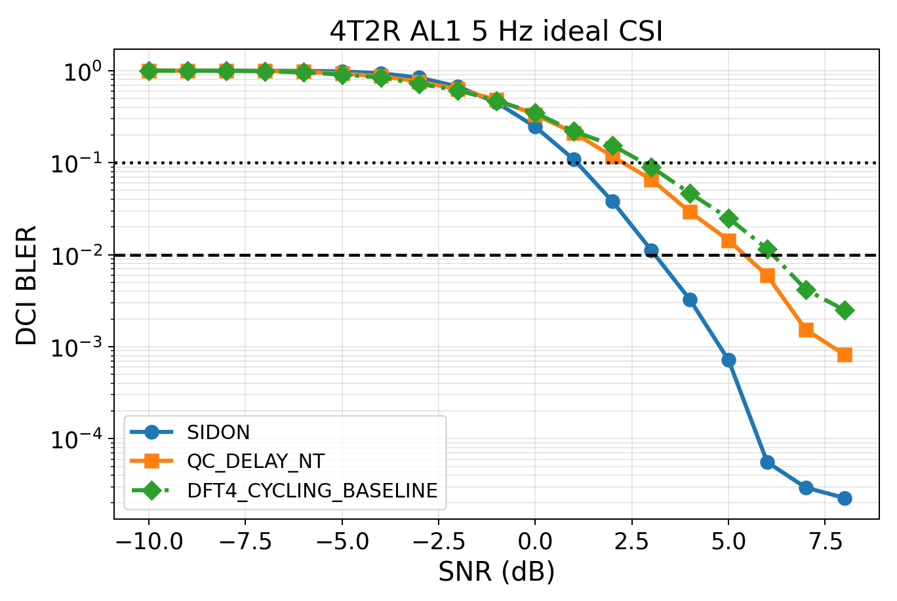

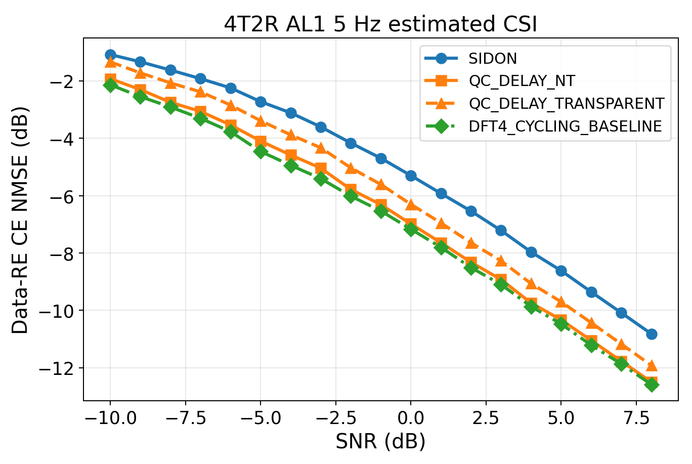

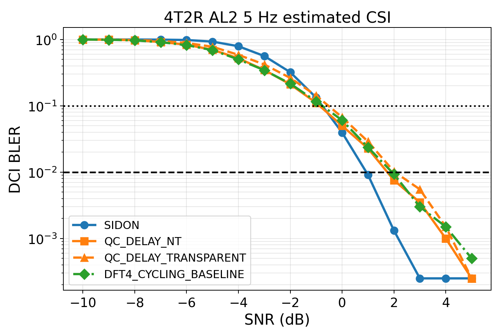

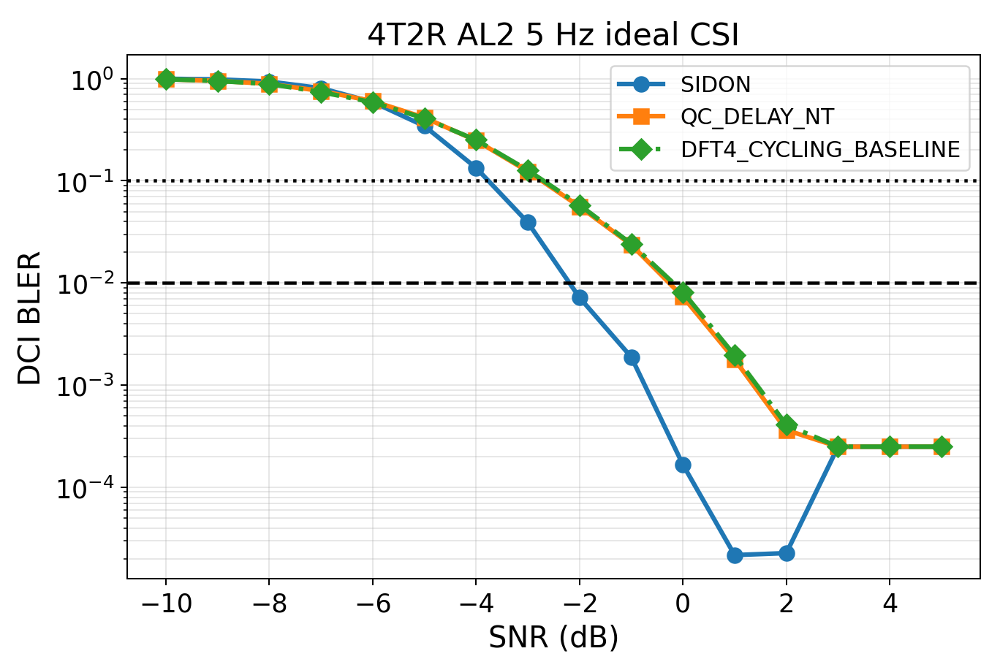

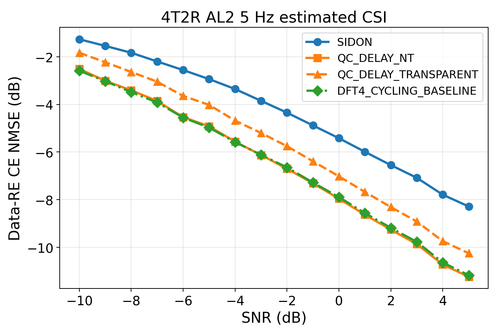

图由 `tools/run_plan036_pdcch.py --stage analyze` 直接读取本地 CSV 生成。每张图对应的完整文字和数值表见 `research/result-036-PDCCH-4T4R-1symbol-text.md`。

## 3. 关键结果

| AL | CSI | Sidon 相对 DFT：10% / 1% | QC non-transparent 相对 DFT：10% / 1% | QC transparency 代价：10% / 1% |
|---:|---|---:|---:|---:|
| 1 | estimated | -0.159 / +1.137 dB | +0.098 / +0.532 dB | 0.353 / 0.253 dB |
| 1 | ideal | +1.057 / +1.851 dB | +0.267 / +0.499 dB | 不适用 |
| 2 | estimated | -0.725 / -0.022 dB | -0.012 / +0.094 dB | 0.486 / 0.494 dB |
| 2 | ideal | +0.589 / +1.153 dB | -0.020 / +0.092 dB | 不适用 |

正增益表示候选所需 SNR 低于同 CSI 模式的 DFT baseline。所有曲线均在规定 SNR 范围内取得原始 `BLER<=0.01` 点。

ideal CSI 下 Sidon 在 AL1/AL2 均有明确波形级优势；estimated CSI 下该优势被信道估计代价显著削弱，AL2 基本消失。Sidon 的 estimated-to-ideal 1%代价为 AL1 `2.713 dB`、AL2 `3.566 dB`，高于 QC 和 DFT；CE NMSE排序与该现象一致。QC transparent 相对 matched-effective 接收机产生约 `0.25–0.49 dB` 目标 SNR 代价。

### 4T2R 关键结果

| AL | CSI | Sidon 相对 DFT：10% / 1% | QC non-transparent 相对 DFT：10% / 1% | QC transparency 代价：10% / 1% |
|---:|---|---:|---:|---:|
| 1 | estimated | +0.691 / +2.250 dB | +0.323 / +0.627 dB | 0.243 / 0.168 dB |
| 1 | ideal | +1.726 / +3.050 dB | +0.531 / +0.732 dB | 不适用 |
| 2 | estimated | +0.002 / +0.989 dB | +0.105 / +0.179 dB | 0.342 / 0.292 dB |
| 2 | ideal | +1.067 / +2.008 dB | +0.036 / +0.078 dB | 不适用 |

4T2R AL1 的原始网格扩展到 8 dB。8 dB 时 estimated Sidon、QC non-transparent、QC transparent 和 DFT BLER 分别为 `0.000182`、`0.005727`、`0.006864`、`0.009273`，均达到原始 BLER 1%验收。DFT 的 Wilson 95%上限为 `0.010628`，略高于 1%，已在无图版中保留该限制。

减少到 2Rx 后，各方案绝对目标 SNR均升高，但 Sidon 相对 DFT 的 estimated 1%优势在 AL1/AL2 分别为 `2.250/0.989 dB`，大于 4Rx 的 `1.137/-0.022 dB`。该现象只适用于本次配置，不能外推为一般规律。

## 4. 限制与验收

- 只运行 5 Hz，未执行 1100 Hz，因此不回答跨 Doppler 不变性问题。
- 目标差目前是原始点的 log-BLER 插值点估计；4,000 次 paired bootstrap 尚未执行，接近零的差值不能解释为统计显著。
- 所有正式点均由 200 errors 或 Wilson 95% 上限低于 0.01 正常停止，没有达到 50,000 上限。
- 图已通过生成状态、文件存在性和 `1368×917` 尺寸检查；未由 Agent 加载，仍需研究者人工核验视觉布局。
- 结果待研究者确认，当前不更新 `KNOWLEDGE.md`、`GOALS.md`，不创建 Git checkpoint。
