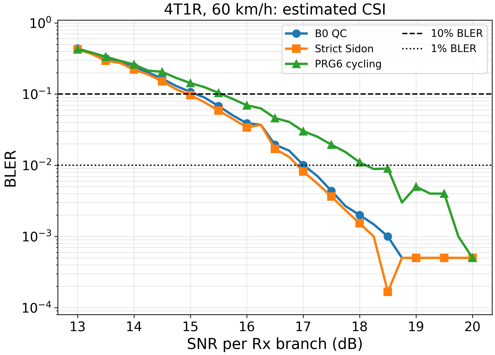
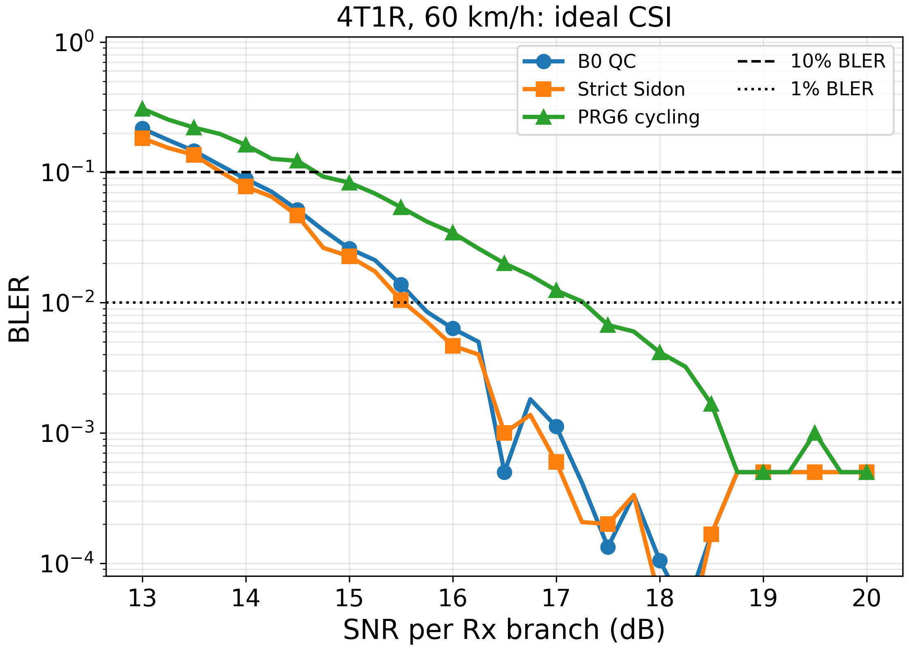
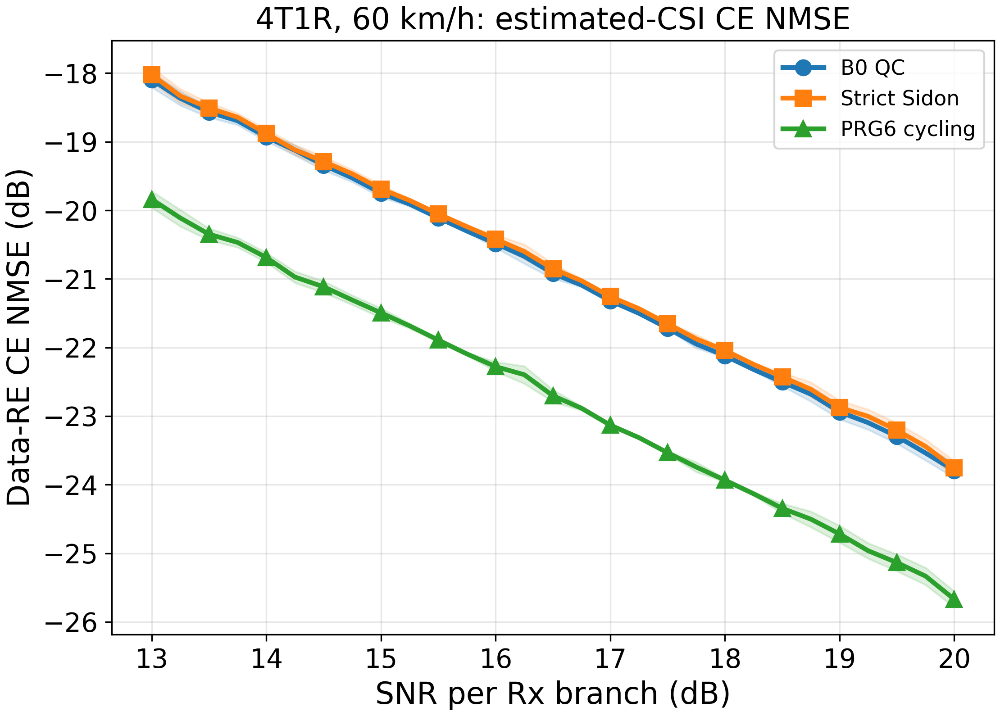

# result-037：PDSCH Tx数影响（4T1R 部分结果）

> 状态：**4T1R 正式结果完成；16T/32T 未纳入本版结论**。研究者在实现阶段把接收天线数从
> plan-037 草案中的 2Rx 改为 1Rx；本结果以实际展开配置 `A100_NT4_NR1_V60` 为准，待后续同步
> 修订 plan。未经研究者确认，本结果不更新 `KNOWLEDGE.md` 或 `GOALS.md`。

## 1. 本次范围与结论

本次只分析 4Tx/1Rx、TDL-A 100 ns、60 km/h 下的 `B0_QC`、严格 `S0_SIDON` 和
`TRANSPARENT_PRG6`。estimated CSI 是主性能口径，ideal CSI 用于诊断。

主要事实如下：

1. 自适应运行状态为 `complete`，无 capped endpoint；29 个 SNR 点各使用 1,000--30,000 个
   paired trials，全部 10%/1% bracket 端点满足预声明的错误块要求。
2. estimated CSI 下，B0 相对 PRG6 的 10%/1% BLER 目标 SNR 增益分别为
   **0.452 dB**（95% paired-bootstrap CI `[0.365, 0.582]` dB）和
   **1.102 dB**（`[0.940, 1.282]` dB）。
3. estimated CSI 下，Sidon 相对 PRG6 的对应增益为
   **0.595 dB**（`[0.484, 0.705]` dB）和
   **1.216 dB**（`[1.054, 1.391]` dB）。四个主比较区间均完全大于 0，因此在当前 4T1R
   冻结构造和接收机下支持 B0、Sidon 相对 PRG6 的正增益。
4. ideal CSI 下，B0 相对 PRG6 的 10%/1% 增益为 0.801/1.596 dB，Sidon 为
   0.916/1.733 dB；对应区间也均完全大于 0。
5. estimated-minus-ideal penalty：B0 为 1.217/1.342 dB，Sidon 为 1.190/1.366 dB，
   PRG6 为 0.869/0.848 dB（依次对应 10%/1% BLER）。这说明当前 4T1R 下，CDD 两方案的
   信道估计损失比 PRG6 大约多 0.32--0.52 dB；但其 ideal-CSI 分集增益更大，最终仍保留正的
   estimated-CSI 净增益。

以上只支持当前冻结 4Tx 构造的结论，不支持纯 $N_t$ 因果解释，也不能外推到 16Tx 或 32Tx。

## 2. 配置与可复现性

| 项目 | 实际取值 |
|---|---|
| 场景 | `A100_NT4_NR1_V60` |
| 天线/层 | 4Tx、1Rx、1 layer |
| 信道 | Sionna 1.0.2 TDL-A，100 ns，3.5 GHz，60 km/h，20 sinusoids |
| 资源网格 | 48 PRB，576 active subcarriers，30 kHz SCS，10 data-bearing OFDM symbols |
| DMRS | symbols `[2,7]`，comb-6，192 pilot RE |
| 接收模式 | estimated：两个 DMRS 的二维时频 RMMSE；ideal：真实 data-RE 等效信道 |
| 调制编码 | 16QAM，NR 256QAM MCS table MCS 8，目标码率 553/1024 |
| SNR 网格 | 13--20 dB，步长 0.25 dB，共 29 点 |
| 随机种子 | `20260727` |
| batch size | 25 |
| 自适应预算 | 初始/追加 1,000 trials，单点上限 50,000；实际最大 30,000 |
| 执行设备 | CPU-only；峰值 RSS 2,756,280,320 bytes（约 2.57 GiB） |

正式配置为 `configs/plan037_nt4_nr1_v60_formal.yaml`，SHA-256 为
`929e716e043f7b46faa53de46e0e5734671d77e10387ba3b3b87eb38606bc384`。展开配置、候选清单、
delay/PRG 审计、seed 配对审计及代码状态位于
`outputs/experiment037_pdsch_tx_scaling/20260920/formal/A100_NT4_NR1_V60/`。

冻结构造为：

- B0：delay grid `[0,18,36,54]`，pilot rank 4，condition number 约 1；
- Sidon：`[0,24,72,240]`，10 个模 576 无序二元和全异，fold gap 24，pilot rank 4，
  condition number 约 1；
- PRG6：DFT4 vector index `[0,1,2,3,0,1,2,3]`，逐 RE 总功率为 1。

复现分析：

```powershell
python tools/analyze_result037_pdsch_tx_scaling.py --scene outputs/experiment037_pdsch_tx_scaling/20260920/formal/A100_NT4_NR1_V60 --bootstrap-replicates 1000
```

## 3. BLER crossing 与增益

### 3.1 Crossing

| 方案 | CSI | 目标 BLER | crossing SNR (dB) | 95% paired-bootstrap CI (dB) |
|---|---|---:|---:|---:|
| B0 | estimated | 10% | 15.098 | [14.972, 15.165] |
| Sidon | estimated | 10% | 14.956 | [14.854, 15.054] |
| PRG6 | estimated | 10% | 15.550 | [15.495, 15.587] |
| B0 | estimated | 1% | 17.008 | [16.949, 17.071] |
| Sidon | estimated | 1% | 16.895 | [16.841, 16.954] |
| PRG6 | estimated | 1% | 18.111 | [17.966, 18.278] |
| B0 | ideal | 10% | 13.881 | [13.790, 13.987] |
| Sidon | ideal | 10% | 13.765 | [13.693, 13.841] |
| PRG6 | ideal | 10% | 14.682 | [14.606, 14.784] |
| B0 | ideal | 1% | 15.666 | [15.616, 15.716] |
| Sidon | ideal | 1% | 15.529 | [15.460, 15.591] |
| PRG6 | ideal | 1% | 17.262 | [17.159, 17.317] |

完整 bracket、端点 errors/trials 和 bootstrap 有效次数见
`outputs/experiment037_pdsch_tx_scaling/20260920/formal/A100_NT4_NR1_V60/analysis/target_crossings_bootstrap.csv`。
所有 12 个 crossing 均有 1,000/1,000 个有效 bootstrap 重复。

### 3.2 相对 PRG6 的目标 SNR 增益

$G=mathrm{SNR}_{\mathrm{PRG6}}-\mathrm{SNR}_{X}$，正值表示方案 $X$ 节省 SNR。

| 方案 | CSI | 目标 BLER | $G$ (dB) | 95% paired-bootstrap CI (dB) | 判定 |
|---|---|---:|---:|---:|---|
| B0 | estimated | 10% | 0.452 | [0.365, 0.582] | 支持正增益 |
| Sidon | estimated | 10% | 0.595 | [0.484, 0.705] | 支持正增益 |
| B0 | estimated | 1% | 1.102 | [0.940, 1.282] | 支持正增益 |
| Sidon | estimated | 1% | 1.216 | [1.054, 1.391] | 支持正增益 |
| B0 | ideal | 10% | 0.801 | [0.661, 0.925] | 支持正增益 |
| Sidon | ideal | 10% | 0.916 | [0.804, 1.039] | 支持正增益 |
| B0 | ideal | 1% | 1.596 | [1.485, 1.672] | 支持正增益 |
| Sidon | ideal | 1% | 1.733 | [1.616, 1.825] | 支持正增益 |

完整数据见 `outputs/experiment037_pdsch_tx_scaling/20260920/formal/A100_NT4_NR1_V60/analysis/target_gains_vs_prg6_bootstrap.csv`。

## 4. 图与数值数据



对应数值：`outputs/experiment037_pdsch_tx_scaling/20260920/formal/A100_NT4_NR1_V60/analysis/estimated_csi_bler.csv`。



对应数值：`outputs/experiment037_pdsch_tx_scaling/20260920/formal/A100_NT4_NR1_V60/analysis/ideal_csi_bler.csv`。



对应数值：`outputs/experiment037_pdsch_tx_scaling/20260920/formal/A100_NT4_NR1_V60/analysis/estimated_csi_ce_nmse.csv`，
其中包含线性域均值、标准误和 95% Monte Carlo 区间，以及绘图使用的 dB 区间。

图片由 `tools/analyze_result037_pdsch_tx_scaling.py` 从本地 CSV/NPY 生成。自动审计确认三张 PNG 均为
2220×1590、300 dpi 输出；未执行人工视觉布局核验。

## 5. 解释与边界

**事实：** Sidon 在 4T1R 的 estimated/ideal 两类接收口径下都取得了三方案中最低的目标 SNR；
但本轮没有声明 Sidon 相对 B0 的统计显著性，因为预声明主比较是各方案相对 PRG6。

**推断：** CDD 的 ideal 增益高于 estimated 增益，同时 CDD 的 estimated-minus-ideal penalty 高于
PRG6，说明更大的理想分集收益被额外 CE 损失部分抵消。CE NMSE 曲线与这一方向一致，但 NMSE
不单独决定 BLER 胜负。

**不能支持：** 本结果不能回答增益随 Tx 数如何变化；16Tx 的 estimated Sidon prescan 已观察到
明显异常，但在 16Tx 正式实验和诊断完成前，不应与本 4Tx formal 数字形成正式跨 Tx 比较。

## 6. 完整性检查与待完成项

- `adaptive_status.json`：`complete`，0 capped endpoint；
- 87 个 estimated 点、87 个 ideal 点、1,446 条 interval 记录；
- 核验 2,169 个 error/NMSE 数组，未发现 shape、计数、非有限值或 trial 间隙/重叠；
- 1,000 次 paired bootstrap 全部有效；
- 16T/32T formal、跨 Tx independent bootstrap、跨 Tx 汇总图以及 plan 中最终完整结论尚未完成；
- plan 的 2Rx→1Rx 文字修订尚待研究者执行或确认。

