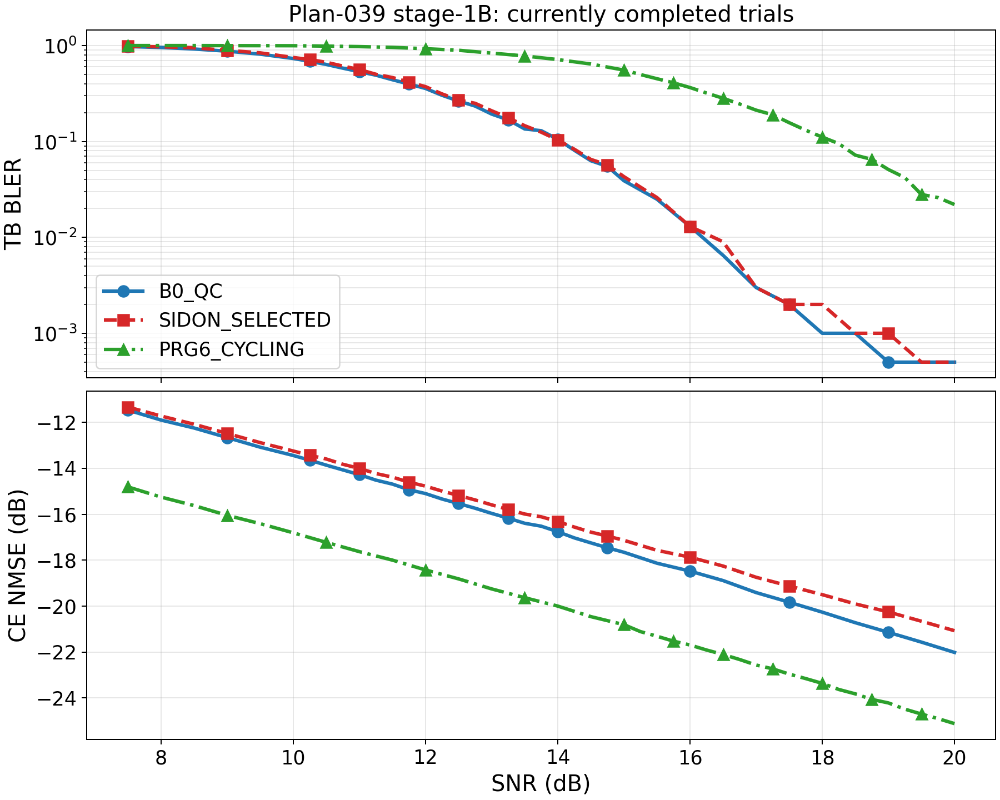
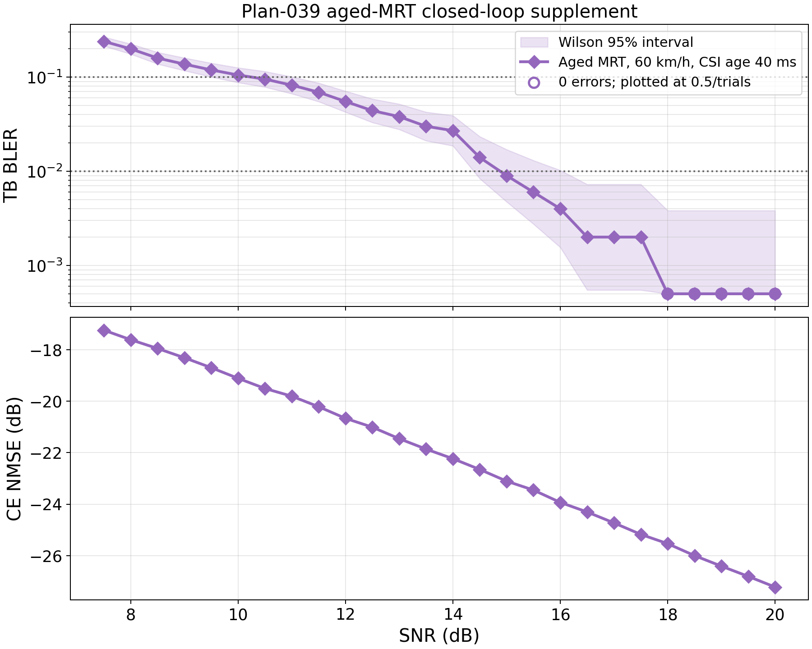
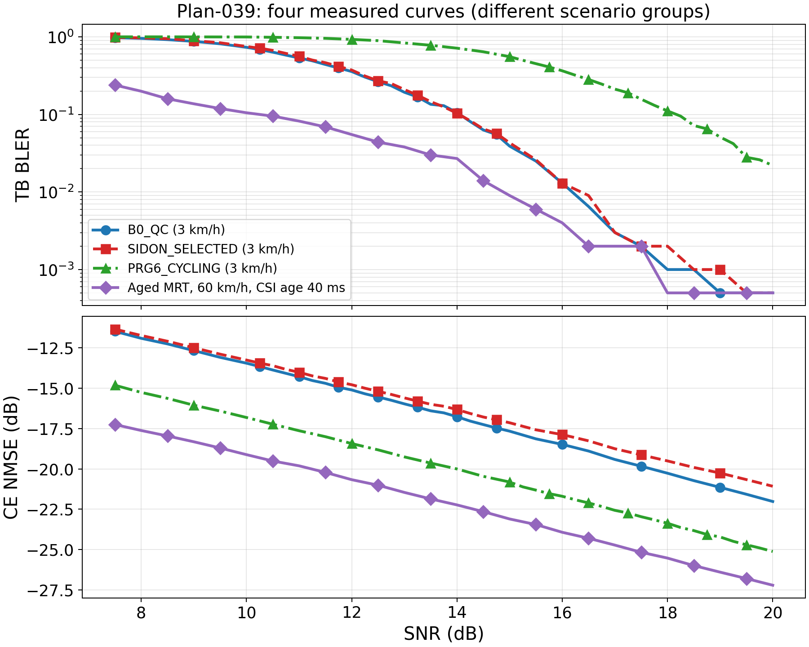

# result-039：CDL 宽波束 CDD 与 cycling BLER（当前已完成批次）

> 状态：阶段性记录，待研究者确认。`cycling_initial` 已完成；CDD 已完成全网格初始
> 1,000 trials，并只在 4 个 SNR 点完成第一批追加。补充的 60 km/h、40 ms outdated-CSI
> MRT 闭环曲线已完成 26,000 trials。原三曲线的自适应追加、paired bootstrap 和最终验收
> 尚未完成，原三曲线的当前 crossing 不是最终结论。

## 当前完成范围

| 曲线 | SNR 点数 | SNR 范围 | 1,000 trials 点数 | 2,000 trials 点数 | 累计 trials |
|---|---:|---:|---:|---:|---:|
| `B0_QC` | 36 | 7.5--20.0 dB | 32 | 4 | 40,000 |
| `SIDON_SELECTED` | 36 | 7.5--20.0 dB | 32 | 4 | 40,000 |
| `PRG6_CYCLING` | 36 | 7.5--20.0 dB | 36 | 0 | 36,000 |
| **合计** | **108 个曲线-SNR 点** | — | **100** | **8** | **116,000** |

CDD 的 2,000-trial 点为 13.75、14.0、16.0、16.5 dB；其余 CDD 点及全部 cycling 点均为
1,000 trials。详细 errors、trials、Wilson 95% 区间和 CE NMSE 见
`outputs/experiment039_cdl_beam_bler/stage0_20260925/analysis/stage1b_current_points.csv`。



## 当前 crossing 与分析

| 曲线 | 10% crossing / bracket | 1% crossing / bracket | 当前判定 |
|---|---|---|---|
| `B0_QC` | 14.051 dB / [14.0, 14.25] | 16.189 dB / [16.0, 16.5] | 两目标均有当前 bracket |
| `SIDON_SELECTED` | 14.039 dB / [14.0, 14.25] | 16.357 dB / [16.0, 16.5] | 两目标均有当前 bracket |
| `PRG6_CYCLING` | 18.168 dB / [18.0, 18.25] | 无；20 dB 为 22/1000 = 2.2% | 1% 未达到 |

当前 B0 与 Sidon 的差异很小，不能据此确认优劣。cycling 的当前 10% crossing 比两条 CDD
高约 4.1 dB，但正式 gain 仍需自适应预算与 paired bootstrap。18.0 dB 时 cycling 为
111/1000、CE NMSE -23.37 dB，B0 为 1/1000、-20.27 dB；较低 CE NMSE 未转化为较低 BLER，
因此不能用 NMSE 单独替代跨预编码方案的 BLER 判定。

## 补充闭环曲线：60 km/h、40 ms outdated-CSI MRT

该曲线使用每个 6-RB PRG 的 40 ms 过时物理 CSI 构造未量化 rank-1 MRT，接收端为
`PLAN039_PRG_COMMON_REFERENCE_PDP` estimated-CSI LMMSE 与 2Rx MRC。7.5--20.0 dB 共 26 点，
每点固定 1,000 trials；完成回执、26 点汇总和 26,000 行 trial 数据均通过一致性检查。



以下合图不绘制 Wilson 区间。aged-MRT 与前三条曲线属于不同速度、发射端知识和 realization
分组，合图仅用于并列展示，不用于归因或 paired gain 判定。



| 指标 | 描述性结果 |
|---|---|
| 10% BLER crossing | 10.244 dB，真实 bracket [10.0, 10.5] dB |
| 1% BLER crossing | 14.881 dB，真实 bracket [14.5, 15.0] dB |
| 7.5 dB | 239/1,000，BLER 0.239，Wilson 95% [0.2136, 0.2664]，CE NMSE -17.25 dB |
| 20.0 dB | 0/1,000，BLER 0，Wilson 95% [0, 0.00383]，CE NMSE -27.21 dB |

同 realization aged/current replay 最大误差为 0，MRT 权值功率范围为
`[0.9999999999999971, 1.0000000000000027]`。18.0--20.0 dB 共 5 个零错误点；图中按
`0.5/trials` 下界并用空心圆标记，原始 CSV 保留 0。该曲线与原三条曲线的速度、发射端知识和
realization 均不同，因此不作 paired gain，也不能把 crossing 差异归因为 MRT 本身。完整配置、
抽样原始数值、Wilson 区间、事实/推断边界和证据路径见同编号无图版。

## 配置、gate、边界与复现

完整仿真条件、前置角度/相关性 gate、阶段 1A 候选冻结、事实/推断边界、异常、证据路径和复现
命令见同编号无图版 `research/result-039-CDL宽波束CDD与cycling-BLER-text.md`。关键 gate 均 PASS：
ASD25 实测 24.936°，AoD 区间覆盖率 0.9484，二维目标矩形覆盖率 0.9351；波束域非对角相关
均值从 ASD10 的 0.6656 降至 ASD25 的 0.4530。唯一执行的 Sidon 候选为
`[0,11,28,148,170,233,277,351]`，其余 top-8 候选未运行。

复现分析：

```powershell
python tools/analyze_plan039_stage1b_initial.py --input outputs/experiment039_cdl_beam_bler/stage0_20260925/estimated_confirm --output outputs/experiment039_cdl_beam_bler/stage0_20260925/analysis --figure-dir docs/figures/result-039-CDL宽波束CDD与cycling-BLER
python tools/analyze_plan039_aged_mrt.py --input outputs/experiment039_cdl_beam_bler/stage0_20260925/aged_mrt_60kmh/C_UE2R_DUAL_ASD25 --output outputs/experiment039_cdl_beam_bler/stage0_20260925/analysis/aged_mrt --figure-dir docs/figures/result-039-CDL宽波束CDD与cycling-BLER --stage1b-points outputs/experiment039_cdl_beam_bler/stage0_20260925/analysis/stage1b_current_points.csv
```

未经研究者确认，不更新 `KNOWLEDGE.md` 或 `GOALS.md`。
